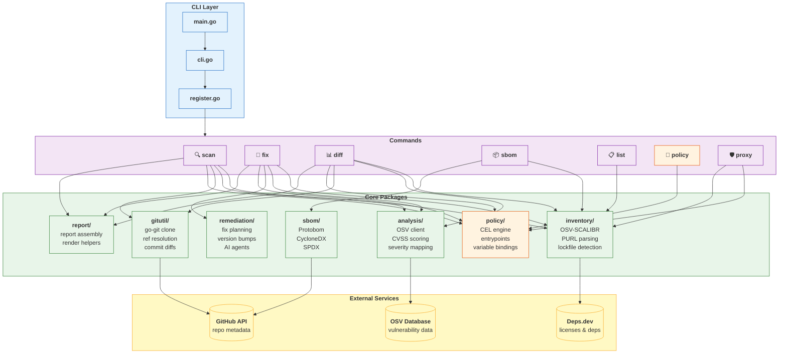
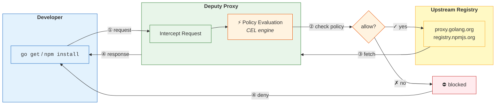

# AGENTS.md

Deputy is a Go CLI for software supply chain security. Scan, fix, diff, and enforce policies.

## Architecture Overview





**Data Flow (for `scan` command):**
1. **Target resolution** — local directory, `git` ref, or remote repository.
2. **Inventory extraction** — OSV-SCALIBR parses lockfiles into PURLs.
3. **Vulnerability lookup** — query OSV API or local GCS bucket mirror.
4. **Policy evaluation** — CEL engine runs per-vulnerability and report-level rules.
5. **Output rendering** — table, JSON, or SARIF format.

## Quick Reference

```bash
go test ./...                                  # run all tests
go test -v -run TestName ./internal/pkg/...   # run specific test
go build -o deputy .                           # build binary
./deputy scan                                  # test locally
```

## Commands

```bash
# Vulnerability scanning
deputy scan                                    # scan current directory
deputy scan github.com/owner/repo              # scan remote repo
deputy scan --ref v1.0.0                       # scan specific Git ref
deputy scan --format json                      # JSON output

# Remediation
deputy fix                                     # show remediation plan
deputy fix --apply .                           # apply fixes to directory

# Compare dependencies between Git refs
deputy diff main HEAD                          # diff main vs HEAD
deputy diff v1.0.0 v2.0.0                      # diff two tags

# Generate SBOM
deputy sbom --format cyclonedx-json --output sbom.json
deputy sbom --format spdx-json --output sbom.spdx.json

# List dependencies
deputy list                                    # list all dependencies
deputy list --only-direct                      # direct dependencies only

# Policy development
deputy policy eval policy.yaml                 # test policy
deputy policy lint policy.yaml                 # validate syntax
deputy policy lsp                              # language server

# Proxy (enforce policies at download time)
deputy proxy go -- go get github.com/pkg
deputy proxy npm -- npm install lodash
```

## Project Structure

```
main.go                      # entry point
internal/
  cli/cmd/                   # Cobra commands (scan.go, fix.go, diff.go, etc.)
                             # see internal/cli/cmd/root.go for command registration
  cli/flags/                 # shared CLI flag parsing helpers
  analysis/                  # analysis orchestration and OSV facade
    osv/                     # OSV API + GitHub Actions bucket integration
  diskcache/                 # shared on-disk cache helpers
  inventory/                 # dependency detection
    manifests/               # manifest path + manager heuristics
  license/                   # license enrichment + scanning
  policy/                    # CEL evaluation engine (eval.go)
  proxy/                     # package proxy server
  report/                    # report/context helpers
    render/                  # CLI-friendly rendering helpers
  sbom/                      # SBOM generation
  remediation/               # fix planning
  gitutil/                   # Git operations (clone.go, diff.go, refs.go)
  vuln/                      # vulnerability domain types + CVSS/severity
docs/                        # documentation
  commands/                  # command reference
  guides/                    # how-to guides (ci.md, workflows.md, agents.md)
policy/examples/             # 30+ CEL policy examples
```

Key entry points: [`main.go`](main.go) → [`internal/cli/cli.go`](internal/cli/cli.go) → [`internal/cli/cmd/root.go`](internal/cli/cmd/root.go)

## Tech Stack

- [Go] 1.21+ (uses [`toolchain`](https://go.dev/doc/toolchain) directive); use modern features like [generics](https://go.dev/blog/intro-generics), and packages like [`slices`](https://pkg.go.dev/slices), [`maps`](https://pkg.go.dev/maps), [`iter`](https://pkg.go.dev/iter), [`cmp`](https://pkg.go.dev/cmp), [`log/slog`](https://pkg.go.dev/log/slog), etc.
- [Cobra] for CLI; [Charm] for [Fang], [Lipgloss], etc. Prefer avoiding emojis in output, use ASCII or Unicode symbols, only if they add clarity; when in doubt, don't use them. Avoid them in most machine-readable output.
- [CEL] (Common Expression Language) for policies in a [YAML]-based [DSL].
- [OSV] API and [GCS] buckets for vulnerability data.
- [OSV-SCALIBR] for SCA inventory extraction (see [`internal/inventory/`](internal/inventory/)).
- [go-git] for Git operations (cloning, refs, diffs, commit snapshots). See [`internal/gitutil/`](internal/gitutil/).
- [PURL] (Package URL) for normalized package IDs.
- [Deps.dev] for dependency license, inventory, resolution, etc.
- [GitHub API] for various data when needed, but mostly avoided (accessing repos, licenses, etc).
- [Protobom] as a first-class feature, with [CycloneDX]/[SPDX] output for SBOMs.

[Go]: https://golang.org
[Cobra]: https://cobra.dev/
[Charm]: https://charm.sh/
[Fang]: https://github.com/charmbracelet/fang
[Lipgloss]: https://github.com/charmbracelet/lipgloss
[CEL]: https://cel.dev/
[YAML]: https://yaml.org/
[DSL]: https://en.wikipedia.org/wiki/Domain-specific_language
[OSV]: https://osv.dev
[OSV-SCALIBR]: https://github.com/google/osv-scalibr
[GCS]: https://cloud.google.com/storage
[go-git]: https://github.com/go-git/go-git
[Deps.dev]: https://deps.dev/
[PURL]: https://github.com/package-url/purl-spec
[Protobom]: https://github.com/protobom/protobom
[GitHub API]: https://docs.github.com/en/rest
[CycloneDX]: https://cyclonedx.org/
[SPDX]: https://spdx.dev/

## Policies (CEL)

Entrypoints define when a policy is evaluated. See [`internal/policy/entrypoints.go`](internal/policy/entrypoints.go) for canonical definitions.  
See [`internal/policy/evaluator.go`](internal/policy/evaluator.go) for CEL activation and variable bindings.

### Policy Examples

```yaml
# Block critical severity vulnerabilities
policies:
  - name: block-critical
    rules:
      - action: deny
        when: vulnerabilities.exists(v, v.severity == "CRITICAL")
        reason: "Critical vulnerability found"
```

```yaml
# Require a license from an approved list
policies:
  - name: require-approved-license
    vars:
      allowed_licenses: ["MIT", "Apache-2.0", "BSD-3-Clause"]
    rules:
      - action: deny
        when: pkg.licenses.all(l, !(l in allowed_licenses))
        reason: "Package license is not in the approved list"
```

### Key Variables

The following variables are available in CEL expressions, depending on the policy entrypoint.

#### `pkg` object

Contains information about the dependency being analyzed. Available in [`scan_report`](internal/policy/entrypoints.go#L16) and [`scan_vulnerability`](internal/policy/entrypoints.go#L18) entrypoints.

| Field | Type | Description | Example Value |
|---|---|---|---|
| `name` | `string` | Name of the package | `"lodash"` |
| `version` | `string` | Version of the package | `"4.17.21"` |
| `ecosystem` | `string` | Package ecosystem | `"npm"` |
| `licenses` | `list(string)` | List of SPDX license identifiers | `["MIT"]` |

**Example Expressions for `pkg`:**

*   Deny a specific package:
    `pkg.name == 'left-pad'`
*   Deny packages with non-compliant licenses:
    `pkg.licenses.all(l, !(l in ['MIT', 'Apache-2.0']))`
*   Deny older versions of a package:
    `pkg.name == 'react' && pkg.version.startsWith('16.')`
*   Deny if license information is missing:
    `pkg.licenses.size() == 0`

Note: The `pkg` helper provides sensible defaults (`name`, `version`, `ecosystem` default to `""`, `licenses` defaults to `[]`), so you don't need `?.orValue()` for these fields.

---

#### `vulnerability` object

Represents a single vulnerability affecting a package. Available in the [`scan_vulnerability`](internal/policy/entrypoints.go#L18) entrypoint.

| Field | Type | Description | Example Value |
|---|---|---|---|
| `id` | `string` | Vulnerability ID (e.g., CVE, GHSA) | `"CVE-2021-44228"` |
| `severity` | `string` | `CRITICAL`, `HIGH`, `MEDIUM`, `LOW` | `"CRITICAL"` |
| `isDirect` | `bool` | If the vulnerability is in a direct dependency | `true` |
| `fixedVersions` | `list(string)` | Versions containing a fix | `["2.15.0"]` |

**Example Expressions for `vulnerability`:**

*   Deny critical vulnerabilities:
    `vulnerability.severity == 'CRITICAL'`
*   Deny vulnerabilities in direct dependencies that have a fix:
    `vulnerability.isDirect && vulnerability.fixedVersions.size() > 0`
*   Deny a specific vulnerability by ID:
    `vulnerability.id == 'GHSA-jfh8-c2j2-2hch'`
*   Deny if a vulnerability has no fix and is `HIGH` or `CRITICAL`:
    `(!has(vulnerability.fixedVersions) || vulnerability.fixedVersions.size() == 0) && (has(vulnerability.severity) && vulnerability.severity in ['HIGH', 'CRITICAL'])`
*   Deny if a vulnerability has no fix and is `HIGH` or `CRITICAL` (using optionals):
    `size(vulnerability.?fixedVersions.orValue([])) == 0 && vulnerability.?severity.orValue('').upperAscii() in ['HIGH', 'CRITICAL']`

---

#### `vulnerabilities` list

A list of all `vulnerability` objects found in a scan report. Available in the [`scan_report`](internal/policy/entrypoints.go#L16) entrypoint. This is most commonly used with CEL macros like `exists`.

**Example Expressions for `vulnerabilities`:**

*   Deny if any critical vulnerabilities exist in the report:
    `vulnerabilities.exists(v, v.severity == 'CRITICAL')`
*   Deny if there are more than 5 vulnerabilities in total:
    `vulnerabilities.size() > 5`
*   Deny if all vulnerabilities are high severity (a strange but possible policy):
    `vulnerabilities.all(v, v.severity == 'HIGH')`

---

#### `request` object

Contains information about a package being requested through the proxy. Available in [`go_artifact_request`](internal/policy/entrypoints.go#L7), [`npm_artifact_request`](internal/policy/entrypoints.go#L9), and other proxy entrypoints.

| Field | Type | Description | Example Value |
|---|---|---|---|
| `package` | `string` | Name of the package being requested | `"react"` |
| `version` | `string` | Version of the package being requested | `"18.2.0"` |

**Example Expressions for `request`:**

*   Block downloads of a specific package:
    `request.package == 'express'`
*   Block downloads of unscoped public npm packages:
    `!request.package.startsWith('@')`

---

#### `env` object

Contains information about the environment in which `deputy` is running.

| Field | Type | Description | Example Value |
|---|---|---|---|
| `command` | `string` | The `deputy` command being executed | `"scan"` |

**Example Expressions for `env`:**

*   Apply a rule only during a `scan` command:
    `env.command == 'scan'`

---

#### `jwt` object

Contains verified JWT claims from authenticated proxy requests. Available in all proxy entrypoints when authentication is enabled. See [Proxy Authentication](#proxy-authentication) for configuration.

| Field | Type | Description | Example Value |
|---|---|---|---|
| `anonymous` | `bool` | `true` if no token was provided | `false` |
| `sub` | `string` | Subject (user/service ID) | `"user:alice"` |
| `iss` | `string` | Token issuer | `"https://auth.example.com"` |
| `aud` | `list(string)` | Audiences | `["deputy-proxy"]` |
| `exp` | `int` | Expiration timestamp (Unix) | `1700000000` |
| `iat` | `int` | Issued-at timestamp (Unix) | `1699990000` |
| `nbf` | `int` | Not-before timestamp (Unix) | `1699990000` |
| `jti` | `string` | JWT ID | `"abc123"` |
| `<custom>` | `any` | Any custom claims from the token | varies |

**Example Expressions for `jwt`:**

Using CEL optionals (`?.field` and `.orValue()`) for cleaner null-safe access:

*   Deny anonymous access to internal packages:
    `jwt.anonymous && request.module.startsWith("internal/")`
*   Require admin role for certain packages (using optionals):
    `!jwt.?roles.orValue([]).exists(r, r == "admin")`
*   Check team membership (using optionals):
    `jwt.?teams.orValue([]).exists(t, t == "platform")`
*   Validate service account format (using optionals):
    `jwt.?sub.orValue("").startsWith("sa:")`
*   Check token age (using time functions and optionals):
    `age(jwt.?iat.orValue(0)) > duration("24h")`

### CEL Helper Functions

Deputy extends CEL with custom functions for policy evaluation:

#### Time Functions

| Function | Signature | Description |
|----------|-----------|-------------|
| `now()` | `now() timestamp` | Returns current time as a timestamp (custom) |
| `age()` | `age(int\|timestamp) duration` | Duration since a Unix timestamp (custom convenience) |
| `timestamp()` | `timestamp(int\|string)` | CEL built-in: convert Unix seconds or RFC 3339 string |
| `duration()` | `duration(string) duration` | CEL built-in: parse duration (e.g., `"1h"`, `"30m"`) |
| `int(now())` | - | Get current Unix timestamp (use native conversion) |
| `int(timestamp)` | - | Get Unix seconds from timestamp (native conversion) |

**Example: Token age check (using optionals)**
```yaml
- action: warn
  when: |
    !jwt.anonymous &&
    age(jwt.?iat.orValue(0)) > duration("24h")
  reason: "Token is older than 24 hours"
```

#### String Functions (ext.Strings)

| Function | Signature | Description |
|----------|-----------|-------------|
| `matches()` | `string.matches(pattern)` | Regex match |
| `split()` | `string.split(sep)` | Split into list |
| `join()` | `list.join(sep)` | Join list elements |
| `trim()` | `string.trim()` | Remove whitespace |
| `replace()` | `string.replace(old, new)` | Replace occurrences |
| `lowerAscii()` | `string.lowerAscii()` | Lowercase ASCII |
| `upperAscii()` | `string.upperAscii()` | Uppercase ASCII |

#### Math Functions (ext.Math)

| Function | Signature | Description |
|----------|-----------|-------------|
| `math.abs()` | `math.abs(number)` | Absolute value |
| `math.ceil()` | `math.ceil(double)` | Round up |
| `math.floor()` | `math.floor(double)` | Round down |
| `math.round()` | `math.round(double)` | Round to nearest |
| `math.greatest()` | `math.greatest(a, b, ...)` | Maximum value |
| `math.least()` | `math.least(a, b, ...)` | Minimum value |

#### Other Functions

| Function | Signature | Description |
|----------|-----------|-------------|
| `levenshtein()` | `levenshtein(a, b) int` | String edit distance |
| `levenshteinWithin()` | `levenshteinWithin(a, b, limit) bool` | Distance within limit |
| `cel.bind()` | `cel.bind(var, init, expr)` | Bind local variable |
| `base64.encode()` | `base64.encode(bytes)` | Encode to base64 |
| `base64.decode()` | `base64.decode(string)` | Decode from base64 |

Full spec: [Policy spec](docs/reference/policy-spec.md) • Examples: [Policy examples](policy/examples/)

## Proxy Authentication

The Deputy proxy supports JWT-based authentication for production deployments. Authentication can be configured per-listener with JWKS endpoints or static public keys.

### Configuration

```yaml
listeners:
  - name: go-proxy
    bind: ":8080"
    ecosystems: ["go"]
    upstream: "https://proxy.golang.org"
    policies: ["policy/go-proxy.yaml"]
    auth:
      # Authentication mode: required | optional | disabled
      mode: required

      # JWKS endpoint for key discovery (recommended for production)
      jwks:
        url: "https://auth.example.com/.well-known/jwks.json"
        oidc_discovery: false    # Set true to auto-discover from issuer URL
        refresh_interval: 1h     # Background key refresh interval

      # Alternative: inline public keys (for testing or air-gapped environments)
      static_keys:
        - kid: "key-1"
          alg: "RS256"
          public_key: |
            -----BEGIN PUBLIC KEY-----
            MIIBIjANBgkqhkiG9w0BAQEFAAOCAQ8AMIIBCgKCAQEA...
            -----END PUBLIC KEY-----

      # Token validation
      issuers: ["https://auth.example.com"]           # Allowed issuers (iss claim)
      audiences: ["deputy-proxy"]                      # Allowed audiences (aud claim)
      required_claims: ["sub", "email"]               # Claims that must be present
      clock_skew: 30s                                  # Tolerance for exp/nbf validation
```

### Authentication Modes

| Mode | Behavior |
|------|----------|
| `disabled` | No authentication (default, backward compatible) |
| `optional` | Validates tokens if present; allows anonymous access |
| `required` | Rejects requests without valid tokens (401) |

### HTTP Headers

**Request:** Tokens are passed via the standard `Authorization` header:
```
Authorization: Bearer <jwt-token>
```

**Response (on auth failure):**
```
WWW-Authenticate: Bearer realm="deputy-proxy"
X-Deputy-Auth-Error: <error-code>
X-Deputy-Auth-Message: <human-readable message>
```

### Error Codes

| Code | HTTP Status | Description |
|------|-------------|-------------|
| `missing_token` | 401 | No Authorization header (mode=required) |
| `invalid_token` | 401 | Malformed JWT |
| `expired_token` | 401 | Token past expiration |
| `signature_invalid` | 401 | Signature verification failed |
| `key_not_found` | 401 | Key ID not in JWKS or static keys |
| `invalid_issuer` | 403 | Issuer not in allowed list |
| `invalid_audience` | 403 | Audience not in allowed list |
| `missing_claim` | 403 | Required claim not present |

### Key Types Supported

- **RSA** (RS256, RS384, RS512)
- **ECDSA** (ES256, ES384, ES512)
- **EdDSA** (Ed25519)

### OIDC Discovery

When `oidc_discovery: true`, the proxy fetches the OIDC configuration from `<url>/.well-known/openid-configuration` and extracts the `jwks_uri` automatically.

### Policy Examples with JWT

```yaml
# Require authentication for internal packages
policies:
  - name: internal-requires-auth
    entrypoints: ["go_artifact_request"]
    rules:
      - action: deny
        when: |
          jwt.anonymous &&
          request.module.startsWith("github.com/acme-internal/")
        reason: "Internal packages require authentication"

# Role-based access control (using optionals for cleaner syntax)
policies:
  - name: admin-only-packages
    entrypoints: ["npm_artifact_request"]
    rules:
      - action: deny
        when: |
          request.package.startsWith("@acme-admin/") &&
          !jwt.?roles.orValue([]).exists(r, r == "admin")
        reason: "Admin packages require admin role"

# Block anonymous users from packages with critical vulns
policies:
  - name: auth-for-critical
    entrypoints: ["go_artifact_request", "npm_artifact_request"]
    rules:
      - action: deny
        when: |
          jwt.anonymous &&
          vulnerabilities.orValue([]).exists(v, v.severity == "CRITICAL")
        reason: "Authenticate to download packages with critical vulnerabilities"
```

See [JWT policy examples](policy/examples/) for more examples.

## Environment Variables

| Variable | Purpose |
|----------|---------|
| `GITHUB_TOKEN` | API access for SBOMs, licenses, and vulnerability data ([`internal/sbom/sbom.go`](internal/sbom/sbom.go), [`internal/license/license.go`](internal/license/license.go), [`internal/analysis/osv/gha_bucket.go`](internal/analysis/osv/gha_bucket.go)) |
| `ANTHROPIC_API_KEY` | AI-assisted remediation ([`internal/cli/cmd/fix_agent_claude.go`](internal/cli/cmd/fix_agent_claude.go)) |
| `DEPUTY_LOG_LEVEL` | `debug`, `info`, `warn`, `error` ([`internal/cli/cli.go`](internal/cli/cli.go)) |
| `DEPUTY_CONFIG` | Path to config file (default: `.deputy.yaml`) ([`internal/config/config.go`](internal/config/config.go)) |

## Exit Codes

| Code | Meaning |
|------|---------|
| `0` | Success (scan clean, command succeeded) |
| `1` | Error (vulnerabilities found, policy violation, runtime error) |

## Style

- Standard Go formatting (`go fmt`, `goimports`)
- Table-driven tests preferred
- Error handling: wrap with context using `fmt.Errorf("context: %w", err)`

## Development Patterns

### Adding a New Command

1. Create `internal/cli/cmd/yourcommand.go` (use `cobra.Command`)
2. Register in [`internal/cli/cmd/root.go`](internal/cli/cmd/root.go)
3. Add docs in [Command reference](docs/commands/)

### Common Tasks

| Task | Key Files |
|------|-----------|
| Vulnerability analysis | [`internal/analysis/osv/client.go`](internal/analysis/osv/client.go), [`internal/vuln/severity.go`](internal/vuln/severity.go), [`internal/vuln/group.go`](internal/vuln/group.go) |
| Ecosystem support | [`internal/inventory/`](internal/inventory/), [`internal/purlx/`](internal/purlx/), [`internal/proxy/`](internal/proxy/) |
| Policy features | [`internal/policy/eval.go`](internal/policy/eval.go), [Policy examples](policy/examples/) |

## Debugging Tips

```bash
DEPUTY_LOG_LEVEL=debug deputy scan           # verbose logging
DEPUTY_LOG_FORMAT=json deputy scan           # structured logs
```

## Don't

- Don't skip tests before submitting changes (run [`blackbox_test.go`](blackbox_test.go) for CLI integration)
