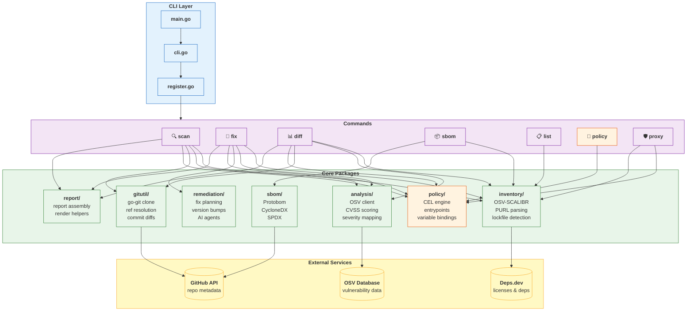
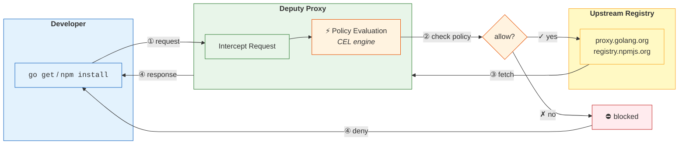
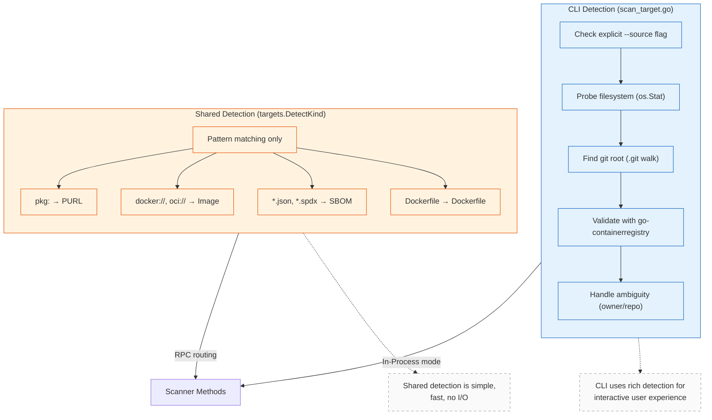
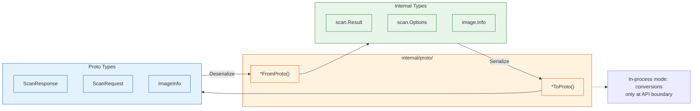
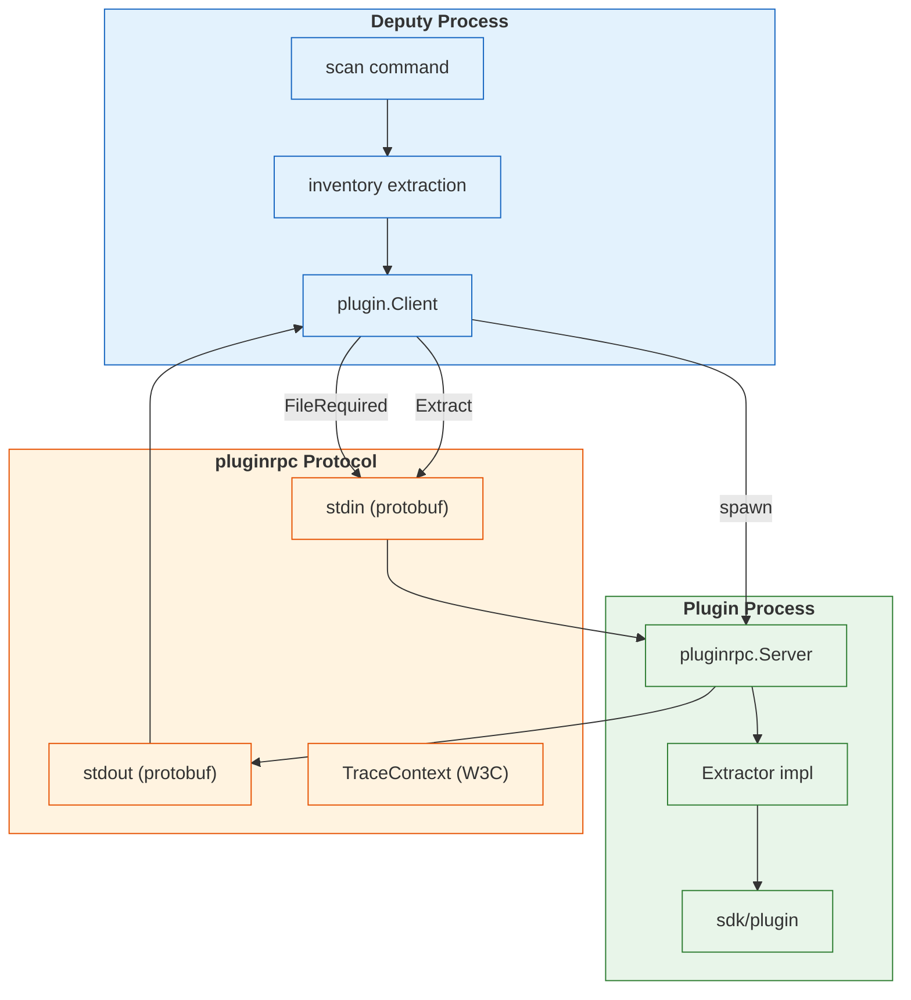

# AGENTS.md

Deputy is a Go CLI for software supply chain security. Scan, fix, diff, and enforce policies.

## Architecture Overview





**Data Flow (for `scan` command):**
1. **Target resolution** — local directory, `git` ref, or remote repository.
2. **Inventory extraction** — OSV-SCALIBR parses lockfiles into PURLs.
3. **Vulnerability lookup** — query OSV API or local GCS bucket mirror.
4. **Policy evaluation** — CEL engine runs per-vulnerability and report-level rules.
5. **Output rendering** — table, JSON, or SARIF format.

## Quick Reference

```bash
go test ./...                                  # run all tests
go test -v -run TestName ./internal/pkg/...   # run specific test
go build -o deputy .                           # build binary
./deputy scan                                  # test locally
```

## Commands

```bash
# Vulnerability scanning
deputy scan                                    # scan current directory
deputy scan github.com/owner/repo              # scan remote repo
deputy scan --ref v1.0.0                       # scan specific Git ref
deputy scan --format json                      # JSON output

# Explain vulnerabilities
deputy explain CVE-2021-44228                  # detailed vulnerability info
deputy explain --agent claude CVE-2021-44228   # with agent analysis
deputy explain --format json GO-2024-2687      # JSON output

# Container image scanning
deputy scan nginx:1.25                         # scan remote image
deputy scan ghcr.io/owner/app:v1.0.0           # scan GHCR image
deputy scan docker-daemon://myapp:latest       # scan local daemon image
deputy scan --platform linux/amd64 alpine:3.19 # specific platform

# Remediation
deputy fix                                     # show remediation plan
deputy fix --apply .                           # apply fixes to directory

# Compare dependencies between Git refs
deputy diff main HEAD                          # diff main vs HEAD
deputy diff v1.0.0 v2.0.0                      # diff two tags

# Compare container images
deputy diff nginx:1.24 nginx:1.25              # diff image versions
deputy diff docker-daemon://app:dev ghcr.io/org/app:prod

# Generate SBOM
deputy sbom --format cyclonedx-json --output sbom.json
deputy sbom --format spdx-json --output sbom.spdx.json
deputy sbom docker://nginx:1.25 --format cyclonedx-json  # image SBOM

# List dependencies
deputy list                                    # list all dependencies
deputy list --only-direct                      # direct dependencies only
deputy list docker://nginx:1.25               # list packages in container image
deputy list --source remote alpine:3.19       # bare image ref with --source

# Policy development
deputy policy eval policy.yaml                 # test policy
deputy policy lint policy.yaml                 # validate syntax
deputy policy lsp                              # language server

# Proxy (enforce policies at download time)
deputy proxy go -- go get github.com/pkg
deputy proxy npm -- npm install lodash
deputy proxy oci --config oci-proxy.yaml       # OCI registry proxy

# Secret scanning
deputy secrets                                 # scan current directory for secrets
deputy secrets /path/to/project                # scan specific directory
deputy secrets --format json                   # JSON output for CI/CD
deputy scan --secrets                          # combined vuln + secrets scan

# Server mode (for remote clients)
deputy server                                  # start API server on :8090
deputy server --addr :9000                     # custom port
deputy --server http://localhost:8090 scan    # connect to remote server

# Cache management (offline use)
deputy cache status                            # show cache status and statistics
deputy cache init                              # download OSV + KEV for offline use
deputy cache init osv kev                      # download specific sources
deputy cache update                            # update stale caches
deputy cache update --force                    # force refresh all caches
deputy cache clear                             # clear all cached data
deputy cache clear osv                         # clear specific cache
deputy scan --no-cache                         # bypass all caches, fetch fresh data
deputy scan --no-cache=osv,kev                 # bypass specific caches
```

## Project Structure

```
main.go                      # entry point
internal/
  cli/cmd/                   # Cobra commands (scan.go, fix.go, diff.go, etc.)
                             # see internal/cli/cmd/root.go for command registration
  cli/flags/                 # shared CLI flag parsing helpers
  analysis/                  # analysis orchestration and OSV facade
    osv/                     # OSV API + GitHub Actions bucket integration
  cache/                     # caching primitives
    memory/                  # in-memory TTL LRU cache
    disk/                    # persistent JSON-on-disk cache
    sources/                 # cache.Source implementations (osv, kev, epss, depsdev)
  container/                 # container analysis
    image/                   # image config, metadata, extraction
  inventory/                 # dependency detection
    manifests/               # manifest path + manager heuristics
  explain/                   # vulnerability explanation rendering
  license/                   # license enrichment + scanning
  policy/                    # CEL evaluation engine (eval.go)
  proxy/                     # package proxy server
  report/                    # report/context helpers
    render/                  # CLI-friendly rendering helpers
  sbom/                      # SBOM generation
  remediation/               # fix planning
  gitutil/                   # Git operations (clone.go, diff.go, refs.go)
  ai/                        # AI provider abstraction
    providers/               # claude, codex implementations
    render/                  # AI output rendering (spinners, glamour)
  vulnerability/             # vulnerability domain types + CVSS/severity
    intel/                   # threat intelligence enrichment
      kev/                   # CISA KEV catalog client
      epss/                  # FIRST EPSS scores client
    ssvc/                    # SSVC decision tree framework
  secrets/                   # secret detection engine (Veles + patterns)
docs/                        # documentation
  commands/                  # command reference
  guides/                    # how-to guides (ci.md, workflows.md, agents.md)
policy/examples/             # 30+ CEL policy examples
```

Key entry points: [`main.go`](main.go) → [`internal/cli/cli.go`](internal/cli/cli.go) → [`internal/cli/cmd/root.go`](internal/cli/cmd/root.go)

## Services Architecture

Deputy uses a proto-first design where CLI, MCP, and SDK all consume the same ConnectRPC-generated service interfaces. This enables three execution modes with different security characteristics.

```mermaid
flowchart TB
    subgraph Consumers["<b>Service Consumers</b>"]
        direction LR
        cli["CLI Commands"]
        mcp["MCP Server"]
        sdk["Go SDK"]
    end

    subgraph Services["<b>services.Clients</b>"]
        direction TB
        vulns["Vulns<br/><i>ScanServiceClient</i>"]
        inventory["Inventory<br/><i>ListServiceClient</i>"]
        sbom["SBOM<br/><i>SBOMServiceClient</i>"]
        secrets["Secrets<br/><i>SecretsServiceClient</i>"]
        diff["Diff<br/><i>DiffServiceClient</i>"]
        graph["Graph<br/><i>GraphServiceClient</i>"]
    end

    subgraph Transport["<b>Transport Layer</b>"]
        direction LR
        inproc["<b>InProcessTransport</b><br/>Direct handler calls<br/>Zero network overhead"]
        daemon["<b>Unix Socket</b><br/>Local daemon<br/>Shared cache + OTel"]
        remote["<b>HTTP/2</b><br/>ConnectRPC<br/>Remote server"]
    end

    subgraph Handlers["<b>Service Handlers</b>"]
        direction TB
        scan_h["ScanHandler"]
        list_h["ListHandler"]
        sbom_h["SBOMHandler"]
        secrets_h["SecretsHandler"]
    end

    cli & mcp & sdk --> Services
    Services --> Transport
    inproc --> Handlers
    daemon -->|"Unix socket"| Handlers
    remote -->|"Network"| Handlers

    classDef consumer fill:#e3f2fd,stroke:#1565c0
    classDef services fill:#e8f5e9,stroke:#2e7d32
    classDef transport fill:#fff3e0,stroke:#e65100
    classDef handler fill:#f3e5f5,stroke:#7b1fa2

    class Consumers,cli,mcp,sdk consumer
    class Services,vulns,inventory,sbom,secrets,diff,graph services
    class Transport,inproc,daemon,remote transport
    class Handlers,scan_h,list_h,sbom_h,secrets_h handler
```

### Execution Modes

| Mode | Transport | Use Case |
|------|-----------|----------|
| **In-Process** | `InProcessTransport` | CLI/MCP default, zero overhead |
| **Local Daemon** | Unix socket | Shared caching, OTel collection, local observability |
| **Remote Server** | HTTP/2 (ConnectRPC) | Centralized policy, enterprise |

Mode is auto-detected:
1. If `DEPUTY_SERVER` is set → Remote mode
2. If `DEPUTY_DAEMON` is set or `/tmp/deputy.sock` exists → Local daemon mode
3. Otherwise → In-process mode

### Security Model

Deputy's security model distinguishes between **local modes** (in-process, daemon) and **remote server mode**. The core principle: remote servers must never execute arbitrary code or access local filesystems.

```mermaid
flowchart LR
    subgraph Local["<b>Local Modes</b><br/>(In-Process, Daemon)"]
        direction TB
        L1["✓ Filesystem paths"]
        L2["✓ Stdin SBOM (-)"]
        L3["✓ docker-daemon://"]
        L4["✓ tarball://, oci-archive://"]
        L5["✓ Git URLs"]
        L6["✓ Container registries"]
        L7["✓ PURLs"]
        L8["✓ Execute remediation plans"]
        L9["✓ AI agent execution"]
    end

    subgraph Remote["<b>Remote Server</b>"]
        direction TB
        R1["✗ Filesystem paths"]
        R2["✗ Stdin SBOM (-)"]
        R3["✗ docker-daemon://"]
        R4["✗ tarball://, oci-archive://"]
        R5["✓ Git URLs"]
        R6["✓ Container registries"]
        R7["✓ PURLs"]
        R8["✗ Execute remediation plans"]
        R9["✗ AI agent execution"]
    end

    validate["ValidateRemoteTarget()"]
    localMode["localMode check"]

    Remote --> validate
    validate -->|"Rejects local targets"| rejected["Error with guidance"]
    Remote --> localMode
    localMode -->|"Blocks code execution"| blocked["PermissionDenied"]

    classDef allowed fill:#c8e6c9,stroke:#2e7d32
    classDef denied fill:#ffcdd2,stroke:#c62828
    classDef validator fill:#fff3e0,stroke:#e65100

    class L1,L2,L3,L4,L5,L6,L7,L8,L9 allowed
    class R1,R2,R3,R4,R8,R9 denied
    class R5,R6,R7 allowed
    class validate,localMode validator
```



**Two security mechanisms:**

1. **Target validation** (`ValidateRemoteTarget()`): Blocks filesystem paths, stdin, and local container transports on remote servers. Ensures servers only access network-reachable resources.

2. **Local mode gating** (`localMode` field): Controls code execution capabilities. Handlers that execute shell commands or AI agents check `localMode` and return `PermissionDenied` if disabled.

**Handler Security Classification:**

| Handler | Method | Filesystem Access | Code Execution | Remote Safe |
|---------|--------|-------------------|----------------|-------------|
| Scan | `Scan()` | Via target validation | No | Yes (with validation) |
| List | `ListPackages()` | Via target validation | No | Yes (with validation) |
| SBOM | `Generate()` | Via target validation | No | Yes (with validation) |
| SBOM | `Diff()` | No (byte arrays) | No | **Yes** |
| Remediation | `GeneratePlan()` | No (in-memory) | No | **Yes** |
| Remediation | `ExecutePlan()` | Yes | **Yes** | **No** - requires `localMode` |
| Remediation | `ExecuteWithAgent()` | Yes | **Yes** | **No** - requires `localMode` |
| Secrets | `Scan()` | Via target validation | No | Yes (with validation) |

**Implementation pattern:**

```go
// Handler with localMode protection
type RemediationHandler struct {
    localMode bool  // Set via WithRemediationLocalMode()
}

func (h *RemediationHandler) ExecutePlan(...) error {
    // Security: Block on remote servers
    if !h.localMode {
        return connect.NewError(connect.CodePermissionDenied,
            fmt.Errorf("ExecutePlan is not available on remote servers; use local CLI or daemon mode"))
    }
    // ... execute shell commands
}
```

**For developers adding new handlers:**
- Read-only operations on network resources: Safe for remote servers
- Operations requiring local filesystem: Add `localMode` check or use `ValidateRemoteTarget()`
- Operations executing code (shell, AI agents): **Must** require `localMode=true`

### Target Detection (Two-Layer Design)

Deputy uses two complementary detection strategies:

| Layer | Function | Purpose | Filesystem Access |
|-------|----------|---------|-------------------|
| **CLI** | `scan_target.go` | Rich UX: git root detection, ambiguity errors, interactive hints | Yes |
| **Client/Server** | `targets.DetectKind()` | Deterministic routing for RPC | No |



**Design rationale:** The CLI needs filesystem awareness (git roots, file existence) and can prompt for clarification. The client/server layer needs deterministic, I/O-free routing for RPC.

### Target Routing

| Target Pattern | Detected As | Scanner Method |
|----------------|-------------|----------------|
| `pkg:golang/...` | PURL | `ScanPURL` |
| `docker://`, `ghcr.io/...`, `nginx:1.25` | Container Image | `ScanContainerImage` |
| `*.json`, `*.spdx`, `*.cdx` | SBOM | `ScanRepository` (file detection) |
| `Dockerfile`, `*.dockerfile` | Dockerfile | `ScanDockerfile` |
| `github.com/owner/repo`, `.` | Git/Directory | `ScanRepository` |

Use `TargetHint` in `ScanOptions` when auto-detection is ambiguous:
```go
opts := &deputyv1.ScanOptions{
    TargetHint: &deputyv1.TargetHint{
        Kind: deputyv1.TargetKind_TARGET_KIND_CONTAINER_IMAGE,
        ImageTransport: "daemon",  // Use local Docker daemon
    },
}
```

### Proto-First Design

The client layer uses Protocol Buffers at the API boundary, enabling:
- **Type-safe RPC** with ConnectRPC (HTTP/2 + gRPC)
- **Language-agnostic clients** (future: TypeScript, Python SDKs)
- **Versioned API contracts** with backward compatibility



### Key Files

| File | Purpose |
|------|---------|
| [`internal/services/services.go`](internal/services/services.go) | Services and Clients structs, `localMode` configuration |
| [`internal/services/transport.go`](internal/services/transport.go) | InProcessTransport implementation |
| [`internal/server/scan_handler.go`](internal/server/scan_handler.go) | ScanServiceHandler with `ValidateRemoteTarget()` |
| [`internal/server/list_handler.go`](internal/server/list_handler.go) | ListServiceHandler for package enumeration |
| [`internal/server/sbom_handler.go`](internal/server/sbom_handler.go) | SBOMServiceHandler (Generate, Diff) |
| [`internal/server/remediation_handler.go`](internal/server/remediation_handler.go) | RemediationServiceHandler with `localMode` security gates |
| [`internal/targets/detect.go`](internal/targets/detect.go) | Shared target detection and `ValidateRemoteTarget()` |
| [`internal/proto/`](internal/proto/) | Proto ↔ internal type converters |
| [`api/deputy/`](api/deputy/) | Proto service definitions |
| [`sdk/deputy.go`](sdk/deputy.go) | Go SDK wrapping services.Clients |

## Plugin System

Deputy supports external extractor plugins for custom package detection. Plugins run as separate processes using [pluginrpc](https://github.com/pluginrpc/pluginrpc), enabling any-language implementations with isolated execution.



### Three Types of Extractors

| Type | Location | Language | Discovery |
|------|----------|----------|-----------|
| **OSV-SCALIBR** | Built-in | Go | Automatic |
| **Deputy Built-in** | `internal/inventory/plugins/` | Go | Automatic |
| **Plugins** | External executables | Any | PATH or config |

### Plugin SDK (Go)

```go
package main

import "github.com/picatz/deputy/sdk/plugin"

func main() {
    plugin.Main(&myExtractor{})
}

type myExtractor struct{}

func (e *myExtractor) Name() string           { return "custom/myformat" }
func (e *myExtractor) DisplayName() string    { return "My Format" }
func (e *myExtractor) Ecosystem() string      { return "custom" }
func (e *myExtractor) Version() int           { return 1 }
func (e *myExtractor) Description() string    { return "Extracts .myformat files" }
func (e *myExtractor) FilePatterns() []string { return []string{"*.myformat"} }

func (e *myExtractor) FileRequired(path string, isDir bool, mode uint32, size int64) bool {
    return strings.HasSuffix(path, ".myformat")
}

func (e *myExtractor) Extract(path string, contents []byte, root string) ([]*plugin.Package, error) {
    return []*plugin.Package{
        plugin.NewPackage("example-pkg", "1.0.0", "custom"),
    }, nil
}
```

### Plugin Registration

```yaml
# .deputy.yaml
plugins:
  extractors:
    - path: /usr/local/bin/deputy-extractor-myformat
    - name: deputy-extractor-gemspec  # searches PATH
```

Plugins named `deputy-extractor-*` in PATH are auto-discovered.

### Distributed Tracing

Plugins automatically participate in distributed traces via W3C TraceContext:

```
Deputy Scan (parent span)
├── inventory.Extract
│   └── plugin.client.FileRequired ─────────────┐
│       └── [subprocess: plugin.FileRequired] ◄─┘
│   └── plugin.client.Extract ──────────────────┐
│       └── [subprocess: plugin.Extract] ◄──────┘
```

When `OTEL_EXPORTER_OTLP_ENDPOINT` is set, trace context flows across process boundaries via the `TraceContext` field in plugin requests.

### Plugin Protocol

Plugins implement the `ExtractorService` from `api/deputy/plugin/v1/extractor.proto`:

```protobuf
service ExtractorService {
  rpc Info(InfoRequest) returns (InfoResponse);
  rpc FileRequired(FileRequiredRequest) returns (FileRequiredResponse);
  rpc Extract(ExtractRequest) returns (ExtractResponse);
}
```

Protocol requirements:
- `--protocol` flag → returns `1`
- `--spec` flag → returns procedure spec (binary)
- Subcommands: `info`, `file-required`, `extract`
- I/O: protobuf on stdin/stdout

### Testing Plugins

```bash
# Build
go build -o deputy-extractor-myformat .

# Test protocol
./deputy-extractor-myformat --protocol        # → 1
./deputy-extractor-myformat --spec            # → procedure spec

# Test info
./deputy-extractor-myformat info --format json

# Integration test with Deputy
deputy scan --debug  # shows plugin invocations
```

### Key Files

| File | Purpose |
|------|---------|
| [`api/deputy/plugin/v1/extractor.proto`](api/deputy/plugin/v1/extractor.proto) | Plugin service definition |
| [`sdk/plugin/`](sdk/plugin/) | Go SDK for building plugins |
| [`sdk/plugin/extractor.go`](sdk/plugin/extractor.go) | `Main()` entry point, `Extractor` interface |
| [`sdk/plugin/package.go`](sdk/plugin/package.go) | `NewPackage()`, `PackageBuilder` |
| [`sdk/plugin/trace.go`](sdk/plugin/trace.go) | OTel trace context extraction |
| [`internal/inventory/plugin/client.go`](internal/inventory/plugin/client.go) | Plugin client for invoking plugins |
| [`examples/plugins/dotenv-extractor/`](examples/plugins/dotenv-extractor/) | Example plugin |

## Tech Stack

- [Go] 1.21+ (uses [`toolchain`](https://go.dev/doc/toolchain) directive); use modern features like [generics](https://go.dev/blog/intro-generics), and packages like [`slices`](https://pkg.go.dev/slices), [`maps`](https://pkg.go.dev/maps), [`iter`](https://pkg.go.dev/iter), [`cmp`](https://pkg.go.dev/cmp), [`log/slog`](https://pkg.go.dev/log/slog), etc.
- [Cobra] for CLI; [Charm] for [Fang], [Lipgloss], etc. Prefer avoiding emojis in output, use ASCII or Unicode symbols, only if they add clarity; when in doubt, don't use them. Avoid them in most machine-readable output.
- [ConnectRPC] for gRPC/HTTP services with ecosystem libraries: [authn-go] (JWT authentication), [validate-go] (protovalidate), [cors-go] (CORS headers), [otelconnect] (OpenTelemetry).
- [CEL] (Common Expression Language) for policies in a [YAML]-based [DSL].
- [OSV] API and [GCS] buckets for vulnerability data.
- [OSV-SCALIBR] for SCA inventory extraction (see [`internal/inventory/`](internal/inventory/)).
- [go-git] for Git operations (cloning, refs, diffs, commit snapshots). See [`internal/gitutil/`](internal/gitutil/).
- [PURL] (Package URL) for normalized package IDs.
- [Deps.dev] for dependency license, inventory, resolution, etc.
- [GitHub API] for various data when needed, but mostly avoided (accessing repos, licenses, etc).
- [Protobom] as a first-class feature, with [CycloneDX]/[SPDX] output for SBOMs.

[Go]: https://golang.org
[Cobra]: https://cobra.dev/
[Charm]: https://charm.sh/
[Fang]: https://github.com/charmbracelet/fang
[Lipgloss]: https://github.com/charmbracelet/lipgloss
[ConnectRPC]: https://connectrpc.com/
[authn-go]: https://github.com/connectrpc/authn-go
[validate-go]: https://github.com/connectrpc/validate-go
[cors-go]: https://github.com/connectrpc/cors-go
[otelconnect]: https://github.com/connectrpc/otelconnect-go
[CEL]: https://cel.dev/
[YAML]: https://yaml.org/
[DSL]: https://en.wikipedia.org/wiki/Domain-specific_language
[OSV]: https://osv.dev
[OSV-SCALIBR]: https://github.com/google/osv-scalibr
[GCS]: https://cloud.google.com/storage
[go-git]: https://github.com/go-git/go-git
[Deps.dev]: https://deps.dev/
[PURL]: https://github.com/package-url/purl-spec
[Protobom]: https://github.com/protobom/protobom
[GitHub API]: https://docs.github.com/en/rest
[CycloneDX]: https://cyclonedx.org/
[SPDX]: https://spdx.dev/

## Policies (CEL)

Entrypoints define when a policy is evaluated. See [`internal/policy/entrypoints.go`](internal/policy/entrypoints.go) for canonical definitions.
See [`internal/policy/evaluator.go`](internal/policy/evaluator.go) for CEL activation and variable bindings.

**Proto-First Design:** Deputy uses a proto-first design for policy evaluation. Variables like `vulnerability`, `pkg`, and `image` are protocol buffer messages, enabling type-safe field access with CEL's native proto support. Field names use **snake_case** as defined in the proto files (e.g., `vulnerability.advisory.fixed_versions`, `vulnerability.package.layer_details.in_base_image`). Severity checks use the canonical proto path with severity constants (e.g., `vulnerability.advisory.severity.level == severity.critical`, `vulnerability.advisory.severity.level in [severity.critical, severity.high]`). See proto definitions in [`api/deputy/`](api/deputy/) for authoritative field names.

**Type-safe Entrypoints:** The `policy.Entrypoint` type provides compile-time safety when passing entrypoints in Go code. Use constants like `policy.EntrypointScanReport` instead of string literals. The `Entrypoint` type provides `String()`, `IsValid()`, and `Category()` methods.

### Policy Examples

```yaml
# Block critical severity vulnerabilities
policies:
  - name: block-critical
    rules:
      - action: deny
        when: vulnerabilities.exists(v, v.advisory.severity.level == severity.critical)
        reason: "Critical vulnerability found"
```

```yaml
# Require a license from an approved list
policies:
  - name: require-approved-license
    vars:
      allowed_licenses: ["MIT", "Apache-2.0", "BSD-3-Clause"]
    rules:
      - action: deny
        when: pkg.licenses.all(l, !(l in allowed_licenses))
        reason: "Package license is not in the approved list"
```

### Key Variables

The following variables are available in CEL expressions, depending on the policy entrypoint.

#### `pkg` object

Contains information about the dependency being analyzed. Available in `scan_report` and `scan_vulnerability` entrypoints.

| Field | Type | Description | Example Value |
|---|---|---|---|
| `name` | `string` | Name of the package | `"lodash"` |
| `version` | `string` | Version of the package | `"4.17.21"` |
| `ecosystem` | `string` | Package ecosystem | `"npm"` |
| `licenses` | `list(string)` | List of SPDX license identifiers | `["MIT"]` |

**Example Expressions for `pkg`:**

*   Deny a specific package:
    `pkg.name == 'left-pad'`
*   Deny packages with non-compliant licenses:
    `pkg.licenses.all(l, !(l in ['MIT', 'Apache-2.0']))`
*   Deny older versions of a package:
    `pkg.name == 'react' && pkg.version.startsWith('16.')`
*   Deny if license information is missing:
    `pkg.licenses.size() == 0`

Note: The `pkg` helper provides sensible defaults (`name`, `version`, `ecosystem` default to `""`, `licenses` defaults to `[]`), so you don't need `?.orValue()` for these fields.

---

#### `vulnerability` object

Represents a single vulnerability affecting a package. Available in the `scan_vulnerability` entrypoint. The `vulnerability` variable is a proto message (`vulnerabilityv1.Finding`).

**Proto-First Field Access:**
Deputy uses a proto-first design with snake_case field names. Access fields using the proto structure:
- `vulnerability.advisory_id` - the advisory ID
- `vulnerability.advisory.severity.level` - severity level enum
- `vulnerability.package.direct` - whether this is a direct dependency
- `vulnerability.advisory.fixed_versions` - list of fixed versions

| Field | Type | Description | Example Value |
|---|---|---|---|
| `vulnerability.advisory_id` | `string` | Vulnerability ID (e.g., CVE, GHSA) | `"CVE-2021-44228"` |
| `vulnerability.advisory.id` | `string` | Primary advisory ID | `"CVE-2021-44228"` |
| `vulnerability.advisory.aliases` | `list(string)` | Alternative identifiers (CVE, GHSA cross-references) | `["GHSA-jfh8-c2jp-5v3q"]` |
| `vulnerability.advisory.summary` | `string` | Brief description | `"Remote code execution..."` |
| `vulnerability.advisory.details` | `string` | Full vulnerability description | `"Apache Log4j2..."` |
| `vulnerability.advisory.cve` | `string` | CVE identifier if available | `"CVE-2021-44228"` |
| `vulnerability.advisory.severity.level` | `enum` | Severity enum (use `severity.critical`, `severity.high`, etc.) | `SEVERITY_LEVEL_CRITICAL` |
| `vulnerability.advisory.fixed_versions` | `list(string)` | Versions containing a fix | `["2.15.0"]` |
| `vulnerability.advisory.references` | `list(string)` | URLs with additional information | `["https://nvd.nist.gov/..."]` |
| `vulnerability.advisory.cwes` | `list(string)` | CWE identifiers | `["CWE-502", "CWE-400"]` |
| `vulnerability.package.direct` | `bool` | If the vulnerability is in a direct dependency | `true` |
| `vulnerability.package.layer_details` | `object` | Container image layer info (nil for non-image scans) | see below |

**Severity Checks (canonical proto access):**
Use the proto path with severity constants for type-safe severity checks:

```cel
# Check for CRITICAL severity
vulnerability.advisory.severity.level == severity.critical

# Check for HIGH or CRITICAL
vulnerability.advisory.severity.level in [severity.critical, severity.high]

# Check for MEDIUM and above
vulnerability.advisory.severity.level in [severity.critical, severity.high, severity.medium]

# In filter/map expressions
vulnerabilities.filter(v, v.advisory.severity.level == severity.critical)
vulnerabilities.exists(v, v.advisory.severity.level in [severity.critical, severity.high])
```

**Severity Constants:**
Deputy provides lowercase severity constants that map to proto enum values:
- `severity.critical` - SEVERITY_LEVEL_CRITICAL
- `severity.high` - SEVERITY_LEVEL_HIGH
- `severity.medium` - SEVERITY_LEVEL_MEDIUM
- `severity.low` - SEVERITY_LEVEL_LOW
- `severity.unspecified` - SEVERITY_LEVEL_UNSPECIFIED

**Enrichment Fields (when `--enrich` is enabled):**

| Field | Type | Description | Example Value |
|---|---|---|---|
| `vulnerability.epss` | `float` | EPSS score (0.0-1.0): probability of exploitation in next 30 days | `0.97` |
| `vulnerability.epss_percentile` | `float` | EPSS percentile (0.0-1.0): % of CVEs with lower EPSS score | `0.99` |
| `vulnerability.in_kev` | `bool` | Whether CVE is in CISA's Known Exploited Vulnerabilities catalog | `true` |
| `vulnerability.kev_date_added` | `string` | Date CVE was added to KEV catalog (YYYY-MM-DD) | `"2021-12-10"` |
| `vulnerability.kev_due_date` | `string` | Federal agency compliance deadline (YYYY-MM-DD) | `"2021-12-24"` |
| `vulnerability.kev_required_action` | `string` | CISA's required remediation action | `"Apply updates..."` |
| `vulnerability.kev_known_ransomware_campaign_use` | `string` | Ransomware involvement: `"Known"` or `"Unknown"` | `"Known"` |

**Layer Details (container images only):**

When scanning container images, `vulnerability.package.layer_details` provides information about which layer introduced the vulnerable package:

| Field | Type | Description | Example Value |
|---|---|---|---|
| `layer_details.index` | `int` | Layer position (0 = oldest/base layer) | `2` |
| `layer_details.diff_id` | `string` | Digest of uncompressed layer content | `"sha256:abc..."` |
| `layer_details.chain_id` | `string` | Cumulative layer chain ID (see below) | `"sha256:def..."` |
| `layer_details.command` | `string` | Dockerfile instruction that created layer | `"RUN apt-get install..."` |
| `layer_details.in_base_image` | `bool` | Whether layer is from base image (FROM) | `true` |

**Understanding chain_id:**

The `chain_id` uniquely identifies a layer in the context of all its parent layers, per the [OCI Image Spec](https://github.com/opencontainers/image-spec/blob/main/config.md#layer-chainid). Unlike `diff_id` (which identifies layer content), `chain_id` is calculated as:
- For the first layer: `chain_id = diff_id`
- For subsequent layers: `chain_id = sha256(parent_chain_id + " " + diff_id)`

Use `chain_id` when you need to identify a specific layer stack (e.g., for caching or comparing layers across images with shared bases). Use `diff_id` when you only care about the layer content itself.

**Example Expressions for `vulnerability`:**

*   Deny critical vulnerabilities:
    `vulnerability.advisory.severity.level == severity.critical`
*   Deny high or above severity:
    `vulnerability.advisory.severity.level in [severity.critical, severity.high]`
*   Deny vulnerabilities in direct dependencies that have a fix:
    `vulnerability.package.direct && size(vulnerability.advisory.fixed_versions) > 0`
*   Deny a specific vulnerability by ID:
    `vulnerability.advisory_id == 'GHSA-jfh8-c2j2-2hch'`
*   Deny if a vulnerability has no fix and is HIGH or CRITICAL:
    `size(vulnerability.advisory.fixed_versions) == 0 && vulnerability.advisory.severity.level in [severity.critical, severity.high]`
*   Block deprecated/unmaintained packages by advisory text:
    `vulnerability.advisory.summary.lowerAscii().matches("deprecated|unmaintained|end.of.life")`
*   Block Log4Shell by alias (CVE cross-reference):
    `vulnerability.advisory.aliases.exists(a, a == "CVE-2021-44228")`
*   Block injection vulnerabilities by CWE:
    `vulnerability.advisory.cwes.exists(c, c in ["CWE-89", "CWE-79", "CWE-94"])`

**Layer-Aware Examples (container images):**

*   Block critical vulnerabilities in base image layers:
    `has(vulnerability.package.layer_details) && vulnerability.package.layer_details.in_base_image && vulnerability.advisory.severity.level == severity.critical`
*   Warn on vulnerabilities from application layers (not base image):
    `has(vulnerability.package.layer_details) && !vulnerability.package.layer_details.in_base_image && vulnerability.advisory.severity.level in [severity.critical, severity.high]`
*   Detect vulnerabilities from apt-get install commands:
    `has(vulnerability.package.layer_details) && vulnerability.package.layer_details.command.contains('apt-get install')`
*   Flag vulnerabilities in early base layers (likely system packages):
    `has(vulnerability.package.layer_details) && vulnerability.package.layer_details.index < 3 && vulnerability.advisory.severity.level == severity.critical`

**Enrichment-Based Examples (when `--enrich` is enabled):**

*   Block vulnerabilities in CISA KEV catalog:
    `vulnerability.in_kev == true`
*   Block high-probability exploitation (EPSS > 0.7):
    `vulnerability.epss > 0.7`
*   Block KEV vulnerabilities used in ransomware campaigns:
    `vulnerability.in_kev == true && vulnerability.kev_known_ransomware_campaign_use == 'Known'`
*   Block KEV vulnerabilities past their due date:
    `vulnerability.in_kev == true && vulnerability.kev_due_date != '' && vulnerability.kev_due_date < now().format('2006-01-02')`
*   Prioritize by EPSS percentile (top 5% most likely to be exploited):
    `vulnerability.epss_percentile > 0.95`

**Graph Fields (when `--with-graph` is enabled):**

When scanning with `--with-graph`, the dependency graph is resolved to show how transitive vulnerabilities reach your project:

| Field | Type | Description | Example Value |
|---|---|---|---|
| `vulnerability.path` | `list(string)` | Dependency chain from root to vulnerable package | `["myapp", "go-git/v5", "x/crypto"]` |
| `vulnerability.depth` | `int` | Distance from root (0 = direct, 1+ = transitive) | `2` |

**Graph-Based Examples (when `--with-graph` is enabled):**

*   Allow deep transitive vulnerabilities (focus on direct deps):
    `vulnerability.depth > 2 && vulnerability.advisory.severity.level != severity.critical`
*   Block critical vulnerabilities regardless of depth:
    `vulnerability.advisory.severity.level == severity.critical`
*   Warn on vulnerabilities introduced through specific packages:
    `vulnerability.path.exists(p, p.contains('legacy-lib'))`
*   Prioritize vulnerabilities in shallow dependencies:
    `vulnerability.depth <= 1 && vulnerability.advisory.severity.level in [severity.critical, severity.high]`
*   Identify vulnerabilities with long dependency chains (supply chain risk):
    `vulnerability.depth > 3`

**Note:** For full dependency graph analysis (graph statistics, node/edge policies, traversal), use the `graph_report`, `graph_node`, and `graph_edge` entrypoints with the `deputy graph` command. See the [Graph Helper Functions](#graph-helper-functions) section below.

---

#### `vulnerabilities` list

A list of all `vulnerability` objects found in a scan report. Available in the `scan_report` entrypoint. This is most commonly used with CEL macros like `exists`.

**Example Expressions for `vulnerabilities`:**

*   Deny if any critical vulnerabilities exist in the report:
    `vulnerabilities.exists(v, v.advisory.severity.level == severity.critical)`
*   Deny if there are more than 5 vulnerabilities in total:
    `vulnerabilities.size() > 5`
*   Deny if all vulnerabilities are high severity:
    `vulnerabilities.all(v, v.advisory.severity.level == severity.high)`

---

#### `image` object

Contains container image configuration and metadata when scanning container images. Available in `scan_report`, `scan_vulnerability`, and `oci_artifact_request` entrypoints.

The `image` object combines provenance data (registry, repository, tag, digest) with extracted configuration (`image.config`) and metadata (`image.metadata`) when available. For advanced use cases, the same data is also available via `image_info` which contains only the extracted config/metadata/history (without provenance).

**Image Configuration Availability by Transport:**

The availability of `image.config` and `image.metadata` depends on how the image is loaded:

| Transport | Scheme | `image.config` | `image.metadata` | Notes |
|-----------|--------|----------------|------------------|-------|
| Remote Registry | `docker://`, `oci://`, `container://` | Yes | Yes | Full config available via v1.Image API |
| Docker Daemon | `docker-daemon://` | No | Partial | Config extraction not supported; use remote pull for full analysis |
| Tarball | `tarball://` | No | Partial | Config extraction not supported for Docker image tarballs |
| OCI Archive | `oci-archive://` | No | Partial | Config extraction not supported for OCI archive tarballs |
| OCI Layout | `oci-layout://` | No | Partial | Config extraction not supported for OCI layout directories |

For full image configuration analysis, pull images from remote registries. When `image.config` is unavailable, the `image` variable will still be populated with basic metadata (registry, repository, tag, digest) from the request or target provenance.

**Image Configuration (`image.config`):**

Extracted from the container image's configuration (Dockerfile settings):

| Field | Type | Description | Example Value |
|---|---|---|---|
| `config.user` | `string` | User to run as (empty = root) | `"nobody"` |
| `config.is_root` | `bool` | Whether running as root | `true` |
| `config.env` | `list(string)` | Environment variables | `["PATH=/usr/bin"]` |
| `config.sensitive_env` | `list(string)` | Env vars that may contain secrets | `["API_KEY"]` |
| `config.entrypoint` | `list(string)` | Container entrypoint command | `["/app"]` |
| `config.cmd` | `list(string)` | Default command arguments | `["serve"]` |
| `config.exposed_ports` | `list(string)` | Exposed ports | `["8080/tcp"]` |
| `config.volumes` | `list(string)` | Defined volumes | `["/data"]` |
| `config.labels` | `map(string)` | Image labels | `{"version": "1.0"}` |
| `config.working_dir` | `string` | Working directory | `"/app"` |
| `config.healthcheck` | `object` | Healthcheck configuration (if defined) | see below |

**Healthcheck Configuration (`image.config.healthcheck`):**

When a container image defines a HEALTHCHECK instruction, the following fields are available:

| Field | Type | Description | Example Value |
|---|---|---|---|
| `healthcheck.test` | `list(string)` | Health check command (`["CMD", "curl", "-f", "http://localhost/"]`) | `["CMD-SHELL", "curl -f http://localhost/health"]` |
| `healthcheck.interval` | `string` | Time between checks (Go duration format) | `"30s"` |
| `healthcheck.timeout` | `string` | Timeout for each check (Go duration format) | `"10s"` |
| `healthcheck.retries` | `int` | Consecutive failures before unhealthy | `3` |

**Note:** `healthcheck` is `null` if no HEALTHCHECK is defined in the image.

**Image Metadata (`image.metadata`):**

| Field | Type | Description | Example Value |
|---|---|---|---|
| `metadata.architecture` | `string` | CPU architecture | `"amd64"` |
| `metadata.os` | `string` | Operating system | `"linux"` |
| `metadata.layer_count` | `int` | Number of layers | `15` |
| `metadata.size` | `int` | Total size in bytes | `104857600` |
| `metadata.created` | `timestamp` | When the image was created | `timestamp("2024-01-01T00:00:00Z")` |
| `metadata.digest` | `string` | Image digest | `"sha256:abc..."` |

**Image History (`image.history`):**

List of build history entries showing Dockerfile commands:

| Field | Type | Description |
|---|---|---|
| `history[].created_by` | `string` | Command that created the layer |
| `history[].created` | `timestamp` | When this layer was created |
| `history[].empty_layer` | `bool` | Whether this is a metadata-only layer |

**Base Image Information (`image.base_image`):**

When available, contains base image information extracted from OCI annotations. This is populated automatically from `org.opencontainers.image.base.name` and `org.opencontainers.image.base.digest` annotations per the [OCI Image Spec](https://github.com/opencontainers/image-spec/blob/main/annotations.md).

| Field | Type | Description | Example Value |
|---|---|---|---|
| `base_image.name` | `string` | Base image reference | `"docker.io/library/alpine:3.19"` |
| `base_image.digest` | `string` | Base image digest | `"sha256:abc123..."` |

**Note:** `image.base_image` is `null` if the image does not have OCI base image annotations. Use `has(image.base_image)` to check for presence. This provides a no-network way to identify base images when the image builder sets the standard annotations (e.g., Docker BuildKit, ko, crane).

**Example Expressions for `image`:**

*   Block images running as root:
    `has(image.config) && image.config.is_root == true`
*   Block images with secrets in environment variables:
    `has(image.config) && size(image.config.sensitive_env) > 0`
*   Require healthcheck for production images:
    `has(image.config) && !has(image.config.healthcheck)`
*   Block images with too many layers (poor optimization):
    `has(image.metadata) && image.metadata.layer_count > 25`
*   Block oversized images (> 2GB):
    `has(image.metadata) && image.metadata.size > 2147483648`
*   Require OCI labels for traceability:
    `has(image.config) && !('org.opencontainers.image.source' in image.config.labels)`
*   Block images older than 90 days:
    `has(image.metadata) && now() - image.metadata.created > duration('2160h')`
*   Validate base image from OCI annotations (no network required):
    `has(image.base_image) && !image.base_image.name.contains("distroless") && !image.base_image.name.contains("alpine")`
*   Require base image annotations for supply chain traceability:
    `!has(image.base_image) || image.base_image.name == ""`

---

#### `dockerfile` object

Contains parsed Dockerfile data for static analysis. Available in `dockerfile_report` and `dockerfile_stage` entrypoints.

| Field | Type | Description | Example Value |
|---|---|---|---|
| `dockerfile.path` | `string` | Path to the Dockerfile | `"/app/Dockerfile"` |
| `dockerfile.stages` | `list(object)` | All build stages | see below |
| `dockerfile.args` | `map(string)` | ARG instructions with defaults | `{"GO_VERSION": "1.22"}` |
| `dockerfile.final_stage` | `object` | The last stage (what gets built) | see below |

**Stage fields** (available in `dockerfile.stages[]`, `dockerfile.final_stage`, and `stage` in `dockerfile_stage` entrypoint):

| Field | Type | Description | Example Value |
|---|---|---|---|
| `stage.index` | `int` | 0-based stage position | `0` |
| `stage.name` | `string` | AS alias (empty if unnamed) | `"builder"` |
| `stage.base_image` | `string` | FROM image reference as written | `"golang:${GO_VERSION}"` |
| `stage.base_image_resolved` | `object` | Parsed image reference | see below |
| `stage.platform` | `string` | --platform flag value | `"linux/amd64"` |
| `stage.is_scratch` | `bool` | True if FROM scratch | `false` |
| `stage.is_builder_stage` | `bool` | True if only used as COPY source | `true` |
| `stage.user` | `string` | Final USER directive value | `"nobody"` |
| `stage.is_root` | `bool` | True if running as root | `false` |
| `stage.workdir` | `string` | WORKDIR value | `"/app"` |
| `stage.env_vars` | `map(string)` | ENV declarations | `{"APP_ENV": "prod"}` |
| `stage.sensitive_env` | `list(string)` | Env vars matching secret patterns | `["API_KEY"]` |
| `stage.exposed_ports` | `list(string)` | EXPOSE ports | `["8080"]` |
| `stage.labels` | `map(string)` | LABEL key-value pairs | `{"version": "1.0"}` |
| `stage.healthcheck` | `object` | HEALTHCHECK config (or null) | see below |
| `stage.run_commands` | `list(object)` | RUN instructions | see below |
| `stage.copy_commands` | `list(object)` | COPY instructions | see below |
| `stage.add_commands` | `list(object)` | ADD instructions | see below |
| `stage.entrypoint` | `list(string)` | ENTRYPOINT command | `["/app"]` |
| `stage.cmd` | `list(string)` | CMD arguments | `["serve"]` |

**base_image_resolved fields:**

| Field | Type | Description | Example Value |
|---|---|---|---|
| `base_image_resolved.registry` | `string` | Registry (Docker Hub = "index.docker.io") | `"index.docker.io"` |
| `base_image_resolved.repository` | `string` | Repository path | `"library/alpine"` |
| `base_image_resolved.tag` | `string` | Tag (default "latest") | `"3.19"` |
| `base_image_resolved.digest` | `string` | Digest if specified | `"sha256:abc..."` |

**Example Expressions for `dockerfile`:**

*   Block images running as root:
    `has(dockerfile.final_stage) && dockerfile.final_stage.is_root && !dockerfile.final_stage.is_scratch`
*   Block :latest tag in any stage:
    `dockerfile.stages.exists(s, !s.is_scratch && s.base_image_resolved.tag == "latest")`
*   Require approved registries:
    `dockerfile.stages.exists(s, !s.is_scratch && !(s.base_image_resolved.registry in ["index.docker.io", "gcr.io"]))`
*   Detect sensitive environment variables:
    `dockerfile.stages.exists(s, size(s.sensitive_env) > 0)`
*   Require HEALTHCHECK in final stage:
    `has(dockerfile.final_stage) && !dockerfile.final_stage.is_scratch && dockerfile.final_stage.healthcheck == null`

---

#### `dockerfile_analysis` object

Contains static analysis results for Dockerfiles. Available in `dockerfile_report` and `dockerfile_stage` entrypoints.

| Field | Type | Description | Example Value |
|---|---|---|---|
| `dockerfile_analysis.stage_count` | `int` | Number of stages | `2` |
| `dockerfile_analysis.has_multi_stage` | `bool` | True if multi-stage build | `true` |
| `dockerfile_analysis.builder_stage_count` | `int` | Stages used only as COPY sources | `1` |
| `dockerfile_analysis.final_stage_is_root` | `bool` | Final stage runs as root | `false` |
| `dockerfile_analysis.final_stage_is_scratch` | `bool` | Final stage uses FROM scratch | `false` |
| `dockerfile_analysis.sensitive_env_vars` | `list(string)` | ENV vars matching secret patterns | `["AWS_SECRET_KEY"]` |
| `dockerfile_analysis.has_add_url` | `bool` | Any ADD instruction uses URLs | `false` |

**Example Expressions for `dockerfile_analysis`:**

*   Require multi-stage builds for Go projects:
    `dockerfile.stages.exists(s, s.base_image.contains("golang")) && !dockerfile_analysis.has_multi_stage`
*   Block ADD with URLs (security risk):
    `dockerfile_analysis.has_add_url`
*   Detect secrets in any stage:
    `size(dockerfile_analysis.sensitive_env_vars) > 0`

---

#### `request` object

Contains information about a package being requested through the proxy. Available in `go_artifact_request`, `npm_artifact_request`, `pypi_artifact_request`, `rubygems_artifact_request`, and `oci_artifact_request` entrypoints.

| Field | Type | Description | Example Value |
|---|---|---|---|
| `package` | `string` | Name of the package being requested | `"react"` |
| `version` | `string` | Version of the package being requested | `"18.2.0"` |

**Example Expressions for `request`:**

*   Block downloads of a specific package:
    `request.package == 'express'`
*   Block downloads of unscoped public npm packages:
    `!request.package.startsWith('@')`

---

#### `env` object

Contains information about the environment in which `deputy` is running.

| Field | Type | Description | Example Value |
|---|---|---|---|
| `command` | `string` | The `deputy` command being executed | `"scan"` |
| `entrypoint` | `string` | The policy entrypoint being evaluated | `"scan_vulnerability"` |

**Example Expressions for `env`:**

*   Apply a rule only during a `scan` command:
    `env.command == 'scan'`
*   Apply a rule only for vulnerability-level policies:
    `env.entrypoint == 'scan_vulnerability'`
*   Combine command and entrypoint for specific contexts:
    `env.command == 'proxy' && env.entrypoint == 'oci_artifact_request'`

---

#### `jwt` object

Contains verified JWT claims from authenticated proxy requests. Available in all proxy entrypoints when authentication is enabled. See [Proxy Authentication](#proxy-authentication) for configuration.

| Field | Type | Description | Example Value |
|---|---|---|---|
| `anonymous` | `bool` | `true` if no token was provided | `false` |
| `sub` | `string` | Subject (user/service ID) | `"user:alice"` |
| `iss` | `string` | Token issuer | `"https://auth.example.com"` |
| `aud` | `list(string)` | Audiences | `["deputy-proxy"]` |
| `exp` | `int` | Expiration timestamp (Unix) | `1700000000` |
| `iat` | `int` | Issued-at timestamp (Unix) | `1699990000` |
| `nbf` | `int` | Not-before timestamp (Unix) | `1699990000` |
| `jti` | `string` | JWT ID | `"abc123"` |
| `<custom>` | `any` | Any custom claims from the token | varies |

**Example Expressions for `jwt`:**

Using CEL optionals (`?.field` and `.orValue()`) for cleaner null-safe access:

*   Deny anonymous access to internal packages:
    `jwt.anonymous && request.module.startsWith("internal/")`
*   Require admin role for certain packages (using optionals):
    `!jwt.?roles.orValue([]).exists(r, r == "admin")`
*   Check team membership (using optionals):
    `jwt.?teams.orValue([]).exists(t, t == "platform")`
*   Validate service account format (using optionals):
    `jwt.?sub.orValue("").startsWith("sa:")`
*   Check token age (using time functions and optionals):
    `age(jwt.?iat.orValue(0)) > duration("24h")`

### CEL Helper Functions

Deputy extends CEL with custom functions for policy evaluation:

#### Time Functions

| Function | Signature | Description |
|----------|-----------|-------------|
| `now()` | `now() timestamp` | Returns current time as a timestamp (custom) |
| `age()` | `age(int\|timestamp) duration` | Duration since a Unix timestamp (custom convenience) |
| `timestamp()` | `timestamp(int\|string)` | CEL built-in: convert Unix seconds or RFC 3339 string |
| `duration()` | `duration(string) duration` | CEL built-in: parse duration (e.g., `"1h"`, `"30m"`) |
| `int(now())` | - | Get current Unix timestamp (use native conversion) |
| `int(timestamp)` | - | Get Unix seconds from timestamp (native conversion) |

**Example: Token age check (using optionals)**
```yaml
- action: warn
  when: |
    !jwt.anonymous &&
    age(jwt.?iat.orValue(0)) > duration("24h")
  reason: "Token is older than 24 hours"
```

#### String Functions (ext.Strings)

| Function | Signature | Description |
|----------|-----------|-------------|
| `matches()` | `string.matches(pattern)` | Regex match |
| `split()` | `string.split(sep)` | Split into list |
| `join()` | `list.join(sep)` | Join list elements |
| `trim()` | `string.trim()` | Remove whitespace |
| `replace()` | `string.replace(old, new)` | Replace occurrences |
| `lowerAscii()` | `string.lowerAscii()` | Lowercase ASCII |
| `upperAscii()` | `string.upperAscii()` | Uppercase ASCII |

#### Math Functions (ext.Math)

| Function | Signature | Description |
|----------|-----------|-------------|
| `math.abs()` | `math.abs(number)` | Absolute value |
| `math.ceil()` | `math.ceil(double)` | Round up |
| `math.floor()` | `math.floor(double)` | Round down |
| `math.round()` | `math.round(double)` | Round to nearest |
| `math.greatest()` | `math.greatest(a, b, ...)` | Maximum value |
| `math.least()` | `math.least(a, b, ...)` | Minimum value |

#### Other Functions

| Function | Signature | Description |
|----------|-----------|-------------|
| `levenshtein()` | `levenshtein(a, b) int` | String edit distance |
| `levenshteinWithin()` | `levenshteinWithin(a, b, limit) bool` | Distance within limit |
| `cel.bind()` | `cel.bind(var, init, expr)` | Bind local variable |
| `base64.encode()` | `base64.encode(bytes)` | Encode to base64 |
| `base64.decode()` | `base64.decode(string)` | Decode from base64 |

#### Container Image Helper Functions

These functions provide complex parsing for container image policies. They are designed to be **composable** with CEL's built-in string functions (`contains`, `matches`, `startsWith`, `endsWith`) and macros (`exists`, `filter`, `map`).

**Design Principle:** Only add functions that parse complex formats CEL can't handle well. Use native CEL for pattern matching, iteration, and logic.

| Function | Signature | Description |
|----------|-----------|-------------|
| `imageRef()` | `imageRef(string) map` | Parse image reference into components |
| `baseImage()` | `baseImage(list) string` | Extract base image from build history |

**`imageRef()` Return Values:**

Parses container image references, handling implicit `docker.io`, `library/` namespace, port vs tag disambiguation, and scheme stripping (`oci://`, `docker-daemon://`).

| Field | Type | Description | Example |
|-------|------|-------------|---------|
| `registry` | `string` | Registry hostname | `"docker.io"`, `"gcr.io"` |
| `repository` | `string` | Full repository path | `"library/nginx"`, `"my-project/app"` |
| `name` | `string` | Image name (last path segment) | `"nginx"`, `"app"` |
| `tag` | `string` | Tag (empty if using digest) | `"1.25.3"`, `"latest"` |
| `digest` | `string` | Digest (empty if using tag) | `"sha256:abc123..."` |

**`baseImage()` Details:**

Parses the first `FROM` instruction from build history, handling:
- Standard: `FROM alpine:3.19`
- Multi-stage: `FROM golang:1.21 AS builder`
- Platform: `FROM --platform=linux/amd64 ubuntu:22.04`
- Docker nop format: `/bin/sh -c #(nop) FROM gcr.io/distroless/static`

**Container Image Policy Examples:**

```yaml
# Block mutable :latest tags (using imageRef + CEL)
policies:
  - name: block-latest-tag
    entrypoints: ["scan_report", "oci_artifact_request"]
    rules:
      - action: deny
        when: |
          has(target.reference) &&
          cel.bind(ref, imageRef(target.reference),
            ref.tag == "latest" || (ref.tag == "" && ref.digest == ""))
        reason: "Image uses :latest tag which is mutable"
        remediation: "Use a specific version tag or digest reference"

# Require semver tags (using imageRef + matches)
  - name: require-semver-tags
    entrypoints: ["scan_report"]
    rules:
      - action: warn
        when: |
          has(target.reference) &&
          cel.bind(ref, imageRef(target.reference),
            ref.digest == "" &&
            !ref.tag.matches("^v?[0-9]+\\.[0-9]+\\.[0-9]+"))
        reason: "Image tag does not follow semantic versioning"

# Registry allowlist (using imageRef + string functions)
  - name: allowed-registries
    entrypoints: ["scan_report", "oci_artifact_request"]
    vars:
      allowedRegistries: ["docker.io", "ghcr.io", "gcr.io"]
    rules:
      - action: deny
        when: |
          has(target.reference) &&
          cel.bind(registry, imageRef(target.reference).registry,
            !(registry in allowedRegistries) &&
            !registry.endsWith(".gcr.io") &&
            !registry.endsWith(".azurecr.io"))
        reason: "Image from unapproved registry"

# Require minimal base images (using baseImage + contains)
  - name: require-minimal-base
    entrypoints: ["scan_report"]
    rules:
      - action: warn
        when: |
          has(image.history) &&
          cel.bind(base, baseImage(image.history),
            base != "" &&
            !base.contains("distroless") &&
            !base.contains("chainguard") &&
            !base.contains("alpine") &&
            !base.contains("scratch"))
        reason: "Image does not use a minimal base image"

# Detect secrets in build history (using exists + patterns)
  - name: no-secrets-in-layers
    entrypoints: ["scan_report"]
    vars:
      secretPatterns: ["password=", "secret=", "api_key=", "token=", ".pem"]
    rules:
      - action: deny
        when: |
          has(image.history) &&
          image.history.exists(h,
            secretPatterns.exists(p, h.created_by.lowerAscii().contains(p)))
        reason: "Potential secrets detected in image build history"

# Layer count limit (using filter + size)
  - name: layer-count-limit
    entrypoints: ["scan_report"]
    vars:
      maxLayers: 20
    rules:
      - action: warn
        when: |
          has(image.history) &&
          image.history.filter(h, !h.empty_layer).size() > maxLayers
        reason: "Image has too many layers (inefficient)"

# Detect curl/wget in builds (using exists)
  - name: no-curl-wget-in-run
    entrypoints: ["scan_report"]
    rules:
      - action: warn
        when: |
          has(image.history) &&
          image.history.exists(h,
            h.created_by.contains("curl") || h.created_by.contains("wget"))
        reason: "Image downloads files during build (supply chain risk)"
```

See [Container security policies](policy/examples/container-security.yaml) for comprehensive examples.

#### SSVC (Stakeholder-Specific Vulnerability Categorization)

The `ssvc()` function evaluates vulnerabilities using the CISA SSVC decision tree framework.
SSVC produces contextual prioritization decisions based on exploitation status, technical impact,
and mission relevance—going beyond static CVSS scores.

| Function | Signature | Description |
|----------|-----------|-------------|
| `ssvc()` | `ssvc(vulnerability) map` | Evaluate vulnerability using SSVC decision tree |

**`ssvc()` Return Values:**

| Field | Type | Description | Example |
|-------|------|-------------|---------|
| `decision` | `string` | SSVC outcome: `"act"`, `"attend"`, `"track*"`, `"track"` | `"act"` |
| `reasoning` | `string` | Explanation of the decision | `"Active exploitation..."` |
| `input.exploitation` | `string` | Derived exploitation status | `"active"`, `"poc"`, `"none"` |
| `input.automatable` | `string` | Whether exploit is automatable | `"yes"`, `"no"` |
| `input.technical_impact` | `string` | Scope of technical impact | `"total"`, `"partial"` |
| `input.mission_prevalence` | `string` | Mission criticality | `"essential"`, `"support"`, `"minimal"` |

**SSVC Decision Outcomes:**

- **Act**: Immediate coordinated action required (highest priority)
- **Attend**: Remediate sooner than normal patching cycle
- **Track***: Monitor closely; status may change
- **Track**: Routine monitoring and patching

**Derivation from Vulnerability Data:**

The `ssvc()` function automatically derives factors from vulnerability data:
- `inKEV == true` → exploitation = "active"
- `epss > 0.1` → exploitation = "poc"
- `epss > 0.5` → automatable = "yes"
- `severity in ["CRITICAL", "HIGH"]` → technical_impact = "total"

**SSVC Policy Examples:**

```yaml
# Block vulnerabilities requiring immediate action
policies:
  - name: ssvc-act-required
    entrypoints: ["scan_vulnerability"]
    rules:
      - action: deny
        when: ssvc(vulnerability).decision == "act"
        reason: "SSVC: Immediate action required"

# Warn on attend-level vulnerabilities
  - name: ssvc-attend-warning
    entrypoints: ["scan_vulnerability"]
    rules:
      - action: warn
        when: ssvc(vulnerability).decision == "attend"
        reason: "SSVC: Expedited remediation recommended"

# Combined SSVC and KEV policy
  - name: ssvc-kev-priority
    entrypoints: ["scan_vulnerability"]
    rules:
      - action: deny
        when: |
          vulnerability.in_kev == true &&
          ssvc(vulnerability).decision in ["act", "attend"]
        reason: "KEV vulnerability with high SSVC priority"
```

#### Graph Helper Functions

These functions provide dependency graph analysis for `graph_report`, `graph_node`, and `graph_edge` entrypoints.

| Function | Signature | Description |
|----------|-----------|-------------|
| `graphMatch()` | `graphMatch(string, pattern) bool` | Glob-like pattern matching (supports `*`, `*prefix`, `suffix*`, `*contains*`) |
| `isDirectDep()` | `isDirectDep(node) bool` | Check if node is a direct dependency |
| `nodeDepth()` | `nodeDepth(node) int` | Get dependency depth (0 = direct, 1+ = transitive) |
| `nodeEcosystem()` | `nodeEcosystem(node) string` | Get ecosystem (e.g., "npm", "Go", "PyPI") |
| `hasVulnerabilities()` | `hasVulnerabilities(node) bool` | Check if node has any vulnerabilities |
| `vulnerabilityCount()` | `vulnerabilityCount(node) int` | Get total vulnerability count for node |

**Path Analysis Functions:**

These work with `vulnerability.path` (when `--with-graph` is enabled) and graph traversal results:

| Function | Signature | Description |
|----------|-----------|-------------|
| `pathLength()` | `pathLength(list) int` | Get length of a dependency path (number of nodes) |
| `pathContains()` | `pathContains(list, pattern) bool` | Check if any path element matches the glob pattern |
| `pathDepth()` | `pathDepth(list) int` | Get dependency depth from path (path length - 1). Direct = 0 |

**Node Accessor Functions:**

Convenient accessors for node fields, composable with `filter`/`map`:

| Function | Signature | Description |
|----------|-----------|-------------|
| `nodePurl()` | `nodePurl(node) string` | Get PURL of a node |
| `nodeName()` | `nodeName(node) string` | Get name of a node |
| `nodeVersion()` | `nodeVersion(node) string` | Get version of a node |

**Edge Functions:**

| Function | Signature | Description |
|----------|-----------|-------------|
| `edgeScope()` | `edgeScope(edge) string` | Get scope of an edge (runtime, dev, test, build, optional) |

**Vulnerability Helper Functions:**

These work with vulnerability objects in `scan_vulnerability` and `scan_report` entrypoints:

**Canonical proto severity access with constants:**

```yaml
# Use canonical proto path with severity constants
rules:
  - action: deny
    when: vulnerability.advisory.severity.level == severity.critical
    reason: "Critical vulnerability found"

  - action: deny
    when: vulnerability.advisory.severity.level in [severity.critical, severity.high]
    reason: "High or critical severity"

# Filter in report-level policies
  - action: deny
    when: vulnerabilities.exists(v, v.advisory.severity.level in [severity.critical, severity.high])
    reason: "High severity or above found"
```

**Accessor helpers (for complex field access):**

| Function | Signature | Description |
|----------|-----------|-------------|
| `hasFix()` | `hasFix(vulnerability) bool` | Check if `vulnerability.advisory.fixed_versions` is non-empty |
| `inKEV()` | `inKEV(vulnerability) bool` | Check if `vulnerability.in_kev` is true |
| `epssScore()` | `epssScore(vulnerability) double` | Get `vulnerability.epss` or 0 if unavailable |

<a id="graph-policy-variables"></a>
**Graph Policy Variables:**

Available in `graph_report` entrypoint (whole-graph policies):

| Variable | Type | Description |
|----------|------|-------------|
| `graph` | `object` | Full graph data |
| `nodes` | `list` | All dependency nodes |
| `edges` | `list` | All dependency edges |
| `roots` | `list` | Direct dependencies (root nodes) |
| `stats` | `object` | Graph statistics (see below) |

**Stats Object Fields:**

| Field | Type | Description |
|-------|------|-------------|
| `stats.total_nodes` | `int` | Total number of dependencies |
| `stats.direct_nodes` | `int` | Number of direct dependencies |
| `stats.transitive_nodes` | `int` | Number of transitive dependencies |
| `stats.max_depth` | `int` | Maximum dependency tree depth |
| `stats.vulnerable_nodes` | `int` | Number of packages with vulnerabilities |
| `stats.ecosystems` | `map` | Map of ecosystem to count |

Available in `graph_node` entrypoint (per-node policies):

| Variable | Type | Description |
|----------|------|-------------|
| `node` | `object` | Current node being evaluated |
| `node.name` | `string` | Package name |
| `node.version` | `string` | Package version |
| `node.ecosystem` | `string` | Package ecosystem |
| `node.direct` | `bool` | Whether this is a direct dependency |
| `node.depth` | `int` | Dependency depth (0 = direct) |
| `node.vulnerabilities` | `list` | Vulnerabilities affecting this node |

Available in `graph_edge` entrypoint (per-edge policies):

| Variable | Type | Description |
|----------|------|-------------|
| `edge` | `object` | Current edge being evaluated |
| `from_node` | `object` | Source node of the edge |
| `to_node` | `object` | Target node of the edge |

**Graph Policy Examples:**

```yaml
# Limit total dependency count
policies:
  - name: dependency-count-limit
    entrypoints: ["graph_report"]
    rules:
      - action: warn
        when: stats.total_nodes > 500
        reason: "Project has more than 500 dependencies"

# Block deprecated packages
  - name: block-deprecated
    entrypoints: ["graph_node"]
    vars:
      deprecatedPackages: ["request", "left-pad", "event-stream"]
    rules:
      - action: deny
        when: node.name in deprecatedPackages
        reason: "Package is deprecated"

# Warn on deep transitive dependencies
  - name: depth-warning
    entrypoints: ["graph_node"]
    rules:
      - action: warn
        when: nodeDepth(node) > 5
        reason: "Dependency is too deep in the tree"

# Block vulnerable direct dependencies
  - name: vulnerable-direct-deps
    entrypoints: ["graph_report"]
    rules:
      - action: deny
        when: |
          nodes.filter(n, isDirectDep(n) && hasVulnerabilities(n)).size() > 0
        reason: "Direct dependencies have vulnerabilities"

# Typosquatting protection
  - name: typosquat-protection
    entrypoints: ["graph_node"]
    vars:
      knownPackages: ["lodash", "express", "react"]
    rules:
      - action: warn
        when: |
          knownPackages.exists(known,
            known != node.name && levenshteinWithin(known, node.name, 2))
        reason: "Package name similar to known package (possible typosquat)"
```

See [graph-report-policies.yaml](policy/examples/graph-report-policies.yaml) and [graph-node-policies.yaml](policy/examples/graph-node-policies.yaml) for more examples.

Full spec: [Policy spec](docs/reference/policy-spec.md) • Examples: [Policy examples](policy/examples/)

## Proxy Authentication

The Deputy proxy supports JWT-based authentication for production deployments. Authentication can be configured per-listener with JWKS endpoints or static public keys.

### Configuration

```yaml
listeners:
  - name: go-proxy
    bind: ":8080"
    ecosystems: ["go"]
    upstream: "https://proxy.golang.org"
    policies: ["policy/go-proxy.yaml"]
    auth:
      # Authentication mode: required | optional | disabled
      mode: required

      # JWKS endpoint for key discovery (recommended for production)
      jwks:
        url: "https://auth.example.com/.well-known/jwks.json"
        oidc_discovery: false    # Set true to auto-discover from issuer URL
        refresh_interval: 1h     # Background key refresh interval

      # Alternative: inline public keys (for testing or air-gapped environments)
      static_keys:
        - kid: "key-1"
          alg: "RS256"
          public_key: |
            -----BEGIN PUBLIC KEY-----
            MIIBIjANBgkqhkiG9w0BAQEFAAOCAQ8AMIIBCgKCAQEA...
            -----END PUBLIC KEY-----

      # Token validation
      issuers: ["https://auth.example.com"]           # Allowed issuers (iss claim)
      audiences: ["deputy-proxy"]                      # Allowed audiences (aud claim)
      required_claims: ["sub", "email"]               # Claims that must be present
      clock_skew: 30s                                  # Tolerance for exp/nbf validation
```

### Authentication Modes

| Mode | Behavior |
|------|----------|
| `disabled` | No authentication (default, backward compatible) |
| `optional` | Validates tokens if present; allows anonymous access |
| `required` | Rejects requests without valid tokens (401) |

### HTTP Headers

**Request:** Tokens are passed via the standard `Authorization` header:
```
Authorization: Bearer <jwt-token>
```

**Response (on auth failure):**
```
WWW-Authenticate: Bearer realm="deputy-proxy"
X-Deputy-Auth-Error: <error-code>
X-Deputy-Auth-Message: <human-readable message>
```

### Error Codes

| Code | HTTP Status | Description |
|------|-------------|-------------|
| `missing_token` | 401 | No Authorization header (mode=required) |
| `invalid_token` | 401 | Malformed JWT |
| `expired_token` | 401 | Token past expiration |
| `signature_invalid` | 401 | Signature verification failed |
| `key_not_found` | 401 | Key ID not in JWKS or static keys |
| `invalid_issuer` | 403 | Issuer not in allowed list |
| `invalid_audience` | 403 | Audience not in allowed list |
| `missing_claim` | 403 | Required claim not present |

### Key Types Supported

- **RSA** (RS256, RS384, RS512)
- **ECDSA** (ES256, ES384, ES512)
- **EdDSA** (Ed25519)

### OIDC Discovery

When `oidc_discovery: true`, the proxy fetches the OIDC configuration from `<url>/.well-known/openid-configuration` and extracts the `jwks_uri` automatically.

### Policy Examples with JWT

```yaml
# Require authentication for internal packages
policies:
  - name: internal-requires-auth
    entrypoints: ["go_artifact_request"]
    rules:
      - action: deny
        when: |
          jwt.anonymous &&
          request.module.startsWith("github.com/acme-internal/")
        reason: "Internal packages require authentication"

# Role-based access control (using optionals for cleaner syntax)
policies:
  - name: admin-only-packages
    entrypoints: ["npm_artifact_request"]
    rules:
      - action: deny
        when: |
          request.package.startsWith("@acme-admin/") &&
          !jwt.?roles.orValue([]).exists(r, r == "admin")
        reason: "Admin packages require admin role"

# Block anonymous users from packages with critical vulns
policies:
  - name: auth-for-critical
    entrypoints: ["go_artifact_request", "npm_artifact_request"]
    rules:
      - action: deny
        when: |
          jwt.anonymous &&
          vulnerabilities.exists(v, v.advisory.severity.level == severity.critical)
        reason: "Authenticate to download packages with critical vulnerabilities"
```

See JWT policy examples for more patterns:
- [jwt-role-based-access.yaml](policy/examples/jwt-role-based-access.yaml) - Role and team-based authorization
- [jwt-anonymous-guard.yaml](policy/examples/jwt-anonymous-guard.yaml) - Protecting resources from anonymous access
- [jwt-audit-logging.yaml](policy/examples/jwt-audit-logging.yaml) - Token age and audit policies
- [jwt-service-account.yaml](policy/examples/jwt-service-account.yaml) - Service account validation

## Server Authentication & Multi-Tenancy

When Deputy runs as a shared service (ECS, EKS, k8s, etc.), it supports the same JWT/OIDC infrastructure as the proxy, plus service-level policy entrypoints for RBAC/ABAC authorization.

### Server Auth Configuration

```yaml
# Server config (passed to internal/server.Config)
auth:
  mode: "required"  # "required" | "disabled" (no "optional" for servers)

  jwks:
    url: "https://auth.example.com/.well-known/jwks.json"
    oidc_discovery: true
    refresh_interval: 1h

  issuers: ["https://auth.example.com"]
  audiences: ["deputy-server"]
  required_claims: ["sub", "tenant"]

# Authorization policies
policies:
  - "policies/server-authz.yaml"
```

### Service-Level Entrypoints

These entrypoints are evaluated **before** each API operation executes, enabling request-level authorization based on JWT claims:

| Entrypoint | Triggered By | Use Case |
|------------|--------------|----------|
| `service_scan_request` | `ScanService/Scan`, `ScanService/StreamScan` | Control who can scan which targets |
| `service_list_request` | `ListService/ListPackages`, `ListService/ListEcosystems` | Control package enumeration |
| `service_sbom_request` | `SBOMService/Generate`, `SBOMService/Diff` | Control SBOM generation |
| `service_diff_request` | `DiffService/Diff` | Control diff operations |
| `service_secrets_request` | `SecretsService/Scan` | Control secrets scanning |
| `service_graph_request` | `GraphService/Resolve`, `GraphService/Why` | Control graph operations |

### Service Policy Variables

At service entrypoints, the following variables are available:

| Variable | Type | Description |
|----------|------|-------------|
| `jwt` | `map` | JWT claims (same as proxy: `jwt.sub`, `jwt.tenant`, `jwt.roles`, etc.) |
| `request` | `map` | Request metadata: `request.procedure`, `request.target` |
| `target` | `map` | Target info: `target.display` (extracted from request) |
| `env` | `map` | Context: `env.command` = "server", `env.entrypoint` |

### Multi-Tenant Policy Examples

```yaml
# policies/server-authz.yaml
policies:
  # Tenant isolation - users can only scan their tenant's resources
  - name: tenant-isolation
    entrypoints: ["service_scan_request", "service_sbom_request"]
    rules:
      - action: deny
        when: |
          !jwt.anonymous &&
          has(jwt.tenant) &&
          has(request.target) &&
          !request.target.contains(jwt.tenant)
        reason: "Cross-tenant access denied"

  # Role-based access control
  - name: require-scanner-role
    entrypoints: ["service_scan_request", "service_secrets_request"]
    rules:
      - action: deny
        when: |
          !jwt.?roles.orValue([]).exists(r, r in ["scanner", "admin"])
        reason: "Scanner role required"

  # Service account scoping
  - name: service-account-scope
    entrypoints: ["service_scan_request", "service_sbom_request"]
    rules:
      - action: deny
        when: |
          jwt.?sub.orValue("").startsWith("sa:") &&
          !jwt.?scopes.orValue([]).exists(s, s == "scan")
        reason: "Service account lacks 'scan' scope"

  # Admin override
  - name: admin-full-access
    entrypoints: ["service_scan_request", "service_list_request",
                  "service_sbom_request", "service_diff_request",
                  "service_secrets_request", "service_graph_request"]
    rules:
      - action: allow
        when: jwt.?roles.orValue([]).exists(r, r == "admin")
        reason: "Admin access granted"
```

### JWT Token Structure for Multi-Tenancy

Design your tokens to include tenant/org information:

```json
{
  "sub": "user:alice@acme.com",
  "iss": "https://auth.example.com",
  "aud": "deputy-server",
  "tenant": "acme-corp",
  "org_id": "org_123",
  "roles": ["developer", "scanner"],
  "teams": ["platform", "security"],
  "scopes": ["scan", "sbom"],
  "exp": 1700000000
}
```

### OIDC Identity Federation

Deputy server supports workload identity federation from CI/CD platforms and cloud providers. Instead of managing long-lived secrets, workloads authenticate with short-lived OIDC tokens from their platform's identity provider.

**Supported OIDC Providers:**

| Provider | Issuer URL | Common Claims |
|----------|------------|---------------|
| **GitHub Actions** | `https://token.actions.githubusercontent.com` | `repository`, `repository_owner`, `workflow`, `ref`, `actor` |
| **GitLab CI/CD** | `https://gitlab.com` (or self-hosted) | `namespace_path`, `project_path`, `ref`, `environment` |
| **Google Cloud** | `https://accounts.google.com` | `email` (service account), `azp` |
| **Azure AD** | `https://login.microsoftonline.com/{tenant}/v2.0` | `tid`, `oid`, `roles`, `groups` |
| **Kubernetes** | Cluster-specific | `kubernetes.io/serviceaccount/namespace` |

**GitHub Actions Example:**

```yaml
# Server auth config
auth:
  mode: required
  jwks:
    url: https://token.actions.githubusercontent.com/.well-known/jwks
  issuers:
    - https://token.actions.githubusercontent.com
  audiences:
    - https://deputy.example.com

# GitHub Actions workflow
jobs:
  scan:
    runs-on: ubuntu-latest
    permissions:
      id-token: write   # Required for OIDC
      contents: read
    steps:
      - uses: actions/checkout@v4
      - name: Get OIDC Token
        id: token
        run: |
          TOKEN=$(curl -sLS \
            -H "Authorization: bearer $ACTIONS_ID_TOKEN_REQUEST_TOKEN" \
            "$ACTIONS_ID_TOKEN_REQUEST_URL&audience=https://deputy.example.com" \
            | jq -r '.value')
          echo "token=$TOKEN" >> $GITHUB_OUTPUT

      - name: Scan with Deputy
        run: deputy --server https://deputy.example.com scan .
        env:
          DEPUTY_AUTH_TOKEN: ${{ steps.token.outputs.token }}
```

**Policy Example (GitHub Actions):**

```yaml
policies:
  - name: github-org-restriction
    entrypoints: ["service_scan_request"]
    rules:
      - action: deny
        when: |
          jwt.?iss.orValue("") == "https://token.actions.githubusercontent.com" &&
          jwt.?repository_owner.orValue("") != "your-organization"
        reason: "Only workflows from your-organization allowed"

  - name: require-protected-branch
    entrypoints: ["service_secrets_request"]
    rules:
      - action: deny
        when: |
          jwt.?iss.orValue("") == "https://token.actions.githubusercontent.com" &&
          !jwt.?ref.orValue("").matches("^refs/(heads/main|tags/v[0-9]+)")
        reason: "Secrets scanning requires main branch or release tag"
```

**Human vs Machine Identity Patterns:**

```yaml
policies:
  # Machine identity: GitHub Actions
  - name: allow-github-actions
    rules:
      - action: allow
        when: |
          jwt.?iss.orValue("") == "https://token.actions.githubusercontent.com" &&
          jwt.?repository_owner.orValue("") in ["acme-corp", "acme-infra"]

  # Machine identity: GCP Service Account
  - name: allow-gcp-service-accounts
    rules:
      - action: allow
        when: |
          jwt.?email.orValue("").endsWith(".iam.gserviceaccount.com") &&
          jwt.?email.orValue("").matches("@acme-(prod|staging)\\.iam")

  # Human identity: Require MFA for sensitive operations
  - name: human-require-mfa
    entrypoints: ["service_secrets_request"]
    rules:
      - action: deny
        when: |
          !jwt.anonymous &&
          jwt.?email.orValue("") != "" &&
          !jwt.?amr.orValue([]).exists(a, a in ["mfa", "otp", "hwk"])
        reason: "MFA required for secrets scanning"

  # Human identity: Group-based access
  - name: human-security-team
    entrypoints: ["service_secrets_request"]
    rules:
      - action: allow
        when: |
          jwt.?groups.orValue([]).exists(g, g in ["security-team", "sre-oncall"])
```

See [`policy/examples/service-oidc-federation.yaml`](policy/examples/service-oidc-federation.yaml) for comprehensive OIDC patterns and [`policy/examples/server-github-actions.yaml`](policy/examples/server-github-actions.yaml) for GitHub Actions-specific policies.

### Security Model Comparison

| Aspect | Proxy | Server |
|--------|-------|--------|
| Auth mode | `required` / `optional` / `disabled` | `required` / `disabled` |
| Policy entrypoints | `*_artifact_request` | `service_*_request` |
| JWT in policies | Yes (`jwt.*`) | Yes (`jwt.*`) |
| Target validation | Remote targets only | Remote targets only |
| Multi-tenant isolation | Via policies + cache scoping | Via policies |
| OIDC federation | Yes | Yes |

### Multi-tenant Cache Isolation

When Deputy runs as a shared service in a multi-tenant environment, caches are automatically isolated per-tenant to prevent cross-tenant cache poisoning. This security feature ensures that:

1. **Vulnerability cache** entries from tenant A cannot be seen by tenant B
2. **License cache** entries are isolated per-tenant
3. **Image scan cache** results are scoped to the tenant that initiated the scan
4. **Digest resolution cache** entries are tenant-specific

**How it works:**

Cache keys are prefixed with a scope derived from:
- **ListenerName**: Isolates caches between different proxy listeners
- **PolicyHash**: Ensures cache invalidation when policies change
- **TenantID**: Extracted from JWT claims (`tenant`, `org_id`, or `sub`)

**Example cache key transformation:**
```
Original key: npm|lodash@4.17.21
Scoped key:   go-proxy/abc123/acme-corp/npm|lodash@4.17.21
              └─listener─┘└─policy┘└─tenant───┘└─original key─┘
```

**Configuration:** Cache scoping is automatic when listener names and policy paths are provided via `HandlerOptions` or `OCIHandlerOptions`. Tenant isolation uses JWT claims from the request context.

```yaml
# Proxy config with cache scoping
listeners:
  - name: go-proxy          # Used for cache scoping
    bind: ":8080"
    ecosystems: ["go"]
    upstream: "https://proxy.golang.org"
    policies: ["policy/security.yaml"]  # Hash used for cache invalidation
    auth:
      mode: required
      # ... JWT config (tenant ID extracted from claims)
```

**Security guarantees:**
- Empty scopes fall back to global cache (backward compatible)
- Anonymous requests (no JWT) use base scope without tenant isolation
- Tenant ID extraction follows precedence: `tenant` > `org_id` > `sub`

### Key Files

| File | Purpose |
|------|---------|
| [`internal/server/server.go`](internal/server/server.go) | Server config, authn middleware, policy interceptors |
| [`internal/auth/jwt/`](internal/auth/jwt/) | JWT validation with JWKS/OIDC, authn-go adapter |
| [`internal/auth/jwt/authn.go`](internal/auth/jwt/authn.go) | `AuthnFunc` adapter for connectrpc/authn-go |
| [`internal/policy/entrypoints.go`](internal/policy/entrypoints.go) | Service entrypoint definitions |
| [`internal/policy/bindings.go`](internal/policy/bindings.go) | Variable bindings for service entrypoints |
| [`internal/proxy/cache_scope.go`](internal/proxy/cache_scope.go) | Multi-tenant cache scoping, `RequestScoped*Cache` types |
| [`internal/proxy/cache.go`](internal/proxy/cache.go) | Cache interfaces, `ContextAware*Cache` extensions |
| [`internal/proxy/oci_toctou.go`](internal/proxy/oci_toctou.go) | TOCTOU mitigation for OCI registry proxy |

## Configuration

Deputy supports configuration from multiple sources with clear precedence:

**Precedence (highest to lowest):**
1. CLI flags (e.g., `--addr :9000`)
2. Environment variables (e.g., `DEPUTY_SERVER_ADDR=:9000`)
3. Config file (`.deputy.yaml`)
4. Built-in defaults

### Config File Locations

Deputy searches for config files in this order:
1. `DEPUTY_CONFIG` environment variable (explicit path)
2. Current directory: `.deputy.yaml`, `.deputy.yml`, `deputy.yaml`, `deputy.yml`
3. Home directory: `~/.deputy.yaml`, etc.

### Server Configuration Example

```yaml
# .deputy.yaml
server:
  addr: ":8090"
  read_timeout: 30s
  write_timeout: 5m
  idle_timeout: 2m
  max_request_body_bytes: 10485760  # 10MB

  tls:
    cert_file: "/path/to/cert.pem"
    key_file: "/path/to/key.pem"
    client_ca_file: "/path/to/ca.pem"  # enables mTLS

  cors:
    allowed_origins: ["https://app.example.com"]
    allowed_methods: ["GET", "POST", "OPTIONS"]
    allowed_headers: ["Content-Type", "Authorization"]
    allow_credentials: true
    max_age: 3600

  auth:
    enabled: true
    jwks_url: "https://auth.example.com/.well-known/jwks.json"
    issuers: ["https://auth.example.com"]
    audiences: ["deputy-server"]

  rate_limit:
    enabled: true
    requests_per_second: 10
    burst: 20

# Policy paths applied to server authorization
policy:
  paths: ["policies/server-authz.yaml"]
  mode: "enforce"

# Logging
logging:
  level: "info"
  format: "json"
```

### Overriding Config with Flags

CLI flags always take precedence. For example:

```bash
# Config file says addr: ":8090", but flag overrides to :9000
deputy server --addr :9000

# Config file enables auth, but flag disables it
deputy server --auth-mode disabled
```

### Overriding Config with Environment Variables

Environment variables override config file values:

```bash
# Override server address
DEPUTY_SERVER_ADDR=:9000 deputy server

# Enable TLS via env vars
DEPUTY_SERVER_TLS_CERT=/path/to/cert.pem \
DEPUTY_SERVER_TLS_KEY=/path/to/key.pem \
deputy server
```

## Environment Variables

| Variable | Purpose |
|----------|---------|
| `GITHUB_TOKEN` | API access for SBOMs, licenses, and vulnerability data ([`internal/sbom/sbom.go`](internal/sbom/sbom.go), [`internal/license/license.go`](internal/license/license.go), [`internal/analysis/osv/gha_bucket.go`](internal/analysis/osv/gha_bucket.go)) |
| `ANTHROPIC_API_KEY` | AI-assisted remediation ([`internal/cli/cmd/fix_agent_claude.go`](internal/cli/cmd/fix_agent_claude.go)) |
| `DEPUTY_LOG_LEVEL` | `debug`, `info`, `warn` (default), `error` ([`internal/cli/cli.go`](internal/cli/cli.go)) |
| `DEPUTY_LOG_FORMAT` | `text` (default), `json` for structured logs ([`internal/logs/logs.go`](internal/logs/logs.go)) |
| `DEPUTY_CONFIG` | Path to config file (default: `.deputy.yaml`) ([`internal/config/config.go`](internal/config/config.go)) |
| `DEPUTY_SERVER` | Remote Deputy server address for client mode ([`internal/client/new.go`](internal/client/new.go)) |
| `DEPUTY_OTEL_ENABLED` | Enable OpenTelemetry instrumentation ([`internal/otel/otel.go`](internal/otel/otel.go)) |
| `OTEL_EXPORTER_OTLP_ENDPOINT` | OTel collector endpoint, e.g., `localhost:4317` ([`internal/otel/config.go`](internal/otel/config.go)) |
| `DEPUTY_SBOM_IMAGE_SCAN_CONCURRENCY` | Max concurrent image scans when scanning SBOMs with container PURLs (default: 4) |
| `DEPUTY_PROXY_IMAGE_SCAN_TIMEOUT` | Max time for proxy image scans, e.g., `10m` (default: 10m) |
| `DEPUTY_PROXY_IMAGE_CACHE_TTL` | TTL for proxy image scan cache (default: 30m) |
| `DEPUTY_PROXY_IMAGE_CACHE_SIZE` | Max items in proxy image scan cache (default: 1024) |
| `DEPUTY_CACHE_DIR` | Override cache directory for KEV/EPSS data (default: `~/.deputy/cache`) |
| `DEPUTY_AUTH_TOKEN` | Bearer token for authenticating with remote Deputy servers ([`internal/cli/cmd/register.go`](internal/cli/cmd/register.go)) |
| `DEPUTY_SERVER_ADDR` | Server listen address (default: `:8090`) ([`internal/config/config.go`](internal/config/config.go)) |
| `DEPUTY_SERVER_TLS_CERT` | Path to TLS certificate file for server |
| `DEPUTY_SERVER_TLS_KEY` | Path to TLS private key file for server |
| `DEPUTY_SERVER_AUTH_ENABLED` | Enable JWT authentication on server (`true`/`false`) |
| `DEPUTY_SERVER_AUTH_JWKS_URL` | JWKS endpoint URL for JWT validation |
| `DEPUTY_SERVER_CORS_ORIGINS` | Comma-separated allowed CORS origins |
| `DEPUTY_SERVER_RATE_LIMIT_ENABLED` | Enable rate limiting (`true`/`false`) |
| `DEPUTY_SERVER_RATE_LIMIT_RPS` | Requests per second limit (default: 10) |

## Exit Codes

| Code | Meaning |
|------|---------|
| `0` | Success (scan clean, command succeeded) |
| `1` | Error (vulnerabilities found, policy violation, runtime error) |

## Style

- Standard Go formatting (`go fmt`, `goimports`)
- Table-driven tests preferred
- Error handling: wrap with context using `fmt.Errorf("context: %w", err)`

## Development Patterns

### Adding a New Command

1. Create `internal/cli/cmd/yourcommand.go` (use `cobra.Command`)
2. Register in [`internal/cli/cmd/root.go`](internal/cli/cmd/root.go)
3. Add docs in [Command reference](docs/commands/)

### Common Tasks

| Task | Key Files |
|------|-----------|
| Vulnerability analysis | [`internal/analysis/osv/client.go`](internal/analysis/osv/client.go), [`internal/vulnerability/`](internal/vulnerability/) |
| Threat intelligence | [`internal/vulnerability/intel/kev/`](internal/vulnerability/intel/kev/), [`internal/vulnerability/intel/epss/`](internal/vulnerability/intel/epss/) |
| Ecosystem support | [`internal/inventory/`](internal/inventory/), [`internal/purlx/`](internal/purlx/), [`internal/proxy/`](internal/proxy/) |
| Policy features | [`internal/policy/entrypoints.go`](internal/policy/entrypoints.go), [`internal/policy/engine.go`](internal/policy/engine.go), [Policy examples](policy/examples/) |
| License resolution | [`internal/license/license.go`](internal/license/license.go) (implements `Resolver` interface) |
| Scanning | [`internal/scanning/`](internal/scanning/) (scan orchestration, filtering, results) |

## Debugging Tips

```bash
DEPUTY_LOG_LEVEL=debug deputy scan           # verbose logging
DEPUTY_LOG_FORMAT=json deputy scan           # structured logs
```

## Don't

- Don't skip tests before submitting changes (run [`blackbox_test.go`](blackbox_test.go) for CLI integration)
