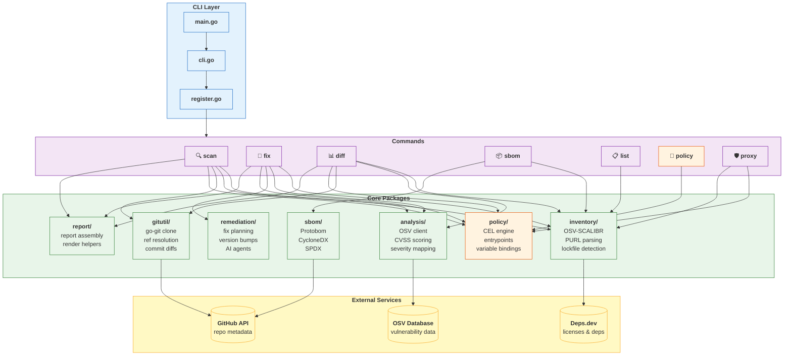
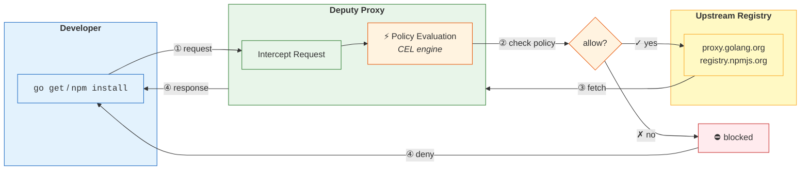

# AGENTS.md

Deputy is a Go CLI for software supply chain security. Scan, fix, diff, and enforce policies.

## Architecture Overview





**Data Flow (for `scan` command):**
1. **Target resolution** — local directory, `git` ref, or remote repository.
2. **Inventory extraction** — OSV-SCALIBR parses lockfiles into PURLs.
3. **Vulnerability lookup** — query OSV API or local GCS bucket mirror.
4. **Policy evaluation** — CEL engine runs per-vulnerability and report-level rules.
5. **Output rendering** — table, JSON, or SARIF format.

## Quick Reference

```bash
go test ./...                                  # run all tests
go test -v -run TestName ./internal/pkg/...   # run specific test
go build -o deputy .                           # build binary
./deputy scan                                  # test locally
```

## Commands

```bash
# Vulnerability scanning
deputy scan                                    # scan current directory
deputy scan github.com/owner/repo              # scan remote repo
deputy scan --ref v1.0.0                       # scan specific Git ref
deputy scan --format json                      # JSON output

# Explain vulnerabilities
deputy explain CVE-2021-44228                  # detailed vulnerability info
deputy explain --agent claude CVE-2021-44228   # with agent analysis
deputy explain --format json GO-2024-2687      # JSON output

# Container image scanning
deputy scan nginx:1.25                         # scan remote image
deputy scan ghcr.io/owner/app:v1.0.0           # scan GHCR image
deputy scan docker-daemon://myapp:latest       # scan local daemon image
deputy scan --platform linux/amd64 alpine:3.19 # specific platform

# Remediation
deputy fix                                     # show remediation plan
deputy fix --apply .                           # apply fixes to directory

# Compare dependencies between Git refs
deputy diff main HEAD                          # diff main vs HEAD
deputy diff v1.0.0 v2.0.0                      # diff two tags

# Compare container images
deputy diff nginx:1.24 nginx:1.25              # diff image versions
deputy diff docker-daemon://app:dev ghcr.io/org/app:prod

# Generate SBOM
deputy sbom --format cyclonedx-json --output sbom.json
deputy sbom --format spdx-json --output sbom.spdx.json
deputy sbom docker://nginx:1.25 --format cyclonedx-json  # image SBOM

# List dependencies
deputy list                                    # list all dependencies
deputy list --only-direct                      # direct dependencies only

# Policy development
deputy policy eval policy.yaml                 # test policy
deputy policy lint policy.yaml                 # validate syntax
deputy policy lsp                              # language server

# Proxy (enforce policies at download time)
deputy proxy go -- go get github.com/pkg
deputy proxy npm -- npm install lodash
deputy proxy oci --config oci-proxy.yaml       # OCI registry proxy

# Secret scanning
deputy secrets                                 # scan current directory for secrets
deputy secrets /path/to/project                # scan specific directory
deputy secrets --format json                   # JSON output for CI/CD
deputy scan --secrets                          # combined vuln + secrets scan
```

## Project Structure

```
main.go                      # entry point
internal/
  cli/cmd/                   # Cobra commands (scan.go, fix.go, diff.go, etc.)
                             # see internal/cli/cmd/root.go for command registration
  cli/flags/                 # shared CLI flag parsing helpers
  analysis/                  # analysis orchestration and OSV facade
    osv/                     # OSV API + GitHub Actions bucket integration
  cache/                     # caching primitives
    memory/                  # in-memory TTL LRU cache
    disk/                    # persistent JSON-on-disk cache
  container/                 # container analysis
    image/                   # image config, metadata, extraction
  inventory/                 # dependency detection
    manifests/               # manifest path + manager heuristics
  explain/                   # vulnerability explanation rendering
  license/                   # license enrichment + scanning
  policy/                    # CEL evaluation engine (eval.go)
  proxy/                     # package proxy server
  report/                    # report/context helpers
    render/                  # CLI-friendly rendering helpers
  sbom/                      # SBOM generation
  remediation/               # fix planning
  gitutil/                   # Git operations (clone.go, diff.go, refs.go)
  ai/                        # AI provider abstraction
    providers/               # claude, codex implementations
    render/                  # AI output rendering (spinners, glamour)
  vulnerability/             # vulnerability domain types + CVSS/severity
    intel/                   # threat intelligence enrichment
      kev/                   # CISA KEV catalog client
      epss/                  # FIRST EPSS scores client
    ssvc/                    # SSVC decision tree framework
  secrets/                   # secret detection engine (Veles + patterns)
docs/                        # documentation
  commands/                  # command reference
  guides/                    # how-to guides (ci.md, workflows.md, agents.md)
policy/examples/             # 30+ CEL policy examples
```

Key entry points: [`main.go`](main.go) → [`internal/cli/cli.go`](internal/cli/cli.go) → [`internal/cli/cmd/root.go`](internal/cli/cmd/root.go)

## Tech Stack

- [Go] 1.21+ (uses [`toolchain`](https://go.dev/doc/toolchain) directive); use modern features like [generics](https://go.dev/blog/intro-generics), and packages like [`slices`](https://pkg.go.dev/slices), [`maps`](https://pkg.go.dev/maps), [`iter`](https://pkg.go.dev/iter), [`cmp`](https://pkg.go.dev/cmp), [`log/slog`](https://pkg.go.dev/log/slog), etc.
- [Cobra] for CLI; [Charm] for [Fang], [Lipgloss], etc. Prefer avoiding emojis in output, use ASCII or Unicode symbols, only if they add clarity; when in doubt, don't use them. Avoid them in most machine-readable output.
- [CEL] (Common Expression Language) for policies in a [YAML]-based [DSL].
- [OSV] API and [GCS] buckets for vulnerability data.
- [OSV-SCALIBR] for SCA inventory extraction (see [`internal/inventory/`](internal/inventory/)).
- [go-git] for Git operations (cloning, refs, diffs, commit snapshots). See [`internal/gitutil/`](internal/gitutil/).
- [PURL] (Package URL) for normalized package IDs.
- [Deps.dev] for dependency license, inventory, resolution, etc.
- [GitHub API] for various data when needed, but mostly avoided (accessing repos, licenses, etc).
- [Protobom] as a first-class feature, with [CycloneDX]/[SPDX] output for SBOMs.

[Go]: https://golang.org
[Cobra]: https://cobra.dev/
[Charm]: https://charm.sh/
[Fang]: https://github.com/charmbracelet/fang
[Lipgloss]: https://github.com/charmbracelet/lipgloss
[CEL]: https://cel.dev/
[YAML]: https://yaml.org/
[DSL]: https://en.wikipedia.org/wiki/Domain-specific_language
[OSV]: https://osv.dev
[OSV-SCALIBR]: https://github.com/google/osv-scalibr
[GCS]: https://cloud.google.com/storage
[go-git]: https://github.com/go-git/go-git
[Deps.dev]: https://deps.dev/
[PURL]: https://github.com/package-url/purl-spec
[Protobom]: https://github.com/protobom/protobom
[GitHub API]: https://docs.github.com/en/rest
[CycloneDX]: https://cyclonedx.org/
[SPDX]: https://spdx.dev/

## Policies (CEL)

Entrypoints define when a policy is evaluated. See [`internal/policy/entrypoints.go`](internal/policy/entrypoints.go) for canonical definitions.
See [`internal/policy/evaluator.go`](internal/policy/evaluator.go) for CEL activation and variable bindings.

**Type-safe Entrypoints:** The `policy.Entrypoint` type provides compile-time safety when passing entrypoints in Go code. Use constants like `policy.EntrypointScanReport` instead of string literals. The `Entrypoint` type provides `String()`, `IsValid()`, and `Category()` methods.

### Policy Examples

```yaml
# Block critical severity vulnerabilities
policies:
  - name: block-critical
    rules:
      - action: deny
        when: vulnerabilities.exists(v, v.severity == "CRITICAL")
        reason: "Critical vulnerability found"
```

```yaml
# Require a license from an approved list
policies:
  - name: require-approved-license
    vars:
      allowed_licenses: ["MIT", "Apache-2.0", "BSD-3-Clause"]
    rules:
      - action: deny
        when: pkg.licenses.all(l, !(l in allowed_licenses))
        reason: "Package license is not in the approved list"
```

### Key Variables

The following variables are available in CEL expressions, depending on the policy entrypoint.

#### `pkg` object

Contains information about the dependency being analyzed. Available in `scan_report` and `scan_vulnerability` entrypoints.

| Field | Type | Description | Example Value |
|---|---|---|---|
| `name` | `string` | Name of the package | `"lodash"` |
| `version` | `string` | Version of the package | `"4.17.21"` |
| `ecosystem` | `string` | Package ecosystem | `"npm"` |
| `licenses` | `list(string)` | List of SPDX license identifiers | `["MIT"]` |

**Example Expressions for `pkg`:**

*   Deny a specific package:
    `pkg.name == 'left-pad'`
*   Deny packages with non-compliant licenses:
    `pkg.licenses.all(l, !(l in ['MIT', 'Apache-2.0']))`
*   Deny older versions of a package:
    `pkg.name == 'react' && pkg.version.startsWith('16.')`
*   Deny if license information is missing:
    `pkg.licenses.size() == 0`

Note: The `pkg` helper provides sensible defaults (`name`, `version`, `ecosystem` default to `""`, `licenses` defaults to `[]`), so you don't need `?.orValue()` for these fields.

---

#### `vulnerability` object

Represents a single vulnerability affecting a package. Available in the `scan_vulnerability` entrypoint.

| Field | Type | Description | Example Value |
|---|---|---|---|
| `id` | `string` | Vulnerability ID (e.g., CVE, GHSA) | `"CVE-2021-44228"` |
| `severity` | `string` | `CRITICAL`, `HIGH`, `MEDIUM`, `LOW` | `"CRITICAL"` |
| `isDirect` | `bool` | If the vulnerability is in a direct dependency | `true` |
| `fixedVersions` | `list(string)` | Versions containing a fix | `["2.15.0"]` |
| `layerDetails` | `object` | Container image layer info (nil for non-image scans) | see below |

**Enrichment Fields (when `--enrich` is enabled):**

| Field | Type | Description | Example Value |
|---|---|---|---|
| `epss` | `float` | EPSS score (0.0-1.0): probability of exploitation in next 30 days | `0.97` |
| `epssPercentile` | `float` | EPSS percentile (0.0-1.0): % of CVEs with lower EPSS score | `0.99` |
| `inKEV` | `bool` | Whether CVE is in CISA's Known Exploited Vulnerabilities catalog | `true` |
| `kevDateAdded` | `string` | Date CVE was added to KEV catalog (YYYY-MM-DD) | `"2021-12-10"` |
| `kevDueDate` | `string` | Federal agency compliance deadline (YYYY-MM-DD) | `"2021-12-24"` |
| `kevRequiredAction` | `string` | CISA's required remediation action | `"Apply updates..."` |
| `kevKnownRansomwareCampaignUse` | `string` | Ransomware involvement: `"Known"` or `"Unknown"` | `"Known"` |

**Layer Details (container images only):**

When scanning container images, `vulnerability.layerDetails` provides information about which layer introduced the vulnerable package:

| Field | Type | Description | Example Value |
|---|---|---|---|
| `layerDetails.index` | `int` | Layer position (0 = oldest/base layer) | `2` |
| `layerDetails.diffId` | `string` | Digest of uncompressed layer content | `"sha256:abc..."` |
| `layerDetails.chainId` | `string` | Cumulative layer chain ID (see below) | `"sha256:def..."` |
| `layerDetails.command` | `string` | Dockerfile instruction that created layer | `"RUN apt-get install..."` |
| `layerDetails.inBaseImage` | `bool` | Whether layer is from base image (FROM) | `true` |

**Understanding ChainID:**

The `chainId` uniquely identifies a layer in the context of all its parent layers, per the [OCI Image Spec](https://github.com/opencontainers/image-spec/blob/main/config.md#layer-chainid). Unlike `diffId` (which identifies layer content), `chainId` is calculated as:
- For the first layer: `chainId = diffId`
- For subsequent layers: `chainId = sha256(parentChainId + " " + diffId)`

Use `chainId` when you need to identify a specific layer stack (e.g., for caching or comparing layers across images with shared bases). Use `diffId` when you only care about the layer content itself.

**Example Expressions for `vulnerability`:**

*   Deny critical vulnerabilities:
    `vulnerability.severity == 'CRITICAL'`
*   Deny vulnerabilities in direct dependencies that have a fix:
    `vulnerability.isDirect && vulnerability.fixedVersions.size() > 0`
*   Deny a specific vulnerability by ID:
    `vulnerability.id == 'GHSA-jfh8-c2j2-2hch'`
*   Deny if a vulnerability has no fix and is `HIGH` or `CRITICAL`:
    `(!has(vulnerability.fixedVersions) || vulnerability.fixedVersions.size() == 0) && (has(vulnerability.severity) && vulnerability.severity in ['HIGH', 'CRITICAL'])`
*   Deny if a vulnerability has no fix and is `HIGH` or `CRITICAL` (using optionals):
    `size(vulnerability.?fixedVersions.orValue([])) == 0 && vulnerability.?severity.orValue('').upperAscii() in ['HIGH', 'CRITICAL']`

**Layer-Aware Examples (container images):**

*   Block critical vulnerabilities in base image layers:
    `has(vulnerability.layerDetails) && vulnerability.layerDetails.inBaseImage && vulnerability.severity == 'CRITICAL'`
*   Warn on vulnerabilities from application layers (not base image):
    `has(vulnerability.layerDetails) && !vulnerability.layerDetails.inBaseImage && vulnerability.severity in ['HIGH', 'CRITICAL']`
*   Detect vulnerabilities from apt-get install commands:
    `has(vulnerability.layerDetails) && vulnerability.layerDetails.command.contains('apt-get install')`
*   Flag vulnerabilities in early base layers (likely system packages):
    `has(vulnerability.layerDetails) && vulnerability.layerDetails.index < 3 && vulnerability.severity == 'CRITICAL'`

**Enrichment-Based Examples (when `--enrich` is enabled):**

*   Block vulnerabilities in CISA KEV catalog:
    `vulnerability.inKEV == true`
*   Block high-probability exploitation (EPSS > 0.7):
    `vulnerability.?epss.orValue(0.0) > 0.7`
*   Block KEV vulnerabilities used in ransomware campaigns:
    `vulnerability.inKEV == true && vulnerability.kevKnownRansomwareCampaignUse == 'Known'`
*   Block KEV vulnerabilities past their due date:
    `vulnerability.inKEV == true && vulnerability.kevDueDate != '' && vulnerability.kevDueDate < now().format('2006-01-02')`
*   Prioritize by EPSS percentile (top 5% most likely to be exploited):
    `vulnerability.?epssPercentile.orValue(0.0) > 0.95`

**Graph Fields (when `--with-graph` is enabled):**

When scanning with `--with-graph`, the dependency graph is resolved to show how transitive vulnerabilities reach your project:

| Field | Type | Description | Example Value |
|---|---|---|---|
| `path` | `list(string)` | Dependency chain from root to vulnerable package | `["myapp", "go-git/v5", "x/crypto"]` |
| `depth` | `int` | Distance from root (0 = direct, 1+ = transitive) | `2` |

**Graph-Based Examples (when `--with-graph` is enabled):**

*   Allow deep transitive vulnerabilities (focus on direct deps):
    `vulnerability.?depth.orValue(0) > 2 && vulnerability.severity != 'CRITICAL'`
*   Block critical vulnerabilities regardless of depth:
    `vulnerability.severity == 'CRITICAL'`
*   Warn on vulnerabilities introduced through specific packages:
    `vulnerability.?path.orValue([]).exists(p, p.contains('legacy-lib'))`
*   Prioritize vulnerabilities in shallow dependencies:
    `vulnerability.?depth.orValue(0) <= 1 && vulnerability.severity in ['HIGH', 'CRITICAL']`
*   Identify vulnerabilities with long dependency chains (supply chain risk):
    `vulnerability.?depth.orValue(0) > 3`

---

#### `vulnerabilities` list

A list of all `vulnerability` objects found in a scan report. Available in the `scan_report` entrypoint. This is most commonly used with CEL macros like `exists`.

**Example Expressions for `vulnerabilities`:**

*   Deny if any critical vulnerabilities exist in the report:
    `vulnerabilities.exists(v, v.severity == 'CRITICAL')`
*   Deny if there are more than 5 vulnerabilities in total:
    `vulnerabilities.size() > 5`
*   Deny if all vulnerabilities are high severity (a strange but possible policy):
    `vulnerabilities.all(v, v.severity == 'HIGH')`

---

#### `image` object

Contains container image configuration and metadata when scanning container images. Available in `scan_report`, `scan_vulnerability`, and `oci_artifact_request` entrypoints.

The `image` object combines provenance data (registry, repository, tag, digest) with extracted configuration (`image.config`) and metadata (`image.metadata`) when available. For advanced use cases, the same data is also available via `image_info` which contains only the extracted config/metadata/history (without provenance).

**Image Configuration Availability by Transport:**

The availability of `image.config` and `image.metadata` depends on how the image is loaded:

| Transport | Scheme | `image.config` | `image.metadata` | Notes |
|-----------|--------|----------------|------------------|-------|
| Remote Registry | `docker://`, `oci://`, `container://` | Yes | Yes | Full config available via v1.Image API |
| Docker Daemon | `docker-daemon://` | No | Partial | Config extraction not supported; use remote pull for full analysis |
| Tarball | `tarball://` | No | Partial | Config extraction not supported for Docker image tarballs |
| OCI Archive | `oci-archive://` | No | Partial | Config extraction not supported for OCI archive tarballs |
| OCI Layout | `oci-layout://` | No | Partial | Config extraction not supported for OCI layout directories |

For full image configuration analysis, pull images from remote registries. When `image.config` is unavailable, the `image` variable will still be populated with basic metadata (registry, repository, tag, digest) from the request or target provenance.

**Image Configuration (`image.config`):**

Extracted from the container image's configuration (Dockerfile settings):

| Field | Type | Description | Example Value |
|---|---|---|---|
| `config.user` | `string` | User to run as (empty = root) | `"nobody"` |
| `config.is_root` | `bool` | Whether running as root | `true` |
| `config.env` | `list(string)` | Environment variables | `["PATH=/usr/bin"]` |
| `config.sensitive_env` | `list(string)` | Env vars that may contain secrets | `["API_KEY"]` |
| `config.entrypoint` | `list(string)` | Container entrypoint command | `["/app"]` |
| `config.cmd` | `list(string)` | Default command arguments | `["serve"]` |
| `config.exposed_ports` | `list(string)` | Exposed ports | `["8080/tcp"]` |
| `config.volumes` | `list(string)` | Defined volumes | `["/data"]` |
| `config.labels` | `map(string)` | Image labels | `{"version": "1.0"}` |
| `config.working_dir` | `string` | Working directory | `"/app"` |
| `config.healthcheck` | `object` | Healthcheck configuration (if defined) | see below |

**Healthcheck Configuration (`image.config.healthcheck`):**

When a container image defines a HEALTHCHECK instruction, the following fields are available:

| Field | Type | Description | Example Value |
|---|---|---|---|
| `healthcheck.test` | `list(string)` | Health check command (`["CMD", "curl", "-f", "http://localhost/"]`) | `["CMD-SHELL", "curl -f http://localhost/health"]` |
| `healthcheck.interval` | `string` | Time between checks (Go duration format) | `"30s"` |
| `healthcheck.timeout` | `string` | Timeout for each check (Go duration format) | `"10s"` |
| `healthcheck.retries` | `int` | Consecutive failures before unhealthy | `3` |

**Note:** `healthcheck` is `null` if no HEALTHCHECK is defined in the image.

**Image Metadata (`image.metadata`):**

| Field | Type | Description | Example Value |
|---|---|---|---|
| `metadata.architecture` | `string` | CPU architecture | `"amd64"` |
| `metadata.os` | `string` | Operating system | `"linux"` |
| `metadata.layer_count` | `int` | Number of layers | `15` |
| `metadata.size` | `int` | Total size in bytes | `104857600` |
| `metadata.created` | `int` | Creation timestamp (Unix) | `1704067200` |
| `metadata.digest` | `string` | Image digest | `"sha256:abc..."` |

**Image History (`image.history`):**

List of build history entries showing Dockerfile commands:

| Field | Type | Description |
|---|---|---|
| `history[].created_by` | `string` | Command that created the layer |
| `history[].created` | `int` | Creation timestamp (Unix) |
| `history[].empty_layer` | `bool` | Whether this is a metadata-only layer |

**Example Expressions for `image`:**

*   Block images running as root:
    `has(image.config) && image.config.is_root == true`
*   Block images with secrets in environment variables:
    `has(image.config) && size(image.config.sensitive_env) > 0`
*   Require healthcheck for production images:
    `has(image.config) && !has(image.config.healthcheck)`
*   Block images with too many layers (poor optimization):
    `has(image.metadata) && image.metadata.layer_count > 25`
*   Block oversized images (> 2GB):
    `has(image.metadata) && image.metadata.size > 2147483648`
*   Require OCI labels for traceability:
    `has(image.config) && !('org.opencontainers.image.source' in image.config.labels)`
*   Block images older than 90 days:
    `has(image.metadata) && age(image.metadata.created) > duration('2160h')`

---

#### `dockerfile` object

Contains parsed Dockerfile data for static analysis. Available in `dockerfile_report` and `dockerfile_stage` entrypoints.

| Field | Type | Description | Example Value |
|---|---|---|---|
| `dockerfile.path` | `string` | Path to the Dockerfile | `"/app/Dockerfile"` |
| `dockerfile.stages` | `list(object)` | All build stages | see below |
| `dockerfile.args` | `map(string)` | ARG instructions with defaults | `{"GO_VERSION": "1.22"}` |
| `dockerfile.final_stage` | `object` | The last stage (what gets built) | see below |

**Stage fields** (available in `dockerfile.stages[]`, `dockerfile.final_stage`, and `stage` in `dockerfile_stage` entrypoint):

| Field | Type | Description | Example Value |
|---|---|---|---|
| `stage.index` | `int` | 0-based stage position | `0` |
| `stage.name` | `string` | AS alias (empty if unnamed) | `"builder"` |
| `stage.base_image` | `string` | FROM image reference as written | `"golang:${GO_VERSION}"` |
| `stage.base_image_resolved` | `object` | Parsed image reference | see below |
| `stage.platform` | `string` | --platform flag value | `"linux/amd64"` |
| `stage.is_scratch` | `bool` | True if FROM scratch | `false` |
| `stage.is_builder_stage` | `bool` | True if only used as COPY source | `true` |
| `stage.user` | `string` | Final USER directive value | `"nobody"` |
| `stage.is_root` | `bool` | True if running as root | `false` |
| `stage.workdir` | `string` | WORKDIR value | `"/app"` |
| `stage.env_vars` | `map(string)` | ENV declarations | `{"APP_ENV": "prod"}` |
| `stage.sensitive_env` | `list(string)` | Env vars matching secret patterns | `["API_KEY"]` |
| `stage.exposed_ports` | `list(string)` | EXPOSE ports | `["8080"]` |
| `stage.labels` | `map(string)` | LABEL key-value pairs | `{"version": "1.0"}` |
| `stage.healthcheck` | `object` | HEALTHCHECK config (or null) | see below |
| `stage.run_commands` | `list(object)` | RUN instructions | see below |
| `stage.copy_commands` | `list(object)` | COPY instructions | see below |
| `stage.add_commands` | `list(object)` | ADD instructions | see below |
| `stage.entrypoint` | `list(string)` | ENTRYPOINT command | `["/app"]` |
| `stage.cmd` | `list(string)` | CMD arguments | `["serve"]` |

**base_image_resolved fields:**

| Field | Type | Description | Example Value |
|---|---|---|---|
| `base_image_resolved.registry` | `string` | Registry (Docker Hub = "index.docker.io") | `"index.docker.io"` |
| `base_image_resolved.repository` | `string` | Repository path | `"library/alpine"` |
| `base_image_resolved.tag` | `string` | Tag (default "latest") | `"3.19"` |
| `base_image_resolved.digest` | `string` | Digest if specified | `"sha256:abc..."` |

**Example Expressions for `dockerfile`:**

*   Block images running as root:
    `has(dockerfile.final_stage) && dockerfile.final_stage.is_root && !dockerfile.final_stage.is_scratch`
*   Block :latest tag in any stage:
    `dockerfile.stages.exists(s, !s.is_scratch && s.base_image_resolved.tag == "latest")`
*   Require approved registries:
    `dockerfile.stages.exists(s, !s.is_scratch && !(s.base_image_resolved.registry in ["index.docker.io", "gcr.io"]))`
*   Detect sensitive environment variables:
    `dockerfile.stages.exists(s, size(s.sensitive_env) > 0)`
*   Require HEALTHCHECK in final stage:
    `has(dockerfile.final_stage) && !dockerfile.final_stage.is_scratch && dockerfile.final_stage.healthcheck == null`

---

#### `dockerfile_analysis` object

Contains static analysis results for Dockerfiles. Available in `dockerfile_report` and `dockerfile_stage` entrypoints.

| Field | Type | Description | Example Value |
|---|---|---|---|
| `dockerfile_analysis.stage_count` | `int` | Number of stages | `2` |
| `dockerfile_analysis.has_multi_stage` | `bool` | True if multi-stage build | `true` |
| `dockerfile_analysis.builder_stage_count` | `int` | Stages used only as COPY sources | `1` |
| `dockerfile_analysis.final_stage_is_root` | `bool` | Final stage runs as root | `false` |
| `dockerfile_analysis.final_stage_is_scratch` | `bool` | Final stage uses FROM scratch | `false` |
| `dockerfile_analysis.sensitive_env_vars` | `list(string)` | ENV vars matching secret patterns | `["AWS_SECRET_KEY"]` |
| `dockerfile_analysis.has_add_url` | `bool` | Any ADD instruction uses URLs | `false` |

**Example Expressions for `dockerfile_analysis`:**

*   Require multi-stage builds for Go projects:
    `dockerfile.stages.exists(s, s.base_image.contains("golang")) && !dockerfile_analysis.has_multi_stage`
*   Block ADD with URLs (security risk):
    `dockerfile_analysis.has_add_url`
*   Detect secrets in any stage:
    `size(dockerfile_analysis.sensitive_env_vars) > 0`

---

#### `request` object

Contains information about a package being requested through the proxy. Available in `go_artifact_request`, `npm_artifact_request`, `pypi_artifact_request`, `rubygems_artifact_request`, and `oci_artifact_request` entrypoints.

| Field | Type | Description | Example Value |
|---|---|---|---|
| `package` | `string` | Name of the package being requested | `"react"` |
| `version` | `string` | Version of the package being requested | `"18.2.0"` |

**Example Expressions for `request`:**

*   Block downloads of a specific package:
    `request.package == 'express'`
*   Block downloads of unscoped public npm packages:
    `!request.package.startsWith('@')`

---

#### `env` object

Contains information about the environment in which `deputy` is running.

| Field | Type | Description | Example Value |
|---|---|---|---|
| `command` | `string` | The `deputy` command being executed | `"scan"` |
| `entrypoint` | `string` | The policy entrypoint being evaluated | `"scan_vulnerability"` |

**Example Expressions for `env`:**

*   Apply a rule only during a `scan` command:
    `env.command == 'scan'`
*   Apply a rule only for vulnerability-level policies:
    `env.entrypoint == 'scan_vulnerability'`
*   Combine command and entrypoint for specific contexts:
    `env.command == 'proxy' && env.entrypoint == 'oci_artifact_request'`

---

#### `jwt` object

Contains verified JWT claims from authenticated proxy requests. Available in all proxy entrypoints when authentication is enabled. See [Proxy Authentication](#proxy-authentication) for configuration.

| Field | Type | Description | Example Value |
|---|---|---|---|
| `anonymous` | `bool` | `true` if no token was provided | `false` |
| `sub` | `string` | Subject (user/service ID) | `"user:alice"` |
| `iss` | `string` | Token issuer | `"https://auth.example.com"` |
| `aud` | `list(string)` | Audiences | `["deputy-proxy"]` |
| `exp` | `int` | Expiration timestamp (Unix) | `1700000000` |
| `iat` | `int` | Issued-at timestamp (Unix) | `1699990000` |
| `nbf` | `int` | Not-before timestamp (Unix) | `1699990000` |
| `jti` | `string` | JWT ID | `"abc123"` |
| `<custom>` | `any` | Any custom claims from the token | varies |

**Example Expressions for `jwt`:**

Using CEL optionals (`?.field` and `.orValue()`) for cleaner null-safe access:

*   Deny anonymous access to internal packages:
    `jwt.anonymous && request.module.startsWith("internal/")`
*   Require admin role for certain packages (using optionals):
    `!jwt.?roles.orValue([]).exists(r, r == "admin")`
*   Check team membership (using optionals):
    `jwt.?teams.orValue([]).exists(t, t == "platform")`
*   Validate service account format (using optionals):
    `jwt.?sub.orValue("").startsWith("sa:")`
*   Check token age (using time functions and optionals):
    `age(jwt.?iat.orValue(0)) > duration("24h")`

### CEL Helper Functions

Deputy extends CEL with custom functions for policy evaluation:

#### Time Functions

| Function | Signature | Description |
|----------|-----------|-------------|
| `now()` | `now() timestamp` | Returns current time as a timestamp (custom) |
| `age()` | `age(int\|timestamp) duration` | Duration since a Unix timestamp (custom convenience) |
| `timestamp()` | `timestamp(int\|string)` | CEL built-in: convert Unix seconds or RFC 3339 string |
| `duration()` | `duration(string) duration` | CEL built-in: parse duration (e.g., `"1h"`, `"30m"`) |
| `int(now())` | - | Get current Unix timestamp (use native conversion) |
| `int(timestamp)` | - | Get Unix seconds from timestamp (native conversion) |

**Example: Token age check (using optionals)**
```yaml
- action: warn
  when: |
    !jwt.anonymous &&
    age(jwt.?iat.orValue(0)) > duration("24h")
  reason: "Token is older than 24 hours"
```

#### String Functions (ext.Strings)

| Function | Signature | Description |
|----------|-----------|-------------|
| `matches()` | `string.matches(pattern)` | Regex match |
| `split()` | `string.split(sep)` | Split into list |
| `join()` | `list.join(sep)` | Join list elements |
| `trim()` | `string.trim()` | Remove whitespace |
| `replace()` | `string.replace(old, new)` | Replace occurrences |
| `lowerAscii()` | `string.lowerAscii()` | Lowercase ASCII |
| `upperAscii()` | `string.upperAscii()` | Uppercase ASCII |

#### Math Functions (ext.Math)

| Function | Signature | Description |
|----------|-----------|-------------|
| `math.abs()` | `math.abs(number)` | Absolute value |
| `math.ceil()` | `math.ceil(double)` | Round up |
| `math.floor()` | `math.floor(double)` | Round down |
| `math.round()` | `math.round(double)` | Round to nearest |
| `math.greatest()` | `math.greatest(a, b, ...)` | Maximum value |
| `math.least()` | `math.least(a, b, ...)` | Minimum value |

#### Other Functions

| Function | Signature | Description |
|----------|-----------|-------------|
| `levenshtein()` | `levenshtein(a, b) int` | String edit distance |
| `levenshteinWithin()` | `levenshteinWithin(a, b, limit) bool` | Distance within limit |
| `cel.bind()` | `cel.bind(var, init, expr)` | Bind local variable |
| `base64.encode()` | `base64.encode(bytes)` | Encode to base64 |
| `base64.decode()` | `base64.decode(string)` | Decode from base64 |

#### Container Image Helper Functions

These functions provide complex parsing for container image policies. They are designed to be **composable** with CEL's built-in string functions (`contains`, `matches`, `startsWith`, `endsWith`) and macros (`exists`, `filter`, `map`).

**Design Principle:** Only add functions that parse complex formats CEL can't handle well. Use native CEL for pattern matching, iteration, and logic.

| Function | Signature | Description |
|----------|-----------|-------------|
| `imageRef()` | `imageRef(string) map` | Parse image reference into components |
| `baseImage()` | `baseImage(list) string` | Extract base image from build history |

**`imageRef()` Return Values:**

Parses container image references, handling implicit `docker.io`, `library/` namespace, port vs tag disambiguation, and scheme stripping (`oci://`, `docker-daemon://`).

| Field | Type | Description | Example |
|-------|------|-------------|---------|
| `registry` | `string` | Registry hostname | `"docker.io"`, `"gcr.io"` |
| `repository` | `string` | Full repository path | `"library/nginx"`, `"my-project/app"` |
| `name` | `string` | Image name (last path segment) | `"nginx"`, `"app"` |
| `tag` | `string` | Tag (empty if using digest) | `"1.25.3"`, `"latest"` |
| `digest` | `string` | Digest (empty if using tag) | `"sha256:abc123..."` |

**`baseImage()` Details:**

Parses the first `FROM` instruction from build history, handling:
- Standard: `FROM alpine:3.19`
- Multi-stage: `FROM golang:1.21 AS builder`
- Platform: `FROM --platform=linux/amd64 ubuntu:22.04`
- Docker nop format: `/bin/sh -c #(nop) FROM gcr.io/distroless/static`

**Container Image Policy Examples:**

```yaml
# Block mutable :latest tags (using imageRef + CEL)
policies:
  - name: block-latest-tag
    entrypoints: ["scan_report", "oci_artifact_request"]
    rules:
      - action: deny
        when: |
          has(target.reference) &&
          cel.bind(ref, imageRef(target.reference),
            ref.tag == "latest" || (ref.tag == "" && ref.digest == ""))
        reason: "Image uses :latest tag which is mutable"
        remediation: "Use a specific version tag or digest reference"

# Require semver tags (using imageRef + matches)
  - name: require-semver-tags
    entrypoints: ["scan_report"]
    rules:
      - action: warn
        when: |
          has(target.reference) &&
          cel.bind(ref, imageRef(target.reference),
            ref.digest == "" &&
            !ref.tag.matches("^v?[0-9]+\\.[0-9]+\\.[0-9]+"))
        reason: "Image tag does not follow semantic versioning"

# Registry allowlist (using imageRef + string functions)
  - name: allowed-registries
    entrypoints: ["scan_report", "oci_artifact_request"]
    vars:
      allowedRegistries: ["docker.io", "ghcr.io", "gcr.io"]
    rules:
      - action: deny
        when: |
          has(target.reference) &&
          cel.bind(registry, imageRef(target.reference).registry,
            !(registry in allowedRegistries) &&
            !registry.endsWith(".gcr.io") &&
            !registry.endsWith(".azurecr.io"))
        reason: "Image from unapproved registry"

# Require minimal base images (using baseImage + contains)
  - name: require-minimal-base
    entrypoints: ["scan_report"]
    rules:
      - action: warn
        when: |
          has(image.history) &&
          cel.bind(base, baseImage(image.history),
            base != "" &&
            !base.contains("distroless") &&
            !base.contains("chainguard") &&
            !base.contains("alpine") &&
            !base.contains("scratch"))
        reason: "Image does not use a minimal base image"

# Detect secrets in build history (using exists + patterns)
  - name: no-secrets-in-layers
    entrypoints: ["scan_report"]
    vars:
      secretPatterns: ["password=", "secret=", "api_key=", "token=", ".pem"]
    rules:
      - action: deny
        when: |
          has(image.history) &&
          image.history.exists(h,
            secretPatterns.exists(p, h.created_by.lowerAscii().contains(p)))
        reason: "Potential secrets detected in image build history"

# Layer count limit (using filter + size)
  - name: layer-count-limit
    entrypoints: ["scan_report"]
    vars:
      maxLayers: 20
    rules:
      - action: warn
        when: |
          has(image.history) &&
          image.history.filter(h, !h.empty_layer).size() > maxLayers
        reason: "Image has too many layers (inefficient)"

# Detect curl/wget in builds (using exists)
  - name: no-curl-wget-in-run
    entrypoints: ["scan_report"]
    rules:
      - action: warn
        when: |
          has(image.history) &&
          image.history.exists(h,
            h.created_by.contains("curl") || h.created_by.contains("wget"))
        reason: "Image downloads files during build (supply chain risk)"
```

See [Container security policies](policy/examples/container-security.yaml) for comprehensive examples.

#### SSVC (Stakeholder-Specific Vulnerability Categorization)

The `ssvc()` function evaluates vulnerabilities using the CISA SSVC decision tree framework.
SSVC produces contextual prioritization decisions based on exploitation status, technical impact,
and mission relevance—going beyond static CVSS scores.

| Function | Signature | Description |
|----------|-----------|-------------|
| `ssvc()` | `ssvc(vulnerability) map` | Evaluate vulnerability using SSVC decision tree |

**`ssvc()` Return Values:**

| Field | Type | Description | Example |
|-------|------|-------------|---------|
| `decision` | `string` | SSVC outcome: `"act"`, `"attend"`, `"track*"`, `"track"` | `"act"` |
| `reasoning` | `string` | Explanation of the decision | `"Active exploitation..."` |
| `input.exploitation` | `string` | Derived exploitation status | `"active"`, `"poc"`, `"none"` |
| `input.automatable` | `string` | Whether exploit is automatable | `"yes"`, `"no"` |
| `input.technical_impact` | `string` | Scope of technical impact | `"total"`, `"partial"` |
| `input.mission_prevalence` | `string` | Mission criticality | `"essential"`, `"support"`, `"minimal"` |

**SSVC Decision Outcomes:**

- **Act**: Immediate coordinated action required (highest priority)
- **Attend**: Remediate sooner than normal patching cycle
- **Track***: Monitor closely; status may change
- **Track**: Routine monitoring and patching

**Derivation from Vulnerability Data:**

The `ssvc()` function automatically derives factors from vulnerability data:
- `inKEV == true` → exploitation = "active"
- `epss > 0.1` → exploitation = "poc"
- `epss > 0.5` → automatable = "yes"
- `severity in ["CRITICAL", "HIGH"]` → technical_impact = "total"

**SSVC Policy Examples:**

```yaml
# Block vulnerabilities requiring immediate action
policies:
  - name: ssvc-act-required
    entrypoints: ["scan_vulnerability"]
    rules:
      - action: deny
        when: ssvc(vulnerability).decision == "act"
        reason: "SSVC: Immediate action required"

# Warn on attend-level vulnerabilities
  - name: ssvc-attend-warning
    entrypoints: ["scan_vulnerability"]
    rules:
      - action: warn
        when: ssvc(vulnerability).decision == "attend"
        reason: "SSVC: Expedited remediation recommended"

# Combined SSVC and KEV policy
  - name: ssvc-kev-priority
    entrypoints: ["scan_vulnerability"]
    rules:
      - action: deny
        when: |
          vulnerability.inKEV == true &&
          ssvc(vulnerability).decision in ["act", "attend"]
        reason: "KEV vulnerability with high SSVC priority"
```

Full spec: [Policy spec](docs/reference/policy-spec.md) • Examples: [Policy examples](policy/examples/)

## Proxy Authentication

The Deputy proxy supports JWT-based authentication for production deployments. Authentication can be configured per-listener with JWKS endpoints or static public keys.

### Configuration

```yaml
listeners:
  - name: go-proxy
    bind: ":8080"
    ecosystems: ["go"]
    upstream: "https://proxy.golang.org"
    policies: ["policy/go-proxy.yaml"]
    auth:
      # Authentication mode: required | optional | disabled
      mode: required

      # JWKS endpoint for key discovery (recommended for production)
      jwks:
        url: "https://auth.example.com/.well-known/jwks.json"
        oidc_discovery: false    # Set true to auto-discover from issuer URL
        refresh_interval: 1h     # Background key refresh interval

      # Alternative: inline public keys (for testing or air-gapped environments)
      static_keys:
        - kid: "key-1"
          alg: "RS256"
          public_key: |
            -----BEGIN PUBLIC KEY-----
            MIIBIjANBgkqhkiG9w0BAQEFAAOCAQ8AMIIBCgKCAQEA...
            -----END PUBLIC KEY-----

      # Token validation
      issuers: ["https://auth.example.com"]           # Allowed issuers (iss claim)
      audiences: ["deputy-proxy"]                      # Allowed audiences (aud claim)
      required_claims: ["sub", "email"]               # Claims that must be present
      clock_skew: 30s                                  # Tolerance for exp/nbf validation
```

### Authentication Modes

| Mode | Behavior |
|------|----------|
| `disabled` | No authentication (default, backward compatible) |
| `optional` | Validates tokens if present; allows anonymous access |
| `required` | Rejects requests without valid tokens (401) |

### HTTP Headers

**Request:** Tokens are passed via the standard `Authorization` header:
```
Authorization: Bearer <jwt-token>
```

**Response (on auth failure):**
```
WWW-Authenticate: Bearer realm="deputy-proxy"
X-Deputy-Auth-Error: <error-code>
X-Deputy-Auth-Message: <human-readable message>
```

### Error Codes

| Code | HTTP Status | Description |
|------|-------------|-------------|
| `missing_token` | 401 | No Authorization header (mode=required) |
| `invalid_token` | 401 | Malformed JWT |
| `expired_token` | 401 | Token past expiration |
| `signature_invalid` | 401 | Signature verification failed |
| `key_not_found` | 401 | Key ID not in JWKS or static keys |
| `invalid_issuer` | 403 | Issuer not in allowed list |
| `invalid_audience` | 403 | Audience not in allowed list |
| `missing_claim` | 403 | Required claim not present |

### Key Types Supported

- **RSA** (RS256, RS384, RS512)
- **ECDSA** (ES256, ES384, ES512)
- **EdDSA** (Ed25519)

### OIDC Discovery

When `oidc_discovery: true`, the proxy fetches the OIDC configuration from `<url>/.well-known/openid-configuration` and extracts the `jwks_uri` automatically.

### Policy Examples with JWT

```yaml
# Require authentication for internal packages
policies:
  - name: internal-requires-auth
    entrypoints: ["go_artifact_request"]
    rules:
      - action: deny
        when: |
          jwt.anonymous &&
          request.module.startsWith("github.com/acme-internal/")
        reason: "Internal packages require authentication"

# Role-based access control (using optionals for cleaner syntax)
policies:
  - name: admin-only-packages
    entrypoints: ["npm_artifact_request"]
    rules:
      - action: deny
        when: |
          request.package.startsWith("@acme-admin/") &&
          !jwt.?roles.orValue([]).exists(r, r == "admin")
        reason: "Admin packages require admin role"

# Block anonymous users from packages with critical vulns
policies:
  - name: auth-for-critical
    entrypoints: ["go_artifact_request", "npm_artifact_request"]
    rules:
      - action: deny
        when: |
          jwt.anonymous &&
          vulnerabilities.orValue([]).exists(v, v.severity == "CRITICAL")
        reason: "Authenticate to download packages with critical vulnerabilities"
```

See JWT policy examples for more patterns:
- [jwt-role-based-access.yaml](policy/examples/jwt-role-based-access.yaml) - Role and team-based authorization
- [jwt-anonymous-guard.yaml](policy/examples/jwt-anonymous-guard.yaml) - Protecting resources from anonymous access
- [jwt-audit-logging.yaml](policy/examples/jwt-audit-logging.yaml) - Token age and audit policies
- [jwt-service-account.yaml](policy/examples/jwt-service-account.yaml) - Service account validation

## Environment Variables

| Variable | Purpose |
|----------|---------|
| `GITHUB_TOKEN` | API access for SBOMs, licenses, and vulnerability data ([`internal/sbom/sbom.go`](internal/sbom/sbom.go), [`internal/license/license.go`](internal/license/license.go), [`internal/analysis/osv/gha_bucket.go`](internal/analysis/osv/gha_bucket.go)) |
| `ANTHROPIC_API_KEY` | AI-assisted remediation ([`internal/cli/cmd/fix_agent_claude.go`](internal/cli/cmd/fix_agent_claude.go)) |
| `DEPUTY_LOG_LEVEL` | `debug`, `info`, `warn` (default), `error` ([`internal/cli/cli.go`](internal/cli/cli.go)) |
| `DEPUTY_LOG_FORMAT` | `text` (default), `json` for structured logs ([`internal/logs/logs.go`](internal/logs/logs.go)) |
| `DEPUTY_CONFIG` | Path to config file (default: `.deputy.yaml`) ([`internal/config/config.go`](internal/config/config.go)) |
| `DEPUTY_OTEL_ENABLED` | Enable OpenTelemetry instrumentation ([`internal/otel/otel.go`](internal/otel/otel.go)) |
| `OTEL_EXPORTER_OTLP_ENDPOINT` | OTel collector endpoint, e.g., `localhost:4317` ([`internal/otel/config.go`](internal/otel/config.go)) |
| `DEPUTY_SBOM_IMAGE_SCAN_CONCURRENCY` | Max concurrent image scans when scanning SBOMs with container PURLs (default: 4) |
| `DEPUTY_PROXY_IMAGE_SCAN_TIMEOUT` | Max time for proxy image scans, e.g., `10m` (default: 10m) |
| `DEPUTY_PROXY_IMAGE_CACHE_TTL` | TTL for proxy image scan cache (default: 30m) |
| `DEPUTY_PROXY_IMAGE_CACHE_SIZE` | Max items in proxy image scan cache (default: 1024) |
| `DEPUTY_CACHE_DIR` | Override cache directory for KEV/EPSS data (default: `~/.deputy/cache`) |

## Exit Codes

| Code | Meaning |
|------|---------|
| `0` | Success (scan clean, command succeeded) |
| `1` | Error (vulnerabilities found, policy violation, runtime error) |

## Style

- Standard Go formatting (`go fmt`, `goimports`)
- Table-driven tests preferred
- Error handling: wrap with context using `fmt.Errorf("context: %w", err)`

## Development Patterns

### Adding a New Command

1. Create `internal/cli/cmd/yourcommand.go` (use `cobra.Command`)
2. Register in [`internal/cli/cmd/root.go`](internal/cli/cmd/root.go)
3. Add docs in [Command reference](docs/commands/)

### Common Tasks

| Task | Key Files |
|------|-----------|
| Vulnerability analysis | [`internal/analysis/osv/client.go`](internal/analysis/osv/client.go), [`internal/vulnerability/`](internal/vulnerability/) |
| Threat intelligence | [`internal/vulnerability/intel/kev/`](internal/vulnerability/intel/kev/), [`internal/vulnerability/intel/epss/`](internal/vulnerability/intel/epss/) |
| Ecosystem support | [`internal/inventory/`](internal/inventory/), [`internal/purlx/`](internal/purlx/), [`internal/proxy/`](internal/proxy/) |
| Policy features | [`internal/policy/entrypoints.go`](internal/policy/entrypoints.go), [`internal/policy/engine.go`](internal/policy/engine.go), [Policy examples](policy/examples/) |
| License resolution | [`internal/license/license.go`](internal/license/license.go) (implements `Resolver` interface) |
| Scanning | [`internal/scan/service.go`](internal/scan/service.go) (implements `Scanner` interface) |

## Debugging Tips

```bash
DEPUTY_LOG_LEVEL=debug deputy scan           # verbose logging
DEPUTY_LOG_FORMAT=json deputy scan           # structured logs
```

## Don't

- Don't skip tests before submitting changes (run [`blackbox_test.go`](blackbox_test.go) for CLI integration)
