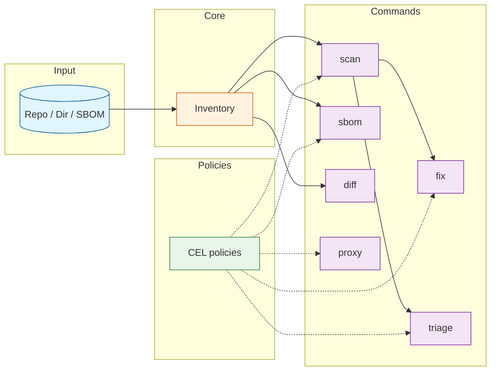

# Deputy

Deputy enables dependency management at scale.

- Inventory dependencies across ecosystems, bring your own plugins for custom sources.
- Scan dependencies using vulnerability sources like OSV to produce actionable findings.
- Generate SBOMs (CycloneDX / SPDX via Protobom) for supply chain visibility.
- Diff dependency changes between Git refs, helping code reviews and audits.
- Triage and prioritize findings with optional agent assistance.
- Create remediation plans and optionally apply them automatically.
- Enforce policies in CI and at download-time via a package proxy.

Deputy aims to provide core dependency management primitives along with a unified toolchain, so you can focus on what matters: your code and policies that protect it. The tool is designed for extensibility, performance, and usability at scale; whether you’re an individual developer, a security team, or an enterprise organization. The goal is to empower you to manage dependencies effectively, reduce risk, and maintain a secure software supply chain with minimal friction.

## Supported Targets

- Local and remote Git repositories
- Local directories
- SBOM files (CycloneDX / SPDX / Protobom)

In the future: container images, artifact registries, container orchestrators, binaries, VSCode extensions, various manifests, etc.

## Supported Ecosystems

Deputy scans dependencies across 15 ecosystems via [OSV-SCALIBR](https://github.com/google/osv-scalibr) and custom extractors:

| Ecosystem | Scan | Proxy | Lockfiles / Manifests |
|-----------|:----:|:-----:|----------------------|
| Go | ✓ | ✓ | go.mod, go.sum, Go binaries |
| npm | ✓ | ✓ | package-lock.json, yarn.lock, pnpm-lock.yaml, bun.lock |
| PyPI | ✓ | ✓ | requirements.txt, Pipfile.lock, poetry.lock, uv.lock, pdm.lock, setup.py, Conda environments |
| RubyGems | ✓ | ✓ | Gemfile.lock, gems.locked, *.gemspec |
| Maven | ✓ | — | pom.xml, gradle.lockfile, JAR/WAR/EAR archives |
| Cargo | ✓ | — | Cargo.lock, Cargo.toml, Rust binaries |
| NuGet | ✓ | — | packages.lock.json, packages.config, *.deps.json |
| Hex | ✓ | — | mix.lock |
| Pub | ✓ | — | pubspec.lock |
| CocoaPods | ✓ | — | Podfile.lock, Package.resolved |
| Packagist | ✓ | — | composer.lock |
| GitHub Actions | ✓ | — | .github/workflows/*.yml |
| Haskell | ✓ | — | cabal.project.freeze, stack.yaml.lock |
| R | ✓ | — | renv.lock |
| C++ | ✓ | — | conan.lock |

**Proxy support** is available for Go, npm, PyPI, and RubyGems—ecosystems with standardized registry protocols for download-time policy enforcement

## Documentation

- Start here: [`docs/README.md`](docs/README.md)
- Getting started: [`docs/getting-started.md`](docs/getting-started.md)
- Concepts: [`docs/concepts/README.md`](docs/concepts/README.md)
- Commands: [`docs/commands/README.md`](docs/commands/README.md)
- Guides: [`docs/guides/README.md`](docs/guides/README.md)
- Reference (config/logging): [`docs/reference/README.md`](docs/reference/README.md)

## Quick start

```console
# Diff dependency changes at HEAD in the current repo
$ deputy

# Scan the current repo at HEAD
$ deputy scan

# Turn findings into a remediation plan (and optionally apply it)
$ deputy fix
$ deputy fix --apply .

# Verify dependency changes between refs (default behavior when running `deputy` inside a repo)
$ deputy diff main WORKING

# Generate an SBOM
$ deputy sbom --format spdx-json --output sbom.spdx.json
```

## Installation

### Go install (recommended)

```console
$ go install github.com/picatz/deputy@latest
$ deputy --version
```

Notes:
- Deputy’s `go.mod` uses the Go `toolchain` directive; use Go 1.21+ so `go` can fetch the pinned toolchain automatically.
- Pin a specific version for reproducibility: `go install github.com/picatz/deputy@vX.Y.Z`

### Build from source

```console
$ git clone https://github.com/picatz/deputy.git
$ cd deputy
$ go test ./...
$ go run . --help
```

## How Deputy fits together



## Commands

| Command | What it’s for | Docs |
| --- | --- | --- |
| `scan` | Find known vulnerabilities via OSV (repos/dirs/SBOMs) | [`docs/commands/scan.md`](docs/commands/scan.md) |
| `fix` | Turn findings into upgrade commands / a plan (optionally apply) | [`docs/commands/fix.md`](docs/commands/fix.md) |
| `triage` | Summarize and prioritize findings (optional agent help) | [`docs/commands/triage.md`](docs/commands/triage.md) |
| `diff` | Compare dependency changes between Git refs | [`docs/commands/diff.md`](docs/commands/diff.md) |
| `sbom` | Emit CycloneDX/SPDX SBOMs at any Git ref | [`docs/commands/sbom.md`](docs/commands/sbom.md) |
| `list` | Dump normalized PURLs for quick auditing/scripting | [`docs/commands/list.md`](docs/commands/list.md) |
| `policy` | Lint/test/eval/bundle policies; authoring tools (LSP) | [`docs/commands/policy.md`](docs/commands/policy.md) |
| `proxy` | Policy-enforcing package proxy (Go/npm/PyPI/RubyGems) | [`docs/commands/proxy.md`](docs/commands/proxy.md) |

## Policies and enforcement

Deputy’s core design idea is: **write policies once and reuse them everywhere** (scan, diff, sbom, fix, triage, and proxy).

- Policy framework overview: [`POLICY.md`](POLICY.md)
- Policy bundle spec: [`POLICY_SPEC.md`](POLICY_SPEC.md)
- Policy examples: [`policy/examples`](policy/examples)
- Policy authoring LSP: [`docs/policy-lsp.md`](docs/policy-lsp.md)

```console
# Lint policies before enforcement
$ deputy policy lint policy/examples/*.yaml

# Enforce a policy during scanning
$ deputy scan --policy policy/examples/severity-guardrail.yaml
```

## Proxy (prevent risky dependencies)

If you want preventive controls (not just reactive scanning), run Deputy as a proxy and enforce policies at download time.

- Proxy design: [`PROXY.md`](PROXY.md)
- Rollout guide: [`docs/guides/proxy-rollout.md`](docs/guides/proxy-rollout.md)

```console
$ deputy proxy template > proxy.yaml
$ deputy proxy serve --config proxy.yaml
```

## Configuration

- Example config: [`.deputy.yaml.example`](.deputy.yaml.example)
- Reference: [`docs/reference/configuration.md`](docs/reference/configuration.md)
- Logging: [`docs/reference/logging.md`](docs/reference/logging.md)

## Contributing

See [`CONTRIBUTING.md`](CONTRIBUTING.md).

## License

MIT. See [`LICENSE`](LICENSE).
