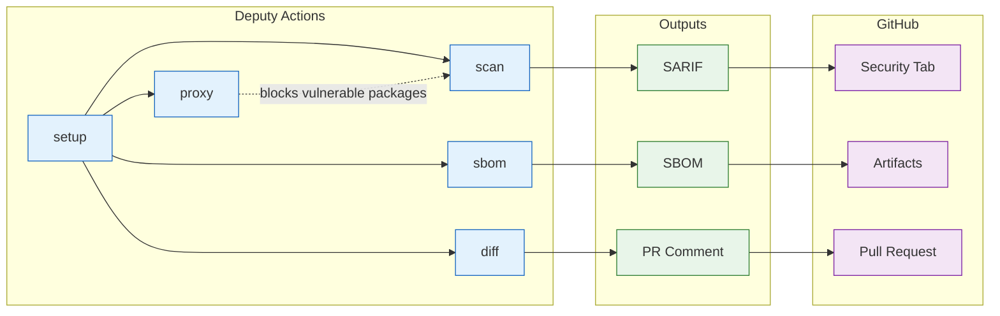

# Deputy GitHub Actions

Composable GitHub Actions for integrating Deputy into your CI/CD pipelines.



## Available Actions

| Action | Purpose | Usage |
|--------|---------|-------|
| [setup](setup/) | Install Deputy CLI | `temporalio/deputy/actions/setup@main` |
| [scan](scan/) | Vulnerability scanning + SARIF upload | `temporalio/deputy/actions/scan@main` |
| [sbom](sbom/) | SBOM generation (CycloneDX/SPDX) | `temporalio/deputy/actions/sbom@main` |
| [diff](diff/) | Dependency change analysis | `temporalio/deputy/actions/diff@main` |
| [proxy](proxy/) | Policy enforcement at download time | `temporalio/deputy/actions/proxy@main` |

## Quick Start

```yaml
name: Security Scan
on: [push, pull_request]

permissions:
  security-events: write
  contents: read

jobs:
  scan:
    runs-on: ubuntu-latest
    steps:
      - uses: actions/checkout@v4
      - uses: temporalio/deputy/actions/setup@main
      - uses: temporalio/deputy/actions/scan@main
        with:
          upload-sarif: true
```

Results appear in **Security > Code scanning alerts**.

## Policy Enforcement

Use policy files to define security gates:

```yaml
- uses: temporalio/deputy/actions/scan@main
  with:
    policy: policy/ci/security-gate.yaml
    fail-on-policy-violation: true
```

## Documentation

- [GitHub Actions Guide](../docs/guides/github-actions.md) - Full documentation with workflow recipes
- [Example Workflows](../.github/workflows/examples/) - Ready-to-use workflow templates
- [CI Policies](../policy/ci/) - Built-in security policies for CI

## Example Workflows

| Workflow | Description |
|----------|-------------|
| [basic-scan.yml](../.github/workflows/examples/basic-scan.yml) | Minimal security scan |
| [pr-security-gate.yml](../.github/workflows/examples/pr-security-gate.yml) | Block vulnerable PRs |
| [release-sbom.yml](../.github/workflows/examples/release-sbom.yml) | SBOM on releases |
| [full-pipeline.yml](../.github/workflows/examples/full-pipeline.yml) | Complete security workflow |
| [monorepo.yml](../.github/workflows/examples/monorepo.yml) | Multi-path scanning |
| [multi-ecosystem.yml](../.github/workflows/examples/multi-ecosystem.yml) | Go + npm + Python |
| [scheduled-scan.yml](../.github/workflows/examples/scheduled-scan.yml) | Daily/weekly scans |
| [reusable-security.yml](../.github/workflows/examples/reusable-security.yml) | Organization-wide reusable workflow |
| [proxied-build.yml](../.github/workflows/examples/proxied-build.yml) | Policy enforcement at download |
