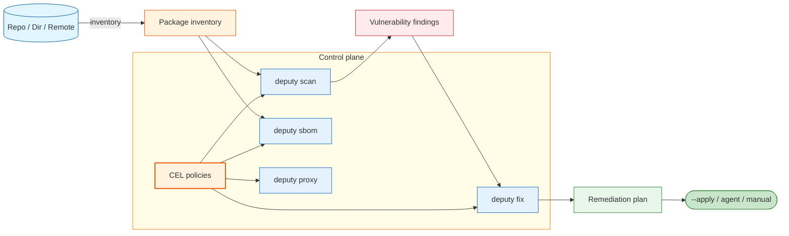

# Deputy Documentation 🛡️

Deputy helps teams **understand, enforce, and improve** their software supply chain:

- **Inventory** dependencies across ecosystems.
- **Scan** for known vulnerabilities (OSV) and produce actionable reports.
- **Generate SBOMs** (CycloneDX / SPDX) for audit and compliance workflows.
- **Create remediation plans** (and optionally apply them).
- **Enforce policies** (CEL) in CI and at download-time via a package proxy.

## Who uses Deputy

- **Developers**: see what changed (`diff`), scan before merging (`scan`), and generate SBOMs (`sbom`).
- **Security teams**: codify guardrails once (policies) and reuse them across repos and enforcement points.
- **Platform/CI owners**: produce structured artifacts for audit (`scan --format json`, `sbom`) and gate pipelines.
- **Organizations**: move from reactive scanning to preventive controls (`proxy` + policy).

## Quick start

```console
# 1) Scan the current repo at HEAD
$ deputy scan

# 2) Generate a remediation plan (text)
$ deputy fix

# 3) Apply runnable fixes (local repos only)
$ deputy fix --apply

# 4) Produce an SBOM (CycloneDX JSON by default)
$ deputy sbom --output sbom.cdx.json
```

## How Deputy fits together



## Documentation map

- **Getting started:** [`docs/getting-started.md`](getting-started.md)
- **Concepts:** [`docs/concepts/README.md`](concepts/README.md)
- **Commands:** [`docs/commands/README.md`](commands/README.md)
- **Guides:** [`docs/guides/README.md`](guides/README.md)
- **Examples (realistic output):** [`docs/examples/README.md`](examples/README.md)
- **Reference:** [`docs/reference/README.md`](reference/README.md)
- **Development:** [`docs/development/README.md`](development/README.md)

## Where to look in code

- CLI wiring + subcommands: [`internal/cli`](../internal/cli) and [`internal/cli/cmd`](../internal/cli/cmd)
- Inventory + PURL normalization: [`internal/inventory`](../internal/inventory), [`internal/purlx`](../internal/purlx)
- Vulnerability analysis + remediation planning: [`internal/analysis`](../internal/analysis), [`internal/remediation`](../internal/remediation)
- SBOM generation: [`internal/sbom`](../internal/sbom)
- Policy engine + entrypoints: [`internal/policy`](../internal/policy)
- Proxy runtime: [`internal/proxy`](../internal/proxy)
