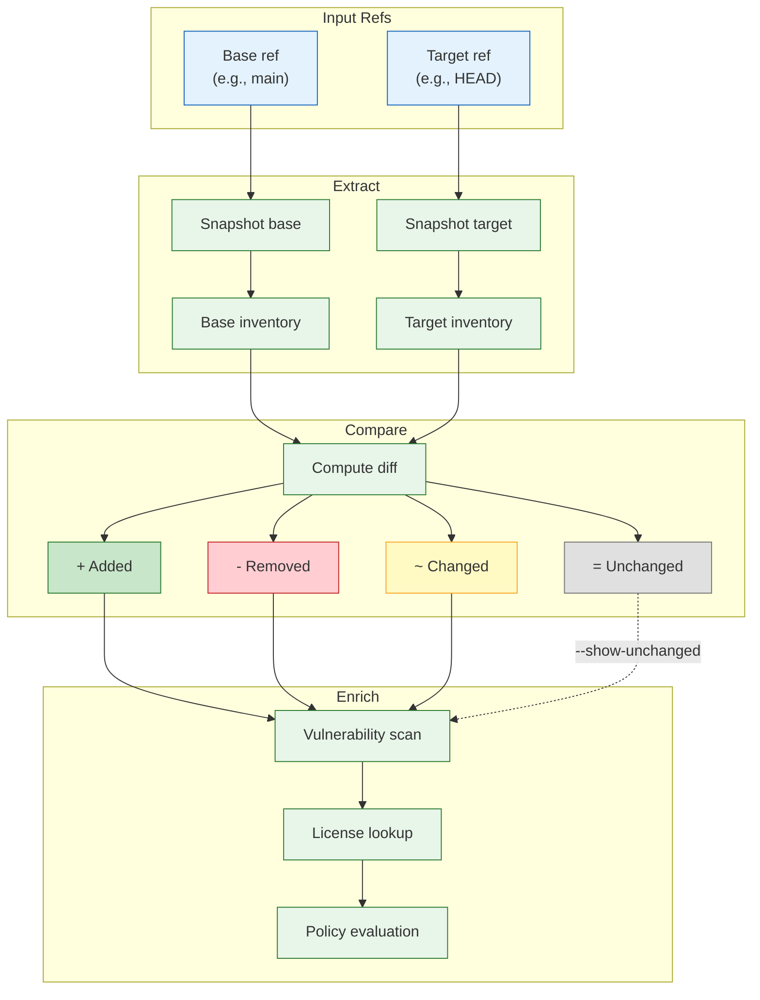
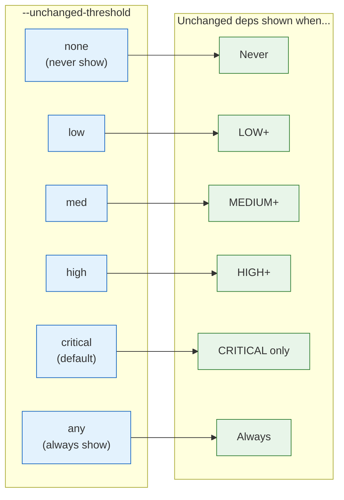

# `deputy diff`

Compare dependency changes between Git references with vulnerability analysis.

## Synopsis

```
deputy diff [base] [target] [flags]
```

## How Diff Works



## When to Use

- In PR reviews to see what dependencies changed
- For release comparisons between tags
- To evaluate the impact of lockfile updates
- To audit dependency changes over time

## Flags

| Flag | Short | Default | Description |
| --- | --- | --- | --- |
| `--repo` | `-r` | cwd | Path to the repository |
| `--skip-vuln-scan` | `-s` | `false` | Skip vulnerability scanning (faster) |
| `--licenses` | | `false` | Include license information |
| `--license-source` | | `depsdev` | License source: `depsdev`, `scan`, `both` |
| `--published-before` | | | Only show vulns published before this date |
| `--published-after` | | | Only show vulns published on/after this date |
| `--as-of` | | | Historical view (implies `--published-before`) |
| `--ignore-unfixed` | | `false` | Hide unfixable vulnerabilities |
| `--show-unchanged` | | `false` | Show vulns in unchanged dependencies |
| `--unchanged-threshold` | | `critical` | Auto-show unchanged vulns at this severity+ |
| `--ecosystems` | | `all` | Ecosystems to scan |
| `--policy` | | | CEL policy files (repeatable) |
| `--debug-matcher` | | `false` | Show which files triggered dependency analysis |

### Unchanged Threshold Values

`none` | `low` | `med` | `high` | `critical` | `any`

The `--unchanged-threshold` flag controls when vulnerabilities in unchanged dependencies are shown:



## Reference Types

Deputy supports many Git reference formats:

| Type | Examples |
| --- | --- |
| Branches | `main`, `develop`, `feature/auth` |
| Tags | `v1.0.0`, `release-2024` |
| Commits | `abc123d`, `HEAD~3` |
| Remote refs | `origin/main`, `upstream/develop` |
| Time expressions | `HEAD@{yesterday}`, `main@{1.week.ago}` |
| Working tree | `WORKING`, `WT`, `.` |

> **Note**: Quote time-based refs to avoid shell expansion: `"HEAD@{yesterday}"`

## Default Behavior

When you run `deputy diff` with no arguments:

1. If manifests have uncommitted changes → compares default branch → `WORKING`
2. Otherwise → compares default branch → `HEAD`

## Examples

### Basic Comparisons

```console
# Default: compare default branch to HEAD/WORKING
$ deputy diff

# Compare two branches
$ deputy diff main develop

# Compare two tags
$ deputy diff v1.0.0 v2.0.0

# Compare branch to working tree
$ deputy diff main WORKING
$ deputy diff main .
```

### Time-Based Comparisons

```console
# What changed since yesterday?
$ deputy diff "HEAD@{yesterday}" HEAD

# Changes in the last week
$ deputy diff "main@{1.week.ago}" main

# Changes in the last month
$ deputy diff "main@{1.month.ago}" main
```

### With License Information

```console
# Include licenses from deps.dev
$ deputy diff --licenses main develop

# Use local license scanning
$ deputy diff --licenses --license-source scan main develop

# Maximum coverage
$ deputy diff --licenses --license-source both main develop
```

### Controlling Vulnerability Output

```console
# Skip vulnerability scanning entirely
$ deputy diff --skip-vuln-scan main develop

# Always show unchanged dependency vulns
$ deputy diff --show-unchanged main develop

# Show unchanged vulns if HIGH or above
$ deputy diff --unchanged-threshold high main develop

# Hide unfixable vulnerabilities
$ deputy diff --ignore-unfixed main develop
```

### With Policies

```console
# Apply policy to diff results
$ deputy diff --policy policy/new-dependency-review.yaml main develop
```

## Output

```
Comparing dependencies: main → WORKING
Scanning packages in working tree...
Scanning packages in base reference abc123d...

Dependency Changes:
  ↑ github.com/example/pkg @ 1.0.0 → 1.1.0 (direct)
  + github.com/new/dep @ 2.0.0 (indirect)
  - github.com/removed/pkg @ 1.0.0 (indirect)

Summary:
  + 1 package added
  - 1 package removed
  ↑ 1 package upgraded

∴ Vulnerabilities

github.com/example/pkg v1.1.0:
  • CVE-2024-5678 [MEDIUM]
    ...
```

## Exit Codes

| Code | Meaning |
| --- | --- |
| `0` | Success |
| `1` | Policy violations or errors |

## See Also

- [Time travel guide](../examples/time-travel.md)
- [Targets and refs](../concepts/targets-and-refs.md)

## Code Pointers

- CLI: [`internal/cli/cmd/diff.go`](../../internal/cli/cmd/diff.go)
- Ref parsing: [`internal/gitutil`](../../internal/gitutil)
- Comparison engine: [`internal/compare`](../../internal/compare)
