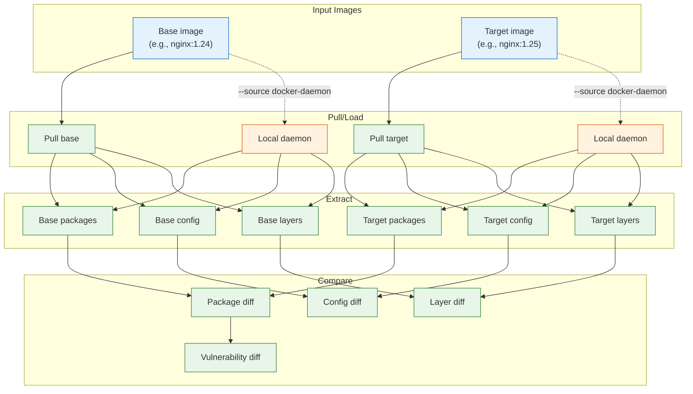
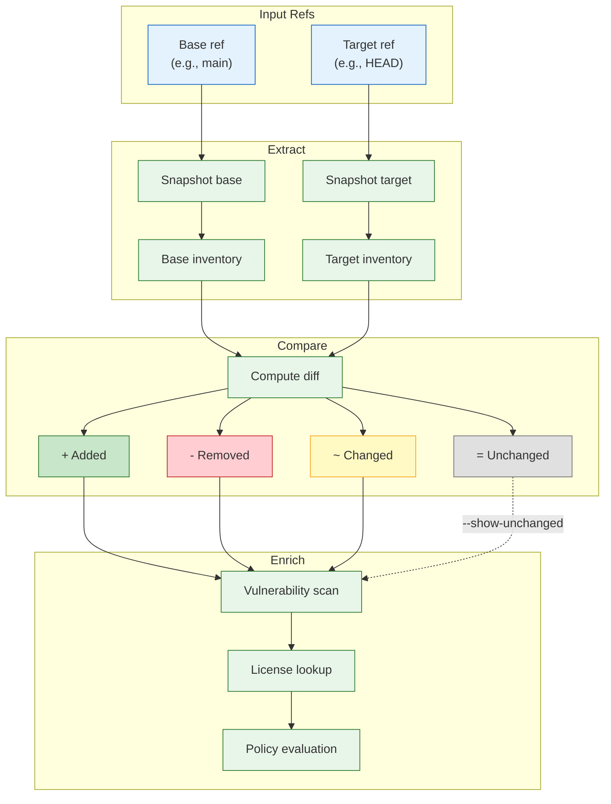
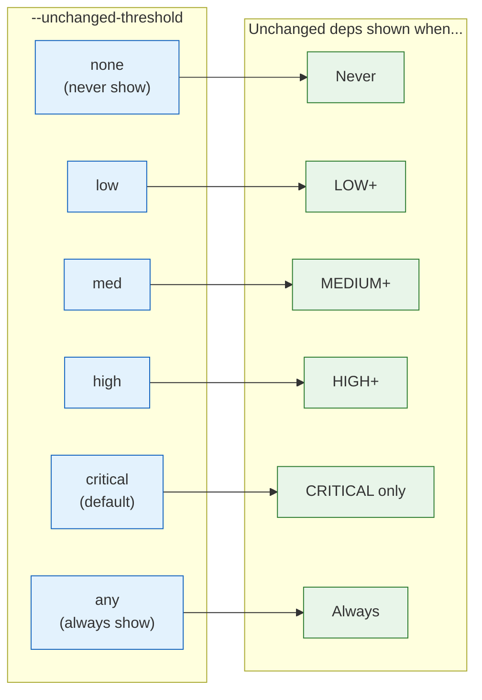

# `deputy diff`

Compare dependency changes between Git references or container images with vulnerability analysis.

## Synopsis

```
deputy diff [base] [target] [flags]
```

## GitHub Actions Integration

For PR reviews and CI pipelines, use the [`diff` action](../../actions/diff/):

```yaml
- uses: picatz/deputy/actions/diff@main
  with:
    comment-on-pr: true
    policy: policy/ci/pr-review.yaml
```

The action auto-detects base refs from PR context and posts a summary comment. See [GitHub Actions Integration](../guides/github-actions.md#diff-aware-pr-reviews) for full documentation.

## Modes

Deputy diff operates in two modes depending on the arguments:

| Mode | When | Example |
| --- | --- | --- |
| **Git diff** | Arguments look like Git refs | `deputy diff main develop` |
| **Container diff** | Arguments look like image refs | `deputy diff nginx:1.24 nginx:1.25` |

Deputy auto-detects the mode based on whether references contain `/` with `:` (image pattern) or look like Git refs.

---

## Container Image Diff

Compare two container images to understand what changed between versions—packages added/removed, vulnerabilities fixed/introduced, configuration changes, and layer modifications.

### How Container Diff Works



### Container Diff Flags

| Flag | Short | Default | Description |
| --- | --- | --- | --- |
| `--source` | `-s` | `remote` | Target source type: `remote`, `docker-daemon` |
| `--skip-vuln-scan` | | `false` | Skip vulnerability scanning (faster) |
| `--policy` | | | CEL policy files (repeatable) |
| `--format` | `-f` | `text` | Output format: `text` or `json` |

### Using Local Docker Daemon

The `--source docker-daemon` flag tells Deputy to load images from your local Docker daemon instead of pulling from remote registries. This is useful for:

- **Avoiding rate limits** (e.g., Docker Hub's pull limits)
- **Scanning private images** already pulled locally
- **Faster iteration** when images are already cached
- **Air-gapped environments** without registry access

```console
# First, pull the images you want to compare
$ docker pull temporalio/server:1.28.1
$ docker pull temporalio/server:1.29.2

# Then compare using local daemon
$ deputy diff --source docker-daemon temporalio/server:1.28.1 temporalio/server:1.29.2
```

> [!NOTE]
> Images must be pulled with `docker pull` before using `--source docker-daemon`. Deputy does not automatically pull images in this mode.

### Container Diff Examples

```console
# Compare two image versions (pulls from registry)
$ deputy diff nginx:1.24 nginx:1.25

# Compare with full registry path
$ deputy diff gcr.io/project/app:v1 gcr.io/project/app:v2

# Skip vulnerability scan for faster comparison
$ deputy diff --skip-vuln-scan alpine:3.18 alpine:3.19

# Use locally cached images (avoids rate limits)
$ deputy diff --source docker-daemon python:3.11 python:3.12

# Apply policy to container diff
$ deputy diff --policy policy/container-upgrade.yaml node:18 node:20

# Output as JSON for CI/CD pipelines
$ deputy diff --format json nginx:1.24 nginx:1.25
```

### Container Diff Output

```
Comparing container images (from local Docker daemon):
  Base:   temporalio/server:1.28.1
  Target: temporalio/server:1.29.2

Package Changes:
  + added-pkg @ 1.0.0 [L5]
  - removed-pkg @ 2.0.0 [L3, base]
  ↑ upgraded-pkg @ 1.0.0 → 2.0.0 [L8]
  ↓ downgraded-pkg @ 3.0.0 → 2.5.0 [L8]

Vulnerabilities:
  ✓ 3 fixed by upgrade:
      2 CRITICAL (CVE-2024-1234, CVE-2024-5678)
      1 HIGH (CVE-2024-7890)
  ! 1 new vulnerabilities:
      example-pkg @2.0.0
        [MEDIUM] CVE-2024-9999 (↑ 2.1.0)
  ~ 5 existing vulnerabilities (2 critical, 3 high) [3 fixable]:
      ...

Configuration Changes:
  ~ USER
      - root
      + nobody
  + EXPOSE 8080/tcp
  + ENV NEW_VAR=value

Layer Analysis:
  Layers: 15 → 16 (+1) (1 added)

Summary:
  + 12 packages added
  - 5 packages removed
  ↑ 23 packages upgraded
  ✓ 3 vulnerabilities fixed
  ! 1 vulnerability added

Vulnerability Summary:
  ! 3 require immediate attention (critical/high severity)
  ↑ 4 can be fixed by upgrading
  - 2 have no fix available yet

Recommended Actions:
  1. Consider a newer base image (2 critical/high vulnerabilities persist)
  2. Upgrade packages with available fixes (4 vulnerabilities can be resolved)
       › openssl 1.1.1k → 1.1.1w (2 vulns)
         [L3, base image]
       › curl 7.68.0 → 7.88.1
         [L5, apt-get install]
  3. Monitor unfixed vulnerabilities (check upstream for patches / consider alternatives)
```

The layer context in recommendations (`[L3, base image]`, `[L5, apt-get install]`) helps you understand:
- Which layer introduced the vulnerable package
- Whether it's from the base image (FROM) or added by your Dockerfile
- What command installed it (apt-get, apk, pip, etc.)

### JSON Output

For CI/CD integration, use `--format json` to get machine-readable output:

```console
$ deputy diff --format json nginx:1.24 nginx:1.25
```

```json
{
  "baseImage": {"reference": "nginx:1.24", ...},
  "targetImage": {"reference": "nginx:1.25", ...},
  "packageChanges": [...],
  "vulnerabilities": [...],
  "configChanges": {...},
  "summary": {
    "packagesAdded": 12,
    "packagesRemoved": 5,
    "packagesUpgraded": 23,
    "vulnerabilitiesFixed": 3,
    "vulnerabilitiesAdded": 1
  },
  "vulnerabilitySummary": {
    "criticalHighCount": 3,
    "fixableCount": 4,
    "unfixedCount": 2
  },
  "recommendations": [
    {
      "priority": 1,
      "action": "Consider a newer base image",
      "description": "2 critical/high vulnerabilities persist"
    },
    {
      "priority": 2,
      "action": "Upgrade packages with available fixes",
      "packages": [
        {
          "package": "openssl",
          "currentVersion": "1.1.1k",
          "fixedVersion": "1.1.1w",
          "vulnerabilityCount": 2,
          "layerContext": {
            "layerIndex": 3,
            "inBaseImage": true
          }
        }
      ]
    }
  ]
}
```

### What Container Diff Compares

| Category | Details |
| --- | --- |
| **Packages** | OS packages (apt, apk, rpm), language packages (pip, npm, go) |
| **Vulnerabilities** | Added, fixed, removed, persisted CVEs with severity |
| **Configuration** | USER, ENV, ENTRYPOINT, CMD, EXPOSE, VOLUME, WORKDIR, HEALTHCHECK |
| **Layers** | Added, removed, modified layers with Dockerfile commands |
| **Labels** | OCI/Docker labels added, removed, or changed |

### Registry Authentication

Deputy uses Docker's credential chain (`~/.docker/config.json`) for registry authentication. If you can `docker pull` an image, Deputy can access it.

For rate-limited registries like Docker Hub, either:
1. Authenticate with `docker login` (increases rate limits)
2. Use `--local-daemon` with pre-pulled images

Deputy automatically retries on rate limit errors (HTTP 429) with exponential backoff.

---

## Git Diff

Compare dependencies between Git references (branches, tags, commits).

## How Diff Works



## When to Use

- In PR reviews to see what dependencies changed
- For release comparisons between tags
- To evaluate the impact of lockfile updates
- To audit dependency changes over time

## Flags

### Common Flags

| Flag | Short | Default | Description |
| --- | --- | --- | --- |
| `--skip-vuln-scan` | | `false` | Skip vulnerability scanning (faster) |
| `--policy` | | | CEL policy files (repeatable) |

### Container Diff Flags

| Flag | Short | Default | Description |
| --- | --- | --- | --- |
| `--source` | `-s` | `remote` | Target source type: `remote`, `docker-daemon` |
| `--format` | `-f` | `text` | Output format: `text`, `json` |

### Git Diff Flags

| Flag | Short | Default | Description |
| --- | --- | --- | --- |
| `--repo` | `-r` | cwd | Path to the repository |
| `--licenses` | | `false` | Include license information |
| `--license-source` | | `depsdev` | License source: `depsdev`, `scan`, `both` |
| `--published-before` | | | Only show vulns published before this date |
| `--published-after` | | | Only show vulns published on/after this date |
| `--as-of` | | | Historical view (implies `--published-before`) |
| `--ignore-unfixed` | | `false` | Hide unfixable vulnerabilities |
| `--show-unchanged` | | `false` | Show vulns in unchanged dependencies |
| `--unchanged-threshold` | | `critical` | Auto-show unchanged vulns at this severity+ |
| `--ecosystems` | | `all` | Ecosystems to scan |
| `--debug-matcher` | | `false` | Show which files triggered dependency analysis |

### Unchanged Threshold Values

`none` | `low` | `med` | `high` | `critical` | `any`

The `--unchanged-threshold` flag controls when vulnerabilities in unchanged dependencies are shown:



## Reference Types

Deputy supports many Git reference formats:

| Type | Examples |
| --- | --- |
| Branches | `main`, `develop`, `feature/auth` |
| Tags | `v1.0.0`, `release-2024` |
| Commits | `abc123d`, `HEAD~3` |
| Remote refs | `origin/main`, `upstream/develop` |
| Time expressions | `HEAD@{yesterday}`, `main@{1.week.ago}` |
| Working tree | `WORKING`, `WT`, `.` |

> [!NOTE]
> Quote time-based refs to avoid shell expansion: `"HEAD@{yesterday}"`

## Default Behavior

When you run `deputy diff` with no arguments:

1. If manifests have uncommitted changes → compares default branch → `WORKING`
2. Otherwise → compares default branch → `HEAD`

## Examples

### Basic Comparisons

```console
# Default: compare default branch to HEAD/WORKING
$ deputy diff

# Compare two branches
$ deputy diff main develop

# Compare two tags
$ deputy diff v1.0.0 v2.0.0

# Compare branch to working tree
$ deputy diff main WORKING
$ deputy diff main .
```

### Time-Based Comparisons

```console
# What changed since yesterday?
$ deputy diff "HEAD@{yesterday}" HEAD

# Changes in the last week
$ deputy diff "main@{1.week.ago}" main

# Changes in the last month
$ deputy diff "main@{1.month.ago}" main
```

### With License Information

```console
# Include licenses from deps.dev
$ deputy diff --licenses main develop

# Use local license scanning
$ deputy diff --licenses --license-source scan main develop

# Maximum coverage
$ deputy diff --licenses --license-source both main develop
```

### Controlling Vulnerability Output

```console
# Skip vulnerability scanning entirely
$ deputy diff --skip-vuln-scan main develop

# Always show unchanged dependency vulns
$ deputy diff --show-unchanged main develop

# Show unchanged vulns if HIGH or above
$ deputy diff --unchanged-threshold high main develop

# Hide unfixable vulnerabilities
$ deputy diff --ignore-unfixed main develop
```

### With Policies

The `--policy` flag evaluates CEL policies against diff results. Different entrypoints are emitted depending on the diff type:

**Git Diff Entrypoints:**
- `diff_report` - Full diff summary
- `diff_dependency_change` - Per-package change
- `diff_vulnerability` - Per-vulnerability in changed deps

**Container Diff Entrypoints:**
- `container_diff_report` - Full diff summary
- `container_diff_change` - Per-package change
- `container_diff_vulnerability` - Per-vulnerability change
- `container_diff_layer` - Per-layer analysis
- `container_diff_config` - Configuration changes

```console
# Git diff with policy
$ deputy diff --policy policy/new-dependency-review.yaml main develop

# Container diff with policy
$ deputy diff --policy policy/container-upgrade.yaml nginx:1.24 nginx:1.25
```

See [Policy Examples](../../policy/examples/) for ready-to-use policies including [container-diff.yaml](../../policy/examples/container-diff.yaml) and [new-dependency-review.yaml](../../policy/examples/new-dependency-review.yaml).

## Output

```
Comparing dependencies: main → WORKING
Scanning packages in working tree...
Scanning packages in base reference abc123d...

Dependency Changes:
  ↑ github.com/example/pkg @ 1.0.0 → 1.1.0 (direct)
  + github.com/new/dep @ 2.0.0 (indirect)
  - github.com/removed/pkg @ 1.0.0 (indirect)

Summary:
  + 1 package added
  - 1 package removed
  ↑ 1 package upgraded

∴ Vulnerabilities

github.com/example/pkg v1.1.0:
  • CVE-2024-5678 [MEDIUM]
    ...
```

## Exit Codes

| Code | Meaning |
| --- | --- |
| `0` | Success |
| `1` | Policy violations or errors |

## See Also

- [GitHub Actions Integration](../guides/github-actions.md) - PR reviews and CI workflows
- [Policy Examples](../../policy/examples/) - Ready-to-use diff policies
- [Policy Inputs Reference](../reference/policy-inputs.md) - CEL variables for diff entrypoints
- [Time travel guide](../examples/time-travel.md)
- [Targets and refs](../concepts/targets-and-refs.md)

## Code Pointers

### Git Diff
- CLI: [`internal/cli/cmd/diff.go`](../../internal/cli/cmd/diff.go)
- Ref parsing: [`internal/gitutil`](../../internal/gitutil)
- Comparison engine: [`internal/compare`](../../internal/compare)

### Container Diff
- CLI: [`internal/cli/cmd/diff_container.go`](../../internal/cli/cmd/diff_container.go)
- Container diff proto: [`internal/proto/container_diff.go`](../../internal/proto/container_diff.go)
- Image comparison: [`internal/compare/container_image.go`](../../internal/compare/container_image.go)
- Container image provider: [`internal/targets/providers/container_image.go`](../../internal/targets/providers/container_image.go)
