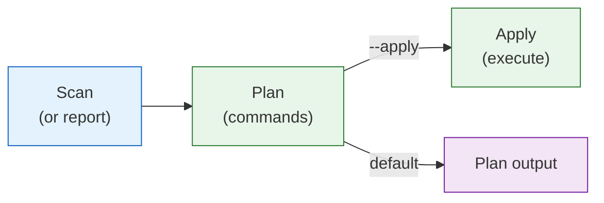

# `deputy fix`

Generate and optionally apply remediation plans for vulnerabilities.

## Synopsis

```
deputy fix [repo] [flags]
```

## When to Use

- You want upgrade commands for fixable vulnerabilities
- You want a JSON plan for review/approval workflows
- You want to delegate complex fixes to an AI agent

## Flags

| Flag | Short | Default | Description |
| --- | --- | --- | --- |
| `--report` | | | Path to JSON scan report (use `-` for stdin) |
| `--plan` | | | Path to existing remediation plan JSON |
| `--ref` | | auto | Git reference to scan; omitted lets Deputy choose `HEAD` or the working tree |
| `--ecosystems` | | all | Limit to specific ecosystems |
| `--exclude-path` | | | Directory glob to skip during the walk (repeatable; e.g. `.bin/**`). Unioned with `scan.exclude_paths` from config |
| `--ignore-unfixed` | | `false` | Skip vulns without fixes |
| `--published-before` | | | Date filter for vulnerabilities |
| `--published-after` | | | Date filter for vulnerabilities |
| `--as-of` | | | Historical view date |
| `--format` | `-f` | `text` | Output format: `text`, `json` |
| `--apply` | | `false` | Execute remediation commands |
| `--policy` | | | CEL policy files (repeatable) |

### Agent Flags

| Flag | Short | Default | Description |
| --- | --- | --- | --- |
| `--agent` | | | AI agent to use (e.g., `codex`) |
| `--agent-model` | | | Model identifier |
| `--agent-sandbox` | | `workspace-write` | Sandbox: `read-only`, `workspace-write`, `danger-full-access` |
| `--agent-full-auto` | | `false` | Enable full-auto mode (dangerous) |
| `--agent-thread` | | | Resume a previous thread ID |
| `--agent-include-plan-tool` | | `true` | Allow agent to use plan tool |
| `--agent-skip-git-check` | | `true` | Skip git repository checks |

## Workflow



## Examples

### Basic Usage

```console
# Scan and generate a plan
$ deputy fix

# Scan and immediately apply fixes
$ deputy fix --apply .

# Generate a plan for a remote repository at a specific ref
$ deputy fix github.com/hashicorp/vagrant --ref main
```

### Plan Management

```console
# Generate a JSON plan for review
$ deputy fix --format json > plan.json

# Review the plan, then apply it later
$ deputy fix --plan plan.json --apply .
```

### From Existing Scan Report

```console
# Use a scan report from CI
$ deputy scan --format json --output scan.json
$ deputy fix --report scan.json

# Pipe directly
$ deputy scan --format json | deputy fix --report -
```

### Filtering

```console
# Only generate commands for fixable vulns
$ deputy fix --ignore-unfixed

# Only Go ecosystem
$ deputy fix --ecosystems go
```

### AI Agent Assistance

```console
# Use Codex agent
$ deputy fix --agent codex

# With specific model
$ deputy fix --agent codex --agent-model gpt-4

# Read-only analysis (safest)
$ deputy fix --agent codex --agent-sandbox read-only

# Full-auto mode (use with caution!)
$ deputy fix --agent codex --agent-full-auto
```

## Output

### Text Format

```
Remediation Plan:
  Target: /path/to/repo
  Commit: abc123d...

  • Upgrade Go toolchain to v1.24.9
  • Apply dependency upgrades (4 total, 4 runnable)
       go.mod:
         › go get github.com/example/pkg@v1.2.4
         › go get github.com/other/dep@v2.0.0
         ↻ go mod tidy
```

### JSON Format

JSON output marshals the `deputy.fix.v1.FixResponse` proto with snake_case
field names:

```json
{
  "target": {
    "display_path": "/path/to/repo",
    "ref": "main",
    "effective_ref": "refs/heads/main",
    "commit_hash": "abc123def456"
  },
  "stdlib_upgrade": "1.24.9",
  "commands": [
    {
      "manager": "go",
      "command": "go get github.com/example/pkg@v1.2.4",
      "path": "go.mod",
      "follow_up": "go mod tidy",
      "is_direct": true,
      "executable": true,
      "package": "github.com/example/pkg",
      "version": "v1.2.3",
      "purl": "pkg:golang/github.com/example/pkg@v1.2.3",
      "target_version": "v1.2.4",
      "vulnerabilities": ["CVE-2026-1234"]
    }
  ],
  "stats": {
    "total_commands": 4,
    "runnable_commands": 4
  },
  "generated_at": "2026-07-06T10:30:00Z"
}
```

## Supported Ecosystems

| Ecosystem | Command Pattern |
| --- | --- |
| Go | `go get <module>@<version>` |
| npm | `npm install <package>@<version>` |
| PyPI | `pip install <package>==<version>` |
| RubyGems | `bundle update <gem>` |

## Exit Codes

| Code | Meaning |
| --- | --- |
| `0` | Success |
| `1` | Errors or policy violations |

## See Also

- [Agents guide](../guides/agents.md)
- [Pipeline example](../examples/pipeline.md)

## Code Pointers

- CLI: [`internal/cli/cmd/fix.go`](../../internal/cli/cmd/fix.go)
- Remediation logic: [`internal/remediation`](../../internal/remediation)
