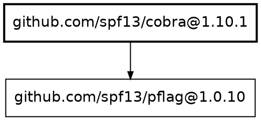

# deputy graph

Visualize and analyze the dependency graph of a repository.

## Synopsis

```
deputy graph [target] [flags]
deputy graph why <package> [target] [flags]
deputy graph needs <package> [target] [flags]
```

## Description

The `graph` command generates a dependency graph showing relationships between packages. It supports multiple output formats for different use cases: CLI viewing, documentation, visualization tools, and programmatic analysis.

## Output Formats

| Format | Description | Use Case |
|--------|-------------|----------|
| `text` | ASCII tree view (default) | CLI-friendly viewing |
| `json` | Full graph structure | Programmatic analysis, CI pipelines |
| `dot` | Graphviz DOT format | Render with `dot`, `neato`, or other Graphviz tools |
| `mermaid` | Mermaid.js flowchart | Embed in Markdown, GitHub README |
| `d3` | D3.js force-directed JSON | Interactive web visualization |

### Text Format

```bash
deputy graph --format text --depth 2
```

Produces an ASCII tree showing dependency hierarchy:

```
github.com/spf13/cobra@1.10.1
├── github.com/inconshreveable/mousetrap@1.1.0
└── github.com/spf13/pflag@1.0.10
github.com/go-git/go-git/v5@5.16.3
├── dario.cat/mergo@1.0.2
├── github.com/ProtonMail/go-crypto@1.3.0
│   └── golang.org/x/crypto@0.45.0
...
```

### JSON Format

```bash
deputy graph --format json | jq '.nodes | length'
```

Full graph structure with nodes and edges:

```json
{
  "nodes": [
    {
      "purl": "pkg:golang/github.com/spf13/cobra@1.10.1",
      "name": "github.com/spf13/cobra",
      "version": "1.10.1",
      "ecosystem": "Go",
      "direct": true,
      "depth": 0,
      "vulnerability_count": {"critical": 0, "high": 0, "medium": 0, "low": 0, "total": 0}
    }
  ],
  "edges": [
    {"from": "pkg:golang/github.com/spf13/cobra@1.10.1", "to": "pkg:golang/github.com/spf13/pflag@1.0.10"}
  ]
}
```

### DOT Format (Graphviz)

```bash
# Generate PNG image
deputy graph --format dot | dot -Tpng -o deps.png

# Generate SVG
deputy graph --format dot | dot -Tsvg -o deps.svg

# With custom direction
deputy graph --format dot --direction LR > deps.dot
```

Produces Graphviz DOT:



### Mermaid Format

```bash
deputy graph --format mermaid >> README.md
```

Produces Mermaid.js flowchart for embedding in documentation:

```mermaid
flowchart TB
    subgraph Go[Go]
        n0([github.com/spf13/cobra@1.10.1])
        n1[github.com/spf13/pflag@1.0.10]
    end
    n0 --> n1
```

### D3 Format

```bash
deputy graph --format d3 > deps.json
```

JSON format designed for D3.js force-directed graph visualization:

```json
{
  "nodes": [
    {"id": "pkg:golang/...", "name": "cobra", "version": "1.10.1", "group": 0, "vulns": 0}
  ],
  "links": [
    {"source": 0, "target": 1}
  ]
}
```

Groups indicate node type:
- `0`: Direct dependency
- `1`: Transitive dependency
- `2`: Has vulnerabilities (low/medium)
- `3`: Has high severity vulnerabilities
- `4`: Has critical severity vulnerabilities

## Subcommands

### graph why

Show why a package is in the dependency graph by tracing dependency paths.

```bash
# Why is lodash in my dependencies?
deputy graph why lodash

# Why is a specific version included?
deputy graph why lodash@4.17.21

# Show all dependency paths (not just shortest)
deputy graph why yaml --all

# JSON output for scripting
deputy graph why protobuf --json
```

Example output:

```
github.com/goccy/go-yaml@1.12.0
(direct dependency)

sigs.k8s.io/yaml@1.6.0
(1 hop)
github.com/spdx/tools-golang@0.5.5 (direct)
└── sigs.k8s.io/yaml@1.6.0
```

### graph needs

Show what packages depend on a given package (reverse dependencies).

```bash
# What depends on protobuf?
deputy graph needs protobuf

# Show all dependents
deputy graph needs golang.org/x/net --all
```

Example output:

```
github.com/gogo/protobuf@1.3.2
(8 dependents: 3 direct, 5 transitive)
  github.com/google/osv-scalibr@0.3.2 (direct)
  github.com/moby/buildkit@0.26.3 (direct)
  github.com/containerd/containerd@1.7.29
  ...
```

## Flags

| Flag | Short | Default | Description |
|------|-------|---------|-------------|
| `--format` | `-f` | `text` | Output format: text, json, dot, mermaid, d3 |
| `--output` | `-o` | `-` | Output file path (- for stdout) |
| `--depth` | `-d` | `-1` | Maximum depth to display (-1 for unlimited) |
| `--direct` | | `false` | Show only direct dependencies |
| `--vulnerable` | | `false` | Show only packages with vulnerabilities |
| `--show-vulns` | | `false` | Show vulnerability counts per package |
| `--versions` | | `true` | Show package versions in output |
| `--direction` | | `TB` | Graph direction: TB, LR, BT, RL |
| `--focus` | | | Focus on a specific package (shows its subgraph) |
| `--stats` | | `false` | Show only graph statistics |
| `--ecosystems` | | `all` | Ecosystems to include |
| `--ref` | | `HEAD` | Git reference (commit, tag, branch) |

## Examples

### Basic Usage

```bash
# Show dependency tree for current repo
deputy graph

# Show graph for a remote repo
deputy graph https://github.com/example/repo

# Quick stats only
deputy graph --stats
```

### Filtering

```bash
# Only direct dependencies
deputy graph --direct

# Limit depth
deputy graph --depth 2

# Focus on a specific package and its dependencies
deputy graph --focus lodash

# Filter by ecosystem
deputy graph --ecosystems go

# Show only vulnerable packages
deputy graph --vulnerable --show-vulns
```

### Output to Files

```bash
# Save as PNG via Graphviz
deputy graph --format dot | dot -Tpng -o deps.png

# Save JSON for analysis
deputy graph --format json -o deps.json

# Append Mermaid to README
deputy graph --format mermaid --depth 1 >> README.md
```

### CI/CD Integration

```bash
# Check for new dependencies
deputy graph --format json | jq '.nodes | length'

# Find vulnerable paths
deputy graph why vulnerable-pkg --json | jq '.paths'

# Generate SBOM-adjacent graph
deputy graph --format json -o graph.json
```

### Visualization Workflows

```bash
# Interactive Graphviz with xdot
deputy graph --format dot | xdot -

# Generate SVG for web embedding
deputy graph --format dot --direction LR | dot -Tsvg -o deps.svg

# Large graph with filtered view
deputy graph --depth 3 --direct --format dot | dot -Tpng -o direct-deps.png
```

## Graph Statistics

Use `--stats` for a quick overview:

```
Dependency Graph Statistics

  Total packages:      217
  Direct dependencies: 55
  Transitive:          162
  Max depth:           999

By Ecosystem
  Go:                  209
```

## Node Styling

In DOT and Mermaid formats, nodes are styled based on their characteristics:

| Characteristic | DOT Style | Mermaid Shape |
|----------------|-----------|---------------|
| Direct dependency | `style=bold` | Stadium `([...])` |
| Transitive | Default | Rectangle `[...]` |
| Critical vulns | `color=red, penwidth=2` | Red fill |
| High vulns | `color=orange, penwidth=2` | Orange fill |
| Medium/Low vulns | `color=yellow` | Yellow fill |

## Exit Codes

| Code | Meaning |
| --- | --- |
| `0` | Success |
| `1` | Error (target not found, invalid options) |

## See Also

- [Scan command](scan.md) — Scan for vulnerabilities
- [List command](list.md) — List dependencies
- [SBOM command](sbom.md) — Generate SBOM
- [Graph policies](../reference/policy-inputs.md#graph-entrypoints) — CEL policies for graph analysis
- [Graphviz Documentation](https://graphviz.org/documentation/)
- [Mermaid.js Documentation](https://mermaid.js.org/)

## Code Pointers

- CLI: [`internal/cli/cmd/graph.go`](../../internal/cli/cmd/graph.go)
- Graph resolution: [`internal/graph`](../../internal/graph)
