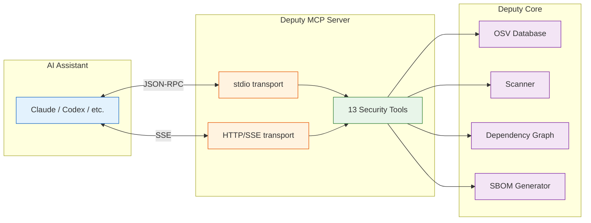

# `deputy mcp`

Run an MCP (Model Context Protocol) server to expose Deputy's vulnerability analysis capabilities to AI assistants like Claude, Codex, and other MCP-compatible tools.

## Synopsis

```
deputy mcp serve [flags]
```

## Flags

| Flag | Default | Description |
| --- | --- | --- |
| `--transport` | `stdio` | Transport mode: `stdio` or `http` |
| `--address` | | Address to listen on for HTTP transport (e.g., `:8080`) |

## What is MCP?

The [Model Context Protocol](https://modelcontextprotocol.io/) (MCP) is an open standard that enables AI assistants to interact with external tools and data sources. Deputy's MCP server exposes vulnerability scanning, dependency analysis, and remediation capabilities as tools that AI assistants can invoke.



## Transport Modes

Deputy's MCP server supports two transport modes:

### stdio (default)

The stdio transport communicates over stdin/stdout using JSON-RPC. This is the standard mode for local integrations with desktop AI tools.

```bash
deputy mcp serve
```

**Best for:**
- Claude Desktop, Claude Code, Cursor, Zed, Windsurf
- Local development
- Single-user scenarios

### HTTP (SSE)

The HTTP transport runs a web server using Server-Sent Events (SSE) for communication. This mode is useful for remote access, shared servers, or web-based integrations.

```bash
deputy mcp serve --transport http --address :8080
```

**Best for:**
- Remote/shared servers
- Container deployments
- Web-based AI integrations
- Load-balanced setups

**Endpoints:**
| Endpoint | Method | Description |
|----------|--------|-------------|
| `/` | GET | SSE endpoint for MCP sessions |
| `/mcp` | GET | Alternative SSE endpoint |
| `/health` | GET | Health check (returns JSON) |
| `/info` | GET | Server info and available tools |

**Health check example:**
```bash
curl http://localhost:8080/health
# {"service":"deputy-mcp","status":"healthy","version":"0.1.0"}
```

## Quick Start

### Claude Code (Anthropic)

The fastest way to add Deputy to Claude Code:

```bash
# Add Deputy MCP server (user scope - available across all projects)
claude mcp add --transport stdio deputy --scope user -- deputy mcp serve
```

Or using JSON configuration:

```bash
claude mcp add-json deputy '{"command":"deputy","args":["mcp","serve"]}'
```

**Verify it's working:**
```bash
claude mcp list
claude mcp get deputy
```

**Alternative: Edit config directly**

Add to `~/.claude.json`:

```json
{
  "mcpServers": {
    "deputy": {
      "command": "deputy",
      "args": ["mcp", "serve"]
    }
  }
}
```

For project-specific configuration, add to `.mcp.json` in the project root.

### OpenAI Codex CLI

**Option 1: CLI command**
```bash
codex mcp add deputy -- deputy mcp serve
```

**Option 2: Edit `~/.codex/config.toml`**

```toml
[mcp_servers.deputy]
command = "deputy"
args = ["mcp", "serve"]
```

With environment variables for debug logging:

```toml
[mcp_servers.deputy]
command = "deputy"
args = ["mcp", "serve"]

[mcp_servers.deputy.env]
DEPUTY_LOG_LEVEL = "debug"
```

> [!NOTE]
> The CLI and VSCode Codex extension share this configuration.

### Claude Desktop

Add to your Claude Desktop configuration:

| Platform | Path |
|----------|------|
| macOS | `~/Library/Application Support/Claude/claude_desktop_config.json` |
| Windows | `%APPDATA%\Claude\claude_desktop_config.json` |
| Linux | `~/.config/Claude/claude_desktop_config.json` |

```json
{
  "mcpServers": {
    "deputy": {
      "command": "deputy",
      "args": ["mcp", "serve"]
    }
  }
}
```

**Restart Claude Desktop** after saving the configuration.

### VS Code (GitHub Copilot)

**Option 1: Via Command Palette**
1. Open Command Palette (`Cmd+Shift+P` / `Ctrl+Shift+P`)
2. Run `MCP: Add Server`
3. Choose "Stdio" transport
4. Enter `deputy` as the name
5. Enter `deputy mcp serve` as the command

**Option 2: Edit `.vscode/mcp.json`** (project-specific)

```json
{
  "servers": {
    "deputy": {
      "command": "deputy",
      "args": ["mcp", "serve"]
    }
  }
}
```

**Option 3: Global configuration**

Run `MCP: Add Server`, then select "Global" to add to your user profile.

### Cursor

**Option 1: Project-specific** - Create `.cursor/mcp.json`:

```json
{
  "mcpServers": {
    "deputy": {
      "command": "deputy",
      "args": ["mcp", "serve"]
    }
  }
}
```

**Option 2: Global** - Create `~/.cursor/mcp.json`:

```json
{
  "mcpServers": {
    "deputy": {
      "command": "deputy",
      "args": ["mcp", "serve"]
    }
  }
}
```

**Option 3: Via Settings UI**
1. Open Settings (`Cmd+,` / `Ctrl+,`)
2. Search for "MCP"
3. Click "Edit in mcp.json"
4. Add the deputy configuration

### Zed

Add to Zed's settings (`~/.config/zed/settings.json`):

```json
{
  "context_servers": {
    "deputy": {
      "command": "deputy",
      "args": ["mcp", "serve"]
    }
  }
}
```

### Windsurf

Add to Windsurf's MCP configuration:

```json
{
  "mcpServers": {
    "deputy": {
      "command": "deputy",
      "args": ["mcp", "serve"]
    }
  }
}
```

### HTTP Transport (Remote/Shared Access)

For remote deployments or shared team servers, use HTTP transport:

**Start the server:**
```bash
deputy mcp serve --transport http --address :8080
```

**Claude Code (SSE):**
```bash
claude mcp add --transport sse deputy-remote http://your-server:8080
```

**VS Code (HTTP):**
```json
{
  "servers": {
    "deputy-remote": {
      "type": "sse",
      "url": "http://your-server:8080"
    }
  }
}
```

**Cursor (HTTP):**
```json
{
  "mcpServers": {
    "deputy-remote": {
      "url": "http://your-server:8080"
    }
  }
}
```

## Available Tools

Deputy's MCP server exposes 13 tools organized into categories:

### Vulnerability Analysis

| Tool | Description |
|------|-------------|
| `explain_vulnerability` | Get detailed information about a CVE or GHSA by ID |
| `explain_vulnerabilities` | Batch lookup for multiple vulnerability IDs |
| `scan_package` | Check a single package for known vulnerabilities |
| `scan_directory` | Scan a directory for vulnerabilities in all dependencies |
| `scan_container` | Scan a container image for vulnerabilities |
| `triage_vulnerabilities` | Prioritize vulnerabilities with actionable recommendations |

### Dependency Analysis

| Tool | Description |
|------|-------------|
| `list_dependencies` | List all dependencies in a directory with metadata |
| `analyze_dependency_graph` | Build and analyze the dependency graph |
| `graph_why` | Show why a package is in your dependencies (like `go mod why`) |
| `graph_needs` | Show what packages depend on a given package |

### Comparison

| Tool | Description |
|------|-------------|
| `diff_refs` | Compare dependencies between Git refs or container images |

### SBOM Generation

| Tool | Description |
|------|-------------|
| `generate_sbom` | Generate Software Bill of Materials (CycloneDX, SPDX, Protobom) |

### Remediation

| Tool | Description |
|------|-------------|
| `get_remediation` | Get actionable commands to fix vulnerabilities |

## Tool Reference

### `scan_directory`

Scan a local directory for vulnerabilities.

**Input:**
```json
{
  "path": "/path/to/project",
  "ecosystems": ["go", "npm"]
}
```

**Output:**
```json
{
  "path": "/path/to/project",
  "packagesScanned": 142,
  "clean": false,
  "vulnerabilitiesBySeverity": {
    "critical": 1,
    "high": 3,
    "medium": 5,
    "low": 2
  },
  "vulnerabilities": [...],
  "scanTime": "2.3s"
}
```

### `scan_container`

Scan a container image for vulnerabilities.

**Input:**
```json
{
  "image": "nginx:1.25",
  "platform": "linux/amd64"
}
```

Supports:
- Remote registries: `nginx:1.25`, `ghcr.io/owner/app:v1`
- Docker daemon: `docker-daemon://myapp:latest`
- Tarballs: `tarball:///tmp/image.tar`

### `explain_vulnerability`

Get detailed information about a vulnerability.

**Input:**
```json
{
  "id": "CVE-2021-44228"
}
```

**Output:**
```json
{
  "id": "CVE-2021-44228",
  "summary": "Remote code execution in Log4j",
  "details": "Apache Log4j2 2.0-beta9 through 2.15.0...",
  "severity": "CRITICAL",
  "affectedPackages": [...],
  "fixedVersions": ["2.17.0", "2.12.3", "2.3.1"],
  "references": [...]
}
```

### `graph_why`

Trace why a package is in your dependency graph.

**Input:**
```json
{
  "path": "/path/to/project",
  "package": "lodash",
  "show_all": false
}
```

**Output:**
```json
{
  "package": "lodash",
  "found": true,
  "direct": false,
  "paths": [
    ["myapp", "express", "body-parser", "lodash"]
  ],
  "pathCount": 3,
  "message": "3 dependency paths found"
}
```

### `graph_needs`

Find packages that depend on a given package (reverse lookup).

**Input:**
```json
{
  "path": "/path/to/project",
  "package": "lodash"
}
```

**Output:**
```json
{
  "package": "lodash",
  "found": true,
  "dependents": [
    {"name": "body-parser", "version": "1.20.2", "direct": false},
    {"name": "express", "version": "4.18.2", "direct": true}
  ],
  "directCount": 1,
  "transitiveCount": 5
}
```

### `triage_vulnerabilities`

Get prioritized vulnerability list with recommendations.

**Input:**
```json
{
  "path": "/path/to/project"
}
```

**Output:**
```json
{
  "path": "/path/to/project",
  "totalVulns": 11,
  "criticalCount": 1,
  "highCount": 3,
  "fixableCount": 8,
  "vulnerabilities": [
    {
      "id": "CVE-2021-44228",
      "package": "log4j-core",
      "severity": "CRITICAL",
      "priority": "critical",
      "reason": "Critical severity, fixable, in direct dependency",
      "hasFix": true,
      "fixedVersion": "2.17.0"
    }
  ],
  "recommendations": [
    "1 critical vulnerability requires immediate attention",
    "8 vulnerabilities can be fixed by upgrading dependencies"
  ]
}
```

### `generate_sbom`

Generate a Software Bill of Materials.

**Input:**
```json
{
  "path": "/path/to/project",
  "format": "cyclonedx-json",
  "ref": "v1.0.0",
  "enrich_licenses": true
}
```

Supported formats: `cyclonedx-json`, `spdx-json`, `protobom-json`

### `diff_refs`

Compare dependencies between Git refs or container images.

**Input (Git refs):**
```json
{
  "path": "/path/to/repo",
  "base_ref": "v1.0.0",
  "target_ref": "v2.0.0"
}
```

**Input (Container images):**
```json
{
  "base_ref": "nginx:1.24",
  "target_ref": "nginx:1.25"
}
```

### `get_remediation`

Get commands to fix vulnerabilities.

**Input:**
```json
{
  "path": "/path/to/project"
}
```

**Output:**
```json
{
  "path": "/path/to/project",
  "vulnerabilitiesFound": 5,
  "remediableCount": 4,
  "unfixableCount": 1,
  "commands": [
    {
      "command": "go get github.com/example/pkg@v1.2.4",
      "ecosystem": "go",
      "package": "github.com/example/pkg",
      "fromVersion": "1.2.3",
      "toVersion": "1.2.4",
      "affectedVulnerabilities": ["CVE-2024-1234"],
      "isDirect": true
    }
  ]
}
```

## Example Conversations

### "Scan my project for vulnerabilities"

The AI assistant will use `scan_directory` with your project path and present the findings in a readable format.

### "Why do I have lodash in my dependencies?"

The AI assistant will use `graph_why` to trace the dependency path from your direct dependencies to lodash.

### "What would break if I removed express?"

The AI assistant will use `graph_needs` to find all packages that depend on express.

### "Compare security between our staging and production images"

The AI assistant will use `diff_refs` to compare two container images and highlight vulnerability differences.

### "Help me fix the critical vulnerabilities"

The AI assistant will use `triage_vulnerabilities` to prioritize issues, then `get_remediation` to generate fix commands.

## Environment Variables

Deputy's MCP server respects standard Deputy environment variables:

| Variable | Description |
|----------|-------------|
| `DEPUTY_LOG_LEVEL` | Log level: `debug`, `info`, `warn`, `error` |
| `DEPUTY_LOG_FORMAT` | Log format: `text`, `json` |
| `GITHUB_TOKEN` | GitHub token for private repos and rate limits |
| `DEPUTY_OTEL_ENABLED` | Enable OpenTelemetry tracing |

## Observability

The MCP server includes full OpenTelemetry instrumentation:

- **Traces**: Each tool invocation creates a span (`deputy.mcp.<tool_name>`)
- **Metrics**: Tool call counts, durations, and error rates
- **Logs**: Structured logging with tool context

Enable with:
```bash
export DEPUTY_OTEL_ENABLED=true
export OTEL_EXPORTER_OTLP_ENDPOINT=localhost:4317
deputy mcp serve
```

## Troubleshooting

### Server not starting

1. Verify Deputy is installed: `deputy version`
2. Check the path is correct: `which deputy`
3. Try running manually: `deputy mcp serve`

### Tools not appearing

1. Restart the AI assistant after configuration changes
2. Check logs for connection errors
3. Verify JSON configuration syntax

### Slow responses

1. First scan downloads OSV database (one-time)
2. Large projects take longer to scan
3. Container scans require image pulls

### Authentication errors (container scanning)

1. Verify Docker credentials: `docker login`
2. Check `~/.docker/config.json` exists
3. For private registries, ensure credentials are configured

### Debug mode

Enable debug logging to diagnose issues:

```json
{
  "mcpServers": {
    "deputy": {
      "command": "deputy",
      "args": ["mcp", "serve"],
      "env": {
        "DEPUTY_LOG_LEVEL": "debug"
      }
    }
  }
}
```

## Docker Deployment

Run Deputy MCP server in a container with HTTP transport:

```dockerfile
FROM golang:1.22 AS builder
RUN go install github.com/picatz/deputy@latest

FROM gcr.io/distroless/base-debian12
COPY --from=builder /go/bin/deputy /deputy
EXPOSE 8080
ENTRYPOINT ["/deputy", "mcp", "serve", "--transport", "http", "--address", ":8080"]
```

Or use docker-compose:

```yaml
services:
  deputy-mcp:
    image: ghcr.io/picatz/deputy:latest
    command: ["mcp", "serve", "--transport", "http", "--address", ":8080"]
    ports:
      - "8080:8080"
    healthcheck:
      test: ["CMD", "curl", "-f", "http://localhost:8080/health"]
      interval: 30s
      timeout: 10s
      retries: 3
```

## Production Deployment

When deploying the MCP server for production use (especially with HTTP transport), consider the following:

### Server Configuration

The HTTP server is configured with production-grade defaults:

| Setting | Default | Description |
|---------|---------|-------------|
| Read Timeout | 30s | Maximum time to read request headers and body |
| Write Timeout | 0 (disabled) | Disabled for SSE long-polling connections |
| Idle Timeout | 120s | Keep-alive connection timeout |
| Header Timeout | 10s | Maximum time to read request headers |
| Max Header Size | 1MB | Maximum size of request headers |
| Shutdown Timeout | 30s | Graceful shutdown wait time |

### Tool Timeouts

Each tool category has configurable timeouts to prevent runaway operations:

| Category | Default | Tools |
|----------|---------|-------|
| Default | 30s | `explain_vulnerability`, `explain_vulnerabilities`, `scan_package` |
| Scan | 5m | `scan_directory`, `scan_container`, `list_dependencies`, `get_remediation`, `triage_vulnerabilities`, `diff_refs` |
| Graph | 2m | `analyze_dependency_graph`, `graph_why`, `graph_needs` |
| SBOM | 3m | `generate_sbom` |

### Panic Recovery

The HTTP handler includes automatic panic recovery that:
- Logs panics with full context (method, path, remote address)
- Returns a 500 Internal Server Error to the client
- Prevents server crashes from propagating to other requests

### Recommended Production Setup

For production HTTP deployments:

1. **Use a reverse proxy** (nginx, Caddy, Traefik) for:
   - TLS termination
   - Authentication/authorization
   - Rate limiting
   - Request logging

2. **Configure healthchecks**:
   ```bash
   curl http://localhost:8080/health
   # {"service":"deputy-mcp","status":"healthy","version":"..."}
   ```

3. **Enable observability**:
   ```bash
   export DEPUTY_OTEL_ENABLED=true
   export OTEL_EXPORTER_OTLP_ENDPOINT=your-collector:4317
   deputy mcp serve --transport http --address :8080
   ```

4. **Kubernetes deployment example**:
   ```yaml
   apiVersion: apps/v1
   kind: Deployment
   metadata:
     name: deputy-mcp
   spec:
     replicas: 2
     selector:
       matchLabels:
         app: deputy-mcp
     template:
       metadata:
         labels:
           app: deputy-mcp
       spec:
         containers:
         - name: deputy
           image: ghcr.io/picatz/deputy:latest
           args: ["mcp", "serve", "--transport", "http", "--address", ":8080"]
           ports:
           - containerPort: 8080
           livenessProbe:
             httpGet:
               path: /health
               port: 8080
             initialDelaySeconds: 5
             periodSeconds: 10
           readinessProbe:
             httpGet:
               path: /health
               port: 8080
             initialDelaySeconds: 5
             periodSeconds: 5
           resources:
             requests:
               memory: "256Mi"
               cpu: "250m"
             limits:
               memory: "1Gi"
               cpu: "1000m"
   ```

### JWT Authentication

The MCP HTTP server supports JWT-based authentication for production deployments. This provides secure access control using standard JWT tokens validated against JWKS endpoints or static keys.

**Authentication Modes:**

| Mode | Description |
|------|-------------|
| `disabled` | No authentication (default) |
| `optional` | Validates tokens if present, allows anonymous |
| `required` | Rejects requests without valid tokens |

**Configuration via Go API:**

```go
import (
    "github.com/picatz/deputy/internal/mcp"
)

cfg := mcp.HTTPConfig{
    // ... other settings ...
    Auth: &mcp.AuthConfig{
        Mode: "required",
        JWKS: &mcp.JWKSConfig{
            URL:           "https://auth.example.com/.well-known/jwks.json",
            OIDCDiscovery: true,  // Auto-discover from issuer URL
            RefreshInterval: time.Hour,
        },
        Issuers:        []string{"https://auth.example.com"},
        Audiences:      []string{"deputy-mcp"},
        RequiredClaims: []string{"sub"},
        ClockSkew:      30 * time.Second,
    },
}

server := mcp.NewServer()
server.RunHTTPWithConfig(ctx, ":8080", cfg)
```

**Static Keys (Development/Testing):**

For development or air-gapped environments:

```go
Auth: &mcp.AuthConfig{
    Mode: "required",
    StaticKeys: []mcp.StaticKeyConfig{{
        KeyID:     "dev-key-1",
        Algorithm: "ES256",
        PublicKey: `-----BEGIN PUBLIC KEY-----
MFkwEwYHKoZIzj0CAQYIKoZIzj0DAQcDQgAE...
-----END PUBLIC KEY-----`,
    }},
}
```

**HTTP Headers:**

Request (client sends):
```
Authorization: Bearer <jwt-token>
```

Response (on auth failure):
```
WWW-Authenticate: Bearer realm="deputy-mcp"
X-MCP-Auth-Error: <error-code>
X-MCP-Auth-Message: <human-readable message>
```

**Error Codes:**

| Code | HTTP Status | Description |
|------|-------------|-------------|
| `missing_token` | 401 | No Authorization header (mode=required) |
| `invalid_token` | 401 | Malformed JWT |
| `expired_token` | 401 | Token past expiration |
| `signature_invalid` | 401 | Signature verification failed |
| `key_not_found` | 401 | Key ID not in JWKS or static keys |
| `invalid_issuer` | 403 | Issuer not in allowed list |
| `invalid_audience` | 403 | Audience not in allowed list |
| `missing_claim` | 403 | Required claim not present |

**Supported Algorithms:**

- RSA: RS256, RS384, RS512, PS256, PS384, PS512
- ECDSA: ES256, ES384, ES512
- EdDSA: Ed25519

**Security Notes:**

- Symmetric algorithms (HS256, etc.) are intentionally not supported - they require shared secrets which is insecure for distributed systems
- Clock skew tolerance: default is 0, maximum allowed is 5 minutes
- Always use HTTPS in production to protect tokens in transit
- Use JWKS with automatic refresh for key rotation support

## Security Considerations

- The MCP server runs with the same permissions as the user
- Scans can access any directory the user can read
- Container scanning uses local Docker credentials
- **stdio transport**: No network services are exposed
- **HTTP transport**: Binds to specified address; use TLS, firewall rules, and authentication for production deployments
- **Panic recovery**: The server recovers from panics gracefully but you should monitor for panic logs

## Limitations

- **Streaming**: Large SBOM outputs are returned as complete responses
- **Caching**: Each tool invocation is independent (no session state)
- **Authentication**: HTTP transport does not include built-in authentication (use a reverse proxy for production)
- **Rate limiting**: Not built-in; use a reverse proxy for rate limiting

## See Also

- [MCP Protocol Specification](https://modelcontextprotocol.io/)
- [Scan command](scan.md) — CLI equivalent
- [Graph command](graph.md) — CLI graph analysis
- [SBOM command](sbom.md) — CLI SBOM generation

## Platform Documentation

Official MCP configuration guides for each platform:

| Platform | Documentation |
|----------|---------------|
| Claude Code | [Connect Claude Code to tools via MCP](https://code.claude.com/docs/en/mcp) |
| OpenAI Codex | [Model Context Protocol](https://developers.openai.com/codex/mcp/) |
| VS Code | [Use MCP servers in VS Code](https://code.visualstudio.com/docs/copilot/customization/mcp-servers) |
| Cursor | [Model Context Protocol (MCP)](https://cursor.com/docs/context/mcp) |
| MCP Spec | [Build an MCP server](https://modelcontextprotocol.io/docs/develop/build-server) |

## Code Pointers

- MCP Server: [`internal/mcp/server.go`](../../internal/mcp/server.go)
- CLI Command: [`internal/cli/cmd/mcp.go`](../../internal/cli/cmd/mcp.go)
- Documentation: [`internal/mcp/doc.go`](../../internal/mcp/doc.go)
