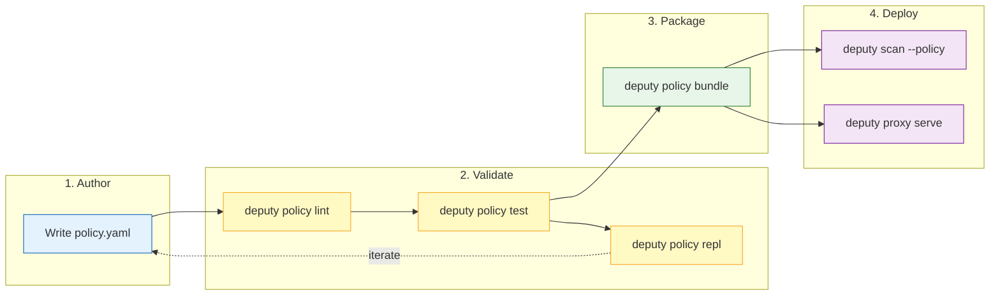

# `deputy policy`

Develop, test, and manage CEL-based security policies.

## Synopsis

```
deputy policy <subcommand> [flags]
```

## Overview

Deputy uses the Common Expression Language (CEL) for security policies covering:

- **Vulnerability management** — block critical/high severity
- **License compliance** — deny AGPL, require Apache-2.0
- **Dependency constraints** — allowlist specific packages

The `policy` command provides a complete development workflow: lint your policies, test them against fixtures, bundle them for deployment, and even explore CEL interactively.

## Subcommands

| Subcommand | Description |
| --- | --- |
| [`eval`](#eval) | Evaluate a policy against JSON input |
| [`lint`](#lint) | Check policy syntax and types |
| [`test`](#test) | Run unit tests from fixtures |
| [`bundle`](#bundle) | Package policies into a single file |
| [`inspect`](#inspect) | Show bundle metadata |
| [`simulate`](#simulate) | Run policies against recorded inputs |
| [`repl`](#repl) | Interactive CEL playground |
| [`lsp`](#lsp) | Language Server Protocol for editors |

---

## `eval`

Evaluate a CEL policy against a JSON payload.

```
deputy policy eval --policy policy.yaml --input context.json
```

### Flags

| Flag | Default | Description |
| --- | --- | --- |
| `--policy` | *required* | Path to CEL policy (use `-` for stdin) |
| `--input` | *required* | Path to JSON input (use `-` for stdin) |
| `--format` | `json` | Output format: `json` or `text` |

### Example

```console
$ deputy policy eval \
    --policy deny-critical.yaml \
    --input scan-output.json \
    --format text
```

---

## `lint`

Validate CEL policy syntax and type safety.

```
deputy policy lint <policy.yaml> [policy2.yaml ...]
```

### Flags

| Flag | Default | Description |
| --- | --- | --- |
| `--var` | | Additional variable names to declare (repeatable) |

### Example

```console
$ deputy policy lint policies/*.yaml
policies/deny-critical.yaml OK
policies/require-license.yaml OK
```

The linter provides helpful diagnostics with caret pointers:

```
policy.yaml: CEL: undeclared reference to 'vuln' (did you mean 'vulnerability'?)
vulnerability.Severity == "CRITICAL"
^
```

---

## `test`

Execute policy unit tests from JSON fixtures.

```
deputy policy test <case.policytest.json|dir> [more...]
```

Test files use the `.policytest.json` extension:

```json
{
  "name": "blocks critical vulnerabilities",
  "policy": "deny-critical.yaml",
  "input": "fixtures/critical-vuln.json",
  "want": [
    { "action": "deny", "reason": "Critical vulnerability CVE-2024-1234" }
  ]
}
```

### Example

```console
$ deputy policy test tests/
✓ blocks critical vulnerabilities
✓ allows low severity
✓ denies AGPL license

3 policy test(s) passed
```

---

## `bundle`

Package multiple policies into a single distributable file.

```
deputy policy bundle --out bundle.json <policy.yaml> [policy2.yaml ...]
```

### Flags

| Flag | Default | Description |
| --- | --- | --- |
| `--out` | *required* | Output bundle path (use `-` for stdout) |

### Example

```console
$ deputy policy bundle \
    --out production.json \
    policies/security.yaml \
    policies/compliance.yaml
```

---

## `inspect`

Display metadata for a policy bundle.

```
deputy policy inspect <bundle.json>
```

### Example

```console
$ deputy policy inspect production.json
Bundle: production.json
  Schema: 1.0
  Generated: 2025-01-15T10:30:00Z
  Policies:
    - deny-critical-vulnerabilities
    - require-approved-licenses
```

---

## `simulate`

Test policies against recorded proxy requests or scan outputs.

```
deputy policy simulate --policy policy.yaml --input requests.json
```

### Flags

| Flag | Default | Description |
| --- | --- | --- |
| `--policy` | | Policy file or bundle (repeatable) |
| `--input` | | JSON payload file or `-` for stdin (repeatable) |
| `--format` | `text` | Output format: `text` or `json` |

### Example

```console
$ deputy policy simulate \
    --policy security.yaml \
    --input recorded-requests.json \
    --format text

Input 0:
  DENY from security.yaml — Critical vulnerability detected
Input 1:
  ALLOW from security.yaml
```

---

## `repl`

Interactive Read-Eval-Print Loop for CEL exploration.

```
deputy policy repl
```

### REPL Commands

| Command | Description |
| --- | --- |
| `:set key=value` | Set a request field |
| `:unset key` | Remove a request field |
| `:clear` | Remove all request fields |
| `:show` | Display current request object |
| `:example` | Load example package metadata |
| `:exit` / `:quit` | Exit the REPL |

### Example Session

```
$ deputy policy repl
CEL Policy Expression REPL
Type :help for commands or enter CEL expressions to evaluate against the 'request' map.
Example: request.package == "github.com/acme/payment"

> :set ecosystem=npm
> :set package=lodash
> :set version=4.17.21
> request.ecosystem == "npm"
Result: true
> request.package.startsWith("lodash")
Result: true
> :exit
Goodbye!
```

### Debugging Expressions

The REPL is invaluable for testing and debugging CEL expressions before deploying them in policies.

**Testing license checks:**

```
> :set name=lodash
> :set version=4.17.21
> pkg.licenses
Result: []
> pkg.licenses.size()
Result: 0
> :set licenses=["MIT"]
> pkg.licenses.exists(l, l == "MIT")
Result: true
```

Note: The `pkg` helper provides sensible defaults (`name`, `version`, `ecosystem` default to `""`, `licenses` defaults to `[]`), so you don't need `?.orValue()` for these fields.

**Testing string patterns:**

```
> :set name=react-dom
> pkg.name.matches("^react(-.*)?$")
Result: true
> :set name=preact
> pkg.name.matches("^react(-.*)?$")
Result: false
```

**Testing list operations:**

```
> :example
Loaded example: lodash@4.17.21 (npm) with vulnerability CVE-2021-23337
> vulnerabilities.exists(v, v.severity == "HIGH")
Result: true
> vulnerabilities.filter(v, v.severity in ["HIGH", "CRITICAL"])
Result: [{id: "CVE-2021-23337", severity: "HIGH", ...}]
> size(vulnerabilities.filter(v, v.severity == "CRITICAL"))
Result: 0
```

**Testing variable compositions:**

```
> :set ecosystem=go
> :set name=github.com/acme/internal
> cel.bind(isInternal, pkg.name.contains("/internal"), isInternal && pkg.ecosystem == "go")
Result: true
```

**Testing levenshtein for typosquat detection:**

```
> :set name=lodahs
> levenshtein(pkg.name, "lodash")
Result: 2
> levenshteinWithin(pkg.name, "lodash", 2)
Result: true
> :set name=loadash
> levenshteinWithin(pkg.name, "lodash", 2)
Result: true
```

---

## `lsp`

Start the Language Server Protocol server for editor integration.

```
deputy policy lsp [flags]
```

### Flags

| Flag | Default | Description |
| --- | --- | --- |
| `--tcp` | | Listen on TCP address instead of stdio (e.g., `127.0.0.1:4389`) |
| `--log-level` | `info` | Log level: `debug`, `info`, `warn`, `error` |

### Editor Setup

**VS Code:** See the [policy LSP setup](../policy-lsp.md)

**Neovim (nvim-lspconfig):**

```lua
require('lspconfig.configs').deputy = {
  default_config = {
    cmd = { 'deputy', 'policy', 'lsp' },
    filetypes = { 'yaml' },
    root_dir = function(fname)
      return vim.fn.getcwd()
    end,
  },
}
require('lspconfig').deputy.setup({})
```

---

## Development Workflow



```
1. Write policy        →  policy.yaml
2. Lint                →  deputy policy lint policy.yaml
3. Test                →  deputy policy test tests/
4. Try interactively   →  deputy policy repl
5. Bundle              →  deputy policy bundle --out bundle.json policy.yaml
6. Deploy              →  deputy proxy serve --policy bundle.json
```

## Exit Codes

| Code | Meaning |
| --- | --- |
| `0` | Success |
| `1` | Lint/eval/test failure or error |

## See Also

- [Policy spec](../reference/policy-spec.md)
- [Policy concepts](../concepts/policies.md)
- [Policy LSP setup](../policy-lsp.md)
- [Proxy command reference](proxy.md)

## Code Pointers

- CLI: [`internal/cli/cmd/policy.go`](../../internal/cli/cmd/policy.go)
- REPL: [`internal/cli/cmd/policy_repl.go`](../../internal/cli/cmd/policy_repl.go)
- LSP: [`internal/cli/cmd/policy_lsp.go`](../../internal/cli/cmd/policy_lsp.go)
- Policy engine: [`internal/policy`](../../internal/policy)
