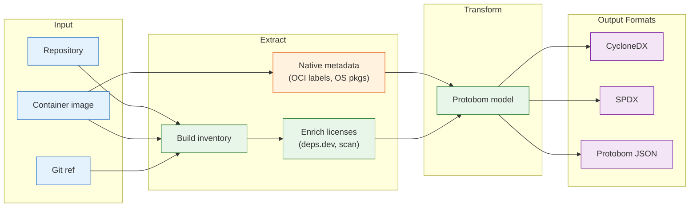

# `deputy sbom`

Generate a Software Bill of Materials (SBOM) for a repository or container image.

## Synopsis

```
deputy sbom [target] [flags]
```

## How SBOM Generation Works



## When to Use

- Compliance and audit ("what did we ship?")
- Security baselining (scan the SBOM later)
- Downstream tooling (attestations, signing, diffing)
- Supply chain transparency
- Container image inventory (scan or distribute SBOMs for images)

## Flags

| Flag | Short | Default | Description |
| --- | --- | --- | --- |
| `--ref` | | `HEAD` | Git reference (commit, tag, branch) |
| `--source` | | `auto` | Target source override: `auto`, `git`, `dir`, `image`, `remote`, `docker-daemon`, `tarball` |
| `--platform` | | | Container image platform (os/arch[/variant]) |
| `--format` | `-f` | `cyclonedx-json` | Output format (see below) |
| `--output` | `-o` | stdout | Output file path (or `-` for stdout) |
| `--ecosystems` | | auto | Limit to specific ecosystems |
| `--name` | | | Custom document name (default: repo@ref) |
| `--enrich-licenses` | | `false` | Add license metadata to components (OCI labels extracted automatically) |
| `--license-source` | | `depsdev` | License enrichment source: `depsdev`, `scan`, `both` |
| `--show-context` | | `false` | Print context header to stderr |
| `--policy` | | | CEL policy files (repeatable) |

## Output Formats

| Format | Flag Value | Description |
| --- | --- | --- |
| CycloneDX JSON | `cyclonedx-json` | OWASP standard, widely supported |
| SPDX JSON | `spdx-json` | Linux Foundation standard, government preferred |
| Protobom JSON | `protobom-json` | Intermediate format for processing |

## Examples

### Basic Generation

```console
# Generate CycloneDX SBOM (default)
$ deputy sbom

# Save to file
$ deputy sbom --output sbom.cdx.json

# SPDX format
$ deputy sbom --format spdx-json --output sbom.spdx.json
```

### Reference-Specific SBOMs

```console
# SBOM for a specific tag
$ deputy sbom --ref v1.2.3

# SBOM for a specific commit
$ deputy sbom --ref abc123d

# SBOM for a branch
$ deputy sbom --ref main
```

### Remote Repositories

```console
# GitHub shorthand
$ deputy sbom github.com/hashicorp/vault --ref v1.16.0

# Full URL
$ deputy sbom https://github.com/hashicorp/vault.git --ref main
```

### Container Images

```console
# Remote registry image
$ deputy sbom docker://ghcr.io/acme/app:1.2.3

# Local Docker daemon image
$ deputy sbom --source docker-daemon ubuntu:latest

# OCI tarball
$ deputy sbom --source tarball ./image.tar

# Specific platform (multi-arch image)
$ deputy sbom --platform linux/amd64 docker://ghcr.io/acme/app:1.2.3
```

Note: `--ref` applies only to Git targets. For images, specify tags/digests in the image reference.
Tarball input expects a Docker "save" archive (not an OCI image layout directory).

### License Enrichment

Deputy extracts licenses from native metadata automatically (OCI labels, OS package
metadata). Use `--enrich-licenses` to add external lookups for component licenses:

```console
# Enrich via deps.dev (default, fast)
$ deputy sbom --enrich-licenses --output sbom.cdx.json

# Local scanning (better for vendored code)
$ deputy sbom --enrich-licenses --license-source scan

# Maximum coverage (both sources)
$ deputy sbom --enrich-licenses --license-source both
```

#### Repository targets

For repositories, license enrichment adds license metadata to each component:

```console
# Repository with deps.dev enrichment
$ deputy sbom --enrich-licenses

# Include local LICENSE files in root component
$ deputy sbom --enrich-licenses --license-source scan
```

#### Container image targets

For container images, Deputy automatically extracts the OCI `org.opencontainers.image.licenses`
label (no flag needed). Use `--enrich-licenses` for component-level licenses:

```console
# OCI label extracted automatically
$ deputy sbom docker://ghcr.io/myorg/myapp:latest

# Add deps.dev enrichment for components inside the image
$ deputy sbom docker://ghcr.io/myorg/myapp:latest --enrich-licenses

# View the root component's license (from OCI label)
$ deputy sbom docker://myimage:latest --format cyclonedx-json | jq '.metadata.component.licenses'
```

To add license metadata to your images, include the OCI annotation:

```dockerfile
LABEL org.opencontainers.image.licenses="Apache-2.0"
# SPDX expressions are supported
LABEL org.opencontainers.image.licenses="MIT OR Apache-2.0"
```

See [License enrichment concepts](../concepts/inventory-and-sboms.md#license-enrichment)
for details on automatic vs enriched license sources.

### Dockerfile Base Images

When generating SBOMs for repositories, Deputy automatically discovers Dockerfiles and includes
base images as components:

```console
# SBOM includes base images from Dockerfiles
$ deputy sbom --format cyclonedx-json | jq '.components[] | select(.properties[]?.value == "container-base-image")'
```

Base images are represented with `pkg:docker` or `pkg:oci` PURLs:

```json
{
  "type": "library",
  "name": "library/golang",
  "version": "1.22",
  "purl": "pkg:docker/library/golang@1.22",
  "properties": [
    {"name": "deputy:type", "value": "container-base-image"},
    {"name": "deputy:location", "value": "Dockerfile"},
    {"name": "deputy:dockerfile-stage", "value": "builder"},
    {"name": "deputy:direct", "value": "true"}
  ]
}
```

Detected Dockerfile patterns:
- `Dockerfile`, `Containerfile` (exact)
- `Dockerfile.*`, `Containerfile.*` (variants like `Dockerfile.prod`)
- `*.dockerfile`, `*.containerfile` (suffixes)

Multi-stage builds include all base images (except `scratch`), with stage names preserved
when available.

### Pipelines

```console
# Generate SBOM, then scan it
$ deputy sbom --format protobom-json | deputy scan sbom -

# Generate with licenses, then apply license policy during scan
$ deputy sbom --enrich-licenses -o sbom.cdx.json
$ deputy scan sbom sbom.cdx.json --policy policy/license-allowlist.yaml

# Extract component PURLs
$ deputy sbom --format cyclonedx-json | jq -r '.components[].purl'

# Count components
$ deputy sbom --format cyclonedx-json | jq '.components | length'

# List only container base images
$ deputy sbom --format cyclonedx-json | jq -r '.components[] | select(.purl | startswith("pkg:docker") or startswith("pkg:oci")) | .purl'
```

License data embedded in SBOM components is preserved when scanning with `deputy scan sbom`,
making `pkg.licenses` available in policy expressions. See [License data sources](../reference/policy-inputs.md#license-data-sources).

### With Policies

```console
# Validate SBOM against policies
$ deputy sbom --policy policy/sbom-metadata-quality.yaml --output sbom.cdx.json
```

## Output Structure

### CycloneDX JSON

```json
{
  "bomFormat": "CycloneDX",
  "specVersion": "1.5",
  "version": 1,
  "metadata": {
    "timestamp": "2025-01-15T10:30:00Z",
    "component": {
      "name": "repo@ref",
      "type": "application"
    }
  },
  "components": [
    {
      "type": "library",
      "name": "github.com/example/pkg",
      "version": "v1.2.3",
      "purl": "pkg:golang/github.com/example/pkg@v1.2.3",
      "licenses": [...]
    }
  ]
}
```

### With `--show-context`

```
repo: /path/to/repo
ref: HEAD
commit: abc123d...
---
{ "bomFormat": "CycloneDX", ... }
```

## Exit Codes

| Code | Meaning |
| --- | --- |
| `0` | Success |
| `1` | Errors or policy violations |

## See Also

- [Inventory concepts](../concepts/inventory-and-sboms.md)
- [Pipeline example](../examples/pipeline.md)

## Code Pointers

- CLI: [`internal/cli/cmd/sbom.go`](../../internal/cli/cmd/sbom.go)
- SBOM pipeline: [`internal/sbom`](../../internal/sbom)
