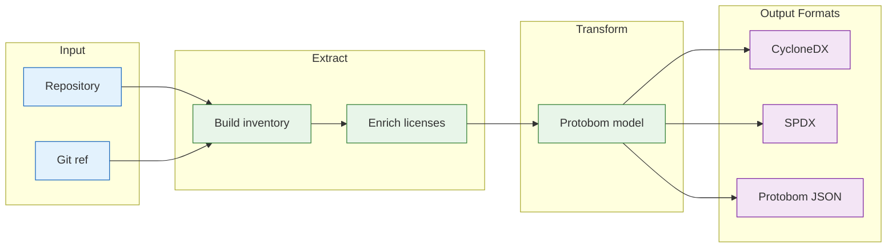

# `deputy sbom`

Generate a Software Bill of Materials (SBOM) for a repository.

## Synopsis

```
deputy sbom [repo] [flags]
```

## How SBOM Generation Works



## When to Use

- Compliance and audit ("what did we ship?")
- Security baselining (scan the SBOM later)
- Downstream tooling (attestations, signing, diffing)
- Supply chain transparency

## Flags

| Flag | Short | Default | Description |
| --- | --- | --- | --- |
| `--ref` | | `HEAD` | Git reference (commit, tag, branch) |
| `--format` | `-f` | `cyclonedx-json` | Output format (see below) |
| `--output` | `-o` | stdout | Output file path (or `-` for stdout) |
| `--ecosystems` | | auto | Limit to specific ecosystems |
| `--name` | | | Custom document name (default: repo@ref) |
| `--enrich-licenses` | | `false` | Add license metadata to components |
| `--license-source` | | `depsdev` | License source: `depsdev`, `scan`, `both` |
| `--show-context` | | `false` | Print context header to stderr |
| `--policy` | | | CEL policy files (repeatable) |

## Output Formats

| Format | Flag Value | Description |
| --- | --- | --- |
| CycloneDX JSON | `cyclonedx-json` | OWASP standard, widely supported |
| SPDX JSON | `spdx-json` | Linux Foundation standard, government preferred |
| Protobom JSON | `protobom-json` | Intermediate format for processing |

## Examples

### Basic Generation

```console
# Generate CycloneDX SBOM (default)
$ deputy sbom

# Save to file
$ deputy sbom --output sbom.cdx.json

# SPDX format
$ deputy sbom --format spdx-json --output sbom.spdx.json
```

### Reference-Specific SBOMs

```console
# SBOM for a specific tag
$ deputy sbom --ref v1.2.3

# SBOM for a specific commit
$ deputy sbom --ref abc123d

# SBOM for a branch
$ deputy sbom --ref main
```

### Remote Repositories

```console
# GitHub shorthand
$ deputy sbom github.com/hashicorp/vault --ref v1.16.0

# Full URL
$ deputy sbom https://github.com/hashicorp/vault.git --ref main
```

### License Enrichment

```console
# Add licenses from deps.dev (fast)
$ deputy sbom --enrich-licenses --output sbom.cdx.json

# Use local scanning (more accurate for vendored code)
$ deputy sbom --enrich-licenses --license-source scan

# Maximum coverage
$ deputy sbom --enrich-licenses --license-source both
```

### Pipelines

```console
# Generate SBOM, then scan it
$ deputy sbom --format protobom-json | deputy scan sbom -

# Extract component PURLs
$ deputy sbom --format cyclonedx-json | jq -r '.components[].purl'

# Count components
$ deputy sbom --format cyclonedx-json | jq '.components | length'
```

### With Policies

```console
# Validate SBOM against policies
$ deputy sbom --policy policy/sbom-metadata-quality.yaml --output sbom.cdx.json
```

## Output Structure

### CycloneDX JSON

```json
{
  "bomFormat": "CycloneDX",
  "specVersion": "1.5",
  "version": 1,
  "metadata": {
    "timestamp": "2025-01-15T10:30:00Z",
    "component": {
      "name": "repo@ref",
      "type": "application"
    }
  },
  "components": [
    {
      "type": "library",
      "name": "github.com/example/pkg",
      "version": "v1.2.3",
      "purl": "pkg:golang/github.com/example/pkg@v1.2.3",
      "licenses": [...]
    }
  ]
}
```

### With `--show-context`

```
repo: /path/to/repo
ref: HEAD
commit: abc123d...
---
{ "bomFormat": "CycloneDX", ... }
```

## Exit Codes

| Code | Meaning |
| --- | --- |
| `0` | Success |
| `1` | Errors or policy violations |

## See Also

- [Inventory concepts](../concepts/inventory-and-sboms.md)
- [Pipeline example](../examples/pipeline.md)

## Code Pointers

- CLI: [`internal/cli/cmd/sbom.go`](../../internal/cli/cmd/sbom.go)
- SBOM pipeline: [`internal/sbom`](../../internal/sbom)
