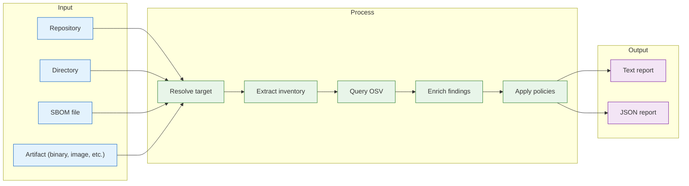

# `deputy scan`

Scan repositories, directories, container images, PURLs, or SBOM files for known vulnerabilities using OSV.

## Synopsis

```
deputy scan [target] [flags]
deputy scan dir <directory> [flags]
deputy scan sbom <sbom-file> [flags]
deputy scan purl <purl> [flags]
deputy scan image <image-ref> [flags]
```

## How Scan Works



Target resolution is extensible via `internal/targets`, so new artifact types
can plug into the same scan flow as providers are added.

## When to Use

- Before releases to catch vulnerable dependencies early
- In CI to gate merges or produce vulnerability artifacts
- As a forensic tool with `--as-of` / published-date filters
- To scan existing SBOMs from other tools

## Flags

| Flag | Short | Default | Description |
| --- | --- | --- | --- |
| `--ref` | `-r` | `HEAD` | Git reference to scan (branch, tag, commit, or `WORKING`) |
| `--format` | `-f` | `text` | Output format: `text`, `json`, `sarif` |
| `--output` | `-o` | stdout | Output file path |
| `--ignore-unfixed` | | `false` | Hide vulnerabilities without a known fix |
| `--ignore-file` | | | Path to ignore rules file (`.deputyignore.yaml`) |
| `--published-before` | | | Only show vulns published before this date |
| `--published-after` | | | Only show vulns published on/after this date |
| `--as-of` | | | Historical view up to this date (implies `--published-before`) |
| `--policy` | | | CEL policy file(s) to evaluate (repeatable) |
| `--ecosystems` | `-e` | all | Limit to specific ecosystems (see [supported ecosystems](#supported-ecosystems)) |
| `--exclude-path` | | | Directory glob to skip during the walk (repeatable; e.g. `.bin/**`). Unioned with `scan.exclude_paths` from config. A slash-less name matches at any depth; a slashed path is anchored to the scan root |
| `--enrich` | | `false` | Enrich with EPSS scores and KEV status (requires network) |
| `--with-graph` | | `false` | Build dependency graph to show paths to vulnerable packages |
| `--secrets` | | `false` | Scan for leaked secrets and credentials alongside vulnerabilities |
| `--filter` | | | CEL expression to filter vulnerabilities (e.g., `'vulnerability.advisory.severity.level == severity.critical'`) |
| `--show-symbols` | | `false` | Show affected symbols in text output |
| `--show-db-info` | | `false` | Show database metadata (e.g., review_status) |
| `--show-unfixable-guidance` | | `false` | Show actionable guidance for unfixable vulnerabilities |
| `--source` | | auto | Target source override: `auto`, `git`, `dir`, `sbom`, `purl`, `dockerfile`, `remote`, `docker-daemon`, `tarball`, `vm`, `rootfs` |
| `--platform` | | | Platform for remote images (`os/arch[/variant]`) |
| `--detect-base-image` | | `false` | Detect base image layers in container scans (requires network, queries deps.dev) |
| `--no-verify-fixes` | | `false` | Skip Go module proxy verification of fixed versions (offline; trusts advisory data verbatim) |

### Date Format

Date flags accept: `YYYY`, `YYYY-MM`, `YYYY-MM-DD`, or RFC3339.

## Examples

### Basic Scanning

```console
# Scan current repo at HEAD (or current directory if not a repo)
$ deputy scan

# Scan at a specific ref
$ deputy scan --ref v1.2.3

# Include uncommitted changes
$ deputy scan --ref WORKING

# Scan a remote repository
$ deputy scan github.com/hashicorp/vault --ref v1.16.0
```

### Target Resolution Order

When you run `deputy scan [target]` without a subcommand, Deputy resolves the
input in this order:

1. PURLs (`pkg:` prefix)
2. Explicit image schemes (`docker://`, `oci://`, `docker-daemon://`, `tarball://`)
3. VM/rootfs schemes (`vm://`, `rootfs://`) or VM file extensions (`.qcow2`, `.vmdk`, `.vhd`, `.vhdx`, `.vdi`, `.ext4`)
4. SBOM stdin (`-`)
5. Existing paths (Git repo → repo scan, directory → dir scan, file → SBOM scan)
6. Container image references (including Docker Hub short names)
7. Remote Git repositories (`github.com/owner/repo`, `https://...`)

If the target is not Git-related, `--ref` is ignored with a warning.

### Ambiguity Rules

- Two-segment Docker Hub short names without a tag or digest (for example
  `owner/repo`) are considered ambiguous.
- Use `docker://owner/repo:tag` (or `docker.io/owner/repo:tag`) for images.
- Use `github.com/owner/repo` for GitHub repositories.
- Use `--source remote` to force image resolution when needed.

### Output Formats

```console
# Machine-readable JSON for CI
$ deputy scan --format json --output scan.json

# Pipe to jq for processing
$ deputy scan --format json | jq '.vulnerabilities[] | {id: .id, severity: .severity}'
```

### Filtering

```console
# Hide unfixable vulnerabilities
$ deputy scan --ignore-unfixed

# Only Go and npm ecosystems
$ deputy scan --ecosystems go,npm

# Scan Java and Rust projects
$ deputy scan --ecosystems maven,cargo
```

#### CEL-Based Filtering

The `--filter` flag accepts CEL (Common Expression Language) expressions for flexible filtering.
This is the recommended approach instead of accumulating severity-specific flags.

```console
# Filter to critical severity only
$ deputy scan --filter 'vulnerability.advisory.severity.level == severity.critical'

# Filter to high and critical severity
$ deputy scan --filter 'vulnerability.advisory.severity.level in [severity.critical, severity.high]'

# Filter to direct dependencies only
$ deputy scan --filter 'vulnerability.package.direct == true'

# Filter to vulnerabilities with fixes available
$ deputy scan --filter 'size(vulnerability.advisory.fixed_versions) > 0'

# Combine conditions: critical/high severity with fixes, in direct deps
$ deputy scan --filter 'vulnerability.advisory.severity.level in [severity.critical, severity.high] && vulnerability.package.direct && size(vulnerability.advisory.fixed_versions) > 0'
```

**Available variables in filter expressions:**

| Variable | Type | Description |
|----------|------|-------------|
| `vulnerability.advisory_id` | `string` | Advisory ID (CVE, GHSA, etc.) |
| `vulnerability.advisory.severity.level` | `enum` | Severity level (use `severity.critical`, etc.) |
| `vulnerability.advisory.fixed_versions` | `list(string)` | Versions with fixes |
| `vulnerability.package.name` | `string` | Package name |
| `vulnerability.package.version` | `string` | Package version |
| `vulnerability.package.ecosystem` | `string` | Package ecosystem |
| `vulnerability.package.direct` | `bool` | Whether it's a direct dependency |
| `vulnerability.package.purl` | `string` | Package URL (PURL) |
| `vulnerability.package.locations` | `list(string)` | File paths where the package was discovered |

`package.locations` enables path-aware filtering without removing a path from the
scan entirely. For example, keep a finding only when it is not *exclusively* under
a vendored tool directory:

```bash
$ deputy scan --filter "!vulnerability.package.locations.all(p, p.startsWith('.bin/'))"
```

To drop such paths from the scan altogether (so they never appear), use
`--exclude-path` / `scan.exclude_paths` instead.

**Severity constants:**
- `severity.critical`
- `severity.high`
- `severity.medium`
- `severity.low`
- `severity.unspecified`

See [AGENTS.md](../../AGENTS.md) for the full list of CEL variables and helper functions available in policy expressions.

### Enrichment and Guidance

```console
# Add EPSS scores and KEV (Known Exploited Vulnerabilities) status
$ deputy scan --enrich

# Show guidance for vulnerabilities that can't be fixed
$ deputy scan --show-unfixable-guidance

# Combine for comprehensive triage information
$ deputy scan --enrich --show-unfixable-guidance

# Show affected symbols (Go import paths, functions)
$ deputy scan --show-symbols
```

The `--enrich` flag queries external APIs to add:
- **EPSS scores**: Probability of exploitation in the next 30 days (0.0-1.0)
- **KEV status**: Whether the CVE is in CISA's Known Exploited Vulnerabilities catalog

The `--show-unfixable-guidance` flag provides actionable recommendations for vulnerabilities without fixes, including:
- Risk assessment factors
- Mitigation recommendations
- Alternative package suggestions (when applicable)

## Supported Ecosystems

Deputy supports 15 ecosystems for scanning:

| Ecosystem | Flag Value | Lockfiles / Manifests |
|-----------|------------|----------------------|
| Go | `go` | go.mod, go.sum, Go binaries |
| npm | `npm` | package-lock.json, yarn.lock, pnpm-lock.yaml, bun.lock |
| PyPI | `pypi` | requirements.txt, Pipfile.lock, poetry.lock, uv.lock, pdm.lock, setup.py, Conda environments |
| RubyGems | `rubygems` | Gemfile.lock, gems.locked, *.gemspec |
| Maven | `maven` | pom.xml, gradle.lockfile, JAR/WAR/EAR archives |
| Cargo | `cargo` | Cargo.lock, Cargo.toml, Rust binaries |
| NuGet | `nuget` | packages.lock.json, packages.config, *.deps.json |
| Hex | `hex` | mix.lock |
| Pub | `pub` | pubspec.lock |
| CocoaPods | `cocoapods` | Podfile.lock, Package.resolved |
| Packagist | `packagist` | composer.lock |
| GitHub Actions | `github-actions` | .github/workflows/*.yml |
| Haskell | `haskell` | cabal.project.freeze, stack.yaml.lock |
| R | `r` | renv.lock |
| C++ | `cpp` | conan.lock |

Detection is powered by [OSV-SCALIBR](https://github.com/google/osv-scalibr) with custom extensions for GitHub Actions.
Binary analysis extracts dependencies from compiled Go and Rust executables

### Historical Analysis

```console
# What was known at end of 2024?
$ deputy scan --as-of 2024-12-31

# Vulns published in a specific window
$ deputy scan --published-after 2025-01 --published-before 2025-03

# Combine with ignore-unfixed for actionable results
$ deputy scan --as-of 2024-12-31 --ignore-unfixed
```

### Scanning Directories and SBOMs

```console
# Scan a directory (no Git context)
$ deputy scan dir ./vendor

# Scan an SBOM file
$ deputy scan sbom sbom.spdx.json

# Scan SBOM from stdin
$ deputy sbom --format protobom-json | deputy scan sbom -

# Scan SBOMs that include container image PURLs (docker/oci)
$ deputy scan sbom sbom-with-images.cdx.json

# Include a platform qualifier in SBOM image PURLs:
# pkg:docker/library/alpine@3.19?platform=linux/amd64

# Apply license policies to SBOM components
$ deputy scan sbom sbom.cdx.json --policy policy/license-allowlist.yaml
```

When scanning SBOMs, license data embedded in components (CycloneDX `licenses`,
SPDX `licenseConcluded`, Protobom `licenses`) is extracted and available via
`pkg.licenses` in policy expressions. This enables license compliance policies
on pre-generated SBOMs.

### Container Images

```console
# Scan a remote image (registry)
$ deputy scan ghcr.io/owner/app:1.2.3
$ deputy scan image docker://ghcr.io/owner/app:1.2.3
$ deputy scan image oci://ghcr.io/owner/app@sha256:...

# Scan a local Docker daemon image
$ deputy scan image docker-daemon://app:latest

# Scan an image tarball (Docker save format)
$ deputy scan image tarball:///tmp/image.tar

# Scan an OCI image layout directory
$ deputy scan image oci-layout:///tmp/image-layout

# Resolve source without explicit scheme
$ deputy scan image ghcr.io/owner/app:1.2.3
$ deputy scan image --source docker-daemon app:latest
$ deputy scan image --source tarball ./image.tar

# Docker Hub short names (implicit registry)
$ deputy scan alpine
$ deputy scan alpine:3.18
$ deputy scan library/ubuntu:latest
```

Image-specific flags:

- `--source` = `remote` | `docker-daemon` | `tarball`
- `--platform` = `os/arch[/variant]` (remote images only)
- `--detect-base-image` = Enable base image layer detection (see below)

Short names are normalized using Docker reference rules. Use explicit tags or
digests if you want to avoid defaulting to `latest` or the Docker Hub namespace.

#### Base Image Detection

Use `--detect-base-image` to identify which vulnerabilities come from your base image (FROM instruction) versus packages you installed in your Dockerfile:

```console
# Enable base image detection for layer-aware policies
$ deputy scan --detect-base-image ghcr.io/owner/app:v1.2.3

# Combine with policies that treat base image vulns differently
$ deputy scan --detect-base-image \
    --policy policy/examples/container-layer-vulnerability.yaml \
    nginx:1.25
```

When enabled, Deputy queries deps.dev to determine which layers belong to known base images. Each vulnerability then includes `layer_details.in_base_image` (true/false) for use in policies.

**Example policy using base image detection:**

```yaml
policies:
  # Warn on base image vulns (update your FROM), deny on app layer vulns
  - name: layer-aware-vulns
    entrypoints: ["scan_vulnerability"]
    rules:
      - action: warn
        when: |
          has(vulnerability.package.layer_details) &&
          vulnerability.package.layer_details.in_base_image == true &&
          vulnerability.advisory.severity.level == severity.critical
        reason: "Critical vulnerability inherited from base image"
        remediation: "Update your base image to a patched version"

      - action: deny
        when: |
          has(vulnerability.package.layer_details) &&
          vulnerability.package.layer_details.in_base_image == false &&
          vulnerability.advisory.severity.level == severity.critical
        reason: "Critical vulnerability in application layer"
        remediation: "Update the package in your Dockerfile"
```

See [Container Layer Vulnerability Policies](../../policy/examples/container-layer-vulnerability.yaml) for more examples.

#### Registry Authentication

Deputy uses the Docker credential keychain for registry authentication. This supports:

- **Docker config file**: `~/.docker/config.json` credentials
- **Credential helpers**: `gcloud`, `ecr-login`, `docker-credential-pass`, etc.
- **Environment variables**: `DOCKER_CONFIG` to specify config location

**Common registry setups:**

```bash
# Docker Hub (credentials stored after `docker login`)
$ deputy scan library/nginx:latest

# GitHub Container Registry
$ echo $GITHUB_TOKEN | docker login ghcr.io -u USERNAME --password-stdin
$ deputy scan ghcr.io/owner/app:v1.0.0

# AWS ECR (requires aws-cli and ecr-login helper)
$ aws ecr get-login-password | docker login --username AWS --password-stdin 123456789.dkr.ecr.us-east-1.amazonaws.com
$ deputy scan 123456789.dkr.ecr.us-east-1.amazonaws.com/app:latest

# Google Artifact Registry (requires gcloud)
$ gcloud auth configure-docker us-docker.pkg.dev
$ deputy scan us-docker.pkg.dev/project/repo/image:tag

# Azure Container Registry
$ az acr login --name myregistry
$ deputy scan myregistry.azurecr.io/app:latest
```

**Troubleshooting authentication:**

- Verify credentials work: `docker pull <image>` should succeed
- Check `~/.docker/config.json` for the registry entry
- For CI, use service account credentials or workload identity
- Set `DEPUTY_LOG_LEVEL=debug` for detailed auth logging

### PURLs

```console
# Scan a single package via PURL
$ deputy scan pkg:npm/lodash@4.17.21
$ deputy scan purl pkg:npm/lodash@4.17.21
$ deputy scan purl pkg:golang/github.com/gin-gonic/gin@v1.9.0
```

### Dockerfiles

```console
# Scan a Dockerfile for policy violations
$ deputy scan Dockerfile
$ deputy scan Dockerfile.prod
$ deputy scan --source dockerfile /path/to/containerfile

# With security policies
$ deputy scan Dockerfile --policy policy/examples/dockerfile-security.yaml

# JSON output
$ deputy scan Dockerfile --format json
```

Dockerfile scanning performs static analysis without pulling images. It checks:

- Base image configuration (registries, tags, digests)
- User privileges (root vs non-root)
- Sensitive environment variables
- Build best practices (HEALTHCHECK, WORKDIR, etc.)
- Multi-stage build patterns

Detected filename patterns:
- `Dockerfile`, `Containerfile` (exact)
- `Dockerfile.*`, `Containerfile.*` (variants)
- `*.dockerfile`, `*.containerfile` (suffixes)

See [Dockerfile scanning guide](../guides/dockerfile.md) for policy examples and variables.

### VM and Rootfs Images

```console
# Scan a QCOW2 disk image
$ deputy scan vm:///path/to/disk.qcow2

# Scan a VMDK image
$ deputy scan vm:///path/to/disk.vmdk

# Scan a raw rootfs (ext4)
$ deputy scan rootfs:///path/to/rootfs.ext4

# Auto-detect by extension
$ deputy scan /path/to/disk.qcow2

# Force VM source type
$ deputy scan --source vm /path/to/disk.img
```

VM image scanning extracts packages from the filesystem without requiring root privileges or kernel mounts. Supported formats:

| Format | Extensions |
|--------|-----------|
| QCOW2 | `.qcow2`, `.qcow` |
| VMDK | `.vmdk` |
| VHD/VHDX | `.vhd`, `.vhdx` |
| VDI | `.vdi` |
| Raw | `.raw`, `.img`, `.bin` |
| ext4 | `.ext4` (rootfs) |

See [VM Images guide](../guides/vm-images.md) for partition selection and advanced usage.

### Dependency Graph

```console
# Show paths to vulnerable packages (how vulnerabilities reach your code)
$ deputy scan --with-graph

# Combine with JSON for detailed path analysis
$ deputy scan --with-graph --format json | jq '.vulnerabilities[].path'
```

The `--with-graph` flag builds the dependency graph to show:
- How transitive vulnerabilities reach your project
- The dependency chain from root to vulnerable package
- Depth information (0 = direct, 1+ = transitive)

### Secret Scanning

```console
# Scan for both vulnerabilities and secrets
$ deputy scan --secrets

# Secrets-only scanning (use the secrets command)
$ deputy secrets
```

### With Policies

```console
# Enforce severity guardrails
$ deputy scan --policy policy/severity-guardrail.yaml

# Multiple policies
$ deputy scan --policy policy/severity.yaml --policy policy/licenses.yaml
```

## Output

### Text Format

```
Scanned /path/to/repo @ HEAD (abc123d)
  Origin: https://github.com/example/repo.git

∴ Vulnerabilities Found:

github.com/example/pkg v1.2.3 [direct]:
  • CVE-2024-1234 [HIGH] (↑ v1.2.4)
    Description of the vulnerability
    Aliases: GHSA-xxxx-xxxx-xxxx
    Published: 2024-01-15

Vulnerability Summary:
  ! 3 require immediate attention (critical/high severity)
  ↑ 5 can be fixed by upgrading
```

### JSON Format

The JSON output uses proto-first serialization with snake_case field names:

```json
{
  "target": {
    "display_path": "/path/to/repo",
    "commit_hash": "abc123d..."
  },
  "stats": {
    "unique_vulns": 5,
    "critical_severity": 1,
    "high_severity": 2,
    "med_severity": 2,
    "low_severity": 0,
    "fix_available": 4,
    "packages_scanned": 42
  },
  "findings": [...],
  "advisories": {...},
  "generated_at": "2025-01-15T10:30:00Z"
}
```

## Exit Codes

| Code | Meaning |
| --- | --- |
| `0` | Success (no policy violations) |
| `1` | Policy violations or scan errors |

## See Also

- [Historical analysis](../examples/historical-analysis.md)
- [Policy concepts](../concepts/policies.md)
- [Pipeline example](../examples/pipeline.md)

## Code Pointers

- CLI: [`internal/cli/cmd/scan.go`](../../internal/cli/cmd/scan.go)
- Inventory: [`internal/inventory`](../../internal/inventory)
- OSV queries: [`internal/analysis`](../../internal/analysis)
