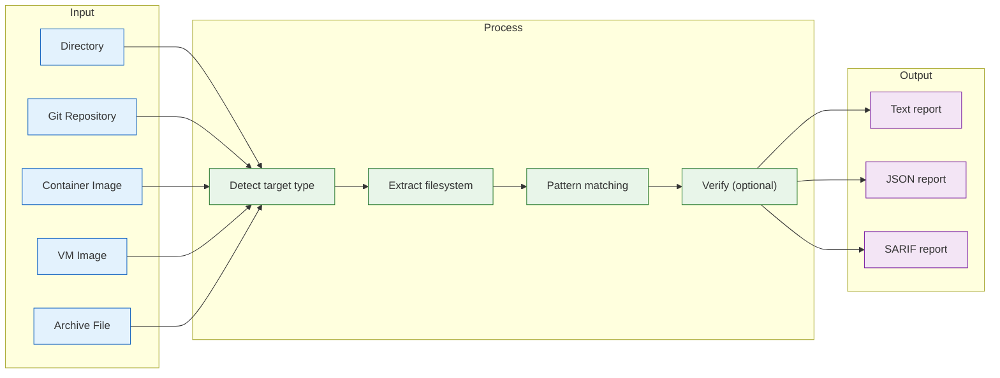

# `deputy secrets`

Scan files, repositories, container images, and VM images for leaked secrets, credentials, API keys, and tokens.

## Synopsis

```
deputy secrets [target] [flags]
deputy secrets [target] --diff <base-ref> <target-ref>
deputy secrets [target] --history [flags]
```

## How Secrets Scanning Works



## When to Use

- Pre-commit and PR checks to prevent secret leaks
- CI/CD pipelines to gate deployments
- Security audits of codebases and git history
- Container image security scanning
- VM image hardening verification
- Incident response to find exposed credentials

## Supported Secret Types

Deputy detects a wide range of credential types:

| Category | Types |
|----------|-------|
| Cloud | GCP API keys, GCP service account keys, AWS access keys |
| Platform tokens | GitHub, GitLab, Slack, Discord, Telegram, npm, PyPI |
| Payment | Stripe, SendGrid |
| Infrastructure | Heroku, Mailgun, Twilio, RubyGems |
| Generic | Private keys, JWTs, high-entropy strings, API key patterns |

## Target Types

### Directories and Repositories

```bash
# Scan current directory
deputy secrets

# Scan a specific directory
deputy secrets /path/to/project
```

### Git History

```bash
# Scan git history for leaked secrets
deputy secrets --history

# Limit commits scanned
deputy secrets --history --max-commits 100

# Time-based filtering
deputy secrets --history --since "1 month ago"
deputy secrets --history --since "2024-01-01" --until "2024-06-01"

# Include removed secrets
deputy secrets --history --include-removed
```

### Git Diff Mode

```bash
# Scan for new secrets between two branches
deputy secrets --diff main feature-branch

# Scan for secrets introduced since last release
deputy secrets --diff v1.0.0 HEAD

# Time-based comparison
deputy secrets --diff "main@{1.week.ago}" main
```

### Container Images

```bash
# Scan container image (auto-detected)
deputy secrets nginx:1.25

# Deep layer scanning
deputy secrets nginx:1.25 --deep

# Explicit transport schemes
deputy secrets docker://nginx:1.25
deputy secrets docker-daemon://myapp:latest
deputy secrets tarball:///path/to/image.tar
```

### VM and Rootfs Images

```bash
# Scan a VM disk image
deputy secrets vm:///path/to/disk.qcow2
deputy secrets /path/to/disk.vmdk
deputy secrets /path/to/disk.vhd

# Scan a rootfs image
deputy secrets rootfs:///path/to/rootfs.ext4

# JSON output for CI/CD
deputy secrets vm:///path/to/disk.qcow2 --format json
```

Supported VM formats: qcow2, qcow, vmdk, vhd, vhdx, vdi, raw, img

### Archive Files

```bash
# Scan archive files
deputy secrets /path/to/backup.tar.gz
deputy secrets /path/to/app.zip
```

Supported formats: zip, jar, war, tar, tar.gz, tgz, tar.bz2, tar.xz

## Options

| Flag | Description |
|------|-------------|
| `--format` | Output format: `text`, `json`, `sarif` (default: text) |
| `--output`, `-o` | Write output to file |
| `--verify` | Verify if detected secrets are still active |
| `--no-redact` | Show actual secret values (use with caution) |
| `--always-exit-zero` | Exit 0 even when secrets are found (report without failing) |
| `--include` | Glob pattern for files to include |
| `--exclude` | Glob pattern for files to exclude |

### History Mode Options

| Flag | Description |
|------|-------------|
| `--history` | Scan git history for leaked secrets |
| `--max-commits` | Maximum commits to scan (default: unlimited) |
| `--since` | Only scan commits after this date |
| `--until` | Only scan commits before this date |
| `--branch` | Branch to scan (default: current) |
| `--include-removed` | Include secrets that were later removed |
| `--path-filter` | Filter to specific file patterns |

### Diff Mode Options

| Flag | Description |
|------|-------------|
| `--diff` | Enable diff mode to compare two refs |

### Container Image Options

| Flag | Description |
|------|-------------|
| `--deep` | Deep scan: extract and scan files within layers |

## Output Formats

### Text (default)

Human-readable output with redacted secrets:

```
Secrets scan results for: /path/to/project

Found 2 secrets in 150 files scanned

CRITICAL: GitHub Personal Access Token
  File: .env
  Line: 5
  Value: ghp_****************************

HIGH: AWS Access Key
  File: config/aws.yaml
  Line: 12
  Value: AKIA****************************
```

### JSON

Machine-readable for CI/CD:

```bash
deputy secrets --format json
```

```json
{
  "target": "/path/to/project",
  "generated": "2024-01-15T10:30:00Z",
  "filesScanned": 150,
  "secretsFound": 2,
  "findings": [
    {
      "type": "github_pat",
      "file": ".env",
      "line": 5,
      "redacted": "ghp_****************************",
      "severity": "critical",
      "confidence": 0.95
    }
  ]
}
```

### SARIF

For GitHub Code Scanning integration:

```bash
deputy secrets --format sarif > secrets.sarif
```

## Verification

The `--verify` flag attempts to verify if detected secrets are still active:

```bash
deputy secrets --verify
```

Verification is supported for:
- GitHub tokens (via GitHub API)
- Slack tokens (via Slack API)
- Stripe keys (via Stripe API)
- AWS credentials (via STS GetCallerIdentity)

## CI/CD Integration

### GitHub Actions

```yaml
# Fail the job as soon as a secret is found.
- name: Scan for secrets
  run: deputy secrets

# Or report first and gate later: --always-exit-zero keeps the upload step reachable.
- name: Scan for secrets (report)
  run: deputy secrets --format sarif --always-exit-zero > secrets.sarif

- name: Upload SARIF
  uses: github/codeql-action/upload-sarif@v3
  with:
    sarif_file: secrets.sarif
```

### PR Secret Check

```yaml
- name: Check for new secrets
  env:
    BASE_SHA: ${{ github.event.pull_request.base.sha }}
    HEAD_SHA: ${{ github.sha }}
  run: deputy secrets --diff "$BASE_SHA" "$HEAD_SHA"
```

The command exits 1 when the diff introduces a secret, so no manual result
parsing is needed.

### VM Image Pipeline

```yaml
- name: Scan VM image for secrets
  run: |
    deputy secrets vm://output/disk.qcow2 \
      --format json \
      --output secrets-results.json
```

## Examples

### Basic Usage

```bash
# Scan current directory
deputy secrets

# Scan with JSON output
deputy secrets --format json

# Include only specific files
deputy secrets --include "*.yaml,*.json,*.env"
```

### Historical Analysis

```bash
# Full history audit
deputy secrets --history --include-removed --format json > audit.json

# Recent changes only
deputy secrets --history --since "1 week ago"
```

### Container Images

```bash
# Quick scan
deputy secrets nginx:1.25

# Deep scan with layer analysis
deputy secrets nginx:1.25 --deep --format json
```

### VM Images

```bash
# Scan VM disk image
deputy secrets vm:///path/to/disk.qcow2

# Scan rootfs image
deputy secrets rootfs:///path/to/rootfs.ext4
```

## Exit Codes

| Code | Meaning |
| --- | --- |
| `0` | No secrets found (or `--always-exit-zero` was passed) |
| `1` | Secrets found, or the scan failed |

Finding a secret is a failure condition, so `deputy secrets` can gate CI
directly:

```yaml
- run: deputy secrets .
```

Every scan mode follows this contract: directory, file, remote Git URL,
`--history`, base/target diff, container image, VM image, and archive.

For report-only runs, `--always-exit-zero` keeps the exit status at 0 so a later step
still executes, which is the usual pattern when uploading SARIF:

```yaml
- run: deputy secrets . --format sarif --always-exit-zero > secrets.sarif
- uses: github/codeql-action/upload-sarif@v3
  with:
    sarif_file: secrets.sarif
```

A scan error always exits 1 regardless of `--always-exit-zero`: an unreadable target
must not look like a clean result.

## See Also

- [Scan](scan.md) - Vulnerability scanning (includes `--secrets` flag)
- [VM Images Guide](../guides/vm-images.md) - Detailed VM scanning guide
- [Container Images Guide](../guides/container-images.md) - Container scanning guide
