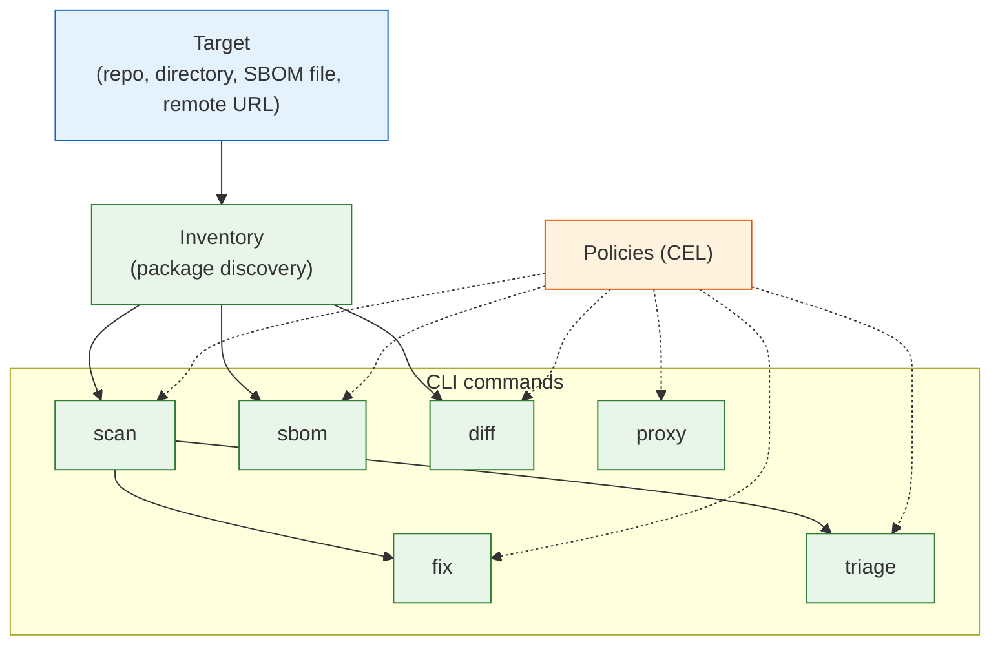

# Concepts

Understanding these core ideas makes Deputy's CLI output and flags feel predictable.

## Core Mental Models

| Concept | What it answers | Doc |
| --- | --- | --- |
| **Targets & Refs** | "What can Deputy analyze? How do I specify versions?" | [Targets and refs](targets-and-refs.md) |
| **Inventory & SBOMs** | "How does Deputy discover packages? What's a PURL?" | [Inventory and SBOMs](inventory-and-sboms.md) |
| **Vulnerabilities & Remediation** | "How does scanning work? What's a fix plan?" | [Vulnerabilities and remediation](vulnerabilities-and-remediation.md) |
| **Policies (CEL)** | "How do I encode rules? What are entrypoints?" | [Policies](policies.md) |

## Quick Orientation

Legend: Dashed lines indicate policy enforcement paths.

## Key Terms

- **PURL**: Package URL — a standard way to identify packages across ecosystems (`pkg:golang/github.com/gin-gonic/gin@v1.9.0`)
- **OSV**: Open Source Vulnerabilities database — Deputy's vulnerability data source
- **CEL**: Common Expression Language — the language used for Deputy policies
- **Entrypoint**: A specific point where policies are evaluated (e.g., `scan_vulnerability`, `go_artifact_request`)
- **SBOM**: Software Bill of Materials — a machine-readable inventory of components

## See Also

- [Command reference](../commands/README.md)
- [Guides](../guides/README.md)
