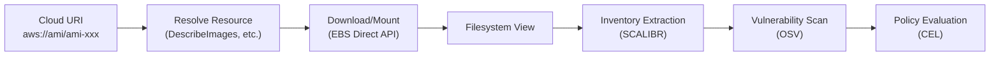

# Cloud Resource Scanning

> [!WARNING]
> Deputy is an early, experimental project, and **cloud scanning is even more experimental**. The core functionality works and can provide real value, but expect rough edges, breaking changes, and incomplete provider coverage. Feedback and contributions are welcome.

Deputy can scan cloud resources (AMIs, EBS snapshots, Lambda functions) for vulnerabilities, applying the same analysis used for containers and repositories.

## Overview

Cloud scanning treats cloud resources as first-class targets. Deputy downloads or mounts the resource's filesystem and runs inventory extraction to discover packages, then checks them against vulnerability databases.



## Supported Resources

### Currently Implemented

| Provider | Resource Type | URI Pattern | Description |
|----------|---------------|-------------|-------------|
| AWS | AMI | `aws://ami/ami-xxx` | Amazon Machine Images |
| AWS | EBS Snapshot | `aws://ebs/snap-xxx` | Elastic Block Store snapshots |
| Plugin | Any | `<scheme>://<type>/<id>` | External cloud providers via plugins |

### Planned (TODO)

The following resources are planned for future implementation. Proto definitions exist for most; contributions welcome.

#### AWS Resources

| Resource Type | URI Pattern | Priority | Notes |
|---------------|-------------|----------|-------|
| **Lambda** | `aws://lambda/function-name` | High | Download function code + layers via GetFunction API |
| **ECR Image** | `aws://ecr/repo:tag` | Medium | Already supported via `docker://`; this adds native AWS auth |
| **ECS Task Definition** | `aws://ecs-task/family:revision` | Medium | Extract container images from task definition |
| **Fargate Task** | `aws://fargate/cluster/task-id` | Low | Live task inspection |

**Lambda implementation notes:**
- Use `GetFunction` API to get code location (S3 presigned URL)
- Download and extract ZIP to temporary filesystem
- Handle layers: each layer is a separate ZIP, merged in order
- Supported runtimes: Python, Node.js, Go, Java, Ruby, .NET
- Required IAM: `lambda:GetFunction`, `lambda:GetLayerVersion`

#### Azure Resources

| Resource Type | URI Pattern | Priority | Notes |
|---------------|-------------|----------|-------|
| **VM Image** | `azure://image/resource-group/image-name` | High | Managed images in resource groups |
| **Managed Disk** | `azure://disk/resource-group/disk-name` | High | Similar to EBS snapshots |
| **VM Scale Set Image** | `azure://vmss/resource-group/vmss-name` | Medium | VMSS golden image |
| **ACR Image** | `azure://acr/registry.azurecr.io/repo:tag` | Medium | Azure Container Registry |
| **Azure Functions** | `azure://function/resource-group/app-name/function` | Medium | Similar to Lambda |

**Azure implementation notes:**
- Use Azure SDK for Go (`github.com/Azure/azure-sdk-for-go`)
- Authentication via `DefaultAzureCredential` (env → managed identity → CLI)
- Disk access via Azure Disk Access / SAS URLs
- Consider Azure Compute Gallery for shared images

#### GCP Resources

| Resource Type | URI Pattern | Priority | Notes |
|---------------|-------------|----------|-------|
| **Compute Image** | `gcp://image/project/image-name` | High | GCE images |
| **Persistent Disk** | `gcp://disk/project/zone/disk-name` | High | Similar to EBS |
| **Artifact Registry** | `gcp://gar/region-docker.pkg.dev/project/repo/image:tag` | Medium | Google Artifact Registry |
| **Cloud Functions** | `gcp://function/project/region/function-name` | Medium | Similar to Lambda |
| **Cloud Run** | `gcp://cloudrun/project/region/service` | Low | Serverless containers |

**GCP implementation notes:**
- Use Google Cloud Go SDK (`cloud.google.com/go`)
- Authentication via Application Default Credentials (ADC)
- Disk access via `gcloud compute disks export` or direct API
- Consider GCE image families for tracking latest images

#### Other Cloud Providers (via plugins)

| Provider | Resource Types | Notes |
|----------|---------------|-------|
| **OpenStack** | Images, Volumes | Via Glance and Cinder APIs |
| **VMware vSphere** | VM Templates, Snapshots | Via vSphere SDK |
| **DigitalOcean** | Droplet Snapshots, Custom Images | Via DO API |
| **Oracle Cloud** | Compute Images, Boot Volumes | Via OCI SDK |
| **Alibaba Cloud** | ECS Images, Snapshots | Via Alibaba SDK |

These are best implemented as plugins (`deputy-cloud-<provider>`) to avoid bloating the core binary.

#### Kubernetes Resources (potential)

| Resource Type | URI Pattern | Notes |
|---------------|-------------|-------|
| **Pod** | `k8s://namespace/pod/name` | Live pod filesystem inspection |
| **Node** | `k8s://node/name` | Node-level package inventory |
| **PVC Snapshot** | `k8s://pvc-snapshot/namespace/name` | CSI volume snapshots |

Kubernetes scanning may be better served by dedicated in-cluster tooling, but plugin support would enable integration.

## URI Formats

### Specific Resources (for scanning)

```
aws://ami/ami-0123456789abcdef0
aws://ami/ami-xxx?region=us-west-2
aws://ebs/snap-0123456789abcdef0
aws://ebs/snap-xxx?region=us-east-1
```

### Collection URIs (for listing)

```
aws://amis                          # List all visible AMIs
aws://amis?owner=self               # List AMIs you own
aws://amis?owner=self&region=us-west-2
aws://amis?tags.env=prod            # Filter by tag
aws://ebs-snapshots                 # List EBS snapshots
aws://ebs-snapshots?owner=self
```

### Bare Resource IDs

For convenience, Deputy also detects bare AWS resource IDs:

```
ami-0123456789abcdef0               # Detected as AWS AMI
snap-0123456789abcdef0              # Detected as EBS snapshot
```

## Authentication

Deputy delegates authentication to the standard cloud SDK credential chains. It never handles credentials directly.

### AWS

Deputy uses the AWS SDK's default credential chain:

1. Environment variables (`AWS_ACCESS_KEY_ID`, `AWS_SECRET_ACCESS_KEY`, `AWS_SESSION_TOKEN`)
2. Shared credentials file (`~/.aws/credentials`) with optional profile
3. IAM instance role (when running on EC2/ECS/Lambda)

**Required IAM Permissions:**

```json
{
  "Version": "2012-10-17",
  "Statement": [
    {
      "Effect": "Allow",
      "Action": [
        "ec2:DescribeImages",
        "ec2:DescribeSnapshots",
        "ebs:ListSnapshotBlocks",
        "ebs:GetSnapshotBlock"
      ],
      "Resource": "*"
    }
  ]
}
```

Use the `--profile` and `--region` flags to specify non-default credentials:

```bash
deputy scan aws://ami/ami-xxx --profile prod-account --region us-west-2
```

### Azure (Planned)

Will use `DefaultAzureCredential`:
- Environment variables
- Managed identity
- Azure CLI credentials

### GCP (Planned)

Will use Application Default Credentials (ADC):
- Environment variable (`GOOGLE_APPLICATION_CREDENTIALS`)
- `gcloud` CLI credentials
- Compute Engine metadata service

## Smart Block Downloading

For EBS snapshots, Deputy uses the EBS Direct API to download only the blocks containing package databases, dramatically reducing bandwidth and time.

**How it works:**

1. Parse the ext4 superblock to understand filesystem layout
2. Map well-known paths (`/var/lib/dpkg`, `/var/lib/rpm`, `/var/lib/apk`) to disk blocks
3. Download only the needed blocks via `ebs:GetSnapshotBlock`
4. Reconstruct a minimal filesystem view for scanning

**Typical reduction:** ~93% less data downloaded (only ~7% of snapshot size).

Disable smart downloading if needed:

```bash
deputy scan aws://ami/ami-xxx --smart-download=false
```

## Policy Entrypoints

Cloud scanning provides three policy entrypoints:

### `cloud_scan_report`

Triggered after a scan completes. Use for aggregate analysis.

**Available variables:**
- `resource.provider` - Cloud provider: "aws", "azure", "gcp"
- `resource.resource_type` - Type: "ami", "ebs-snapshot", "lambda"
- `resource.resource_id` - Provider-specific ID
- `resource.region` - Cloud region
- `resource.account_id` - Account/subscription/project ID
- `resource.tags` - Resource tags (map)
- `vulnerabilities` - List of all vulnerabilities found
- `packages` - List of all packages found

**Example policy:**

```yaml
policies:
  - name: ami-vulnerability-baseline
    description: AMIs must meet vulnerability baseline
    entrypoints: ["cloud_scan_report"]
    rules:
      - action: deny
        when: |
          resource.resource_type == "ami" &&
          vulnerabilities.filter(v, v.severity == severity.CRITICAL).size() > 0
        reason: "AMI has critical vulnerabilities"
        remediation: "Rebuild AMI with patched packages"
```

### `cloud_scan_vulnerability`

Triggered for each vulnerability. Use for per-vulnerability decisions with resource context.

**Additional variables:**
- `vulnerability` - The specific vulnerability
- `pkg` - The affected package

**Example policy:**

```yaml
policies:
  - name: production-critical-vulns
    description: Block critical vulns in production resources
    entrypoints: ["cloud_scan_vulnerability"]
    rules:
      - action: deny
        when: |
          resource.tags.exists(k, k.lowerAscii() == "environment") &&
          resource.tags.filter(k, k.lowerAscii() == "environment")[0] in ["production", "prod"] &&
          vulnerability.severity == severity.CRITICAL
        reason: "Critical vulnerability in production resource"
        remediation: "Address vulnerability before deploying to production"
```

### `service_cloud_scan_request`

Triggered before a cloud scan in server mode. Use for authorization.

**Additional variables:**
- `jwt.claims` - JWT claims when authenticated

**Example policy:**

```yaml
policies:
  - name: account-allowlist
    description: Only allow scanning approved accounts
    entrypoints: ["service_cloud_scan_request"]
    vars:
      allowedAccounts: ["123456789012", "234567890123"]
    rules:
      - action: deny
        when: |
          resource.account_id != "" &&
          !(resource.account_id in allowedAccounts)
        reason: "Account not in approved list"
```

## Examples

### Basic Scanning

```bash
# Scan an AMI
deputy scan aws://ami/ami-0123456789abcdef0

# Scan with region override
deputy scan aws://ami/ami-xxx --region us-west-2

# Scan using a specific AWS profile
deputy scan aws://ami/ami-xxx --profile prod-account

# Scan an EBS snapshot directly
deputy scan aws://ebs/snap-0123456789abcdef0
```

### Collection Listing

```bash
# List your AMIs
deputy list aws://amis?owner=self

# List AMIs with specific tags
deputy list "aws://amis?owner=self&tags.env=prod"

# List with pagination
deputy list aws://amis --page-size 50 --all

# List and scan all
deputy list aws://amis?owner=self -f json | \
  jq -r '.discovered_targets[].uri' | \
  xargs -P4 -I{} deputy scan {}
```

### With Policies

```bash
# Apply cloud security policies
deputy scan aws://ami/ami-xxx --policy policy/examples/cloud-security.yaml

# Combine with other policy types
deputy scan aws://ami/ami-xxx \
  --policy policy/examples/cloud-security.yaml \
  --policy policy/examples/critical-vulns.yaml
```

## Cloud Provider Plugins

Deputy supports external cloud providers via plugins. A plugin is an executable named `deputy-cloud-<name>` that implements the CloudProviderService RPC protocol over Unix sockets.

### Plugin Discovery

Plugins are discovered in:
1. Current working directory (for development)
2. `$GOPATH/bin`
3. `$HOME/go/bin`
4. `$PATH`

### Writing a Plugin

Use the `sdk/cloudplugin` package:

```go
package main

import (
    "context"
    "iter"

    "github.com/picatz/deputy/sdk/cloudplugin"
)

type MyProvider struct{}

func (p *MyProvider) Info() cloudplugin.ProviderInfo {
    return cloudplugin.ProviderInfo{
        Name:    "mycloud",
        Schemes: []string{"mycloud://"},
    }
}

func (p *MyProvider) Detect(ctx context.Context, target string) (*cloudplugin.DetectResult, error) {
    // Return {Detected: true} if you handle this target
}

func (p *MyProvider) Open(ctx context.Context, req cloudplugin.OpenRequest) iter.Seq[cloudplugin.OpenEvent] {
    return func(yield func(cloudplugin.OpenEvent) bool) {
        yield(cloudplugin.ProgressEvent{Phase: "downloading", Percent: 50})
        yield(cloudplugin.ReadyEvent{LocalPath: "/path/to/resource"})
    }
}

func (p *MyProvider) Close(ctx context.Context, requestID string) error {
    return nil
}

func main() {
    cloudplugin.Main(&MyProvider{})
}
```

### Local Testing Plugin

A `local://` plugin is available for testing without cloud credentials:

```bash
# Build the local plugin
go build -o deputy-cloud-local ./examples/plugins/local-cloud

# Use it to scan a local directory as if it were a cloud resource
deputy scan local://ami/./testdata/rootfs
```

## Architecture

### Resource Interface

All cloud resources implement the `cloud.Resource` interface:

```go
type Resource interface {
    Provider() Provider           // aws, azure, gcp, plugin
    Type() ResourceType           // ami, ebs-snapshot, lambda, etc.
    ID() string                   // Resource identifier
    Region() string               // Cloud region
    AccountID() string            // Account/subscription/project
    Tags() map[string]string      // Resource tags
    Name() string                 // Human-readable name
    FS(ctx context.Context) (fs.FS, error)  // Filesystem view
    Close() error                 // Cleanup
}
```

### Target Provider Pattern

Cloud resources are exposed to Deputy through the target provider system:

1. **Detection**: Provider checks if URI matches (e.g., `aws://`)
2. **Opening**: Provider resolves and materializes the resource
3. **Scanning**: Deputy runs inventory extraction on the `fs.FS`
4. **Cleanup**: Provider releases resources (temp files, connections)

## See Also

- [Cloud security policy examples](../../policy/examples/cloud-security.yaml)
- [Terraform support](terraform.md)
- [Targets and refs](targets-and-refs.md)
- [Policies](policies.md)
