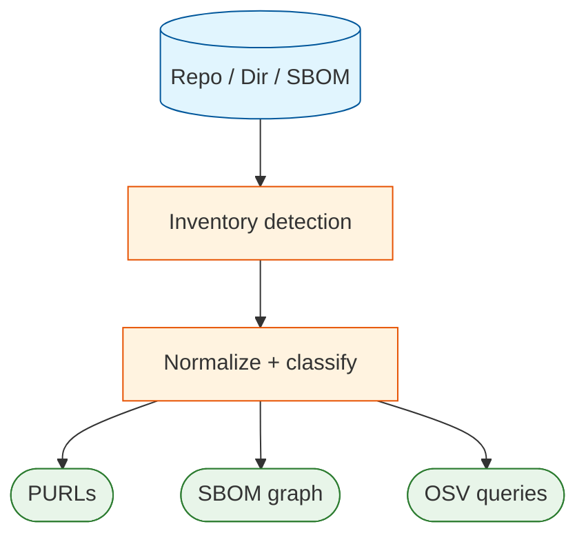

# Inventory, PURLs, and SBOMs

Deputy’s “source of truth” is an **inventory**: the set of packages discovered in your target.

## Inventory

Deputy uses OSV-Scalibr to discover packages across ecosystems from manifests/lockfiles and other sources.
From there, Deputy normalizes results into a consistent model used by `scan`, `list`, `sbom`, and `diff`.

## PURLs

PURLs (Package URLs) are a compact identifier used throughout Deputy for output and linking.

- `deputy list` emits PURLs directly.
- `deputy sbom` uses PURLs in SBOM component identities (where applicable).
- `deputy scan` uses inventory items to query OSV efficiently.

## SBOM formats

Deputy can generate:

- CycloneDX JSON (`cyclonedx-json`)
- SPDX 2.3 JSON (`spdx-json`)
- Protobom JSON (`protobom-json`, the intermediate model)

## License enrichment

`deputy sbom --enrich-licenses` can attach license metadata to SBOM nodes via:

- deps.dev (`--license-source depsdev`) for fast lookups
- local scanning (`--license-source scan`) for “what’s in the repo/module”
- both (`--license-source both`) for best coverage

## Code pointers

- Inventory extraction: [`internal/inventory`](../../internal/inventory)
- PURL normalization helpers: [`internal/purlx`](../../internal/purlx)
- SBOM generation + format conversions: [`internal/sbom`](../../internal/sbom)
