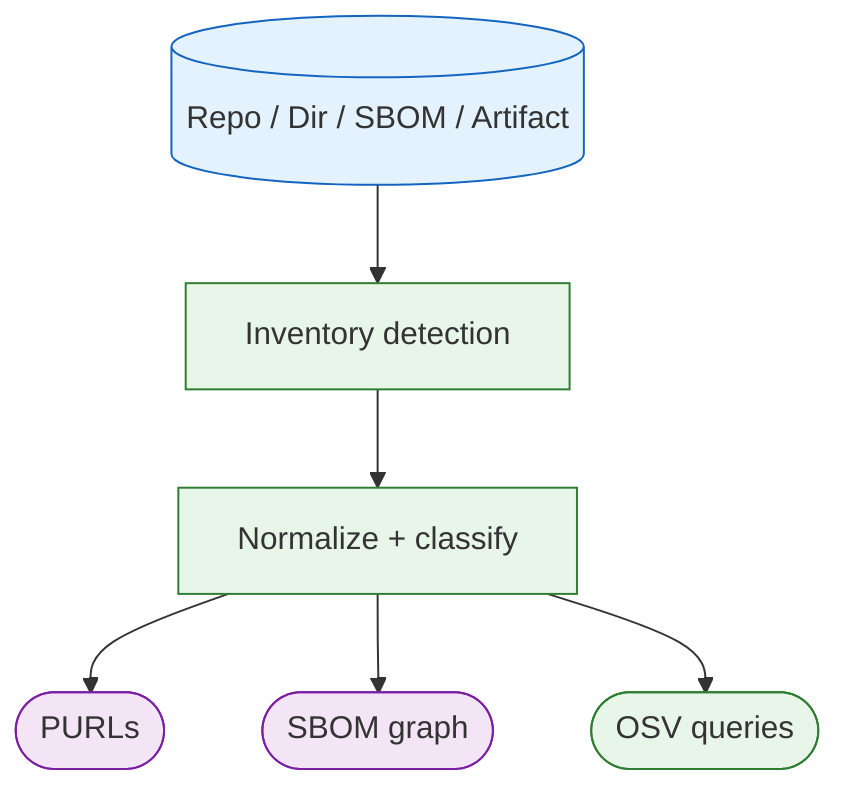

# Inventory, PURLs, and SBOMs

Deputy’s “source of truth” is an **inventory**: the set of packages discovered in your target.
Targets are materialized into a filesystem view or SBOM payload so the same
inventory pipeline can work across repos, directories, and future artifacts.

## Inventory

Deputy uses OSV-Scalibr to discover packages across ecosystems from manifests/lockfiles and other sources.
From there, Deputy normalizes results into a consistent model used by `scan`, `list`, `sbom`, and `diff`.



### Direct and transitive dependencies

A package is direct when the project declares it in its own manifest. Deputy reads
that from the manifests of Go (`go.mod`), npm (`package.json`), Cargo (`Cargo.toml`),
and PyPI (`pyproject.toml`, `requirements.txt`). For PyPI that means every table
the project declares for itself, including PEP 621 extras, PEP 735 dependency
groups, and Poetry's named groups. Base images, workflow `uses`, and `mise` or
`asdf` tools are direct by construction, since every one of them is written down
in the file that declares it.

Every other ecosystem Deputy inventories (Maven, RubyGems, NuGet, Hex, Pub,
CocoaPods, Packagist, Hackage, CRAN, ConanCenter) has no manifest parser yet, and
`direct` is a boolean, so its packages are reported as transitive whether they are
or not, with nothing in the output distinguishing the two. Treat `--only-direct`,
`direct` in JSON and SBOM output, and direct-only policies as covering the
ecosystems listed above and no others.
[Issue #246](https://github.com/temporalio/deputy/issues/246) tracks both halves:
reading the remaining manifests, and a contract that can say "not determined"
instead of reporting `false`.

## PURLs

PURLs (Package URLs) are a compact identifier used throughout Deputy for output and linking.

- `deputy list` emits PURLs directly.
- `deputy sbom` uses PURLs in SBOM component identities (where applicable).
- `deputy scan` uses inventory items to query OSV efficiently.

Container image SBOMs may include docker/oci PURLs. When present, `deputy scan sbom`
will resolve and scan those images in addition to the SBOM package list. Image
PURLs can also carry qualifiers like `platform`, `os`, `arch`, or `variant` to
pin multi-arch images to a specific platform.

### Dockerfile Base Images

When generating SBOMs for repositories, Deputy automatically discovers Dockerfiles
and includes base images as inventory components. This provides supply chain
visibility for container infrastructure dependencies declared via `FROM` instructions.

Base images are represented with standard container PURLs:
- `pkg:docker/library/alpine@3.19` (Docker Hub)
- `pkg:oci/ghcr.io/owner/app@v1.0.0` (other registries)

Each base image node includes properties for traceability:
- `deputy:type`: `container-base-image`
- `deputy:location`: path to the Dockerfile
- `deputy:dockerfile-stage`: stage name (if using `AS alias`)
- `deputy:platform`: platform if specified with `--platform`
- `deputy:direct`: always `true` (base images are direct dependencies)

## SBOM formats

Deputy can generate:

- CycloneDX JSON (`cyclonedx-json`)
- SPDX 2.3 JSON (`spdx-json`)
- Protobom JSON (`protobom-json`, the intermediate model)

## License enrichment

Deputy provides license information through multiple mechanisms, designed to work
consistently across target types while respecting each target's native metadata.

### Automatic extraction (no flag required)

Some license sources are always extracted because they're part of the target's
native metadata:

| Target Type | Automatic Source | Notes |
|-------------|------------------|-------|
| Container images | OCI label `org.opencontainers.image.licenses` | Per [OCI Image Spec](https://github.com/opencontainers/image-spec/blob/main/annotations.md) |
| OS packages | Package manager metadata | apt, apk, rpm embed license info |
| Some ecosystems | Lockfile/manifest declarations | Where available |

### Enrichment (requires `--enrich-licenses`)

For additional license lookups beyond native metadata, use `--enrich-licenses`:

| Source | Flag | Best For |
|--------|------|----------|
| deps.dev | `--license-source depsdev` | Fast lookups for supported ecosystems |
| Local scan | `--license-source scan` | Vendored code, license files in repo |
| Both | `--license-source both` | Maximum coverage |

```console
# Fast enrichment via deps.dev
$ deputy sbom --enrich-licenses

# Scan license files locally (more accurate for vendored code)
$ deputy sbom --enrich-licenses --license-source scan

# Maximum coverage
$ deputy sbom --enrich-licenses --license-source both
```

### Container image licenses

Container images have three license sources, applied in order:

1. **OCI Labels** (automatic): The `org.opencontainers.image.licenses` label is
   always extracted and attached to the SBOM root node.

2. **OS package metadata** (automatic): System packages (apt, apk, rpm) often embed
   license info that OSV-SCALIBR extracts during inventory scanning.

3. **Package enrichment** (with `--enrich-licenses`): Application packages inside the
   container (Go modules, npm packages, etc.) are enriched using deps.dev or scanning.

To add license metadata to your container images:

```dockerfile
FROM alpine:3.19
LABEL org.opencontainers.image.licenses="Apache-2.0"
```

SPDX expressions are supported:

```dockerfile
LABEL org.opencontainers.image.licenses="MIT OR Apache-2.0"
```

### Repository licenses

Git repositories also have multiple license sources:

1. **Package manifests** (with `--enrich-licenses`): Dependencies declared in lockfiles
   are enriched via deps.dev or by scanning their source.

2. **Local license files** (with `--enrich-licenses --license-source scan`): LICENSE,
   COPYING, and similar files in the repository root are scanned and attached to the
   SBOM root node.

3. **Dockerfile base images**: When Dockerfiles are present, base image references are
   included as SBOM components. These inherit any OCI label licenses from the resolved
   images when scanned.

## Code pointers

- Inventory extraction: [`internal/inventory`](../../internal/inventory)
- PURL normalization helpers: [`internal/purlx`](../../internal/purlx)
- SBOM generation + format conversions: [`internal/sbom`](../../internal/sbom)
