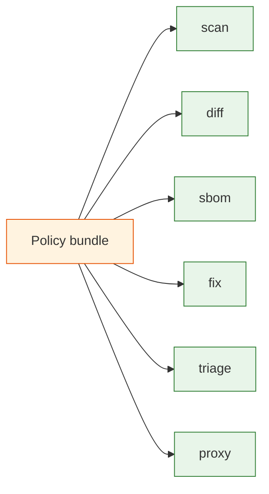

# Policies (CEL)

Deputy policies are reusable guardrails for supply chain decisions. You write them once and apply them everywhere Deputy runs: scan, diff, sbom, fix, triage, and the artifact proxy.

Policies are authored as YAML bundles that contain CEL expressions. This gives you a single, auditable rule set that can block risky artifacts, warn on policy drift, or annotate outputs for downstream tooling.

## What policies solve

- Enforce severity thresholds and exploit signals across scans and proxies.
- Standardize license and provenance requirements for every dependency.
- Codify enterprise rules (allowlists, blocklists, naming conventions).

## Where policies run



## How policy evaluation works

Each command emits one or more entrypoints (for example: `scan_report`, `diff_dependency_change`, `sbom_component`, `go_artifact_request`). The policy runtime injects `env.command` and `env.entrypoint` so a single policy can branch based on where it is being applied.

## Quick start

```yaml
policies:
  - name: block-critical
    entrypoints: ["scan_vulnerability"]
    rules:
      - action: deny
        when: vulnerability.?severity.orValue("") == "CRITICAL"
        reason: "critical vulnerability found"
```

```bash
deputy policy lint policy/block-critical.yaml
deputy policy test policy/
deputy scan --policy policy/block-critical.yaml
```

## Learn more

- [Policy framework](../reference/policy-framework.md)
- [CEL language reference](../reference/policy-framework.md#cel-language-reference)
- [Policy inputs](../reference/policy-inputs.md)
- [Policy command reference](../commands/policy.md)
- [Policy spec](../reference/policy-spec.md)
- [Policy examples](../../policy/examples/)
- [Policy LSP setup](../policy-lsp.md)
