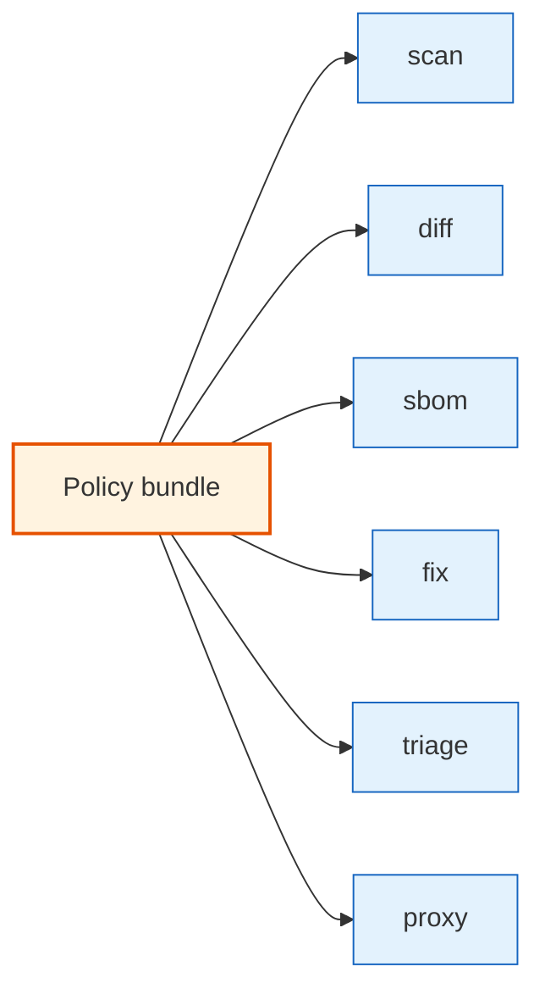

# Policies (CEL)

Deputy policies let you define reusable guardrails for:

- Vulnerabilities (severity thresholds, “block exploit-available”, etc.)
- Licenses and provenance constraints
- Naming and typosquat heuristics
- Proxy-time enforcement (block before artifacts land in builds)

Deputy policies are written in YAML bundles that contain **CEL** expressions.

## Where policies run



## Entry points

Each command evaluates policies at one or more **entry points** (for example: `scan_report`,
`diff_dependency_change`, `sbom_component`, `go_artifact_request`).

This lets you write one bundle that behaves differently depending on where it’s being applied via
`env.command` and `env.entrypoint`.

## Start using policies

- Read the framework overview: [`POLICY.md`](../../POLICY.md)
- Policy file spec: [`POLICY_SPEC.md`](../../POLICY_SPEC.md)
- Examples you can copy: [`policy/examples`](../../policy/examples)

Common workflows:

```console
# Lint and test policies before enforcement
$ deputy policy lint policy/examples/*.yaml
$ deputy policy test policy/

# Enforce a policy during a scan
$ deputy scan --policy policy/examples/severity-guardrail.yaml
```

## Editor tooling

Deputy ships an LSP for YAML + CEL authoring:

- [`docs/policy-lsp.md`](../policy-lsp.md)

## Code pointers

- Policy engine + CEL environment: [`internal/policy`](../../internal/policy)
