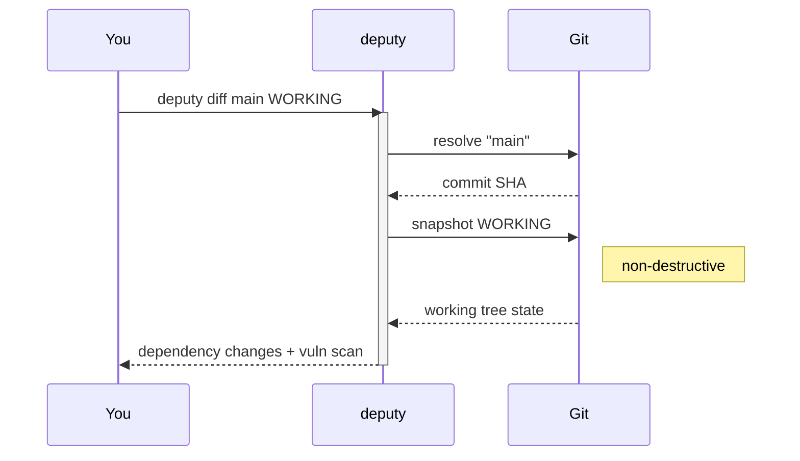

# Targets & refs

Deputy commands operate on a **target** (what to analyze) and often a **ref** (which version of it).

## Targets

Most commands accept a single optional argument:

- **Local repository path:** `deputy scan .`
- **Remote Git repository:** `deputy scan github.com/owner/repo`
- **Directory without Git context:** `deputy scan dir ./some/folder`
- **SBOM input (file or stdin):** `deputy scan sbom sbom.json` or `deputy scan sbom -`

## Refs

When a command supports `--ref`, it can usually point at:

- Branches/tags: `main`, `v1.2.3`
- Commits: `abc123d`, `HEAD~3`
- Time expressions: `HEAD@{yesterday}`, `main@{3.month.ago}` (quote these)
- Working tree (uncommitted changes): `WORKING` (aliases: `WORKTREE`, `WT`, `.`)

## Practical tips

- Quote refs with `@{...}` to avoid shell expansion: `deputy diff "HEAD@{yesterday}" HEAD`
- If you omit refs:
  - `deputy diff` compares default branch → `HEAD` (or → `WORKING` when manifests changed).
  - `deputy scan` scans `HEAD` by default (use `--ref WORKING` to include uncommitted changes explicitly).

## Code pointers

- Ref parsing + default branch detection: [`internal/gitutil`](../../internal/gitutil)
- Target resolution (local vs remote): [`internal/targets`](../../internal/targets), [`internal/repository`](../../internal/repository)
