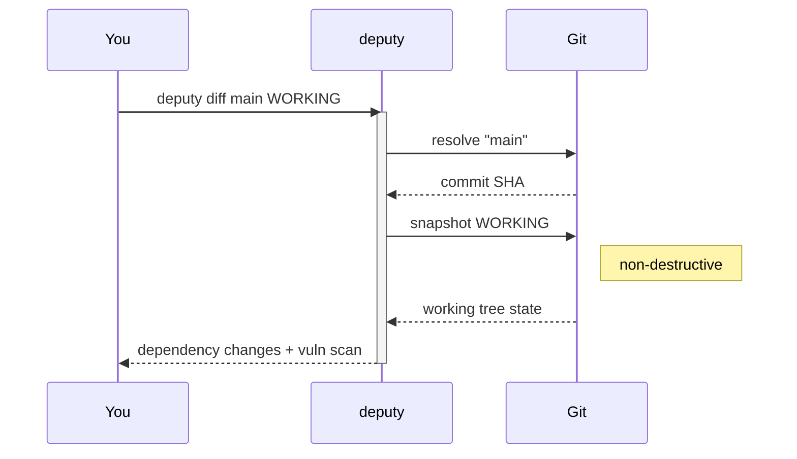

# Targets & refs

Deputy commands operate on a **target** (what to analyze) and often a **ref** (which version of it).

## Targets

Most commands accept a single optional argument:

- **Local repository path:** `deputy scan .`
- **Remote Git repository:** `deputy scan github.com/owner/repo`
- **Directory without Git context:** `deputy scan dir ./some/folder`
- **SBOM input (file or stdin):** `deputy scan sbom sbom.json` or `deputy scan sbom -`
- **PURL (single package):** `deputy scan pkg:npm/lodash@4.17.21` or `deputy scan purl pkg:npm/lodash@4.17.21`
- **Container image (registry, daemon, tarball):** `deputy scan image docker://ghcr.io/owner/app:1.2.3`
  - Docker Hub short names are recognized at the root: `deputy scan alpine`, `deputy scan library/ubuntu:latest`
  - Two-segment names without a tag/digest (for example `owner/repo`) are ambiguous; use `docker://owner/repo:tag`, `github.com/owner/repo`, or `--source remote`
  - SBOMs can reference images via PURLs (docker/oci). Qualifiers like `platform` or `os`/`arch` can pin multi-arch images.

These are the current built-ins. Target resolution is designed to be extensible
so future targets (binaries, container images/instances, extension packages, and
more) plug into the same flow without reworking the scan pipeline.

Container image targets use explicit schemes (`docker://`, `oci://`, `docker-daemon://`,
`tarball://`) to keep detection unambiguous. The root `scan` command also detects
common registry references (for example `ghcr.io/owner/app:1.2.3`).

### Target kinds (extensible)

Targets are normalized into a kind for consistent handling:

- `git` (local or remote repositories)
- `dir` (local directory without Git context)
- `sbom` (SBOM documents or streams)
- `purl` (single-package identifiers)
- `file` / `binary` (single artifacts like executables or archives)
- `container-image` / `container-instance`
- `vm-image`
- `extension` (browser/editor extensions)

Not every kind is implemented yet in the CLI, but the registry and data model are
prepared to accept them as providers are added.

### Target resolution

Target resolution is handled by the `internal/targets` registry:

- Each provider detects whether it can handle a target and materializes it.
- Materialized targets expose a filesystem view, an SBOM payload, or both.
- Providers can implement priority ordering to disambiguate overlapping inputs.

## Refs

When a command supports `--ref`, it can usually point at:

- Branches/tags: `main`, `v1.2.3`
- Commits: `abc123d`, `HEAD~3`
- Time expressions: `HEAD@{yesterday}`, `main@{3.month.ago}` (quote these)
- Working tree (uncommitted changes): `WORKING` (aliases: `WORKTREE`, `WT`, `.`)

Refs are Git-specific today. Other target kinds (such as container images) will
use their own selectors (tags, digests, versions) surfaced via target options.

## Practical tips

- Quote refs with `@{...}` to avoid shell expansion: `deputy diff "HEAD@{yesterday}" HEAD`
- If you omit refs:
  - `deputy diff` compares default branch → `HEAD` (or → `WORKING` when manifests changed).
  - `deputy scan` scans `HEAD` by default (use `--ref WORKING` to include uncommitted changes explicitly).

## Code pointers

- Ref parsing + default branch detection: [`internal/gitutil`](../../internal/gitutil)
- Target resolution (local vs remote): [`internal/targets`](../../internal/targets), [`internal/repository`](../../internal/repository)
