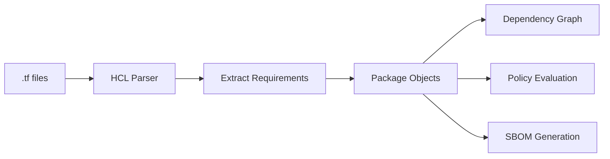

# Terraform Support

> [!WARNING]
> Deputy is an early, experimental project, and **Terraform support is newer still**. Core functionality (inventory, policy, SBOM) works well; vulnerability scanning via Go ecosystem mapping is functional but has coverage gaps. Feedback welcome.

Deputy inventories Terraform version requirements from HCL configuration files, enabling policy enforcement for Terraform core and provider versions.

## Quick Start

```bash
# Scan Terraform files for inventory
deputy scan ./infrastructure --ecosystems terraform

# List Terraform dependencies
deputy list ./infrastructure --ecosystems terraform

# Generate SBOM with Terraform requirements
deputy sbom ./infrastructure --ecosystems terraform --format cyclonedx-json

# Diff Terraform changes between branches
deputy diff main HEAD --ecosystems terraform

# Enforce minimum Terraform version policy
deputy diff main HEAD --policy policy/examples/terraform-min-required-version.yaml
```

## Overview

Deputy extracts version constraints from `terraform` blocks in `.tf` and `.tf.json` files:

- **Terraform core version** (`required_version`)
- **Provider versions** (`required_providers`)

These requirements are treated as dependencies, enabling:
- Version constraint policy enforcement via `diff_dependency_change`
- Dependency graph visualization with Terraform nodes
- SBOM generation including Terraform requirements



## What's Inventoried

### Terraform Core Version

From `terraform.required_version`:

```hcl
terraform {
  required_version = ">= 1.5.0"
}
```

Represented as: `pkg:terraform/terraform@>=1.5.0`

### Provider Versions

From `terraform.required_providers`:

```hcl
terraform {
  required_providers {
    aws = {
      source  = "hashicorp/aws"
      version = "~> 5.0"
    }
    google = {
      source  = "hashicorp/google"
      version = ">= 4.0, < 6.0"
    }
  }
}
```

Represented as:
- `pkg:terraform-provider/hashicorp/aws@~>5.0`
- `pkg:terraform-provider/hashicorp/google@>=4.0,<6.0`

## PURL Types

Deputy uses custom PURL types for Terraform:

| Type | Pattern | Example |
|------|---------|---------|
| `terraform` | `pkg:terraform/terraform@<constraint>` | `pkg:terraform/terraform@>=1.5.0` |
| `terraform-provider` | `pkg:terraform-provider/<namespace>/<name>@<constraint>` | `pkg:terraform-provider/hashicorp/aws@~>5.0` |
| `terraform-module` | `pkg:terraform-module/<path>` | `pkg:terraform-module/modules/vpc` |

## Version Constraint Parsing

Deputy parses Terraform version constraints and extracts structured metadata for policy evaluation:

| Constraint | Meaning | Parsed Metadata |
|------------|---------|-----------------|
| `>= 1.5.0` | Minimum version | `min_version: "1.5.0", min_inclusive: true` |
| `> 1.5.0` | Exclusive minimum | `min_version: "1.5.0", min_inclusive: false` |
| `< 2.0.0` | Maximum version | `max_version: "2.0.0", max_inclusive: false` |
| `~> 1.5` | Pessimistic (1.5.x) | `min: "1.5.0", max: "2.0.0"` |
| `~> 1.5.3` | Pessimistic (1.5.x) | `min: "1.5.3", max: "1.6.0"` |
| `>= 1.0, < 2.0` | Range | Both min and max |
| `!= 1.5.0` | Exclude | `excludes: ["1.5.0"]` |

### Metadata Fields

The following fields are available in `pkg.metadata` for Terraform packages:

```yaml
kind: "terraform_core" | "terraform_provider"
constraint: ">= 1.5.0"            # Raw constraint string
source: "hashicorp/aws"           # Provider source (providers only)
min_version: "1.5.0"              # Parsed minimum version
min_inclusive: true               # Whether minimum is inclusive
min_major: 1                      # Minimum major version
min_minor: 5                      # Minimum minor version
min_patch: 0                      # Minimum patch version
max_version: "2.0.0"              # Parsed maximum version (if bounded)
max_inclusive: false              # Whether maximum is inclusive
excludes: ["1.6.0"]               # Excluded versions (if any)
```

## Policy Enforcement

Use the `diff_dependency_change` entrypoint to enforce Terraform version policies. Filter by ecosystem to target Terraform specifically.

### Minimum Terraform Version

```yaml
policies:
  - name: terraform-min-version
    description: Require Terraform >= 1.5.0
    entrypoints: ["diff_dependency_change"]
    vars:
      minMajor: 1
      minMinor: 5
      isTerraform: 'pkg.ecosystem.lowerAscii() == "terraform"'
      isTerraformCore: 'isTerraform && pkg.metadata.kind == "terraform_core"'
      hasMin: '"min_major" in pkg.metadata && "min_minor" in pkg.metadata'
      belowMin: |
        hasMin && (
          pkg.metadata.min_major < minMajor ||
          (pkg.metadata.min_major == minMajor && pkg.metadata.min_minor < minMinor)
        )
    rules:
      - action: deny
        when: isTerraformCore && (!hasMin || belowMin)
        reason: "Terraform required_version must be >= 1.5.0"
        remediation: 'Update terraform.required_version to ">= 1.5.0"'
```

### Provider Version Requirements

```yaml
policies:
  - name: aws-provider-version
    description: Require AWS provider >= 5.0
    entrypoints: ["diff_dependency_change"]
    vars:
      isAWSProvider: |
        pkg.ecosystem.lowerAscii() == "terraform" &&
        pkg.metadata.kind == "terraform_provider" &&
        pkg.metadata.source == "hashicorp/aws"
    rules:
      - action: deny
        when: |
          isAWSProvider &&
          "min_major" in pkg.metadata &&
          pkg.metadata.min_major < 5
        reason: "AWS provider must be >= 5.0"
        remediation: 'Update aws provider version to "~> 5.0"'
```

### Block Specific Providers

```yaml
policies:
  - name: block-deprecated-providers
    description: Block known deprecated providers
    entrypoints: ["diff_dependency_change"]
    vars:
      deprecatedProviders:
        - "hashicorp/template"
        - "hashicorp/null"
    rules:
      - action: warn
        when: |
          pkg.ecosystem.lowerAscii() == "terraform" &&
          pkg.metadata.kind == "terraform_provider" &&
          pkg.metadata.source in deprecatedProviders
        reason: "Using deprecated provider"
        remediation: "Migrate to recommended alternatives"
```

## Dependency Graph

Terraform requirements appear in the dependency graph alongside other package types:

```bash
# View graph including Terraform
deputy graph --ecosystems terraform

# Visualize in terminal
deputy graph --ecosystems terraform --format dot | dot -Tpng > graph.png
```

### Graph Structure

The graph includes:
- **Module nodes**: `pkg:terraform-module/path/to/module`
- **Terraform core nodes**: `pkg:terraform/terraform@constraint`
- **Provider nodes**: `pkg:terraform-provider/namespace/name@constraint`

Edges show:
- Module → Terraform core requirement
- Module → Provider requirements

## Examples

### Basic Scanning

```bash
# Scan a directory with Terraform files
deputy scan ./infrastructure

# Include only Terraform ecosystem
deputy scan ./infrastructure --ecosystems terraform

# View Terraform dependencies
deputy list ./infrastructure --ecosystems terraform
```

### Diff Analysis

```bash
# Check Terraform changes between commits
deputy diff main feature-branch --ecosystems terraform

# With policy enforcement
deputy diff main HEAD \
  --ecosystems terraform \
  --policy policy/examples/terraform-min-required-version.yaml
```

### SBOM Generation

```bash
# Generate SBOM including Terraform requirements
deputy sbom ./infrastructure --ecosystems terraform --format cyclonedx-json

# All ecosystems
deputy sbom ./infrastructure --format spdx-json
```

## Lock File Parsing

Deputy parses `.terraform.lock.hcl` files to extract **actual resolved versions** and cryptographic hashes, not just constraints. This enables:

- Knowing exactly which provider versions are installed
- Verifying package integrity via hashes
- Accurate vulnerability scanning (constraints can match multiple versions)

### Lock File Format

```hcl
provider "registry.terraform.io/hashicorp/aws" {
  version     = "5.31.0"
  constraints = "~> 5.0"
  hashes = [
    "h1:6y12cTFaxpFv4qyU3gkV9M15eSBBrgInoKY1iaHuhvg=",
    "zh:0573de96ba316d808be9f8d6fc8e8e68e0e6b614...",
  ]
}
```

### Locked Provider Metadata

Locked providers have `kind: locked_provider` and include:

```yaml
kind: "locked_provider"
source: "hashicorp/aws"
resolved: true                    # Distinguishes from constraints
constraint: "~> 5.0"              # Original constraint
version_major: 5                  # Parsed from exact version
version_minor: 31
version_patch: 0
hashes:                           # Provider integrity hashes
  - "h1:6y12cTFaxpFv4qyU3gkV9M15eSBBrgInoKY1iaHuhvg="
  - "zh:0573de96ba316d808be9f8d6fc8e8e68e0e6b614..."
```

## Module Extraction

Deputy extracts Terraform module dependencies from configuration files:

### Registry Modules

```hcl
module "vpc" {
  source  = "terraform-aws-modules/vpc/aws"
  version = "5.1.0"
}
```

Represented as: `pkg:terraform-module/terraform-aws-modules/vpc/aws@5.1.0`

### Git Modules

```hcl
module "eks" {
  source = "git::https://github.com/terraform-aws-modules/terraform-aws-eks.git?ref=v19.0.0"
}
```

Represented as: `pkg:terraform-module/git::https://github.com/terraform-aws-modules/terraform-aws-eks.git?ref=v19.0.0`

### Local Modules

```hcl
module "networking" {
  source = "./modules/networking"
}
```

Represented as: `pkg:terraform-module/./modules/networking`

### Module Metadata

Module packages include:

```yaml
kind: "module"
source: "terraform-aws-modules/vpc/aws"
module_type: "registry"           # or "git", "local", "http", "s3", "gcs"
constraint: "5.1.0"               # Version constraint if specified
```

## Vulnerability Scanning

### Current Status

OSV does not have a dedicated "Terraform" ecosystem. However, Deputy can leverage existing vulnerability data through the **Go ecosystem** since Terraform providers are Go modules.

### GHSA Coverage

The [GitHub Advisory Database](https://github.com/advisories?query=terraform) contains Terraform-related vulnerabilities:

| Advisory | Affected | Severity | Description |
|----------|----------|----------|-------------|
| GHSA-h626-pv66-hhm7 | `github.com/hashicorp/terraform` | Moderate | Arbitrary file write during `init` (CVE-2023-4782) |
| GHSA-gmm6-j2g5-r52m | `github.com/hashicorp/terraform-provider-vault` | High | LDAP auth misconfiguration (CVE-2025-13357) |
| GHSA-23fv-m8pv-77j9 | `terraform-provider-vault` | Critical | GCE misconfiguration (CVE-2021-30476) |
| GHSA-4vgf-2cm4-mp7c | `github.com/nrkno/terraform-provider-windns` | Low | Input sanitization issue (CVE-2025-46735) |

### Vulnerability Query Strategy

Deputy automatically maps Terraform packages to Go modules for OSV vulnerability queries:

1. **Locked providers** (from `.terraform.lock.hcl`): `hashicorp/aws@5.31.0` → `github.com/hashicorp/terraform-provider-aws@v5.31.0` (Go ecosystem)
2. **Git modules**: `git::https://github.com/org/repo.git?ref=v1.0.0` → `github.com/org/repo@v1.0.0` (Go ecosystem)
3. **Query OSV**: Vulnerabilities are queried using the Go ecosystem

**What gets scanned:**
- Locked providers with exact versions from `.terraform.lock.hcl`
- Git modules with GitHub URLs

**What doesn't get scanned (yet):**
- Required providers with version constraints (need lock file)
- Terraform core constraints (need exact version)
- Registry modules (no Go module mapping)
- Local modules

### Example: Vulnerability Scan

```bash
# Scan a directory with a Terraform lock file
deputy scan ./infrastructure

# The locked provider hashicorp/vault@3.25.0 will be checked
# against github.com/hashicorp/terraform-provider-vault@v3.25.0
# in the Go ecosystem of OSV (which indexes GHSA)
```

### License Enrichment

Deputy supports license enrichment for Terraform providers via the [Terraform Registry API](https://developer.hashicorp.com/terraform/registry/api-docs) and GitHub source scanning.

| Component | License Support | Method |
|-----------|-----------------|--------|
| **Providers** | Supported | Terraform Registry API + GitHub fallback |
| **Terraform core** | Hardcoded | BUSL-1.1 (v1.6+) or MPL-2.0 (v1.5.x and earlier) |
| **Modules** | Partial | GitHub source scanning (if source is GitHub URL) |

**How it works for providers:**

1. Query `registry.terraform.io/v1/providers/{namespace}/{provider}` for license metadata
2. If registry returns license info, use it
3. Otherwise, extract `source` field (usually GitHub URL) and scan repository for LICENSE file

**Example:**
```bash
# SBOM with license enrichment
deputy sbom ./infrastructure --enrich-licenses --ecosystems terraform
```

**Note:** deps.dev (Google's Open Source Insights) does not index Terraform, so the standard `--enrich-licenses` deps.dev path doesn't apply. Deputy uses its own Terraform-specific license resolution.

### Roadmap

| Feature | Status | Notes |
|---------|--------|-------|
| Terraform core exact version | Planned | Track from state or CLI for accurate vuln scanning |
| Registry module scanning | Planned | Query Terraform Registry for GitHub sources |
| Module license enrichment | Planned | Query Terraform Registry for module licenses |
| Terragrunt support | Planned | Parse `terragrunt.hcl` for dependencies |
| OSV Terraform ecosystem | Wishlist | Request native ecosystem support from OSV |

## Limitations

### Files Scanned

| Scanned | Skipped |
|---------|---------|
| `*.tf` (HCL format) | `.terraform/` directory |
| `*.tf.json` (JSON format) | Variable files (`.tfvars`) |
| `.terraform.lock.hcl` (lock files) | State files (`*.tfstate`) |

### Not Yet Supported

| Limitation | Reason | Workaround |
|------------|--------|------------|
| Variable interpolation | Version constraints with variables aren't evaluated | Use literal version strings |
| Remote module resolution | Deputy doesn't fetch remote modules | Scan after `terraform init` |
| Registry module vulnerabilities | Can't map to Go modules | Use git modules for vuln scanning |
| Terraform core vulnerabilities | Requires exact version, not constraints | Track exact version externally |

## Related Ecosystems

### OpenTofu

OpenTofu configurations use the same HCL syntax and are detected as the `terraform` ecosystem:

```bash
deputy scan ./infrastructure --ecosystems terraform
```

### Terragrunt

Terragrunt wraps Terraform with additional configuration. Currently, Deputy scans the underlying `.tf` files but doesn't parse `terragrunt.hcl`. Terragrunt support is planned.

### Other IaC Tools (Planned)

| Tool | Status | Notes |
|------|--------|-------|
| **CloudFormation** | Planned | YAML/JSON parsing, resource type extraction |
| **Pulumi** | Planned | Multi-language, requires SDK analysis |
| **CDK** | Planned | Synthesizes to CloudFormation |
| **Bicep** | Planned | Azure-specific, compiles to ARM |
| **Helm** | Planned | Kubernetes manifests with templating |

## See Also

- [Terraform governance policies](../../policy/examples/terraform-governance.yaml) - Comprehensive policy suite
- [Terraform minimum version policy](../../policy/examples/terraform-min-required-version.yaml)
- [Terraform provider versions policy](../../policy/examples/terraform-provider-min-versions.yaml)
- [Diff command](../commands/diff.md)
- [Dependency graphs](../commands/graph.md)
- [Policies](policies.md)
