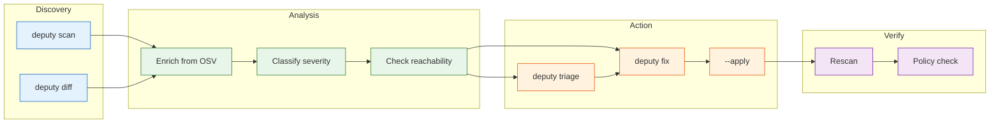
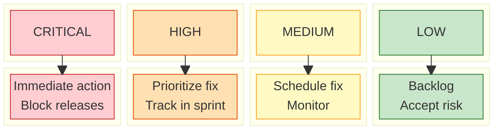

# Vulnerabilities & remediation

Deputy is optimized for answering:

1) **What's vulnerable right now?** (`scan`)
2) **What changed?** (`diff`)
3) **What should we do next?** (`fix`, `triage`)

## Vulnerability Lifecycle

## Vulnerability lookups

Deputy queries the OSV database using the normalized inventory.

Key flags (shared across `scan`, `diff`, `fix`, `triage`):

- `--ignore-unfixed`: filter out vulnerabilities without a known fixed version.
- `--published-after` / `--published-before`: time-window views (publication date).
- `--as-of`: “what was known up to and including this date?”

## Severity Handling

Deputy maps OSV severity scores to actionable tiers:

## Fix verification & module migrations

A vulnerability database records a "fixed" version per affected package, but that
version is not always installable on the module path a project actually imports.
Two cases break a naive "upgrade to the fixed version" suggestion:

- The advisory lists a **product/release version that was never published on the
  Go module path**. For example, `github.com/docker/docker` is reported "fixed in
  29.3.1", but that module tops out at `v28.5.2+incompatible`; the v29 engine
  ships as `github.com/moby/moby/v2`.
- The fix only exists **after a Go major-version migration** (`foo` → `foo/v2`).

By default, Deputy resolves each finding's claimed fix against the Go module
proxy and classifies the outcome:

| Verdict | Meaning | Output |
| --- | --- | --- |
| **in-place** | A fixed version is installable on the current module path | `(↑ <version>)` and a runnable `go get` |
| **migration** | The only fix lives on a different module path | `(→ <module>@<version>)`; remediation is `go get <module>@<version>` plus a manual import-path update |
| **unverified** | A fix is claimed but installability couldn't be confirmed (offline) | `(↑ <version>, unverified)` |
| **unavailable** | No fix exists on any known module path | counted under "no fix available" |

This means Deputy never recommends an `go get pkg@version` that would fail, and a
fix that requires a module migration is reported as such instead of being
mislabeled "no fix available". Migration targets are discovered from the
advisory's sibling affected modules, matched via the mechanical `foo` → `foo/vN`
rule plus a small curated rename table (see
[`internal/remediation/fixresolve`](../../internal/remediation/fixresolve)).

Verification requires network access to the module proxy. Use `--no-verify-fixes`
for fully offline scans; Deputy then trusts the advisory's fixed-version strings
verbatim (the legacy behavior).

## Remediation plans

`deputy fix` turns findings into a **plan**:

- Runnable steps (e.g., `go get`, `npm install`) when Deputy can express a safe command
- Manual steps when human edits are required
- Optional application with `--apply` (local targets only)

Plans can be exported as JSON (`--format json`) for review/approval workflows.

## Triage

`deputy triage` produces a prioritized summary and can optionally delegate “what matters most?” analysis
to an agent (without necessarily granting repository write access).

## Code pointers

- Finding consolidation + severity logic: [`internal/analysis`](../../internal/analysis)
- Upgrade hints + plan materialization: [`internal/remediation`](../../internal/remediation)
- Report output formatters: [`internal/output`](../../internal/output)
