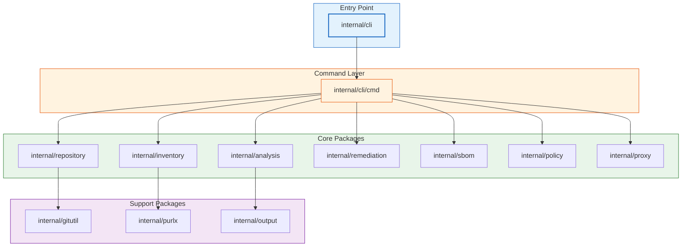

# Architecture

Deputy is a Go CLI that composes a few core subsystems: inventory, analysis, remediation, policy, and proxy.

## Package map (high level)

## Design principles

- **One inventory model** reused across commands.
- **Non-destructive Git operations** (snapshots vs mutating working trees).
- **Policy as a reusable control plane**, not a one-off filter per command.
- **Pipeline-friendly I/O** (stdout/stderr, JSON formats, `--output` flags).

## Code pointers

- Root command wiring: [`internal/cli/cli.go`](../../internal/cli/cli.go)
- Subcommands: [`internal/cli/cmd`](../../internal/cli/cmd)
- Policy engine: [`internal/policy`](../../internal/policy)
- Proxy adapters + servers: [`internal/proxy`](../../internal/proxy)
