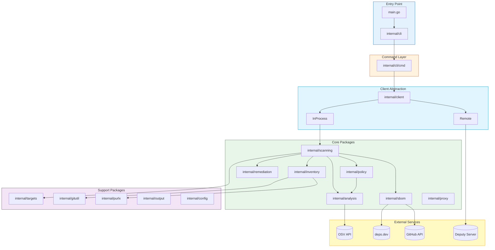
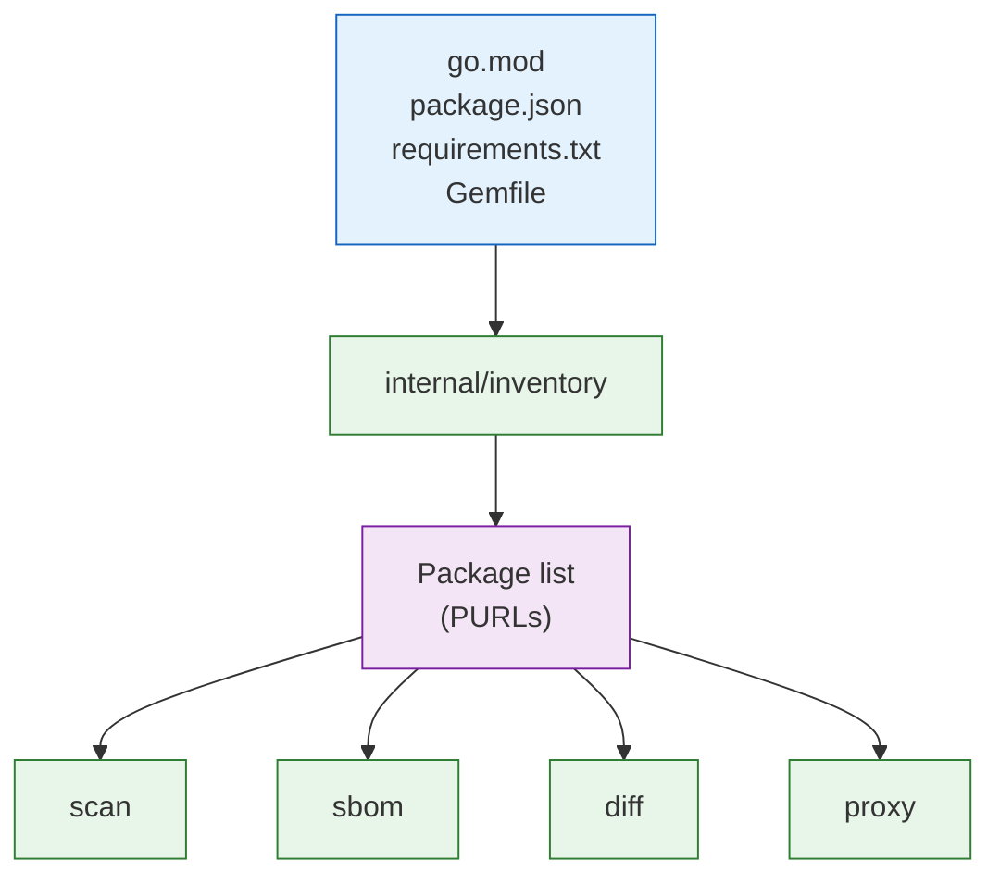
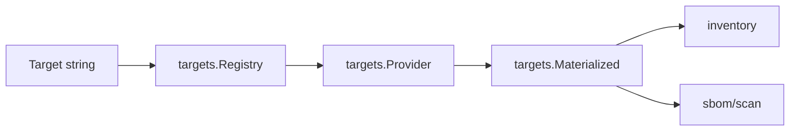
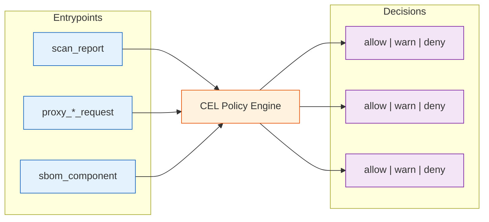
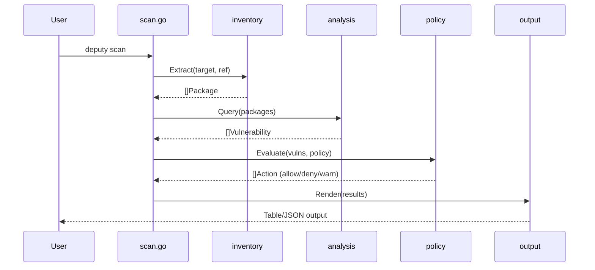
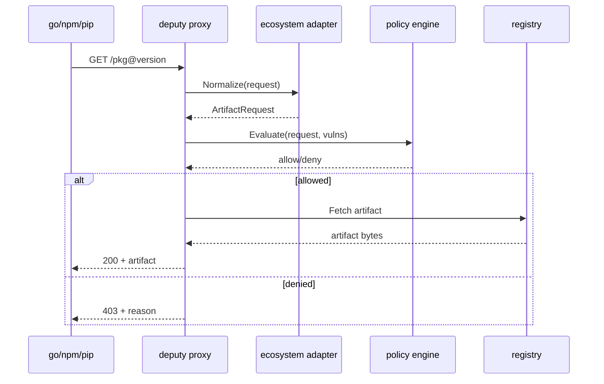
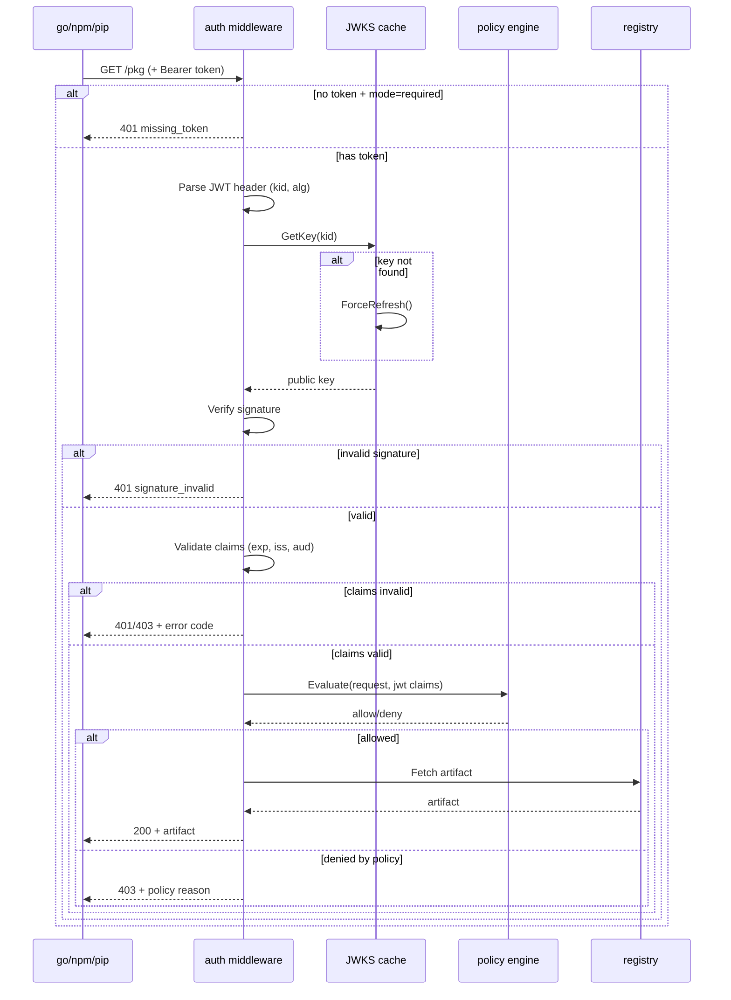

# Architecture

Deputy is a Go CLI that composes core subsystems: inventory, analysis, remediation, policy, and proxy. This document explains how the pieces fit together.

## High-Level Architecture



## Design Principles

### One Inventory Model

All commands share the same inventory extraction logic. Whether scanning, diffing, generating SBOMs, or running the proxy, Deputy uses `internal/inventory` to parse manifests into a normalized package list.



### Client Abstraction

Commands communicate with Deputy's core services through a unified client interface (`internal/client`). This abstraction supports three execution modes:

| Mode | Transport | Use Case |
|------|-----------|----------|
| **In-Process** | Direct function calls | CLI usage (default, zero overhead) |
| **Local Daemon** | Unix socket | Shared caching, faster repeat scans |
| **Remote Server** | HTTP/2 (ConnectRPC) | Enterprise features, centralized policy |

Mode selection is automatic:
1. If `DEPUTY_SERVER` is set → Remote mode
2. If daemon socket exists → Daemon mode
3. Otherwise → In-process mode (default)

The public SDK (`sdk/`) wraps this client for external Go consumers.

### Target Resolution and Materialization

Targets are resolved through `internal/targets` before inventory extraction:

- Providers detect the target kind (repo, dir, sbom, artifact, etc.).
- Providers materialize a filesystem view, an SBOM payload, or both.
- Scan/SBOM commands consume the materialized target to build inventory.
- New target kinds only need a provider plus any inventory adapters.



### Non-Destructive Git Operations

Deputy never modifies the working tree for read operations. Instead, it uses `go-git` to:

- Clone repositories to temp directories
- Resolve refs to commit SHAs
- Read files at specific commits without checkout
- Generate diffs between refs

Only `fix --apply` modifies files, and only when explicitly requested.

### Policy as Control Plane

CEL policies are evaluated at multiple points, not just scan output:



This lets you write rules once and enforce them everywhere: in CI scans, at package download time, and during SBOM generation.

### Pipeline-Friendly I/O

- **stdout**: Command output (scan results, SBOMs, lists)
- **stderr**: Logs and diagnostics
- **JSON formats**: Stable schemas for scripting
- **Exit codes**: 0 = success, 1 = error/policy violation

### Domain vs Integration Split

Deputy keeps pure domain logic separate from service integrations:

- `internal/vulnerability` owns the vulnerability domain model, severity parsing,
  alias consolidation, and fix selection. It is pure and has no IO.
- `internal/analysis/osv` owns OSV API and GitHub Actions bucket integration,
  including cache-aware lookups and conversion into domain types.
- `internal/license` handles license enrichment (deps.dev, registry APIs, local
  scans) and uses `internal/cache/disk` for on-disk caching.
- `internal/analysis` is a thin orchestration layer and compatibility facade
  that keeps CLI and policy code stable while delegating to the above packages.

## Package Reference

### Entry Points

| Package | Purpose |
|---------|---------|
| `main.go` | Binary entry point |
| `internal/cli` | CLI initialization, root command, logging setup |
| `internal/cli/cmd` | Individual Cobra commands (scan, fix, diff, etc.) |
| `internal/client` | Client abstraction (in-process, daemon, remote modes) |
| `sdk` | Public Go SDK for external consumers |

### Core Packages

| Package | Purpose | Key Types |
|---------|---------|-----------|
| `internal/inventory` | Dependency detection from manifests | `Package`, `Inventory`, `Extractor` |
| `internal/inventory/manifests` | Manifest/manager heuristics for locations | `DetectManager`, `InferArtifactManager` |
| `internal/analysis/osv` | OSV API + GitHub Actions bucket integration | `Client`, `PkgInput`, `Vulnerability` |
| `internal/vulnerability` | Domain types, CVSS/severity, consolidation | `Finding`, `ConsolidatedFinding` |
| `internal/license` | License enrichment and scanning | `DepsClient` |
| `internal/remediation` | Fix planning, upgrade commands | `Plan`, `Step`, `Upgrade` |
| `internal/report` | Report/context assembly helpers (rendering in subpackages) | `ManifestContext`, `Summary`, `TriageReport`, `PolicyFinding`, `Target` |
| `internal/report/render` | Human-readable report rendering | `VulnerabilityList`, `TriageSummaryDoc`, `PolicyFindings` |
| `internal/sbom` | SBOM generation (CycloneDX, SPDX) | `Generator`, `Document` |
| `internal/policy` | CEL evaluation engine | `Evaluator`, `Policy`, `Action` |
| `internal/proxy` | Package proxy adapters and server | `Server`, `Adapter`, `Request` |

### Support Packages

| Package | Purpose |
|---------|---------|
| `internal/gitutil` | Git operations via go-git |
| `internal/targets` | Target detection + materialization |
| `internal/purlx` | PURL parsing and normalization |
| `internal/output` | Output formatting (table, JSON) |
| `internal/config` | Configuration loading |
| `internal/cache` | Caching (memory, disk subpackages) |
| `internal/cli/flags` | Shared CLI flag parsing helpers |

## Data Flow

### Scan Command



### Proxy Request



### Proxy Authentication (JWT/OIDC)

When authentication is enabled, the proxy validates JWT tokens before policy evaluation:



**JWT claims available in CEL policies:**

| Field | Type | Description |
|-------|------|-------------|
| `jwt.sub` | string | Subject (user/service ID) |
| `jwt.iss` | string | Issuer URL |
| `jwt.aud` | list | Audience(s) |
| `jwt.exp` | int | Expiration timestamp |
| `jwt.anonymous` | bool | True if no token (mode=optional) |
| `jwt.<custom>` | any | Custom claims from token |

See the [proxy command reference](../commands/proxy.md#authentication-jwtoidc) for configuration details.

## Key Abstractions

### Package (internal/inventory)

Represents a dependency with ecosystem-agnostic metadata:

```go
type Package struct {
    Name      string   // e.g., "github.com/gin-gonic/gin"
    Version   string   // e.g., "v1.9.1"
    Ecosystem string   // e.g., "go", "npm", "pypi"
    PURL      string   // Package URL
    Direct    bool     // Direct vs transitive
    Licenses  []string // SPDX identifiers
    Source    string   // Manifest file path
}
```

### Vulnerability (internal/analysis)

OSV-aligned vulnerability record:

```go
type Vulnerability struct {
    ID            string   // CVE, GHSA, etc.
    Aliases       []string // Alternative IDs
    Summary       string   // Brief description
    Severity      string   // CRITICAL, HIGH, MEDIUM, LOW
    Published     time.Time
    FixedVersions []string // Versions with fix
    Package       Package  // Affected package
}
```

### Policy Action (internal/policy)

Result of CEL evaluation:

```go
type Action struct {
    Type        string            // "allow", "warn", "deny"
    Reason      string            // Human-readable explanation
    Policy      string            // Policy name that triggered
    Headers     map[string]string // For proxy responses
    Remediation string            // Suggested fix
}
```

## Extension Points

### Adding a New Ecosystem

1. **Inventory**: Create extractor in `internal/inventory/`
2. **PURL**: Register type in `internal/purlx/`
3. **Proxy**: Add adapter in `internal/proxy/`
4. **Tests**: Add fixtures in `testdata/`

### Adding a Policy Entrypoint

1. Define constant in `internal/policy/entrypoints.go`
2. Add input bindings in `internal/policy/evaluator.go`
3. Document in the [policy framework](../reference/policy-framework.md)
4. Add example in `policy/examples/`

### Adding a Command

1. Create `internal/cli/cmd/yourcommand.go`
2. Register in `internal/cli/cmd/register.go`
3. Document in `docs/commands/`

## External Dependencies

| Dependency | Purpose |
|------------|---------|
| [OSV API](https://osv.dev) | Vulnerability data |
| [deps.dev](https://deps.dev) | License and dependency info |
| [GitHub API](https://docs.github.com) | Repo metadata, rate limits |
| [go-git](https://github.com/go-git/go-git) | Git operations |
| [OSV-SCALIBR](https://github.com/google/osv-scalibr) | Manifest parsing |
| [Protobom](https://github.com/protobom/protobom) | SBOM handling |
| [CEL-Go](https://github.com/google/cel-go) | Policy evaluation |

## Code Pointers

| What | Where |
|------|-------|
| CLI entry | [main.go](../../main.go) |
| Root command | [internal/cli/cli.go](../../internal/cli/cli.go) |
| Command registration | [internal/cli/cmd/register.go](../../internal/cli/cmd/register.go) |
| Client abstraction | [internal/client/client.go](../../internal/client/client.go) |
| Client factory | [internal/client/new.go](../../internal/client/new.go) |
| Public SDK | [sdk/deputy.go](../../sdk/deputy.go) |
| Scan implementation | [internal/cli/cmd/scan.go](../../internal/cli/cmd/scan.go) |
| Fix implementation | [internal/cli/cmd/fix.go](../../internal/cli/cmd/fix.go) |
| Policy evaluator | [internal/policy/evaluator.go](../../internal/policy/evaluator.go) |
| Policy entrypoints | [internal/policy/entrypoints.go](../../internal/policy/entrypoints.go) |
| OSV client | [internal/analysis/osv/client.go](../../internal/analysis/osv/client.go) |
| Inventory extraction | [internal/inventory/inventory.go](../../internal/inventory/inventory.go) |
| Go proxy adapter | [internal/proxy/gomod.go](../../internal/proxy/gomod.go) |
| npm proxy adapter | [internal/proxy/npm.go](../../internal/proxy/npm.go) |

## See Also

- [Contributing](contributing.md) - Development workflow
- [AGENTS context](../../AGENTS.md) - Project context for AI agents
- [Policy framework](../reference/policy-framework.md) - Policy framework design
- [Proxy design](../reference/proxy.md) - Proxy architecture
