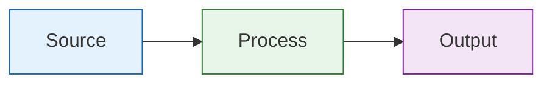

# Style Guide

Guidelines for documentation and Go code in the Deputy project.

## Documentation Style

### Principles

- Prefer **short, skimmable** pages with links to deeper docs
- Keep emoji usage **minimal and intentional** (avoid decoration-only emoji)
- Prefer diagrams (Mermaid) when they replace paragraphs
- Link to code where it clarifies "where this lives" or "how it works"

### Markdown Conventions

```markdown
# Page Title (H1 - one per page)

## Major Section (H2)

### Subsection (H3)

Use **bold** for emphasis, `code` for identifiers, commands, flags.

| Column | Column |    <- Tables for structured data
|--------|--------|
| data   | data   |
```

### Code Blocks

Always specify the language:

````markdown
```go
func Example() {}
```

```console
$ deputy scan --format json
```

```yaml
policies:
  - name: example
```
````

Use `console` (not `bash` or `shell`) for command examples with `$` prompts.

### Diagrams

Use Mermaid for workflows, architecture, and sequences:

```markdown

```

Keep diagrams small enough to read in GitHub's default width.

---

## Go Code Style

Deputy uses modern, idiomatic Go. Follow these patterns.

### Use Modern stdlib Packages

Prefer packages introduced in Go 1.21+:

```go
// Good: modern stdlib
import (
    "cmp"
    "log/slog"
    "maps"
    "slices"
)

// Avoid: older patterns when modern alternatives exist
import (
    "log"      // use log/slog
    "sort"     // use slices.Sort, slices.SortFunc
)
```

### slices Package

```go
// Good: slices package
slices.Sort(items)
slices.SortFunc(vulns, func(a, b Vuln) int {
    return cmp.Compare(a.Severity, b.Severity)
})
slices.Contains(ecosystems, "go")
slices.Clone(original)
idx := slices.Index(items, target)
filtered := slices.DeleteFunc(items, func(v Vuln) bool {
    return v.Severity == "LOW"
})

// Avoid: manual loops for common operations
found := false
for _, e := range ecosystems {
    if e == "go" {
        found = true
        break
    }
}
```

### maps Package

```go
// Good: maps package
keys := slices.Collect(maps.Keys(m))
values := slices.Collect(maps.Values(m))
copy := maps.Clone(original)
maps.DeleteFunc(m, func(k string, v int) bool {
    return v == 0
})

// Avoid: manual iteration for common operations
keys := make([]string, 0, len(m))
for k := range m {
    keys = append(keys, k)
}
```

### iter Package (Go 1.23+)

```go
// Good: iterators for lazy evaluation
func (inv *Inventory) Packages() iter.Seq[Package] {
    return func(yield func(Package) bool) {
        for _, pkg := range inv.packages {
            if !yield(pkg) {
                return
            }
        }
    }
}

// Collecting from iterators
packages := slices.Collect(inv.Packages())

// Filtering with iterators
direct := slices.Collect(filterDirect(inv.Packages()))
```

### cmp Package

```go
// Good: cmp for comparisons
slices.SortFunc(items, func(a, b Item) int {
    if c := cmp.Compare(a.Priority, b.Priority); c != 0 {
        return c
    }
    return cmp.Compare(a.Name, b.Name)
})

// cmp.Or for default values (Go 1.22+)
name := cmp.Or(config.Name, "default")
port := cmp.Or(opts.Port, 8080)
```

### log/slog for Logging

```go
// Good: structured logging with slog
slog.Info("scan complete",
    "packages", len(packages),
    "vulnerabilities", len(vulns),
    "duration", time.Since(start),
)

slog.Debug("querying OSV",
    "ecosystem", ecosystem,
    "count", len(packages),
)

slog.Error("failed to fetch",
    "url", url,
    "error", err,
)

// With context/logger
logger := slog.With("command", "scan", "target", target)
logger.Info("starting scan")

// Avoid: fmt.Printf for operational logs
fmt.Printf("Scanned %d packages\n", len(packages))
```

### Align Code to the Left (Happy Path)

Handle errors and edge cases first, keep the main logic unindented:

```go
// Good: early returns, happy path aligned left
func Process(input string) (Result, error) {
    if input == "" {
        return Result{}, errors.New("empty input")
    }

    data, err := fetch(input)
    if err != nil {
        return Result{}, fmt.Errorf("fetch: %w", err)
    }

    parsed, err := parse(data)
    if err != nil {
        return Result{}, fmt.Errorf("parse: %w", err)
    }

    // Happy path - main logic here, not nested
    result := transform(parsed)
    return result, nil
}

// Avoid: else blocks and deep nesting
func Process(input string) (Result, error) {
    if input != "" {
        data, err := fetch(input)
        if err == nil {
            parsed, err := parse(data)
            if err == nil {
                result := transform(parsed)
                return result, nil
            } else {
                return Result{}, fmt.Errorf("parse: %w", err)
            }
        } else {
            return Result{}, fmt.Errorf("fetch: %w", err)
        }
    } else {
        return Result{}, errors.New("empty input")
    }
}
```

### Avoid else - Use Early Returns

```go
// Good: no else needed
func GetSeverity(score float64) string {
    if score >= 9.0 {
        return "CRITICAL"
    }
    if score >= 7.0 {
        return "HIGH"
    }
    if score >= 4.0 {
        return "MEDIUM"
    }
    return "LOW"
}

// Avoid: else chains
func GetSeverity(score float64) string {
    if score >= 9.0 {
        return "CRITICAL"
    } else if score >= 7.0 {
        return "HIGH"
    } else if score >= 4.0 {
        return "MEDIUM"
    } else {
        return "LOW"
    }
}
```

### Prefer switch Over if-else Chains

```go
// Good: switch for multiple conditions
func FormatOutput(format string, data any) ([]byte, error) {
    switch format {
    case "json":
        return json.Marshal(data)
    case "yaml":
        return yaml.Marshal(data)
    case "text", "":
        return formatText(data)
    default:
        return nil, fmt.Errorf("unsupported format: %s", format)
    }
}

// Good: type switch
func Process(v any) error {
    switch x := v.(type) {
    case string:
        return processString(x)
    case []byte:
        return processBytes(x)
    case io.Reader:
        return processReader(x)
    default:
        return fmt.Errorf("unsupported type: %T", v)
    }
}

// Good: switch true for complex conditions
func Classify(pkg Package) string {
    switch {
    case pkg.Ecosystem == "go" && strings.HasPrefix(pkg.Name, "golang.org/x/"):
        return "golang-extended"
    case pkg.Direct && len(pkg.Vulnerabilities) > 0:
        return "direct-vulnerable"
    case !pkg.Direct && len(pkg.Vulnerabilities) > 0:
        return "transitive-vulnerable"
    default:
        return "ok"
    }
}
```

### Error Handling

```go
// Good: wrap errors with context
data, err := os.ReadFile(path)
if err != nil {
    return fmt.Errorf("reading manifest %s: %w", path, err)
}

// Good: errors.Is and errors.As for checking
if errors.Is(err, os.ErrNotExist) {
    return nil, nil // file doesn't exist is ok
}

var parseErr *ParseError
if errors.As(err, &parseErr) {
    slog.Warn("parse error", "line", parseErr.Line, "error", parseErr)
}

// Good: sentinel errors for expected conditions
var ErrNotFound = errors.New("not found")

func Find(id string) (Item, error) {
    item, ok := cache[id]
    if !ok {
        return Item{}, ErrNotFound
    }
    return item, nil
}
```

### Idiomatic Godoc Comments

```go
// Package inventory extracts dependency information from manifest files.
//
// It supports multiple ecosystems (Go, npm, PyPI, RubyGems) and normalizes
// all packages to PURLs for consistent downstream processing.
package inventory

// Extractor discovers packages from a filesystem or Git tree.
// Implementations exist for each supported ecosystem.
type Extractor interface {
    // Extract returns packages found in the given root directory.
    // It returns an empty slice (not nil) if no packages are found.
    Extract(ctx context.Context, root fs.FS) ([]Package, error)

    // Ecosystems returns the ecosystem identifiers this extractor handles.
    Ecosystems() []string
}

// Package represents a software dependency with normalized metadata.
type Package struct {
    Name      string   // Package name (e.g., "github.com/gin-gonic/gin")
    Version   string   // Semantic version (e.g., "v1.9.1")
    Ecosystem string   // Ecosystem identifier (e.g., "go", "npm")
    PURL      string   // Package URL per purl-spec
    Direct    bool     // True if explicitly declared in manifest
    Licenses  []string // SPDX license identifiers
}

// NewInventory creates an Inventory from the given packages.
// It deduplicates by PURL and sorts by name.
func NewInventory(packages []Package) *Inventory {
    // ...
}
```

### Function and Variable Naming

```go
// Good: clear, concise names
func (c *Client) QueryVulnerabilities(ctx context.Context, pkgs []Package) ([]Vulnerability, error)
func ParseManifest(r io.Reader) (*Manifest, error)
func (p *Policy) Evaluate(input map[string]any) ([]Action, error)

// Good: acronyms as words in mixed case
var httpClient *http.Client  // not HTTPClient
type jsonOutput struct{}     // not JSONOutput
func parseURL(s string)      // not parseUrl

// Good: short names for short scopes
for i, pkg := range packages {
    // i, pkg are fine here
}

// Good: descriptive names for longer scopes
func processVulnerabilities(vulnerabilities []Vulnerability) {
    vulnerabilitiesBySeverity := make(map[string][]Vulnerability)
    // ...
}
```

### Struct Initialization

```go
// Good: named fields for clarity
client := &Client{
    BaseURL:    "https://api.osv.dev",
    HTTPClient: http.DefaultClient,
    Timeout:    30 * time.Second,
}

// Good: zero values are meaningful
var buf bytes.Buffer  // ready to use
var mu sync.Mutex     // ready to use

// Good: constructors for complex initialization
func NewEvaluator(opts ...Option) (*Evaluator, error) {
    e := &Evaluator{
        timeout: 5 * time.Second,  // default
    }
    for _, opt := range opts {
        if err := opt(e); err != nil {
            return nil, err
        }
    }
    return e, nil
}
```

### Context Usage

```go
// Good: context as first parameter
func (c *Client) Fetch(ctx context.Context, url string) ([]byte, error) {
    req, err := http.NewRequestWithContext(ctx, "GET", url, nil)
    if err != nil {
        return nil, err
    }
    // ...
}

// Good: respect context cancellation
func Process(ctx context.Context, items []Item) error {
    for _, item := range items {
        select {
        case <-ctx.Done():
            return ctx.Err()
        default:
        }
        if err := processItem(ctx, item); err != nil {
            return err
        }
    }
    return nil
}
```

### Table-Driven Tests

```go
func TestGetSeverity(t *testing.T) {
    tests := []struct {
        name  string
        score float64
        want  string
    }{
        {"critical", 9.5, "CRITICAL"},
        {"critical boundary", 9.0, "CRITICAL"},
        {"high", 7.5, "HIGH"},
        {"high boundary", 7.0, "HIGH"},
        {"medium", 5.0, "MEDIUM"},
        {"low", 2.0, "LOW"},
        {"zero", 0, "LOW"},
    }

    for _, tt := range tests {
        t.Run(tt.name, func(t *testing.T) {
            got := GetSeverity(tt.score)
            if got != tt.want {
                t.Errorf("GetSeverity(%v) = %q, want %q", tt.score, got, tt.want)
            }
        })
    }
}
```

## Summary

| Principle | Pattern |
|-----------|---------|
| Modern stdlib | `slices`, `maps`, `iter`, `cmp`, `log/slog` |
| Happy path left | Early returns, no else when avoidable |
| Explicit flow | `switch` over `if-else` chains |
| Error context | `fmt.Errorf("context: %w", err)` |
| Clear names | Concise but descriptive, acronyms as words |
| Structured logs | `slog` with key-value pairs |
| Test style | Table-driven with `t.Run` |

## See Also

- [Contributing](contributing.md) - Development workflow
- [Architecture](architecture.md) - System design
- [Effective Go](https://go.dev/doc/effective_go)
- [Go Code Review Comments](https://github.com/golang/go/wiki/CodeReviewComments)
