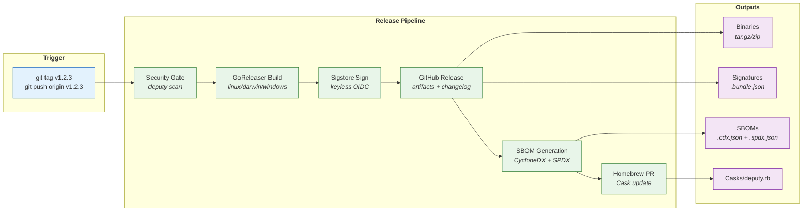
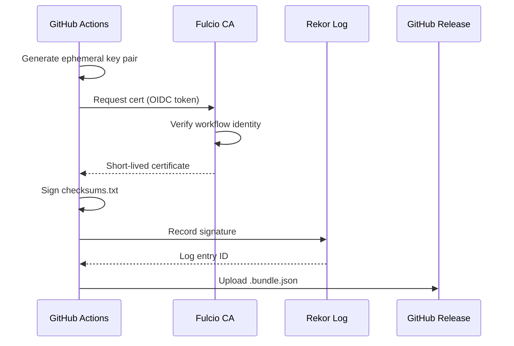

# Releases

This document covers how Deputy releases are built, signed, and published.

## Release Flow



## Release Process

Releases are triggered by pushing a version tag:

```bash
git tag v1.2.3
git push origin v1.2.3
```

This triggers the [release workflow](../../.github/workflows/release.yml) which:

1. **Security gate** - Scans for vulnerabilities before releasing
2. **Build** - Cross-compiles binaries via GoReleaser
3. **Sign** - Signs checksums with Sigstore/Cosign
4. **Publish** - Creates GitHub release with assets
5. **SBOM** - Generates and signs SBOMs with Deputy itself
6. **Homebrew** - Opens PR to update the Cask

## Release Artifacts

Each release includes:

| Artifact | Description |
|----------|-------------|
| `deputy_X.Y.Z_<os>_<arch>.tar.gz` | Binary archives |
| `checksums.txt` | SHA256 checksums |
| `checksums.txt.bundle.json` | Sigstore bundle (signature + certificate) |
| `deputy_vX.Y.Z.sbom.cdx.json` | CycloneDX SBOM (generated by Deputy) |
| `deputy_vX.Y.Z.sbom.cdx.json.bundle.json` | SBOM Sigstore bundle |
| `deputy_vX.Y.Z.sbom.spdx.json` | SPDX SBOM (generated by Deputy) |
| `deputy_vX.Y.Z.sbom.spdx.json.bundle.json` | SBOM Sigstore bundle |

## Signing

### How it works

Deputy uses [Sigstore](https://sigstore.dev) keyless signing:



1. GitHub Actions requests an OIDC token from GitHub
2. Sigstore's Fulcio CA issues a short-lived certificate bound to the workflow identity
3. Cosign signs the artifact with the ephemeral key
4. The signature is recorded in Sigstore's Rekor transparency log

No long-lived secrets are required. The signing identity is:

```
Subject: https://github.com/picatz/deputy/.github/workflows/release.yml@refs/tags/vX.Y.Z
Issuer: https://token.actions.githubusercontent.com
```

### Verification

Users verify releases with:

```bash
cosign verify-blob \
    --bundle checksums.txt.bundle.json \
    --certificate-oidc-issuer https://token.actions.githubusercontent.com \
    --certificate-identity-regexp 'https://github.com/picatz/deputy/.github/workflows/release.yml@.*' \
    checksums.txt
```

See [Verifying Releases](../guides/verifying-releases.md) for full user-facing documentation.

## GoReleaser Configuration

The [`.goreleaser.yaml`](../../.goreleaser.yaml) configures:

- **Cross-compilation**: Linux, macOS, Windows (amd64, arm64)
- **Ldflags**: Injects version via `-X github.com/picatz/deputy/internal/version.Value={{.Version}}`
- **Archives**: tar.gz (Unix), zip (Windows)
- **Checksums**: SHA256
- **Signing**: Cosign keyless via `signs` config
- **Homebrew**: Auto-generates Cask and opens PR

### Version Injection

The version is injected at build time:

```yaml
ldflags:
  - -s -w
  - -X github.com/picatz/deputy/internal/version.Value={{.Version}}
```

This sets `version.Value` in the `internal/version` package. For local builds, it defaults to `0.0.0-dev`.

## GitHub Actions

### Workflows

| Workflow | Trigger | Purpose |
|----------|---------|---------|
| `ci.yml` | Push, PR | Build, test, lint |
| `security.yml` | Push, PR | Self-scan, PR security gate |
| `release.yml` | Version tag | Build and publish release |

### Reusable Workflows

| Workflow | Purpose |
|----------|---------|
| `scan.yml` | Vulnerability scanning (SARIF) |
| `pr-gate.yml` | PR security checks with diff |
| `release-sbom.yml` | SBOM generation on release |

### Actions

| Action | Purpose |
|--------|---------|
| `actions/setup/` | Install Deputy CLI |
| `actions/scan/` | Vulnerability scan + SARIF upload |
| `actions/diff/` | Dependency diff for PRs |
| `actions/sbom/` | SBOM generation |
| `actions/proxy/` | Policy-enforcing proxy |

### Permissions

Release workflow requires:

```yaml
permissions:
  contents: write        # Release creation
  security-events: write # SARIF upload
  id-token: write        # Sigstore OIDC signing
  pull-requests: write   # Homebrew cask PR
```

## Homebrew

The release workflow auto-generates a Homebrew cask and opens a PR to update it:

```yaml
homebrew_casks:
  - name: deputy
    repository:
      owner: picatz
      name: deputy
      branch: main
      pull_request:
        enabled: true
```

The PR updates `Casks/deputy.rb` with the new version and checksums. We use `homebrew_casks` (not `brews`) as it's the correct approach for pre-built binaries.

## Maintenance Tasks

### Updating dependencies

```bash
go get -u ./...
go mod tidy
go test ./...
```

### Testing release locally

```bash
# Test GoReleaser config without publishing
goreleaser release --snapshot --clean

# Build with version injection
go build -ldflags "-X github.com/picatz/deputy/internal/version.Value=1.2.3" -o deputy .
./deputy --version
```

### Debugging release issues

1. Check the [release workflow runs](https://github.com/picatz/deputy/actions/workflows/release.yml)
2. Verify the tag format: `v1.2.3` (must start with `v`)
3. Check GoReleaser logs for build errors
4. Verify Cosign signing succeeded (requires `id-token: write` permission)

### Rotating signing keys

Sigstore keyless signing doesn't use persistent keys - each release gets a fresh ephemeral certificate. No key rotation is needed.

If you need to revoke trust in old releases:

1. Delete the release from GitHub
2. The Rekor log entry remains (transparency), but users can no longer download artifacts

## Security Considerations

### Supply chain protections

1. **Signed releases**: All checksums are signed with Sigstore
2. **SBOM generation**: Deputy generates its own SBOM (dogfooding)
3. **Security gate**: Releases blocked if critical vulnerabilities exist
4. **Minimal permissions**: Workflows use least-privilege permissions
5. **No hardcoded secrets**: All signing uses OIDC tokens

### Script injection prevention

All GitHub Actions workflows pass user-controlled values through environment variables, never directly in `run:` blocks:

```yaml
# Good - injection safe
env:
  TAG: ${{ github.ref_name }}
run: echo "$TAG"

# Bad - vulnerable to injection
run: echo "${{ github.ref_name }}"
```

## See Also

- [Verifying Releases](../guides/verifying-releases.md) - User guide for verification
- [GitHub Actions Guide](../guides/github-actions.md) - Using Deputy in CI
- [GoReleaser docs](https://goreleaser.com/intro/)
- [Sigstore docs](https://docs.sigstore.dev/)
