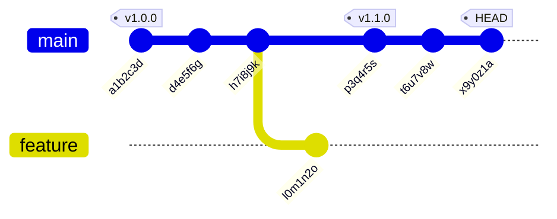
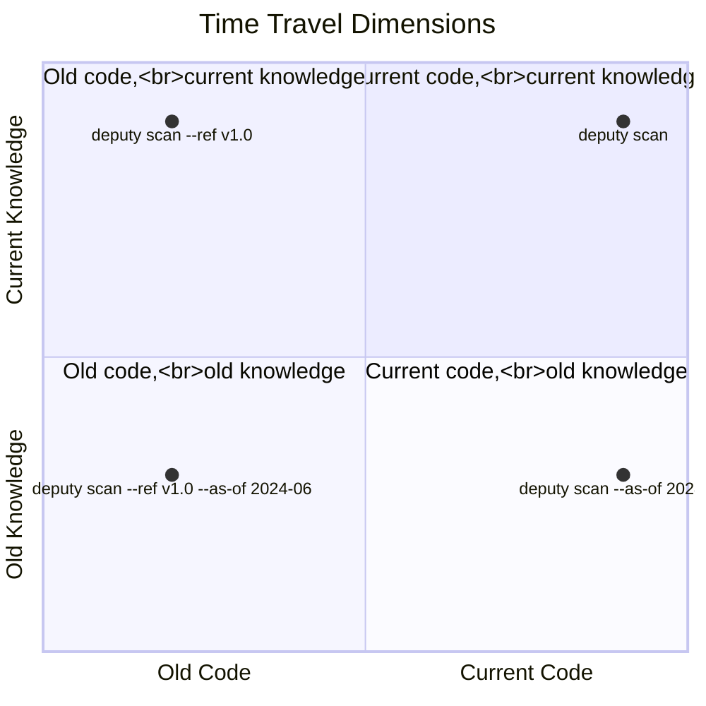

# Time Travel: WORKING and `@{...}` Refs

Deputy embraces Git's ref model so you can answer "what changed?" and "when did it change?" precisely.

## How Time Travel Works

Deputy resolves Git refs to snapshots, letting you compare any two points in your repository's history:

```mermaid
flowchart LR
    subgraph Refs["Git References"]
        direction TB
        Branch["main, develop"]
        Tag["v1.0.0, v2.0.0"]
        Commit["abc123, HEAD~3"]
        Time["HEAD@{yesterday}"]
        Working["WORKING / ."]
    end

    subgraph Resolution["Deputy Resolution"]
        direction TB
        Resolve["Resolve ref"]
        Snapshot["Extract snapshot"]
        Inventory["Build inventory"]
    end

    subgraph Analysis["Analysis"]
        direction TB
        Compare["Compare inventories"]
        Scan["Vuln scan"]
        Report["Generate report"]
    end

    Refs --> Resolve
    Resolve --> Snapshot
    Snapshot --> Inventory
    Inventory --> Compare
    Compare --> Scan
    Scan --> Report

    classDef source fill:#e3f2fd,stroke:#1565c0
    classDef process fill:#e8f5e9,stroke:#2e7d32
    classDef output fill:#f3e5f5,stroke:#7b1fa2

    class Branch,Tag,Commit,Time,Working source
    class Resolve,Snapshot,Inventory,Compare,Scan process
    class Report output
```



## Working Tree Compare (WORKING)

When you run `deputy diff` with no args inside a repo:

- **Default**: compares default branch to `HEAD`
- **If manifests changed**: compares default branch to `WORKING` (uncommitted state)

You can always be explicit:

```console
$ deputy diff main WORKING
$ deputy diff main .          # shorthand for WORKING
```

### Example: Reviewing uncommitted changes

```console
$ deputy diff main WORKING

Comparing dependencies: main → WORKING
Scanning packages in working tree...
Scanning packages in base reference abc123d...

Dependency Changes:
  ↑ github.com/example/pkg @ 1.0.0 → 1.1.0 (direct)
  + github.com/new/dep @ 2.0.0 (indirect)

Summary:
  + 1 package added
  ↑ 1 package upgraded

Scanning dependencies for vulnerabilities...

∴ Vulnerabilities

github.com/new/dep v2.0.0:
  • CVE-2024-1234 [HIGH] (↑ v2.0.1)
    Remote code execution in request handler
    Published: 2024-11-15
```

## Time-Based References

Git supports time expressions via `@{...}`. Quote these to avoid shell expansion.

The following diagram shows how time-based refs map to your commit history:



```
Time expressions resolve to commits in the reflog:

  HEAD@{yesterday}     --> t6u7v8w (commit from yesterday)
  main@{1.week.ago}    --> h7i8j9k (main's state 1 week ago)
  HEAD@{3}             --> p3q4r5s (3 commits before HEAD in reflog)
```

```console
$ deputy diff "HEAD@{yesterday}" HEAD
$ deputy diff "main@{1.week.ago}" main
$ deputy diff "main@{3.month.ago}" main
$ deputy diff "HEAD@{1.year.ago}" HEAD
```

### Supported Time Units

| Unit | Aliases |
|------|---------|
| seconds | s, sec, second, seconds |
| minutes | m, min, minute, minutes |
| hours | h, hr, hour, hours |
| days | d, day, days |
| weeks | w, wk, week, weeks |
| months | mo, mon, month, months |
| years | y, yr, year, years |

Special values: `now`, `yesterday`

### Example: Weekly dependency review

```console
$ deputy diff "HEAD@{1.week.ago}" HEAD

Comparing dependencies: HEAD@{1.week.ago} → HEAD
Scanning packages in HEAD...
Scanning packages in base reference d4e5f6a...

Dependency Changes:
  ↑ golang.org/x/crypto @ 0.17.0 → 0.21.0 (indirect)
  ↑ github.com/gin-gonic/gin @ 1.9.0 → 1.9.1 (direct)
  - github.com/deprecated/pkg @ 1.0.0 (indirect)

Summary:
  - 1 package removed
  ↑ 2 packages upgraded

Scanning dependencies for vulnerabilities...

∴ Vulnerabilities

✓ No vulnerabilities found in changed packages

Note: golang.org/x/crypto upgrade fixed CVE-2023-48795 (HIGH)
```

### Example: Incident response - when was vulnerability introduced?

```console
# Binary search through time to find when a vulnerable dep appeared
$ deputy scan --ref "main@{2.weeks.ago}" | grep CVE-2024-5678
# (no output - not present)

$ deputy scan --ref "main@{1.week.ago}" | grep CVE-2024-5678
CVE-2024-5678 [CRITICAL]

# Narrow down further
$ deputy scan --ref "main@{10.days.ago}" | grep CVE-2024-5678
# (no output)

$ deputy scan --ref "main@{9.days.ago}" | grep CVE-2024-5678
CVE-2024-5678 [CRITICAL]

# Found: vulnerability introduced 9 days ago
```

## Combining Time Travel with Historical OSV

Time travel has two dimensions: **code state** (Git refs) and **knowledge state** (OSV data). You can combine them:



Pair time-based refs with `--as-of` to see what was known at a specific point:

```console
# What vulnerabilities were known in v1.0.0 when it shipped?
$ deputy scan --ref v1.0.0 --as-of=2024-06-15

# Compare two releases with knowledge available at release time
$ deputy diff v1.0.0 v2.0.0 --as-of=2024-09-01
```

### Example: Post-incident analysis

```console
# We shipped v2.3.0 on 2024-08-15. What did we know then vs now?

# What we knew at ship time
$ deputy scan --ref v2.3.0 --as-of=2024-08-15 --format json | jq '.stats'
{
  "total": 3,
  "critical": 0,
  "high": 1,
  "medium": 2,
  "low": 0
}

# What we know now (same code, current OSV data)
$ deputy scan --ref v2.3.0 --format json | jq '.stats'
{
  "total": 7,
  "critical": 1,
  "high": 3,
  "medium": 3,
  "low": 0
}

# 4 new vulnerabilities disclosed since ship date
```

## Practical Use Cases

### 1. Daily standup check

```console
# What changed since yesterday?
$ deputy diff "HEAD@{yesterday}" HEAD
```

### 2. Sprint retrospective

```console
# Dependency changes over the sprint
$ deputy diff "main@{2.weeks.ago}" main --licenses
```

### 3. Release preparation

```console
# Compare release branch to main
$ deputy diff main release/v2.0

# Or compare to previous release tag
$ deputy diff v1.9.0 release/v2.0
```

### 4. Quarterly security review

```console
# Vulnerability trend over the quarter
$ deputy scan --ref "main@{3.months.ago}" --format json > q3-start.json
$ deputy scan --format json > q3-end.json

# Compare with jq
$ jq -s '.[0].stats.total as $start | .[1].stats.total as $end |
  {start: $start, end: $end, delta: ($end - $start)}' q3-start.json q3-end.json
```

### 5. Audit trail for compliance

```console
# Generate SBOMs at specific points for audit
$ deputy sbom --ref v1.0.0 --output sbom-v1.0.0.json
$ deputy sbom --ref v2.0.0 --output sbom-v2.0.0.json

# Diff the component lists
$ deputy diff v1.0.0 v2.0.0 --skip-vuln-scan
```

## Common Pitfalls

### Shell expansion

Always quote refs containing `@{...}`:

```console
# Wrong - shell tries to expand @{...}
$ deputy diff HEAD@{yesterday} HEAD

# Correct
$ deputy diff "HEAD@{yesterday}" HEAD
```

### Reflog availability

Time-based refs rely on Git's reflog. If reflog entries have expired (default: 90 days for unreachable, 30 days for reachable), the ref may not resolve.

```console
# Check reflog availability
$ git reflog show main --date=relative

# If needed, fetch older history
$ git fetch --unshallow
```

## See Also

- [Targets and Refs](../concepts/targets-and-refs.md) - Full ref syntax
- [diff command](../commands/diff.md) - Complete diff reference
- [Historical Analysis](historical-analysis.md) - `--as-of` and published date filters
