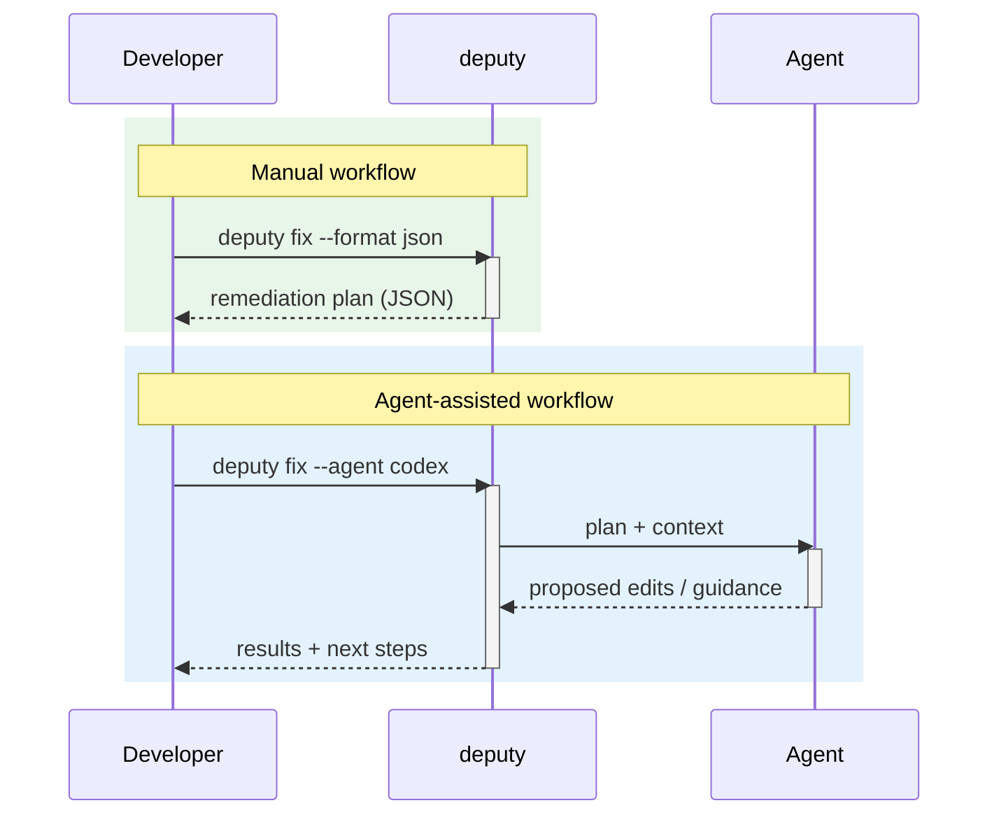

# Agents & automation

Deputy can delegate some workflows to external agents to reduce manual toil.

## Where agents fit

## Safety checklist

- Prefer `--agent-sandbox read-only` when you only need analysis.
- Use `workspace-write` when the agent needs to edit files and run tests.
- Avoid `--agent-full-auto` unless you’re comfortable with unattended changes.
- Generate plans with `--format json` first so humans can review.

## Code pointers

- Agent integrations: [`internal/cli/cmd/fix.go`](../../internal/cli/cmd/fix.go), [`internal/cli/cmd/triage.go`](../../internal/cli/cmd/triage.go)
