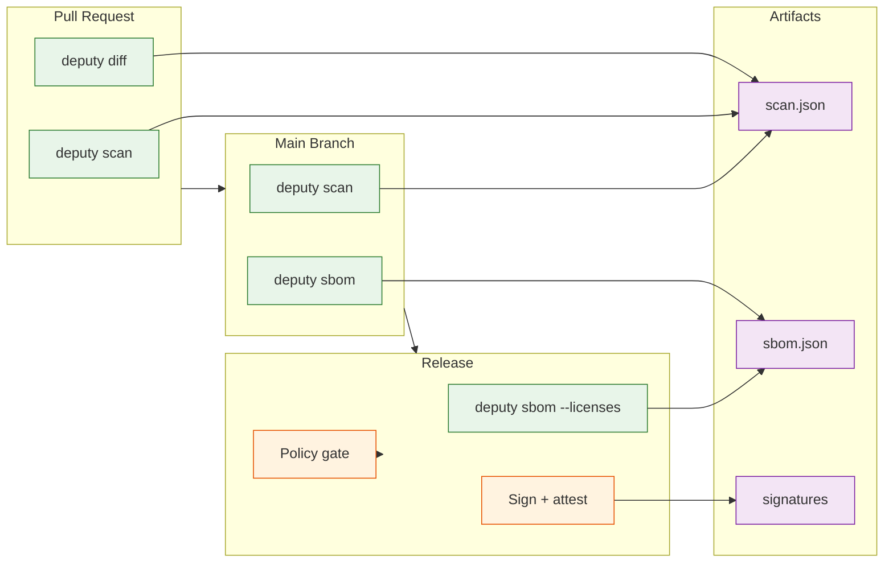
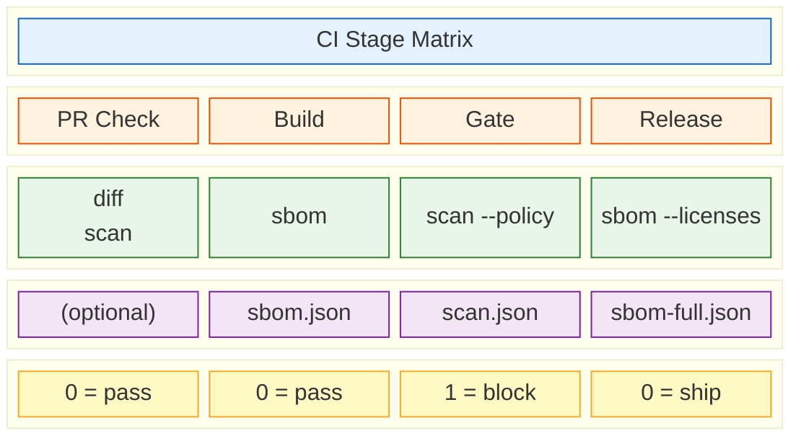

# CI Integration

Deputy integrates into CI/CD pipelines for two main purposes:

1. **Gate merges/releases** — fail builds on unacceptable risk
2. **Produce artifacts** — JSON reports + SBOMs for audit, compliance, and trending

## CI Pipeline Overview



## GitHub Actions

### Basic scan + SBOM

```yaml
name: deputy
on:
  pull_request:
  push:
    branches: [main]

jobs:
  scan:
    runs-on: ubuntu-latest
    steps:
      - uses: actions/checkout@v4
      - uses: actions/setup-go@v5
        with:
          go-version: "stable"
      - run: go install github.com/picatz/deputy@latest

      # Scan for vulnerabilities
      - run: deputy scan --format json --output scan.json

      # Generate SBOM
      - run: deputy sbom --format spdx-json --output sbom.spdx.json

      # Upload artifacts for audit trail
      - uses: actions/upload-artifact@v4
        with:
          name: deputy-reports
          path: |
            scan.json
            sbom.spdx.json
```

### With policy enforcement

```yaml
jobs:
  scan:
    runs-on: ubuntu-latest
    steps:
      - uses: actions/checkout@v4
      - uses: actions/setup-go@v5
        with:
          go-version: "stable"
      - run: go install github.com/picatz/deputy@latest

      # Fail if policy violations found
      - run: deputy scan --policy policy/severity-guardrail.yaml

      # Or use a bundled policy
      - run: |
          deputy policy bundle --out corp.bundle.json policy/*.yaml
          deputy scan --policy corp.bundle.json
```

### PR diff analysis

```yaml
jobs:
  diff:
    runs-on: ubuntu-latest
    if: github.event_name == 'pull_request'
    steps:
      - uses: actions/checkout@v4
        with:
          fetch-depth: 0  # Need full history for diff
      - uses: actions/setup-go@v5
        with:
          go-version: "stable"
      - run: go install github.com/picatz/deputy@latest

      # Compare PR branch against base
      - run: deputy diff ${{ github.event.pull_request.base.sha }} ${{ github.sha }}
```

## GitLab CI

```yaml
stages:
  - security

deputy-scan:
  stage: security
  image: golang:latest
  before_script:
    - go install github.com/picatz/deputy@latest
  script:
    - deputy scan --format json --output scan.json
    - deputy sbom --format cyclonedx-json --output sbom.cdx.json
  artifacts:
    paths:
      - scan.json
      - sbom.cdx.json
    reports:
      # GitLab can parse SARIF for security dashboard
      sast: scan.json
```

## Azure DevOps

```yaml
trigger:
  - main

pool:
  vmImage: 'ubuntu-latest'

steps:
  - task: GoTool@0
    inputs:
      version: '1.22'

  - script: go install github.com/picatz/deputy@latest
    displayName: 'Install Deputy'

  - script: |
      deputy scan --format json --output $(Build.ArtifactStagingDirectory)/scan.json
      deputy sbom --format spdx-json --output $(Build.ArtifactStagingDirectory)/sbom.spdx.json
    displayName: 'Run Deputy'

  - task: PublishBuildArtifacts@1
    inputs:
      pathToPublish: '$(Build.ArtifactStagingDirectory)'
      artifactName: 'deputy-reports'
```

## CircleCI

```yaml
version: 2.1

jobs:
  security-scan:
    docker:
      - image: cimg/go:1.22
    steps:
      - checkout
      - run:
          name: Install Deputy
          command: go install github.com/picatz/deputy@latest
      - run:
          name: Scan
          command: |
            deputy scan --format json --output scan.json
            deputy sbom --format spdx-json --output sbom.spdx.json
      - store_artifacts:
          path: scan.json
      - store_artifacts:
          path: sbom.spdx.json

workflows:
  security:
    jobs:
      - security-scan
```

## CI Stage Matrix

The following diagram shows which Deputy commands to run at each CI stage:



## Best Practices

### 1. Use policies for maintainable rules

Instead of parsing JSON output in scripts, encode rules in policies:

```yaml
# policy/ci-guardrails.yaml
policies:
  - name: ci-vulnerability-gate
    rules:
      - action: deny
        when: vulnerabilities.exists(v, v.severity in ["CRITICAL", "HIGH"])
        reason: "Critical/high severity vulnerabilities must be addressed before merge"
```

```console
$ deputy scan --policy policy/ci-guardrails.yaml
```

### 2. Archive artifacts for compliance

Store scan results and SBOMs with your release artifacts:
- Enables retroactive analysis ("what did we ship?")
- Satisfies audit requirements
- Allows trending over time

### 3. Use `--ignore-unfixed` thoughtfully

`--ignore-unfixed` hides vulnerabilities without known fixes. Use it to reduce noise, but be aware it hides real issues.

### 4. Pin Deputy versions for reproducibility

```console
$ go install github.com/picatz/deputy@v1.2.3
```

### 5. Set exit codes appropriately

Deputy exits with:
- `0` — success (no policy violations)
- `1` — policy violations or scan failures
- Use this for gating merges

## Related

- [Policy concepts](../concepts/policies.md)
- [Policy framework](../reference/policy-framework.md)
- [Troubleshooting](troubleshooting.md)
