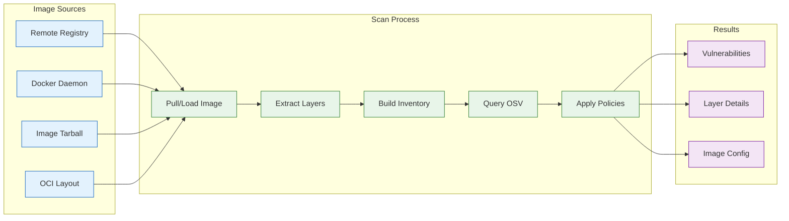

# Container Image Security

This guide covers scanning container images for vulnerabilities and writing policies to enforce security standards.

## Quick Start

Scan a container image in under 30 seconds:

```console
# Scan a remote image
$ deputy scan nginx:1.25

# Scan with JSON output for CI
$ deputy scan --format json ghcr.io/your-org/app:v1.2.3

# Scan a local Docker daemon image
$ deputy scan docker-daemon://myapp:latest
```

## How Container Scanning Works



Deputy extracts the software inventory from each layer of the container image, queries OSV for vulnerabilities, and enriches results with layer-specific metadata so you know exactly where each vulnerability was introduced.

## Image Source Types

### Remote Registry (Default)

Pull and scan images from any OCI-compatible registry:

```console
# Docker Hub
$ deputy scan nginx:1.25
$ deputy scan library/alpine:3.19

# GitHub Container Registry
$ deputy scan ghcr.io/owner/app:v1.0.0

# Google Container Registry
$ deputy scan gcr.io/project/image:tag

# Amazon ECR
$ deputy scan 123456789.dkr.ecr.us-east-1.amazonaws.com/app:latest

# With explicit scheme
$ deputy scan oci://ghcr.io/owner/app:v1.0.0
```

### Local Docker Daemon

Scan images already pulled to your local Docker daemon (avoids rate limits):

```console
# Explicit scheme
$ deputy scan docker-daemon://myapp:latest

# Using --source flag
$ deputy scan --source docker-daemon myapp:latest
```

### Image Tarball

Scan images saved with `docker save`:

```console
# Save and scan
$ docker save myapp:latest -o myapp.tar
$ deputy scan tarball://myapp.tar

# Or with --source
$ deputy scan --source tarball ./myapp.tar
```

### OCI Layout Directory

Scan images in OCI image layout format:

```console
$ deputy scan oci-layout:///path/to/layout
```

## Registry Authentication

Deputy uses Docker's credential system automatically:

```console
# Login to a registry (credentials stored in ~/.docker/config.json)
$ docker login ghcr.io
$ deputy scan ghcr.io/private/image:tag  # Uses stored credentials
```

### Cloud Provider Setup

**Google Cloud (GCR/Artifact Registry):**
```console
$ gcloud auth configure-docker
$ deputy scan gcr.io/your-project/image:tag
```

**Amazon ECR:**
```console
$ aws ecr get-login-password | docker login --username AWS --password-stdin 123456789.dkr.ecr.us-east-1.amazonaws.com
$ deputy scan 123456789.dkr.ecr.us-east-1.amazonaws.com/app:tag
```

**Azure Container Registry:**
```console
$ az acr login --name yourregistry
$ deputy scan yourregistry.azurecr.io/image:tag
```

**GitHub Container Registry:**
```console
$ echo $GITHUB_TOKEN | docker login ghcr.io -u USERNAME --password-stdin
$ deputy scan ghcr.io/owner/image:tag
```

## Multi-Architecture Images

Scan specific platforms for multi-arch images:

```console
# Scan linux/amd64 variant
$ deputy scan --platform linux/amd64 nginx:1.25

# Scan ARM64 variant
$ deputy scan --platform linux/arm64 alpine:3.19

# With variant (e.g., ARMv7)
$ deputy scan --platform linux/arm/v7 debian:bookworm
```

## Understanding Scan Results

### Layer-Aware Vulnerabilities

When scanning container images, each vulnerability includes layer details. To enable base image detection (determining whether a package came from your base image vs. your Dockerfile), use the `--detect-base-image` flag:

```console
# Enable base image detection for layer-aware analysis
$ deputy scan --detect-base-image nginx:1.25

# Combine with layer-aware policies
$ deputy scan --detect-base-image --policy policy/examples/container-layer-vulnerability.yaml ghcr.io/org/app:v1
```

Each vulnerability then includes layer details:

```json
{
  "advisory": {
    "id": "CVE-2024-1234",
    "severity": {"level": "SEVERITY_LEVEL_HIGH"}
  },
  "package": {
    "name": "openssl",
    "version": "1.1.1k",
    "ecosystem": "deb"
  },
  "layer_details": {
    "index": 3,
    "diff_id": "sha256:abc...",
    "command": "RUN apt-get install -y openssl",
    "in_base_image": true
  }
}
```

This tells you:
- **index**: Which layer introduced the package (0 = base layer)
- **diff_id**: The layer's content hash
- **command**: The Dockerfile instruction that created the layer
- **in_base_image**: Whether it came from your base image (FROM instruction)

### Image Configuration

Deputy extracts image configuration for policy evaluation:

```yaml
image:
  config:
    user: "app"           # USER directive (empty = root)
    is_root: false        # true if running as root
    entrypoint: ["/app"]
    cmd: ["serve"]
    env: ["PATH=/usr/bin"]
    exposed_ports: ["8080/tcp"]
    labels:
      version: "1.0.0"
  metadata:
    architecture: "amd64"
    os: "linux"
    layer_count: 12
    size: 104857600
  history:
    - created_by: "FROM alpine:3.19"
    - created_by: "RUN apk add curl"
```

## Writing Container Image Policies

### Policy Entrypoints

Container image policies use these entrypoints:

| Entrypoint | When Evaluated | Use Case |
|------------|----------------|----------|
| `scan_report` | After scanning completes | Scan-time policies |
| `scan_vulnerability` | Per vulnerability | Per-vuln decisions |
| `oci_artifact_request` | OCI proxy requests | Download-time enforcement |

### Available Variables

**Image reference parsing** with `imageRef()`:
```yaml
# Parse "gcr.io/project/app:v1.2.3" into components
imageRef(image.image).registry    # "gcr.io"
imageRef(image.image).repository  # "project/app"
imageRef(image.image).tag         # "v1.2.3"
imageRef(image.image).digest      # "" (empty if tag-based)
```

**Base image detection** with `baseImage()`:
```yaml
# Extract base image from build history
baseImage(image.history)  # "alpine:3.19"
```

**Image configuration** via `image.config`:
```yaml
image.config.user           # USER directive value
image.config.is_root        # true if running as root
image.config.env            # Environment variables list
image.config.sensitive_env  # Env vars that may contain secrets
image.config.entrypoint     # ENTRYPOINT command
image.config.cmd            # CMD arguments
image.config.exposed_ports  # EXPOSE ports
image.config.labels         # Image labels map
```

**Image metadata** via `image.metadata`:
```yaml
image.metadata.architecture  # "amd64"
image.metadata.os           # "linux"
image.metadata.layer_count  # Number of layers
image.metadata.size         # Size in bytes
image.metadata.created      # Creation timestamp (Unix)
```

**Layer details** on vulnerabilities:
```yaml
vulnerability.layer_details.index         # Layer position
vulnerability.layer_details.in_base_image # true if from base image
vulnerability.layer_details.command       # Dockerfile command
vulnerability.layer_details.diff_id       # Layer content hash
```

### Example Policies

#### Block Latest Tag

```yaml
policies:
  - name: block-latest-tag
    description: Block images using mutable :latest tag
    entrypoints: ["scan_report", "oci_artifact_request"]
    rules:
      - action: deny
        when: |
          has(image.image) && image.image != "" &&
          cel.bind(ref, imageRef(image.image),
            ref.tag == "latest" || (ref.tag == "" && ref.digest == ""))
        reason: "Image uses :latest tag which is mutable and unpredictable"
        remediation: "Use a specific version tag (e.g., nginx:1.25.3) or digest"
```

#### Block Root User

```yaml
policies:
  - name: no-root-user
    description: Block images running as root
    entrypoints: ["scan_report", "oci_artifact_request"]
    rules:
      - action: deny
        when: |
          has(image.config) && image.config.is_root == true
        reason: "Container runs as root user"
        remediation: "Add USER directive with non-root user"
```

#### Registry Allowlist

```yaml
policies:
  - name: allowed-registries
    description: Only allow images from approved registries
    entrypoints: ["scan_report", "oci_artifact_request"]
    vars:
      allowed: ["docker.io", "ghcr.io", "gcr.io"]
    rules:
      - action: deny
        when: |
          has(image.image) && image.image != "" &&
          !(imageRef(image.image).registry in allowed)
        reason: "Image from unapproved registry"
```

#### Critical Vulnerabilities in Base Image

```yaml
policies:
  - name: base-image-critical-vulns
    description: Block critical vulns from base image
    entrypoints: ["scan_vulnerability"]
    rules:
      - action: deny
        when: |
          has(vulnerability.layer_details) &&
          vulnerability.layer_details.in_base_image == true &&
          vulnerability.advisory.severity.level == severity.critical
        reason: "Critical vulnerability in base image"
        remediation: "Update to a patched base image"
```

#### Require Minimal Base Images

```yaml
policies:
  - name: require-minimal-base
    description: Require distroless, Alpine, or scratch base
    entrypoints: ["scan_report"]
    rules:
      - action: warn
        when: |
          has(image.history) &&
          cel.bind(base, baseImage(image.history),
            base != "" &&
            !base.contains("distroless") &&
            !base.contains("alpine") &&
            !base.contains("scratch"))
        reason: "Image does not use a minimal base"
        remediation: "Use distroless or Alpine base images"
```

#### Block Sensitive Environment Variables

```yaml
policies:
  - name: no-sensitive-env
    description: Block images with secrets in environment
    entrypoints: ["scan_report"]
    rules:
      - action: deny
        when: |
          has(image.config) &&
          has(image.config.sensitive_env) &&
          size(image.config.sensitive_env) > 0
        reason: "Image has sensitive environment variables baked in"
        remediation: "Use secrets management instead of environment variables"
```

#### Image Size Limit

```yaml
policies:
  - name: image-size-limit
    description: Block oversized images
    entrypoints: ["scan_report"]
    vars:
      maxSizeBytes: 1073741824  # 1GB
    rules:
      - action: deny
        when: |
          has(image.metadata) &&
          image.metadata.size > maxSizeBytes
        reason: "Image exceeds 1GB size limit"
        remediation: "Use multi-stage builds and minimal base images"
```

## CI/CD Integration

### GitHub Actions

```yaml
name: Container Security Scan

on:
  push:
    branches: [main]
  pull_request:

jobs:
  scan:
    runs-on: ubuntu-latest
    steps:
      - uses: actions/checkout@v4

      - name: Build image
        run: docker build -t myapp:${{ github.sha }} .

      - name: Scan image
        run: |
          deputy scan docker-daemon://myapp:${{ github.sha }} \
            --policy policy/container-security.yaml \
            --format json \
            --output scan-results.json

      - name: Upload results
        uses: github/codeql-action/upload-sarif@v3
        with:
          sarif_file: scan-results.sarif
```

### GitLab CI

```yaml
container-scan:
  image: golang:1.22
  script:
    - go install github.com/picatz/deputy@latest
    - deputy scan $CI_REGISTRY_IMAGE:$CI_COMMIT_SHA
      --policy policy/container-security.yaml
      --format json
      --output scan-results.json
  artifacts:
    reports:
      container_scanning: scan-results.json
```

### Jenkins Pipeline

```groovy
pipeline {
    agent any
    stages {
        stage('Scan') {
            steps {
                sh '''
                    deputy scan ${DOCKER_REGISTRY}/${IMAGE_NAME}:${BUILD_TAG} \
                        --policy policy/container-security.yaml \
                        --format json \
                        --output scan-results.json
                '''
            }
        }
    }
    post {
        always {
            archiveArtifacts artifacts: 'scan-results.json'
        }
    }
}
```

## Comparing Container Images

Use `deputy diff` to compare vulnerabilities between image versions:

```console
# Compare two image versions
$ deputy diff nginx:1.24 nginx:1.25

# Compare local and remote
$ deputy diff docker-daemon://myapp:dev ghcr.io/org/myapp:prod

# Output as JSON
$ deputy diff --format json nginx:1.24 nginx:1.25
```

This shows:
- New vulnerabilities introduced
- Vulnerabilities fixed
- Common vulnerabilities in both

## Generating SBOMs

Generate Software Bill of Materials for container images:

```console
# CycloneDX format
$ deputy sbom docker://nginx:1.25 --format cyclonedx-json --output sbom.json

# SPDX format
$ deputy sbom docker://nginx:1.25 --format spdx-json --output sbom.spdx.json

# Include license information
$ deputy sbom docker://nginx:1.25 --licenses --format cyclonedx-json
```

## OCI Proxy Enforcement

Enforce policies at image pull time using the OCI proxy:

```console
# Start the OCI proxy
$ deputy proxy oci --config proxy-config.yaml

# Configure Docker to use the proxy (in daemon.json)
# { "registry-mirrors": ["http://localhost:8080"] }

# Now pulls are policy-enforced
$ docker pull nginx:latest  # Blocked if policy denies :latest
```

See the [Proxy Rollout Guide](proxy-rollout.md) for production deployment.

## Troubleshooting

### Authentication Errors

```
Error: GET https://gcr.io/v2/.../manifests/latest: UNAUTHORIZED
```

**Solution**: Configure credentials for the registry:
```console
$ docker login gcr.io
# Or for GCR specifically:
$ gcloud auth configure-docker
```

### Rate Limiting

```
Error: too many requests
```

**Solution**: Use local Docker daemon to avoid registry rate limits:
```console
$ docker pull nginx:1.25
$ deputy scan docker-daemon://nginx:1.25
```

### Platform Mismatch

```
Error: no matching manifest for linux/arm64
```

**Solution**: Specify the available platform:
```console
$ deputy scan --platform linux/amd64 image:tag
```

### Slow Scans

Large images with many layers can be slow to scan.

**Solutions**:
1. Use local daemon (avoids re-downloading):
   ```console
   $ docker pull large-image:tag
   $ deputy scan docker-daemon://large-image:tag
   ```

2. Scan from tarball (for offline/repeated scans):
   ```console
   $ docker save large-image:tag -o image.tar
   $ deputy scan tarball://image.tar
   ```

3. Increase timeout (for very large images):
   ```console
   $ DEPUTY_PROXY_IMAGE_SCAN_TIMEOUT=20m deputy scan ...
   ```

## Known Limitations

### Image Configuration for Local Sources

Image configuration (`image.config.*`, `image.metadata.*`, `image.history`) is **only available when scanning remote registry images**.

| Source | Packages | Vulnerabilities | Image Config |
|--------|----------|-----------------|--------------|
| Remote registry (`oci://`) | Yes | Yes | **Yes** |
| Docker daemon (`docker-daemon://`) | Yes | Yes | No |
| Tarball (`tarball://`) | Yes | Yes | No |
| OCI layout (`oci-layout://`) | Yes | Yes | No |

**Why?** Configuration extraction requires accessing the image manifest via OCI registry APIs. Local sources (Docker daemon, tarballs) expose packages through SCALIBR but don't provide the v1.Image interface needed for configuration extraction.

**Workaround**: For local images requiring config-based policies, push to a registry first:
```console
$ docker tag myapp:latest localhost:5000/myapp:latest
$ docker push localhost:5000/myapp:latest
$ deputy scan oci://localhost:5000/myapp:latest --policy policy/container-config.yaml
```

### Layer Attribution Heuristics

The `in_base_image` field on vulnerability layer details uses heuristics to determine whether a package came from the base image (FROM instruction) or was added by the Dockerfile.

**Limitations**:
- Multi-stage builds may cause misattribution
- Non-standard base images may not be recognized
- Empty layer commands (metadata-only) can confuse detection

**Best practice**: Use `layer_details.index < N` for more deterministic layer targeting:
```yaml
# Target first 3 layers (typically base image)
when: |
  has(vulnerability.layer_details) &&
  vulnerability.layer_details.index < 3 &&
  vulnerability.advisory.severity.level == severity.critical
```

## Policy Examples

See the full collection of container image policies:

- [Container Security Policies](../../policy/examples/container-security.yaml) - Registry, base image, and configuration policies
- [Container Layer Vulnerability Policies](../../policy/examples/container-layer-vulnerability.yaml) - Layer-aware vulnerability handling
- [Container Image Config Policies](../../policy/examples/container-image-config.yaml) - Image configuration enforcement

## Next Steps

- [Policy Cookbook](policy-cookbook.md) - More policy patterns
- [CI Integration](ci.md) - CI/CD pipeline setup
- [Proxy Rollout](proxy-rollout.md) - Download-time enforcement
- [Troubleshooting](troubleshooting.md) - Common issues and solutions
