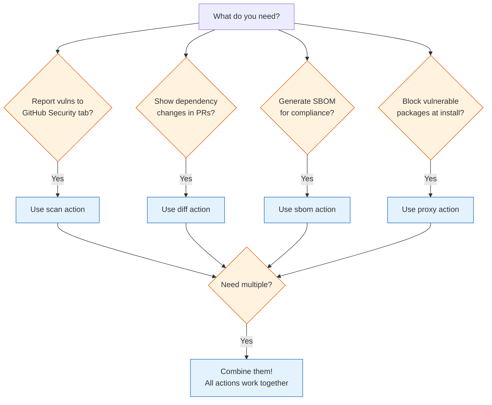
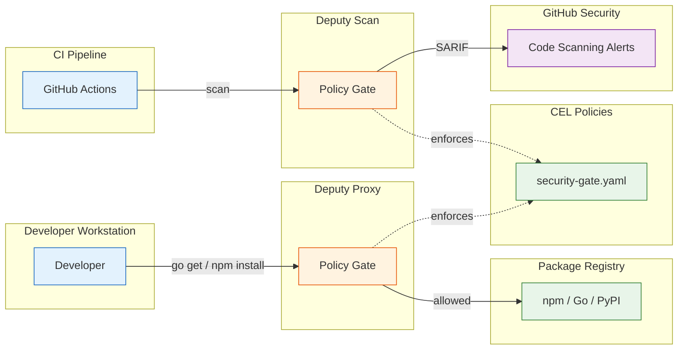

# GitHub Actions Integration

Deputy provides composable GitHub Actions for integrating supply chain security into your CI/CD pipelines.

## Why Deputy for CI/CD?

Deputy brings capabilities that go beyond basic vulnerability scanning:

| Feature | Deputy | Generic Scanners |
|---------|--------|------------------|
| **CEL Policy Engine** | Express nuanced rules (direct vs transitive, fixable vs unfixable, license + vuln combos) | Usually severity thresholds only |
| **Diff-Aware Analysis** | See exactly what changed between commits/PRs | Full scan each time |
| **Remote Repo Scanning** | Scan any Git repo without cloning | Local files only |
| **Git Ref Scanning** | Scan historical tags, branches, commits | Current state only |
| **SBOM Generation** | CycloneDX + SPDX in one tool | Often separate tooling |
| **Proxy Integration** | Enforce policies at download time | CI-only enforcement |

## Quick Start

Add vulnerability scanning to your workflow in 30 seconds:

```yaml
name: Security Scan
on: [push, pull_request]

permissions:
  security-events: write
  contents: read

jobs:
  scan:
    runs-on: ubuntu-latest
    steps:
      - uses: actions/checkout@v4

      - uses: picatz/deputy/actions/setup@main

      - uses: picatz/deputy/actions/scan@main
        with:
          upload-sarif: true
```

Results appear in **Security > Code scanning alerts**.

## Available Actions

| Action | Purpose |
|--------|---------|
| [`setup`](../../actions/setup/) | Install Deputy CLI |
| [`scan`](../../actions/scan/) | Vulnerability scanning + SARIF upload |
| [`sbom`](../../actions/sbom/) | SBOM generation (CycloneDX/SPDX) |
| [`diff`](../../actions/diff/) | Dependency change analysis |
| [`proxy`](../../actions/proxy/) | Policy enforcement at download time |

### Which Action Do I Need?



### Permissions Quick Reference

| Action | Required | Optional | When Needed |
|--------|----------|----------|-------------|
| `setup` | - | - | Always needed first |
| `scan` | `security-events: write` | `contents: read` | SARIF upload to Security tab |
| `diff` | `contents: read` | `pull-requests: write` | PR comments |
| `sbom` | - | `contents: write` | Artifact upload |
| `proxy` | - | `id-token: write` | OIDC authentication |

All actions require `actions: read` (implicit default).

## Reusable Workflows

For standardized security across multiple repositories, use Deputy's reusable workflows:

| Workflow | Purpose | When to Use |
|----------|---------|-------------|
| [`scan.yml`](../../.github/workflows/scan.yml) | Basic security scanning | Any repo needing vuln scanning |
| [`pr-gate.yml`](../../.github/workflows/pr-gate.yml) | PR security enforcement | PRs with dependency changes |
| [`release-sbom.yml`](../../.github/workflows/release-sbom.yml) | SBOM on release | Compliance requirements |

### Using Reusable Workflows

Call a reusable workflow from your repository:

```yaml
name: Security
on: [push, pull_request]

permissions:
  security-events: write
  contents: read

jobs:
  scan:
    uses: picatz/deputy/.github/workflows/scan.yml@main
    with:
      policy: policy/ci/security-gate.yaml
```

### PR Security Gate (Reusable)

```yaml
name: PR Security
on: pull_request

permissions:
  security-events: write
  contents: read
  pull-requests: write

jobs:
  security:
    uses: picatz/deputy/.github/workflows/pr-gate.yml@main
    with:
      scan-policy: policy/ci/security-gate.yaml
      diff-policy: policy/ci/pr-review.yaml
      comment-on-pr: true
```

### Release SBOM (Reusable)

```yaml
name: Release
on:
  release:
    types: [published]

permissions:
  contents: write

jobs:
  sbom:
    uses: picatz/deputy/.github/workflows/release-sbom.yml@main
    with:
      format: cyclonedx-json
      upload-release-asset: true
```

## Workflow Recipes

### Basic Security Scan

Scan on every push and pull request:

```yaml
name: Security Scan
on: [push, pull_request]

permissions:
  security-events: write

jobs:
  scan:
    runs-on: ubuntu-latest
    steps:
      - uses: actions/checkout@v4
      - uses: picatz/deputy/actions/setup@main
      - uses: picatz/deputy/actions/scan@main
```

### PR Security Gate

Block PRs with critical/high vulnerabilities:

```yaml
name: PR Security Gate
on: pull_request

permissions:
  security-events: write
  pull-requests: write
  contents: read

jobs:
  security:
    runs-on: ubuntu-latest
    steps:
      - uses: actions/checkout@v4

      - uses: picatz/deputy/actions/setup@main

      # Show what changed (auto-fetches base commit)
      - uses: picatz/deputy/actions/diff@main
        with:
          comment-on-pr: true

      # Enforce security policy
      - uses: picatz/deputy/actions/scan@main
        with:
          policy: policy/ci/security-gate.yaml
          fail-on-policy-violation: true
```

### Release SBOM

Generate SBOM on releases:

```yaml
name: Release
on:
  release:
    types: [published]

permissions:
  contents: write

jobs:
  sbom:
    runs-on: ubuntu-latest
    steps:
      - uses: actions/checkout@v4

      - uses: picatz/deputy/actions/setup@main

      - uses: picatz/deputy/actions/sbom@main
        with:
          format: cyclonedx-json
          output: sbom.cdx.json
          name: "${{ github.repository }} ${{ github.ref_name }}"
          upload-artifact: false

      - uses: softprops/action-gh-release@v1
        with:
          files: sbom.cdx.json
```

### Full Security Pipeline

Complete security workflow:

```yaml
name: Security Pipeline
on:
  push:
    branches: [main]
  pull_request:
  release:
    types: [published]

permissions:
  security-events: write
  pull-requests: write
  contents: write

jobs:
  # Always run scan
  scan:
    runs-on: ubuntu-latest
    steps:
      - uses: actions/checkout@v4
      - uses: picatz/deputy/actions/setup@main
      - uses: picatz/deputy/actions/scan@main
        with:
          policy: policy/ci/security-gate.yaml

  # PR-only: dependency diff
  diff:
    if: github.event_name == 'pull_request'
    runs-on: ubuntu-latest
    steps:
      - uses: actions/checkout@v4
      - uses: picatz/deputy/actions/setup@main
      - uses: picatz/deputy/actions/diff@main
        with:
          comment-on-pr: true
          policy: policy/ci/pr-review.yaml

  # Release-only: SBOM + strict scan
  release:
    if: github.event_name == 'release'
    runs-on: ubuntu-latest
    steps:
      - uses: actions/checkout@v4
      - uses: picatz/deputy/actions/setup@main

      - uses: picatz/deputy/actions/scan@main
        with:
          policy: policy/ci/release-gate.yaml
          fail-on-policy-violation: true

      - uses: picatz/deputy/actions/sbom@main
        with:
          format: cyclonedx-json
          output: sbom.json
```

### Monorepo Scanning

Scan multiple paths in a monorepo:

```yaml
name: Monorepo Scan
on: [push, pull_request]

permissions:
  security-events: write

jobs:
  scan:
    runs-on: ubuntu-latest
    strategy:
      matrix:
        path: [services/api, services/web, packages/shared]
    steps:
      - uses: actions/checkout@v4
      - uses: picatz/deputy/actions/setup@main
      - uses: picatz/deputy/actions/scan@main
        with:
          target: ${{ matrix.path }}
          sarif-category: deputy-${{ matrix.path }}
```

### Scheduled Scans

Run daily vulnerability scans:

```yaml
name: Daily Security Scan
on:
  schedule:
    - cron: '0 6 * * *'  # 6 AM UTC daily
  workflow_dispatch:

permissions:
  security-events: write

jobs:
  scan:
    runs-on: ubuntu-latest
    steps:
      - uses: actions/checkout@v4
      - uses: picatz/deputy/actions/setup@main
      - uses: picatz/deputy/actions/scan@main
        with:
          sarif-category: deputy-scheduled
```

## Deputy-Specific Power Features

Deputy's CI integration goes beyond basic vulnerability scanning. These features leverage Deputy's unique capabilities.

### Diff-Aware PR Reviews

The `diff` action compares dependencies between your PR branch and base, showing exactly what changed. Combined with policies, you can enforce rules specifically on new or changed dependencies:

```yaml
name: PR Dependency Review
on: pull_request

permissions:
  pull-requests: write
  contents: read

jobs:
  review:
    runs-on: ubuntu-latest
    steps:
      - uses: actions/checkout@v4

      - uses: picatz/deputy/actions/setup@main

      # Diff shows: added, removed, updated dependencies
      # Plus vulnerabilities in the changes
      # (auto-fetches base commit for comparison)
      - uses: picatz/deputy/actions/diff@main
        with:
          comment-on-pr: true
          # Apply PR-specific policy to the diff
          policy: policy/ci/pr-review.yaml
          fail-on-new-vulnerabilities: true
```

The PR comment shows:
- Dependencies added/removed/updated
- Version changes with vulnerability deltas
- License changes
- New vulnerabilities introduced by this PR

### Policy-Driven Security Gates

Deputy's CEL-based policies let you encode nuanced security rules that go far beyond "block all criticals":

```yaml
# policy/smart-gate.yaml
policies:
  # Block critical vulns, but only if they're fixable
  - name: block-fixable-criticals
    rules:
      - action: deny
        when: |
          vulnerabilities.exists(v,
            v.advisory.severity.level == severity.critical &&
            size(v.advisory.fixed_versions) > 0
          )
        reason: Critical vulnerability with available fix
        remediation: Upgrade to a fixed version

  # Stricter rules for direct dependencies (you control these)
  - name: direct-deps-must-be-clean
    rules:
      - action: deny
        when: |
          vulnerabilities.exists(v,
            v.package.direct &&
            v.advisory.severity.level in [severity.critical, severity.high]
          )
        reason: Direct dependency has high-severity vulnerability

  # Warn on transitive vulns (less control, but track them)
  - name: transitive-vulns-warning
    rules:
      - action: warn
        when: |
          vulnerabilities.exists(v,
            !v.package.direct &&
            v.advisory.severity.level in [severity.critical, severity.high]
          )
        reason: Transitive dependency has vulnerability
```

Use in CI:

```yaml
- uses: picatz/deputy/actions/scan@main
  with:
    policy: policy/smart-gate.yaml
    fail-on-policy-violation: true
```

### License Compliance in CI

Enforce license policies alongside vulnerability scanning:

```yaml
# policy/license-gate.yaml
policies:
  - name: approved-licenses-only
    vars:
      approved:
        - MIT
        - Apache-2.0
        - BSD-2-Clause
        - BSD-3-Clause
        - ISC
    rules:
      - action: deny
        when: |
          pkg.licenses.size() > 0 &&
          pkg.licenses.all(l, !(l in approved))
        reason: License not in approved list

  - name: no-unknown-licenses
    rules:
      - action: warn
        when: pkg.licenses.size() == 0
        reason: No license detected - manual review required

  - name: copyleft-review
    vars:
      copyleft:
        - GPL-2.0
        - GPL-3.0
        - AGPL-3.0
    rules:
      - action: warn
        when: pkg.licenses.exists(l, l in copyleft)
        reason: Copyleft license - ensure compliance
```

### Staged Security Policies

Use different policies for different stages of your pipeline:

```yaml
name: Staged Security
on:
  push:
    branches: [main]
  pull_request:
  release:
    types: [published]

jobs:
  # PRs: Focus on new issues, be lenient on existing debt
  pr-check:
    if: github.event_name == 'pull_request'
    runs-on: ubuntu-latest
    steps:
      - uses: actions/checkout@v4
      - uses: picatz/deputy/actions/setup@main
      - uses: picatz/deputy/actions/diff@main
        with:
          policy: policy/ci/pr-review.yaml
          comment-on-pr: true

  # Main branch: Track everything, warn broadly
  main-scan:
    if: github.ref == 'refs/heads/main'
    runs-on: ubuntu-latest
    steps:
      - uses: actions/checkout@v4
      - uses: picatz/deputy/actions/setup@main
      - uses: picatz/deputy/actions/scan@main
        with:
          policy: policy/ci/security-gate.yaml
          upload-sarif: true
          fail-on-policy-violation: false  # Track, don't block

  # Releases: Strict enforcement, no exceptions
  release-gate:
    if: github.event_name == 'release'
    runs-on: ubuntu-latest
    steps:
      - uses: actions/checkout@v4
      - uses: picatz/deputy/actions/setup@main
      - uses: picatz/deputy/actions/scan@main
        with:
          policy: policy/ci/release-gate.yaml
          fail-on-policy-violation: true  # Hard block
```

### Vulnerability Exceptions (Accept Risk)

Sometimes you need to accept known risks temporarily. Use policies to codify exceptions:

```yaml
# policy/exceptions.yaml
policies:
  - name: accepted-risks
    description: Temporarily accepted vulnerabilities with tracking
    vars:
      # Document why each is accepted and when to revisit
      accepted_vulns:
        - CVE-2023-12345  # No fix available, mitigated by WAF, review Q2
        - GHSA-xxxx-yyyy  # Low impact in our usage, tracking upstream
    rules:
      - action: allow
        when: vulnerability.advisory.id in accepted_vulns
        reason: Accepted risk - see security team documentation
```

Combine with your main policy:

```yaml
- uses: picatz/deputy/actions/scan@main
  with:
    policy: policy/exceptions.yaml,policy/ci/security-gate.yaml
```

### Blocking Specific Packages

Block known-bad packages by name (typosquatting, malware, deprecated):

```yaml
# policy/blocklist.yaml
policies:
  - name: blocked-packages
    vars:
      blocked:
        - event-stream      # Known supply chain attack
        - left-pad          # Too risky as a dependency
        - colors            # Intentionally corrupted
    rules:
      - action: deny
        when: pkg.name in blocked
        reason: Package is on the blocklist

  - name: no-deprecated-packages
    rules:
      - action: warn
        when: |
          pkg.name.contains("/deprecated/") ||
          pkg.name.contains("-deprecated")
        reason: Using deprecated package
```

### SBOM Attestation Workflow

Generate SBOMs and attach them to releases for supply chain transparency:

```yaml
name: Release with SBOM
on:
  release:
    types: [published]

permissions:
  contents: write

jobs:
  sbom:
    runs-on: ubuntu-latest
    steps:
      - uses: actions/checkout@v4
      - uses: picatz/deputy/actions/setup@main

      # Scan first - fail if release policy violated
      - uses: picatz/deputy/actions/scan@main
        with:
          policy: policy/ci/release-gate.yaml
          fail-on-policy-violation: true

      # Generate CycloneDX SBOM with license info
      - uses: picatz/deputy/actions/sbom@main
        with:
          format: cyclonedx-json
          output: ${{ github.event.repository.name }}-${{ github.ref_name }}.cdx.json
          enrich-licenses: true
          upload-artifact: false

      # Also generate SPDX for compliance tools
      - uses: picatz/deputy/actions/sbom@main
        with:
          format: spdx-json
          output: ${{ github.event.repository.name }}-${{ github.ref_name }}.spdx.json
          enrich-licenses: true
          upload-artifact: false

      # Attach both to release
      - uses: softprops/action-gh-release@v2
        with:
          files: |
            *.cdx.json
            *.spdx.json
```

### Using Action Outputs

Action outputs allow conditional logic based on scan results:

```yaml
name: Security with Conditional Steps
on: [push, pull_request]

permissions:
  security-events: write

jobs:
  scan:
    runs-on: ubuntu-latest
    steps:
      - uses: actions/checkout@v4
      - uses: picatz/deputy/actions/setup@main

      - uses: picatz/deputy/actions/scan@main
        id: scan
        with:
          fail-on-findings: false  # Don't fail, let us handle it

      # Only run if critical vulnerabilities found
      - name: Alert on critical findings
        if: steps.scan.outputs.critical-count != '0'
        run: |
          echo "::error::Found ${{ steps.scan.outputs.critical-count }} critical vulnerabilities"
          # Could also: send Slack alert, create issue, etc.

      # Conditional notification based on total count
      - name: Post summary
        run: |
          echo "Scan complete: ${{ steps.scan.outputs.findings-count }} total findings"
          echo "  Critical: ${{ steps.scan.outputs.critical-count }}"
          echo "  High: ${{ steps.scan.outputs.high-count }}"

      # Fail the job if any high/critical findings
      - name: Enforce threshold
        if: steps.scan.outputs.critical-count != '0' || steps.scan.outputs.high-count != '0'
        run: exit 1
```

Available outputs from `scan`:
- `findings-count` - Total vulnerabilities found
- `critical-count` - Critical severity count
- `high-count` - High severity count
- `policy-violations` - Policy violation count
- `sarif` - Path to SARIF file
- `exit-code` - Deputy exit code

Available outputs from `diff`:
- `added-count` - Dependencies added
- `removed-count` - Dependencies removed
- `updated-count` - Dependencies updated
- `new-vulnerabilities` - New vulnerabilities introduced
- `summary` - Text summary

### Conditional Scanning by File Changes

Only run security scans when dependency files change:

```yaml
name: Smart Security Scan
on:
  pull_request:
    paths:
      - 'go.mod'
      - 'go.sum'
      - 'package*.json'
      - 'yarn.lock'
      - 'pnpm-lock.yaml'
      - 'requirements*.txt'
      - 'Pipfile.lock'
      - 'poetry.lock'
      - 'Cargo.lock'
      - 'Gemfile.lock'

permissions:
  security-events: write
  pull-requests: write

jobs:
  scan:
    runs-on: ubuntu-latest
    steps:
      - uses: actions/checkout@v4
      - uses: picatz/deputy/actions/setup@main
      - uses: picatz/deputy/actions/diff@main
        with:
          comment-on-pr: true
          policy: policy/ci/pr-review.yaml
```

## Policy Reference

### Severity Filtering

Unlike tools with simple `--severity` flags, Deputy uses CEL policies for severity filtering. This provides more flexibility:

```yaml
# policy/severity-gate.yaml
policies:
  - name: severity-filter
    entrypoints: [scan_vulnerability]
    rules:
      # Block critical and high severity
      - action: deny
        when: vulnerability.advisory.severity.level in [severity.critical, severity.high]
        reason: High-severity vulnerability found

      # Warn on medium severity
      - action: warn
        when: vulnerability.advisory.severity.level == severity.medium
        reason: Medium-severity vulnerability found
```

This approach enables nuanced rules like "block critical vulns only if fixable" or "block high severity in direct deps but warn for transitive" - impossible with simple severity thresholds.

### Built-in CI Policies

Deputy includes ready-to-use CI policies in `policy/ci/`:

| Policy | Purpose | When to Use |
|--------|---------|-------------|
| `security-gate.yaml` | Block criticals, warn on high | General CI gate |
| `pr-review.yaml` | Focus on new dependencies | PR reviews with diff |
| `release-gate.yaml` | Strict, no high/critical | Release pipelines |

### Policy Actions

| Action | Behavior |
|--------|----------|
| `deny` | Fail the scan, exit code 1 |
| `warn` | Log warning, continue |
| `allow` | Explicitly permit (for exceptions) |

### Policy Variables

Common variables available in CEL expressions:

| Variable | Type | Description |
|----------|------|-------------|
| `pkg.name` | string | Package name |
| `pkg.version` | string | Package version |
| `pkg.ecosystem` | string | go, npm, pypi, etc. |
| `pkg.licenses` | list | SPDX license IDs |
| `vulnerability.advisory.id` | string | CVE/GHSA ID |
| `vulnerability.advisory.severity.level` | enum | Use `severity.critical`, `severity.high`, etc. |
| `vulnerability.package.direct` | bool | Direct vs transitive |
| `vulnerability.advisory.fixed_versions` | list | Available fixes |
| `vulnerabilities` | list | All vulns (for `.exists()`) |

### Custom Policy Examples

```yaml
# Block if more than 10 total vulnerabilities
- action: deny
  when: vulnerabilities.size() > 10
  reason: Too many vulnerabilities

# Block specific ecosystems in certain paths
- action: deny
  when: pkg.ecosystem == "npm" && pkg.name.startsWith("@internal/")
  reason: Internal packages should not have npm deps

# Medium severity with no fix - monitor upstream
- action: warn
  when: |
    vulnerability.advisory.severity.level == severity.medium &&
    size(vulnerability.advisory.fixed_versions) == 0
  reason: Medium severity with no fix - monitor upstream
```

### Advanced Policy Patterns

Deputy's CEL engine enables patterns impossible with simple severity filters:

```yaml
# Block specific CVEs (e.g., Log4Shell)
policies:
  - name: block-log4shell
    vars:
      log4shell_cves: ["CVE-2021-44228", "CVE-2021-45046"]
    rules:
      - action: deny
        when: vulnerabilities.exists(v, v.advisory.id in log4shell_cves)
        reason: Log4Shell vulnerability - must upgrade immediately

# Typosquat detection using Levenshtein distance
policies:
  - name: typosquat-guard
    vars:
      popular: ["react", "lodash", "express", "axios", "next"]
    rules:
      - action: deny
        when: |
          popular.exists(p, levenshteinWithin(pkg.name, p, 2)) &&
          !(pkg.name in popular)
        reason: Package name suspiciously similar to popular package

# Require minimum version for security-critical packages
policies:
  - name: enforce-minimum-versions
    vars:
      minimums:
        "log4j-core": "2.17.1"
        "jackson-databind": "2.13.0"
    rules:
      - action: deny
        when: |
          pkg.name in minimums &&
          pkg.version < minimums[pkg.name]
        reason: Package version below security minimum
```

See [Policy Examples](../../policy/examples/) for 35+ real-world patterns including XZ backdoor detection, license compliance, JWT-based access control, and typosquat guards.

Full reference: [Policy Specification](../reference/policy-spec.md)

### Scan Remote Repositories

Deputy can scan any public Git repository directly without cloning:

```yaml
name: Audit Third-Party Dependency
on: workflow_dispatch

jobs:
  audit:
    runs-on: ubuntu-latest
    steps:
      - uses: picatz/deputy/actions/setup@main

      - name: Scan upstream dependency
        run: |
          deputy scan github.com/some/dependency --format json
```

### Scan Historical Git Refs

Compare security posture across releases or audit specific commits:

```yaml
name: Release Comparison
on:
  release:
    types: [published]

jobs:
  compare:
    runs-on: ubuntu-latest
    steps:
      # Full history needed for git describe to find previous tag
      - uses: actions/checkout@v4
        with:
          fetch-depth: 0

      - uses: picatz/deputy/actions/setup@main

      # Compare current release to previous
      - name: Security diff vs previous release
        run: |
          PREV_TAG=$(git describe --tags --abbrev=0 HEAD^)
          deputy diff "$PREV_TAG" "${{ github.ref_name }}"
```

## SARIF and GitHub Security

### How It Works

1. Deputy generates SARIF 2.1.0 output
2. `github/codeql-action/upload-sarif` uploads to GitHub
3. Results appear in **Security > Code scanning alerts**

### SARIF Categories

Use unique categories for different scan types:

```yaml
# Separate categories prevent result conflicts
- uses: picatz/deputy/actions/scan@main
  with:
    sarif-category: deputy-main-scan

- uses: picatz/deputy/actions/scan@main
  with:
    target: ./subproject
    sarif-category: deputy-subproject-scan
```

### Required Permissions

```yaml
permissions:
  security-events: write  # For SARIF upload
  contents: read          # For checkout
  pull-requests: write    # For PR comments (optional)
```

## Troubleshooting

### SARIF Upload Fails

**Symptom**: Error like "Resource not accessible by integration" or "403 Forbidden"

**Solution**: Ensure `security-events: write` permission is set:

```yaml
permissions:
  security-events: write
```

Also verify the repository has GitHub Advanced Security enabled (required for private repos).

### PR Comment Not Appearing

**Symptom**: Diff action runs but no comment appears on PR

**Solution**: Add `pull-requests: write` permission:

```yaml
permissions:
  pull-requests: write
  contents: read
```

### Policy File Not Found

**Symptom**: Error "policy file not found" or scan ignores policy

**Solution**: Verify the policy path is correct relative to the repository root:

```yaml
# Correct - path from repo root
- uses: picatz/deputy/actions/scan@main
  with:
    policy: policy/ci/security-gate.yaml

# Wrong - path doesn't exist
- uses: picatz/deputy/actions/scan@main
  with:
    policy: ./ci/security-gate.yaml  # Missing policy/ prefix
```

### Diff With Tag Comparisons

**Symptom**: Error "reference not found" when comparing tags

**Solution**: For comparing tags (e.g., release-to-release diff), ensure tags are fetched:

```yaml
# Option 1: Full history (simple but slower for large repos)
- uses: actions/checkout@v4
  with:
    fetch-depth: 0

# Option 2: Fetch only needed tags (faster)
- uses: actions/checkout@v4
- run: git fetch --tags origin v1.0.0 v2.0.0
```

For PR diffs, the action auto-fetches the base commit - no extra configuration needed.

### Policy Violations Exit Code

**Symptom**: Workflow fails unexpectedly with exit code 1

**Solution**: Deputy exits with code 1 on policy violations. Use `fail-on-policy-violation: false` to continue without failing:

```yaml
- uses: picatz/deputy/actions/scan@main
  with:
    fail-on-policy-violation: false  # Report but don't fail
```

### No Vulnerabilities in Security Tab

**Symptom**: Scan runs but Security tab shows no results

**Causes**:
1. **No vulnerabilities found** - This is good! Check the job summary for confirmation.
2. **SARIF not uploaded** - Ensure `upload-sarif: true` (default).
3. **Wrong SARIF category** - If running multiple scans, use unique `sarif-category` values.
4. **Branch protection** - Some repos only show alerts for default branch.

### Proxy Action Not Blocking Packages

**Symptom**: Packages install despite policy violations

**Solution**: Verify the proxy is configured for the right ecosystem:

```yaml
- uses: picatz/deputy/actions/proxy@main
  with:
    ecosystems: go,npm  # Must match your package manager
    policy: policy/ci/security-gate.yaml
```

Also ensure the environment variables are set correctly - check the action output for the proxy URLs.

### Scan Takes Too Long

**Symptom**: Scan action times out or takes >5 minutes

**Solutions**:
1. **Scan specific path**: Instead of scanning the entire repo, target specific directories:
   ```yaml
   with:
     target: ./backend  # Only scan backend
   ```

2. **Filter ecosystems**: Only scan relevant ecosystems:
   ```yaml
   with:
     ecosystems: go  # Skip npm, pip, etc.
   ```

3. **Skip unfixed vulns**: Reduce noise if you can't act on unfixed issues:
   ```yaml
   with:
     ignore-unfixed: true
   ```

### Debug Output

Enable debug logging to diagnose issues:

```yaml
- uses: picatz/deputy/actions/scan@main
  env:
    DEPUTY_LOG_LEVEL: debug
```

Or for the CLI directly:

```yaml
- run: DEPUTY_LOG_LEVEL=debug deputy scan --format json
```

### Common Error Messages

| Error | Cause | Solution |
|-------|-------|----------|
| `no supported lockfiles found` | No package manager files in target | Check target path contains go.mod, package-lock.json, etc. |
| `failed to fetch vulnerability data` | Network issue or OSV API down | Retry, or check GitHub Actions status |
| `CEL evaluation error` | Invalid policy syntax | Run `deputy policy lint your-policy.yaml` locally |
| `git: command not found` | Missing git in runner | Use `ubuntu-latest` runner (has git) |

## Migration from Manual Workflows

If you're migrating from manual `go install` workflows:

**Before:**
```yaml
- run: go install github.com/picatz/deputy@latest
- run: deputy scan --format json --output scan.json
```

**After:**
```yaml
- uses: picatz/deputy/actions/setup@main
- uses: picatz/deputy/actions/scan@main
  with:
    format: sarif
    upload-sarif: true
```

## Defense in Depth: CI + Proxy

GitHub Actions catches issues at PR/merge time, but developers can still `go get` or `npm install` vulnerable packages locally. For complete coverage, combine CI scanning with Deputy's proxy:



### Using the Proxy Action in CI

The `proxy` action brings download-time enforcement directly into your CI pipeline. It intercepts package manager requests and evaluates policies before packages are installed.

#### Local Proxy Mode (Ephemeral)

Start a local proxy within your workflow for per-repo policy enforcement:

```yaml
name: Secure Build
on: [push, pull_request]

jobs:
  build:
    runs-on: ubuntu-latest
    steps:
      - uses: actions/checkout@v4

      - uses: picatz/deputy/actions/setup@main

      # Start proxy with policy enforcement
      - uses: picatz/deputy/actions/proxy@main
        with:
          policy: policy/ci/security-gate.yaml
          ecosystems: go,npm

      # These commands now go through the proxy
      # and will fail if they try to download vulnerable packages
      - run: go mod download
      - run: npm ci

      - run: go build ./...
      - run: npm run build
```

#### Remote Proxy Mode (Centralized)

Point to an organization-wide Deputy proxy for centralized policy management:

```yaml
name: Build
on: [push]

jobs:
  build:
    runs-on: ubuntu-latest
    steps:
      - uses: actions/checkout@v4

      # Use organization's central proxy
      - uses: picatz/deputy/actions/proxy@main
        with:
          mode: remote
          proxy-url: ${{ vars.DEPUTY_PROXY_URL }}
          auth-token: ${{ secrets.DEPUTY_PROXY_TOKEN }}
          ecosystems: go,npm

      # All package downloads enforced by central policies
      - run: npm ci
      - run: npm run build
```

#### OIDC Identity Federation

For production deployments, use GitHub Actions OIDC tokens instead of long-lived secrets. This enables identity-aware policies based on the calling workflow's repository, branch, actor, and more.

```yaml
name: Build with OIDC
on: [push]

permissions:
  contents: read
  id-token: write  # Required for OIDC

jobs:
  build:
    runs-on: ubuntu-latest
    steps:
      - uses: actions/checkout@v4

      # Authenticate using GitHub Actions OIDC
      - uses: picatz/deputy/actions/proxy@main
        with:
          mode: remote
          proxy-url: https://deputy-proxy.example.com
          use-oidc: true

      - run: npm ci
```

The OIDC token includes claims like `repository`, `repository_owner`, `ref`, `actor`, `event_name`, and `environment` that can be used in policy decisions. See the [Proxy Action README](../../actions/proxy/README.md#github-actions-oidc-authentication) for configuration details and [GitHub Actions OIDC Policy Examples](../../policy/examples/github-actions-oidc.yaml) for policy patterns.

#### Combined Scan + Proxy

For maximum coverage, use both:
- **Proxy**: Blocks vulnerable packages at download time (prevents installation)
- **Scan**: Reports to GitHub Security tab (visibility and tracking)

```yaml
name: Complete Security
on: [push, pull_request]

permissions:
  security-events: write

jobs:
  build:
    runs-on: ubuntu-latest
    steps:
      - uses: actions/checkout@v4

      - uses: picatz/deputy/actions/setup@main

      # Block vulnerable packages at download time
      - uses: picatz/deputy/actions/proxy@main
        with:
          policy: policy/ci/security-gate.yaml

      - run: npm ci

      # Also scan and report to GitHub Security tab
      - uses: picatz/deputy/actions/scan@main
        with:
          policy: policy/ci/security-gate.yaml
          upload-sarif: true
```

See the [Proxy Action README](../../actions/proxy/README.md) for full input/output reference and the [Proxy Rollout Guide](proxy-rollout.md) for deployment options.

## See Also

- [CI Integration Guide](ci.md) - Manual CI setup
- [Policy Reference](../reference/policy-spec.md) - CEL policy syntax
- [Policy Examples](../../policy/examples/) - Sample policies
- [Proxy Rollout Guide](proxy-rollout.md) - Download-time enforcement
