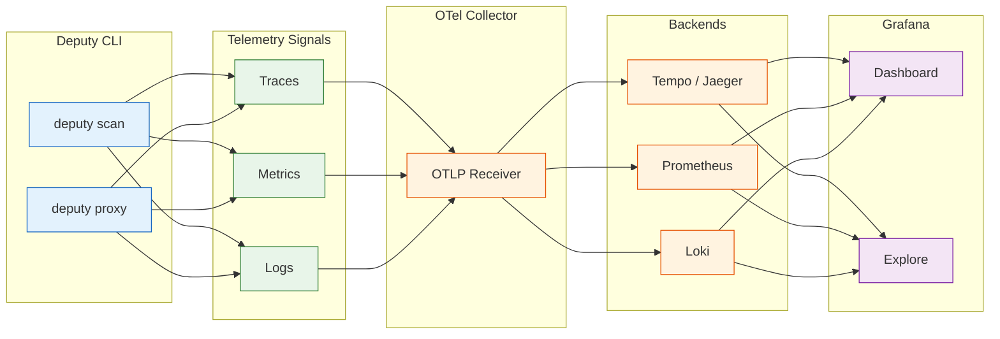
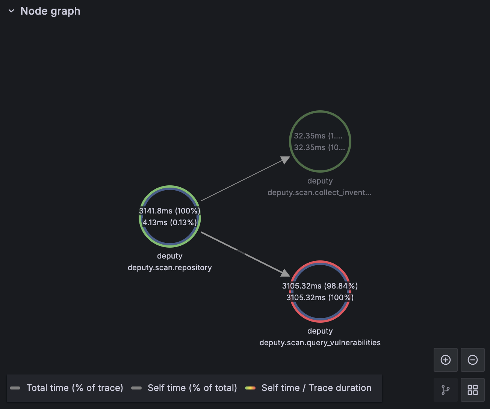
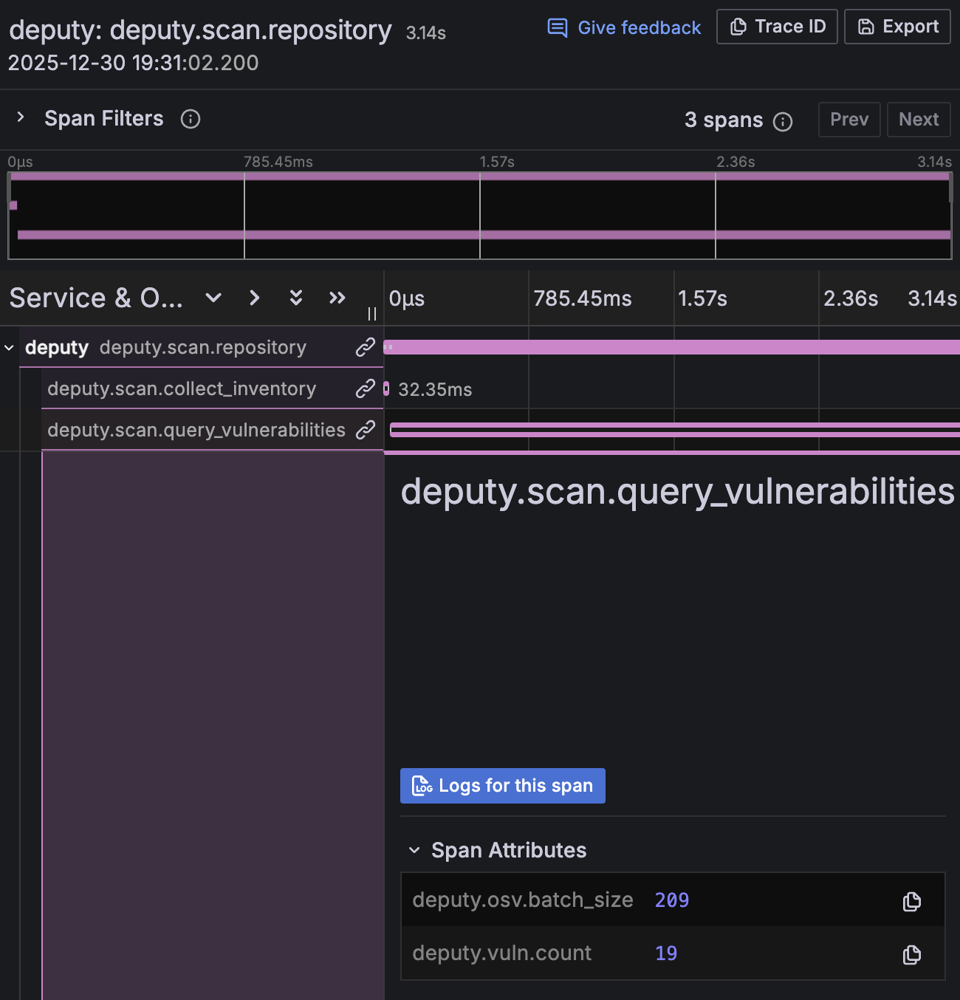
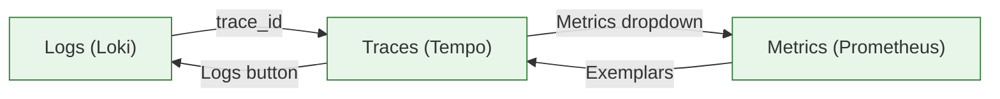

# Observability

Deputy integrates with OpenTelemetry for comprehensive observability: distributed tracing, metrics, and log correlation. This enables debugging performance issues, tracking vulnerability trends, and correlating events across scans.

## Overview



## Quick Start

```console
$ # Enable OpenTelemetry
$ export DEPUTY_OTEL_ENABLED=true
$ export OTEL_EXPORTER_OTLP_ENDPOINT=localhost:4317
$ export OTEL_EXPORTER_OTLP_INSECURE=true

$ # Run any command - traces will be exported
$ deputy scan

$ # For verbose log output (INFO level with trace correlation)
$ DEPUTY_LOG_LEVEL=info deputy scan
```

## Configuration

### Environment Variables

| Variable | Description | Default |
|----------|-------------|---------|
| `DEPUTY_OTEL_ENABLED` | Enable OTel instrumentation | `false` |
| `DEPUTY_OTEL_SERVICE_NAME` | Service name in traces | `deputy` |
| `DEPUTY_LOG_LEVEL` | Log level (debug, info, warn, error) | `warn` |
| `OTEL_EXPORTER_OTLP_ENDPOINT` | Collector endpoint | `localhost:4317` |
| `OTEL_EXPORTER_OTLP_PROTOCOL` | Transport protocol | `grpc` |
| `OTEL_EXPORTER_OTLP_INSECURE` | Disable TLS | `false` |
| `OTEL_TRACES_SAMPLER_ARG` | Sample rate (0.0-1.0) | `1.0` |
| `OTEL_EXPORTER_OTLP_TIMEOUT` | Export timeout | `10s` |

**Note:** The default log level is `warn` to keep CLI output clean for interactive use. Set `DEPUTY_LOG_LEVEL=info` for verbose logs with trace correlation when running pipelines or debugging.

### YAML Configuration

```yaml
# .deputy.yaml
otel:
  enabled: true
  service_name: deputy
  exporter:
    protocol: grpc
    endpoint: localhost:4317
    insecure: true
  traces:
    enabled: true
    sample_rate: 1.0
  metrics:
    enabled: true
    interval: 5s  # Default: 5s for demos. Use 60s for production.
  logs:
    enabled: true
    include_trace_context: true
```

## Traced Operations

### Scan Command

The scan command creates a trace hierarchy showing where time is spent:

```
deputy.scan.repository
├── deputy.scan.collect_inventory
└── deputy.scan.query_vulnerabilities
    ├── osv.query_batch
    └── osv.get_vulnerability
```

**Node Graph** — Visualizes the span hierarchy and time distribution:



**Trace Waterfall** — Shows span timing with attributes like `deputy.vuln.count`:



**Span Attributes:**

| Attribute | Description |
|-----------|-------------|
| `deputy.target.path` | Repository path |
| `deputy.target.ref` | Git reference |
| `deputy.target.remote` | Whether cloned from remote |
| `deputy.package.count` | Packages scanned |
| `deputy.vuln.count` | Vulnerabilities found |
| `deputy.vuln.critical` | Critical severity count |
| `deputy.vuln.high` | High severity count |
| `deputy.vuln.medium` | Medium severity count |
| `deputy.vuln.low` | Low severity count |

### Proxy Server

The proxy creates a span per request with events for key operations:

```
deputy.proxy.<ecosystem>
└── events:
    ├── auth.completed      (authentication result)
    ├── policy.evaluated    (policy decision)
    └── cache.access        (cache hits/misses)
```

**Span Attributes:**

| Attribute | Description |
|-----------|-------------|
| `deputy.proxy.ecosystem` | Ecosystem (go, npm, pypi, ruby) |
| `deputy.proxy.package` | Package requested |
| `deputy.proxy.version` | Version requested |
| `deputy.proxy.operation` | Operation type (fetch, list) |
| `deputy.proxy.listener` | Listener name |
| `deputy.proxy.upstream` | Upstream registry URL |
| `deputy.proxy.vuln.count` | Vulnerabilities found |

**Event Attributes:**

| Event | Attribute | Description |
|-------|-----------|-------------|
| `auth.completed` | `deputy.proxy.auth.result` | success, anonymous, rejected, error |
| | `deputy.proxy.auth.subject` | JWT subject (if authenticated) |
| | `deputy.proxy.auth.error_code` | Error code if auth failed |
| `policy.evaluated` | `deputy.proxy.policy.result` | allow, deny, warn, error |
| | `deputy.policy.entrypoint` | Policy entrypoint evaluated |
| | `deputy.policy.name` | Policy that caused deny/warn |
| `cache.access` | `deputy.cache.type` | osv or license |
| | `deputy.cache.hit` | Whether cache hit |

## Metrics

Deputy exports the following metrics:

| Metric | Type | Labels | Description |
|--------|------|--------|-------------|
| `deputy.scan.duration` | Histogram | ecosystem | Scan duration in seconds |
| `deputy.scan.packages` | Counter | ecosystem | Packages scanned |
| `deputy.scan.vulnerabilities` | Counter | ecosystem, severity | Vulnerabilities found |
| `deputy.osv.queries` | Counter | status | OSV API queries |
| `deputy.osv.query.duration` | Histogram | query_type | OSV query latency |
| `deputy.osv.cache.hits` | Counter | | Cache hits |
| `deputy.osv.cache.misses` | Counter | | Cache misses |
| `deputy.proxy.requests` | Counter | ecosystem, status_code | Proxy requests |
| `deputy.proxy.request.duration` | Histogram | ecosystem | Proxy request latency |
| `deputy.proxy.auth` | Counter | result, error_code | Authentication attempts |
| `deputy.proxy.policy_denials` | Counter | ecosystem, policy | Policy denials |
| `deputy.policy.evaluations` | Counter | result | Policy evaluations |
| `deputy.policy.duration` | Histogram | result | Policy evaluation latency |

## Log Correlation

When OTel is enabled, Deputy automatically injects trace context into structured log output:

```json
{
  "time": "2024-01-15T10:30:00Z",
  "level": "INFO",
  "msg": "scan completed",
  "trace_id": "abc123def456",
  "span_id": "789xyz",
  "packages_scanned": 150,
  "vulnerabilities_found": 3
}
```

This enables navigating from logs to traces and vice versa in Grafana.

## Local Development Stack

A Docker Compose stack is provided for local development with full signal correlation:

```console
$ cd docker/otel
$ docker compose up -d

$ # Generate telemetry
$ DEPUTY_LOG_LEVEL=info DEPUTY_OTEL_ENABLED=true \
  OTEL_EXPORTER_OTLP_ENDPOINT=localhost:4317 \
  OTEL_EXPORTER_OTLP_INSECURE=true deputy scan
```

### Access Points

| Service | URL | Description |
|---------|-----|-------------|
| Grafana | http://localhost:3000 | Dashboards (no login required) |
| Dashboard | http://localhost:3000/d/deputy-overview | Deputy Overview |
| Prometheus | http://localhost:9090 | Metrics queries |
| Tempo | http://localhost:3200 | Trace API |
| Loki | http://localhost:3100 | Log API |

### Signal Correlation

Navigate between logs, traces, and metrics in Grafana:



| From | To | How |
|------|-----|-----|
| Logs → Traces | Click log line → expand → click `trace_id` link |
| Traces → Logs | Click trace → select span → "Logs" button |
| Traces → Metrics | Click span → "Metrics" dropdown |
| Metrics → Traces | Enable "Exemplars" → click dots on graph |

See [docker/otel/README.md](../../docker/otel/README.md) for detailed setup, troubleshooting, and stack management.

## Example Queries

### Prometheus (Metrics)

```promql
# Scan duration p95 by ecosystem
histogram_quantile(0.95, sum(rate(deputy_scan_duration_seconds_bucket[5m])) by (le, deputy_ecosystem))

# Vulnerabilities found in the last hour by severity
sum(increase(deputy_scan_vulnerabilities_total[1h])) by (severity)

# Proxy request rate by ecosystem
sum(rate(deputy_proxy_requests_total[5m])) by (deputy_ecosystem)

# OSV cache hit ratio
sum(rate(deputy_osv_cache_hits_total[5m])) /
(sum(rate(deputy_osv_cache_hits_total[5m])) + sum(rate(deputy_osv_cache_misses_total[5m])))

# Policy evaluations by result
sum(rate(deputy_policy_evaluations_total[5m])) by (result)
```

### TraceQL (Tempo)

```
# Find all Deputy traces
{ resource.service.name="deputy" }

# Find scan operations
{ resource.service.name="deputy" && name="deputy.scan.repository" }

# Find slow scans (>5s)
{ resource.service.name="deputy" && name="deputy.scan.repository" } | duration > 5s

# Find scans that found vulnerabilities
{ resource.service.name="deputy" && span.deputy.vuln.count > 0 }

# Find proxy requests denied by policy
{ resource.service.name="deputy" && span.deputy.proxy.policy.result="deny" }
```

### LogQL (Loki)

```logql
# Find all Deputy logs
{service_name="deputy"}

# Find error logs
{service_name="deputy"} |= "level=ERROR"

# Find logs for a specific trace
{service_name="deputy"} | json | trace_id="<your-trace-id>"

# Find logs mentioning vulnerabilities
{service_name="deputy"} |~ "vuln|CVE"
```

## Production Backends

### Grafana Cloud

```console
$ export DEPUTY_OTEL_ENABLED=true
$ export OTEL_EXPORTER_OTLP_ENDPOINT=otlp-gateway-prod-us-central-0.grafana.net:443
$ export OTEL_EXPORTER_OTLP_HEADERS="Authorization=Basic $(echo -n 'instance_id:api_key' | base64)"
```

### Jaeger

```console
$ # Start Jaeger
$ docker run -d --name jaeger \
  -p 4317:4317 \
  -p 16686:16686 \
  jaegertracing/all-in-one:latest

$ export DEPUTY_OTEL_ENABLED=true
$ export OTEL_EXPORTER_OTLP_ENDPOINT=localhost:4317
$ export OTEL_EXPORTER_OTLP_INSECURE=true

$ # View traces at http://localhost:16686
```

### Datadog

```console
$ export DEPUTY_OTEL_ENABLED=true
$ export OTEL_EXPORTER_OTLP_ENDPOINT=localhost:4317
$ # Run Datadog agent with OTLP receiver enabled
```

### AWS X-Ray

Use the AWS Distro for OpenTelemetry Collector to forward traces to X-Ray.

## Sampling

For high-volume production use, reduce the sample rate:

```console
$ # Sample 10% of traces
$ export OTEL_TRACES_SAMPLER_ARG=0.1
```

Parent-based sampling is used by default, so child spans inherit the parent's sampling decision.

## Graceful Degradation

OTel is designed to fail gracefully:

- **Collector unreachable** — Deputy continues normally, telemetry is dropped
- **Invalid configuration** — Logs a warning and disables OTel
- **OTel disabled** — Zero performance impact (no-op instrumentation)

## Troubleshooting

### No traces appearing

1. Verify OTel is enabled:
   ```console
   $ echo $DEPUTY_OTEL_ENABLED  # Should be "true"
   ```

2. Check the endpoint format (no protocol prefix):
   ```console
   $ # Correct
   $ export OTEL_EXPORTER_OTLP_ENDPOINT=localhost:4317

   $ # Wrong
   $ export OTEL_EXPORTER_OTLP_ENDPOINT=http://localhost:4317
   ```

3. Enable debug logging:
   ```console
   $ DEPUTY_LOG_LEVEL=debug deputy scan
   ```

### Connection refused

Ensure the collector is running and accessible:

```console
$ nc -zv localhost 4317
```

### TLS errors

For local development, disable TLS:

```console
$ export OTEL_EXPORTER_OTLP_INSECURE=true
```

## See Also

- [docker/otel/README.md](../../docker/otel/README.md) — Full local stack setup and troubleshooting
- [CI Integration](ci.md) — Using Deputy in CI/CD pipelines
- [Troubleshooting](troubleshooting.md) — General troubleshooting guide
- [OpenTelemetry documentation](https://opentelemetry.io/docs/)
