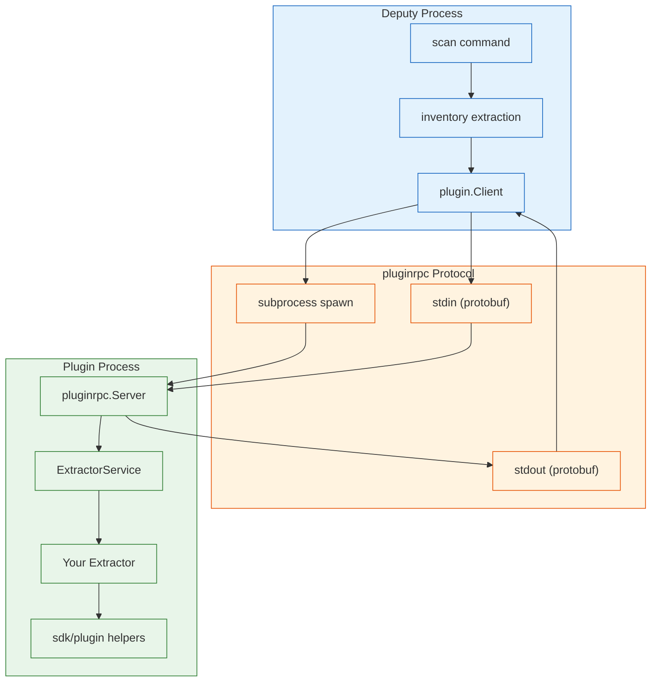
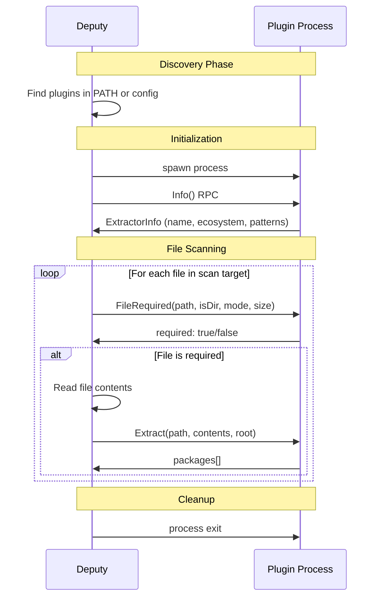
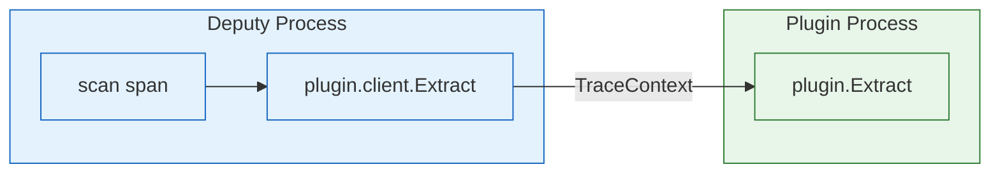
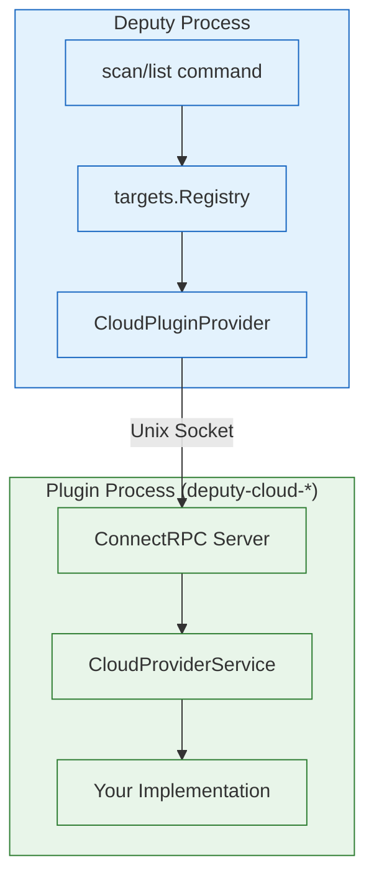

# Building Deputy Extractor Plugins

This guide covers how to build custom extractor plugins for Deputy. Plugins enable custom package detection for file formats not supported by the built-in extractors.

## Overview

Deputy supports three types of inventory extractors:

| Type | Location | Language | Discovery |
|------|----------|----------|-----------|
| **OSV-SCALIBR** | Built-in | Go | Automatic |
| **Deputy Built-in** | `internal/inventory/plugins/` | Go | Automatic |
| **Plugins** | External executables | Any | PATH or config |

Plugins are standalone executables that communicate with Deputy via [pluginrpc](https://github.com/pluginrpc/pluginrpc), a subprocess-based RPC protocol using Protocol Buffers.

## Architecture



## Quick Start (Go)

Create a plugin in a single `main.go` file:

```go
package main

import (
    "strings"
    "github.com/picatz/deputy/sdk/plugin"
)

func main() {
    plugin.Main(&myExtractor{})
}

type myExtractor struct{}

func (e *myExtractor) Name() string           { return "custom/myformat" }
func (e *myExtractor) DisplayName() string    { return "My Custom Format" }
func (e *myExtractor) Ecosystem() string      { return "custom" }
func (e *myExtractor) Version() int           { return 1 }
func (e *myExtractor) Description() string    { return "Extracts packages from .myformat files" }
func (e *myExtractor) FilePatterns() []string { return []string{"*.myformat"} }

func (e *myExtractor) FileRequired(path string, isDir bool, mode uint32, size int64) bool {
    return strings.HasSuffix(path, ".myformat")
}

func (e *myExtractor) Extract(path string, contents []byte, root string) ([]*plugin.Package, error) {
    // Parse contents and return packages
    return []*plugin.Package{
        plugin.NewPackage("example-pkg", "1.0.0", "custom"),
    }, nil
}
```

Build and install:

```bash
go build -o deputy-extractor-myformat .
mv deputy-extractor-myformat /usr/local/bin/
```

## Plugin Lifecycle



## The Extractor Interface

Implement the `Extractor` interface from `github.com/picatz/deputy/sdk/plugin`:

```go
type Extractor interface {
    // Metadata - called once at startup
    Name() string           // Unique identifier (e.g., "ruby/gemspec")
    DisplayName() string    // Human-readable name
    Ecosystem() string      // Package ecosystem (go, npm, pypi, etc.)
    Version() int           // Increment on behavior changes
    Description() string    // What does this extractor do?
    FilePatterns() []string // Glob patterns for matched files

    // File filtering - called for every file (keep fast!)
    FileRequired(path string, isDir bool, mode uint32, size int64) bool

    // Package extraction - called only for required files
    Extract(path string, contents []byte, root string) ([]*Package, error)
}
```

### Metadata Methods

| Method | Purpose | Example |
|--------|---------|---------|
| `Name()` | Unique identifier for the extractor | `"ruby/gemspec"` |
| `DisplayName()` | Human-readable name for logs/UI | `"Ruby Gemspec"` |
| `Ecosystem()` | Package ecosystem for grouping | `"rubygems"` |
| `Version()` | Version number (increment on changes) | `1` |
| `Description()` | What this extractor does | `"Extracts gem dependencies from .gemspec files"` |
| `FilePatterns()` | Glob patterns for discovery | `["*.gemspec", "Gemfile.lock"]` |

### FileRequired

Called for every file during scanning. Return `true` if the file should be extracted.

```go
func (e *myExtractor) FileRequired(path string, isDir bool, mode uint32, size int64) bool {
    // Skip directories
    if isDir {
        return false
    }

    // Match by extension
    if strings.HasSuffix(path, ".myformat") {
        return true
    }

    // Match by filename
    base := filepath.Base(path)
    if base == "myformat.lock" {
        return true
    }

    return false
}
```

**Performance tip:** This method is called for every file. Keep it fast - use string matching, not file I/O.

### Extract

Called for files where `FileRequired` returned `true`. Parse the file contents and return packages.

```go
func (e *myExtractor) Extract(path string, contents []byte, root string) ([]*plugin.Package, error) {
    var packages []*plugin.Package

    // Parse your custom format
    for _, dep := range parseMyFormat(contents) {
        pkg := plugin.NewPackageBuilder(dep.Name, dep.Version, "custom").
            WithPURL(fmt.Sprintf("pkg:custom/%s@%s", dep.Name, dep.Version)).
            WithLicenses(dep.License).
            WithDirect(dep.IsDirect).
            WithLocations(path).
            Build()

        packages = append(packages, pkg)
    }

    return packages, nil
}
```

## Creating Packages

### Simple Constructor

```go
pkg := plugin.NewPackage("lodash", "4.17.21", "npm")
```

### Builder Pattern

For packages with additional metadata:

```go
pkg := plugin.NewPackageBuilder("lodash", "4.17.21", "npm").
    WithPURL("pkg:npm/lodash@4.17.21").
    WithLicenses("MIT").
    WithDirect(true).
    WithLocations("package.json").
    WithManifestRef("package.json", "npm", "dependencies").
    Build()
```

### Package Fields

| Field | Description | Required |
|-------|-------------|----------|
| `Name` | Package name | Yes |
| `Version` | Package version | Yes |
| `Ecosystem` | Package ecosystem | Yes |
| `PURL` | Package URL | No |
| `Licenses` | SPDX license identifiers | No |
| `Direct` | Is direct dependency | No |
| `Locations` | Source file paths | No |

## Plugin Registration

### Via Configuration

Add to `.deputy.yaml`:

```yaml
plugins:
  extractors:
    # Absolute path
    - path: /usr/local/bin/deputy-extractor-myformat

    # Relative path
    - path: ./tools/deputy-extractor-myformat

    # Search PATH by name
    - name: deputy-extractor-gemspec
```

### Via PATH Discovery

Plugins named `deputy-extractor-*` in PATH are auto-discovered:

```bash
# These are auto-discovered
/usr/local/bin/deputy-extractor-gemspec
/usr/local/bin/deputy-extractor-pyproject
~/.local/bin/deputy-extractor-custom
```

## Distributed Tracing

Plugins automatically participate in distributed traces when OpenTelemetry is configured.



### How It Works

1. Set `OTEL_EXPORTER_OTLP_ENDPOINT` environment variable
2. Deputy injects W3C TraceContext into plugin requests
3. Plugin SDK extracts context and creates child spans
4. Traces flow seamlessly across process boundaries

### Viewing Traces

```bash
# Start Jaeger (or your preferred collector)
docker run -d --name jaeger \
  -p 16686:16686 \
  -p 4317:4317 \
  jaegertracing/all-in-one:latest

# Run Deputy with tracing
DEPUTY_OTEL_ENABLED=true \
OTEL_EXPORTER_OTLP_ENDPOINT=localhost:4317 \
deputy scan .

# View traces at http://localhost:16686
```

## Testing Plugins

### Protocol Testing

```bash
# Check protocol version
./deputy-extractor-myformat --protocol
# Output: 1

# Check procedure spec
./deputy-extractor-myformat --spec
# Output: JSON procedure spec

# Get extractor info
./deputy-extractor-myformat info --format json
# Output: {"name":"custom/myformat","display_name":"My Format",...}
```

### Integration Testing

```go
func TestMyExtractor(t *testing.T) {
    // Build the plugin
    pluginPath := buildPlugin(t)
    defer os.Remove(pluginPath)

    // Create client
    ctx := context.Background()
    client, err := invplugin.NewClient(ctx, pluginPath)
    require.NoError(t, err)

    // Test metadata
    info := client.ExtractorInfo()
    assert.Equal(t, "custom/myformat", info.Name)

    // Test file matching
    required, err := client.FileRequired(ctx, "test.myformat", false, 0644, 100)
    require.NoError(t, err)
    assert.True(t, required)

    // Test extraction
    contents := []byte(`name: example\nversion: 1.0.0`)
    packages, err := client.ExtractPackages(ctx, "test.myformat", contents, "/project")
    require.NoError(t, err)
    assert.Len(t, packages, 1)
    assert.Equal(t, "example", packages[0].Name)
}
```

### With Deputy

```bash
# Debug mode shows plugin invocations
DEPUTY_LOG_LEVEL=debug deputy scan .
```

## Writing Plugins in Other Languages

Plugins can be written in any language that supports protobuf. Implement the `ExtractorService` from `api/deputy/plugin/v1/extractor.proto`:

```protobuf
service ExtractorService {
  rpc Info(InfoRequest) returns (InfoResponse);
  rpc FileRequired(FileRequiredRequest) returns (FileRequiredResponse);
  rpc Extract(ExtractRequest) returns (ExtractResponse);
}
```

### Requirements

1. **Protocol flag**: `--protocol` returns `1`
2. **Spec flag**: `--spec` returns the procedure spec (binary protobuf)
3. **Subcommands**: `info`, `file-required`, `extract`
4. **I/O**: Read protobuf from stdin, write protobuf to stdout

### Python Example (Conceptual)

```python
#!/usr/bin/env python3
import sys
from deputy.plugin.v1 import extractor_pb2

def handle_info():
    response = extractor_pb2.InfoResponse()
    response.info.name = "python/custom"
    response.info.display_name = "Python Custom"
    response.info.ecosystem = "pypi"
    response.info.version = 1
    sys.stdout.buffer.write(response.SerializeToString())

def handle_file_required(request):
    response = extractor_pb2.FileRequiredResponse()
    response.required = request.path.endswith(".custom")
    sys.stdout.buffer.write(response.SerializeToString())

def handle_extract(request):
    response = extractor_pb2.ExtractResponse()
    # Parse request.contents and populate response.packages
    sys.stdout.buffer.write(response.SerializeToString())

if __name__ == "__main__":
    if "--protocol" in sys.argv:
        print("1")
    elif "--spec" in sys.argv:
        print('{"procedures":[...]}')
    elif sys.argv[1] == "info":
        handle_info()
    elif sys.argv[1] == "file-required":
        request = extractor_pb2.FileRequiredRequest()
        request.ParseFromString(sys.stdin.buffer.read())
        handle_file_required(request)
    elif sys.argv[1] == "extract":
        request = extractor_pb2.ExtractRequest()
        request.ParseFromString(sys.stdin.buffer.read())
        handle_extract(request)
```

## Best Practices

### Performance

- `FileRequired` is called for every file - keep it fast (string matching only)
- Avoid reading files in `FileRequired` - Deputy provides contents in `Extract`
- Cache compiled regexes if using pattern matching

### Error Handling

```go
func (e *myExtractor) Extract(path string, contents []byte, root string) ([]*plugin.Package, error) {
    packages, err := parseMyFormat(contents)
    if err != nil {
        // Return partial results with error context
        return nil, fmt.Errorf("parse %s: %w", path, err)
    }
    return packages, nil
}
```

### Versioning

Increment `Version()` when:
- Changing what files are matched
- Changing what packages are extracted
- Fixing bugs that affect extraction results

This allows Deputy to invalidate caches appropriately.

### Naming Conventions

| Convention | Example |
|------------|---------|
| Binary name | `deputy-extractor-<format>` |
| Extractor name | `<ecosystem>/<format>` |
| Display name | `<Format> <Ecosystem>` |

## Example: Dotenv Extractor

See [examples/plugins/dotenv-extractor/](../../examples/plugins/dotenv-extractor/) for a complete working example that:

- Discovers `.env` files
- Reports environment variable files as packages
- Demonstrates the full plugin lifecycle

## Troubleshooting

### Plugin Not Found

```bash
# Check if plugin is in PATH
which deputy-extractor-myformat

# Check plugin permissions
ls -la $(which deputy-extractor-myformat)

# Test plugin directly
deputy-extractor-myformat --protocol
```

### Protocol Errors

```bash
# Enable debug logging
DEPUTY_LOG_LEVEL=debug deputy scan .

# Check plugin stderr
deputy-extractor-myformat info 2>&1
```

### Trace Context Not Propagating

```bash
# Verify OTel is enabled
DEPUTY_OTEL_ENABLED=true \
OTEL_EXPORTER_OTLP_ENDPOINT=localhost:4317 \
deputy scan .

# Check for trace IDs in debug output
DEPUTY_LOG_LEVEL=debug deputy scan . 2>&1 | grep trace
```

## Reference

- [Plugin SDK (pkg.go.dev)](https://pkg.go.dev/github.com/picatz/deputy/sdk/plugin)
- [ExtractorService Proto](../../api/deputy/plugin/v1/extractor.proto)
- [pluginrpc Documentation](https://github.com/pluginrpc/pluginrpc)
- [Example: Dotenv Extractor](../../examples/plugins/dotenv-extractor/)

---

# Building Cloud Provider Plugins

Cloud provider plugins extend Deputy's target support to additional cloud platforms like OpenStack, VMware vSphere, or custom private clouds.

## Overview

Cloud provider plugins are standalone executables that communicate with Deputy over Unix sockets using ConnectRPC. They enable:

- **Target detection**: Recognize URIs like `openstack://instances`
- **Collection listing**: Enumerate available resources (VMs, images, snapshots)
- **Resource opening**: Materialize cloud resources for scanning

## Architecture



## The CloudProviderService Interface

Implement the `CloudProviderService` from `api/deputy/cloud/v1/plugin.proto`:

```protobuf
service CloudProviderService {
  // GetInfo returns metadata about this cloud provider plugin.
  rpc GetInfo(GetProviderInfoRequest) returns (GetProviderInfoResponse);

  // Detect checks if a target URI is handled by this provider.
  rpc Detect(DetectRequest) returns (DetectResponse);

  // IsCollection checks if a target URI represents a collection.
  rpc IsCollection(IsCollectionRequest) returns (IsCollectionResponse);

  // List enumerates resources in a collection.
  rpc List(PluginListRequest) returns (PluginListResponse);

  // Open materializes a cloud resource for scanning.
  rpc Open(OpenResourceRequest) returns (stream OpenResourceEvent);

  // Close releases resources from a previous Open call.
  rpc Close(CloseResourceRequest) returns (CloseResourceResponse);
}
```

### RPC Methods

| Method | Purpose | When Called |
|--------|---------|-------------|
| `GetInfo` | Return plugin metadata | Plugin startup |
| `Detect` | Check if URI belongs to this provider | Target resolution |
| `IsCollection` | Check if URI is a collection (e.g., `openstack://instances`) | Before listing |
| `List` | Enumerate resources in a collection | `deputy list <collection>` |
| `Open` | Download/mount resource for scanning | `deputy scan <target>` |
| `Close` | Clean up after scanning | After scan completes |

## Plugin Discovery

Cloud provider plugins are discovered as executables named `deputy-cloud-<name>` in PATH:

```bash
# These are auto-discovered
/usr/local/bin/deputy-cloud-openstack
/usr/local/bin/deputy-cloud-vsphere
~/.local/bin/deputy-cloud-mycloud
```

## Implementing Collection Support

To support `deputy list` for discovering resources, implement `IsCollection` and `List`:

### IsCollection

```go
func (s *Server) IsCollection(
    ctx context.Context,
    req *connect.Request[cloudv1.IsCollectionRequest],
) (*connect.Response[cloudv1.IsCollectionResponse], error) {
    target := req.Msg.Target

    // Collection URIs use plural resource names
    // e.g., "openstack://instances", "openstack://images"
    isCollection := false
    collectionType := ""

    if strings.HasPrefix(target, "openstack://") {
        u, _ := url.Parse(target)
        switch u.Host {
        case "instances":
            isCollection = true
            collectionType = "instances"
        case "images":
            isCollection = true
            collectionType = "images"
        case "volumes":
            isCollection = true
            collectionType = "volumes"
        }
    }

    return connect.NewResponse(&cloudv1.IsCollectionResponse{
        IsCollection:   isCollection,
        CollectionType: collectionType,
    }), nil
}
```

### List

```go
func (s *Server) List(
    ctx context.Context,
    req *connect.Request[cloudv1.PluginListRequest],
) (*connect.Response[cloudv1.PluginListResponse], error) {
    target := req.Msg.Target
    opts := req.Msg.Options

    // Parse collection URI
    u, _ := url.Parse(target)
    collectionType := u.Host

    var resources []*cloudv1.CloudResource

    switch collectionType {
    case "instances":
        instances, err := s.client.ListInstances(ctx, opts)
        if err != nil {
            return nil, connect.NewError(connect.CodeInternal, err)
        }
        for _, inst := range instances {
            resources = append(resources, &cloudv1.CloudResource{
                Id:          inst.ID,
                Name:        inst.Name,
                Type:        cloudv1.ResourceType_RESOURCE_TYPE_VM,
                Provider:    "openstack",
                Uri:         fmt.Sprintf("openstack://instance/%s", inst.ID),
                CreatedAt:   timestamppb.New(inst.Created),
                Description: inst.Description,
                Metadata: map[string]string{
                    "project": inst.Project,
                    "flavor":  inst.Flavor,
                },
            })
        }
    case "images":
        // Similar for images...
    }

    return connect.NewResponse(&cloudv1.PluginListResponse{
        Resources: resources,
    }), nil
}
```

## URI Design Guidelines

Follow these conventions for consistent CLI experience:

| Pattern | Type | Example |
|---------|------|---------|
| `<provider>://<collection>` | Collection | `openstack://instances` |
| `<provider>://<resource>/<id>` | Specific | `openstack://instance/abc-123` |
| `?param=value` | Filter/option | `openstack://instances?project=myproj` |

### Collection vs Specific

```
# Collections (plural) - list resources
openstack://instances
openstack://images
vsphere://vms

# Specific (singular with ID) - scan resource
openstack://instance/abc-123
openstack://image/img-456
vsphere://vm/vm-789
```

## Example Usage

After implementing a cloud provider plugin:

```bash
# Discover instances
$ deputy list openstack://instances
TARGET                                   NAME              CREATED
openstack://instance/abc-123             web-server-1      2024-01-15
openstack://instance/def-456             db-server-1       2024-01-10

# Discover with filters
$ deputy list openstack://instances?project=production

# Scan a specific instance
$ deputy scan openstack://instance/abc-123

# Pipeline: discover and scan
$ deputy list openstack://instances -f json | \
    jq -r '.targets[].uri' | \
    xargs -I{} deputy scan {}
```

## Testing Cloud Plugins

```bash
# Check plugin is discoverable
which deputy-cloud-openstack

# Test detection
deputy scan openstack://instance/test-123 --dry-run

# Debug mode
DEPUTY_LOG_LEVEL=debug deputy list openstack://instances
```

## Proto Reference

- [CloudProviderService Proto](../../api/deputy/cloud/v1/plugin.proto)
- [CloudResource Proto](../../api/deputy/cloud/v1/cloud.proto)
