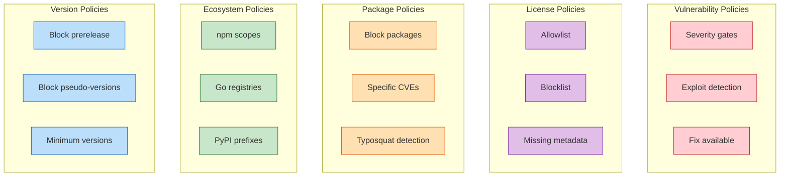
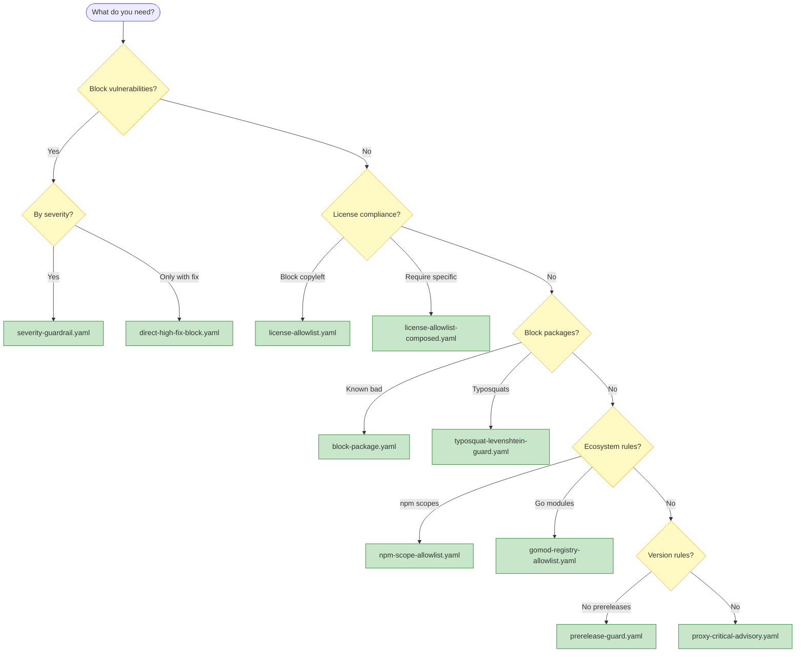

# Policy Cookbook

Real-world CEL policy patterns for common security and compliance scenarios.

> All examples are available in the [policy examples](../../policy/examples/).

## Policy Categories Overview



## Choosing a Policy



## Quick Reference

| Category | Policy | Use Case |
| --- | --- | --- |
| **Severity** | [`severity-guardrail.yaml`](#block-critical-and-high-severity) | Block critical/high vulnerabilities |
| **Licenses** | [`license-allowlist.yaml`](#license-allowlist) | Block copyleft licenses |
| **Packages** | [`block-package.yaml`](#blocklist-specific-packages) | Ban compromised packages |
| **Typosquats** | [`typosquat-levenshtein-guard.yaml`](#typosquat-detection) | Detect name confusion attacks |
| **Ecosystems** | [`npm-scope-allowlist.yaml`](#npm-scope-allowlist) | Restrict to approved scopes |
| **Versions** | [`prerelease-guard.yaml`](#block-prerelease-versions) | Block alpha/beta/rc versions |
| **Proxy** | [`proxy-critical-advisory.yaml`](#proxy-time-enforcement) | Enforce at download time |

---

## Vulnerability Policies

### Block Critical and High Severity

```yaml
# severity-guardrail.yaml
policies:
  - name: deny-critical-and-high
    description: Deny artifacts with CRITICAL/HIGH vulnerabilities
    vars:
      blockedSeverities:
        - CRITICAL
        - HIGH
    rules:
      - action: deny
        when: vulnerabilities.exists(v, blockedSeverities.exists(s, s == v.severity))
        reason: dependency has unresolved high-severity vulnerabilities
        remediation: Apply the vendor patch or upgrade to a remediated release
```

**When to use:** CI gates, release pipelines, proxy enforcement

### Block Only If Fix Available

```yaml
# direct-high-fix-block.yaml
policies:
  - name: direct-high-fix-block
    description: Block direct dependencies with HIGH/CRITICAL vulns when a fix exists
    vars:
      highSeverities:
        - CRITICAL
        - HIGH
      severity: 'vulnerability.?severity.orValue("").upperAscii()'
      isDirect: 'vulnerability.?isDirect.orValue(false)'
      hasFix: 'size(vulnerability.?fixedVersions.orValue([])) > 0'
      inScope: 'env.entrypoint in ["scan_vulnerability", "diff_vulnerability"]'
    rules:
      - action: deny
        when: inScope && isDirect && hasFix && severity in highSeverities
        reason: Direct dependency has a HIGH/CRITICAL vulnerability with an available fix
        remediation: Upgrade this dependency to a fixed version
```

**When to use:** Allow unfixed vulns to pass while enforcing upgrades when fixes exist

### Exploit Available Blocker

```yaml
# exploit-available-blocker.yaml
policies:
  - name: exploit-available-critical
    rules:
      - action: deny
        when: |
          vulnerabilities.exists(v, 
            v.severity == "CRITICAL" && 
            v.?hasExploit.orValue(false)
          )
        reason: critical vulnerability with known exploit
        remediation: Immediate patching required
```

**When to use:** Prioritize actively exploited vulnerabilities

---

## License Policies

### License Allowlist

```yaml
# license-allowlist.yaml
policies:
  - name: allow-sans-copyleft
    description: Block copyleft licenses
    vars:
      forbidden:
        - SSPL-1.0
        - AGPL-3.0-only
        - GPL-3.0
    rules:
      - action: deny
        when: pkg.licenses.exists(l, l in forbidden)
        reason: package carries a forbidden license
      - action: warn
        when: size(pkg.licenses) == 0
        reason: package missing license metadata
```

### Composed License Policy

```yaml
# license-allowlist-composed.yaml
policies:
  - name: approved-licenses-only
    vars:
      approved:
        - MIT
        - Apache-2.0
        - BSD-2-Clause
        - BSD-3-Clause
        - ISC
        - 0BSD
    rules:
      - action: deny
        when: |
          size(pkg.licenses) > 0 &&
          !pkg.licenses.all(l, l in approved)
        reason: package uses non-approved license
        remediation: Request license exception or find alternative
```

**When to use:** Strict compliance environments, legal requirements

---

## Package Policies

### Blocklist Specific Packages

```yaml
# block-package.yaml
policies:
  - name: block-known-bad-packages
    vars:
      blockedPkgs:
        - left-pad
        - event-stream
        - ua-parser-js
        - ctx
    rules:
      - action: deny
        when: pkg.name in blockedPkgs
        reason: package is blocklisted due to previous compromises
        remediation: Use reviewed internal alternatives
```

### Log4Shell Specific Block

```yaml
# log4shell.yaml
policies:
  - name: log4shell-cve-2021-44228
    rules:
      - action: deny
        when: |
          vulnerabilities.exists(v, 
            v.id == "CVE-2021-44228" || 
            v.?aliases.orValue([]).exists(a, a == "CVE-2021-44228")
          )
        reason: Log4Shell vulnerability detected
        remediation: Upgrade log4j to 2.17.0+ or remove dependency
```

### XZ Backdoor Detection

```yaml
# xz-backdoor.yaml
policies:
  - name: xz-backdoor-cve-2024-3094
    rules:
      - action: deny
        when: |
          pkg.name.matches("(?i)^xz(-utils)?$") &&
          pkg.version.matches("^5\\.6\\.[01]$")
        reason: xz-utils versions 5.6.0/5.6.1 contain backdoor
        remediation: Downgrade to 5.4.x or upgrade to 5.6.2+
```

---

## Ecosystem-Specific Policies

### npm Scope Allowlist

```yaml
# npm-scope-allowlist.yaml
policies:
  - name: npm-scope-allowlist
    vars:
      allowedScopes:
        - "@mycompany"
        - "@types"
        - "@babel"
        - "@testing-library"
    rules:
      - action: deny
        when: |
          pkg.ecosystem == "npm" &&
          pkg.name.startsWith("@") &&
          !allowedScopes.exists(s, pkg.name.startsWith(s + "/"))
        reason: npm scope not in allowlist
        remediation: Request scope approval or use unscoped package
```

### Go Module Registry Allowlist

```yaml
# gomod-registry-allowlist.yaml
policies:
  - name: go-registry-allowlist
    vars:
      allowedPrefixes:
        - "github.com/"
        - "golang.org/"
        - "google.golang.org/"
        - "k8s.io/"
    rules:
      - action: deny
        when: |
          pkg.ecosystem == "go" &&
          !allowedPrefixes.exists(p, pkg.name.startsWith(p))
        reason: Go module not from approved registry
```

### PyPI Prefix Allowlist

```yaml
# pypi-prefix-allowlist.yaml
policies:
  - name: pypi-org-packages
    vars:
      allowedPrefixes:
        - "mycompany-"
        - "django-"
        - "flask-"
    rules:
      - action: warn
        when: |
          pkg.ecosystem == "pypi" &&
          !allowedPrefixes.exists(p, pkg.name.startsWith(p))
        reason: PyPI package not from approved namespace
```

---

## Version Policies

### Block Prerelease Versions

```yaml
# prerelease-guard.yaml
policies:
  - name: no-prerelease
    rules:
      - action: deny
        when: pkg.version.matches("(?i)-(alpha|beta|rc|dev|pre)")
        reason: prerelease versions not allowed in production
        remediation: Use stable release version
```

### Go Pseudo-Version Deny

```yaml
# go-pseudo-version-deny.yaml
policies:
  - name: no-pseudo-versions
    rules:
      - action: deny
        when: |
          pkg.ecosystem == "go" &&
          pkg.version.matches("v\\d+\\.\\d+\\.\\d+-\\d{14}-[a-f0-9]{12}")
        reason: Go pseudo-versions indicate unreleased code
        remediation: Pin to a tagged release
```

### Minimum Version Enforcement

```yaml
# min-version.yaml
policies:
  - name: minimum-go-version
    vars:
      parts: 'pkg.version.split(".")'
      major: 'size(parts) > 0 ? int(parts[0]) : 0'
      minor: 'size(parts) > 1 ? int(parts[1]) : 0'
      numeric: 'pkg.version.matches("^\\d+\\.\\d+(\\.\\d+)?$")'
    rules:
      - action: warn
        when: |
          pkg.name == "stdlib" &&
          numeric &&
          (major < 1 || (major == 1 && minor < 21))
        reason: Go version below minimum supported
        remediation: Upgrade to Go 1.21+
```

---

## Typosquat & Supply Chain

### Typosquat Detection

```yaml
# typosquat-levenshtein-guard.yaml
policies:
  - name: typosquat-levenshtein-guard
    vars:
      popular: ["react","lodash","express","typescript","axios"]
      allowScopes: ["@acme", "@types"]
      name: 'pkg.name.lowerAscii()'
      isScoped: 'name.startsWith("@")'
      limit: '(size(name) <= 5 ? 1 : (size(name) <= 8 ? 2 : 3))'
      nearPopular: 'popular.exists(p, levenshteinWithin(name, p, limit))'
    rules:
      - action: deny
        when: env.command == "proxy" && !isScoped && nearPopular
        reason: package name suspiciously similar to popular package
        remediation: Verify the intended package name
```

### Domain-Branded Package Guard

```yaml
# domain-branded-package-guard.yaml
policies:
  - name: domain-brand-guard
    vars:
      protectedDomains: ["google", "microsoft", "amazon", "apple"]
    rules:
      - action: warn
        when: |
          protectedDomains.exists(d, 
            pkg.name.contains(d) && 
            !pkg.name.startsWith("@" + d)
          )
        reason: package name contains protected brand
```

---

## Proxy Policies

### Proxy-Time Enforcement

```yaml
# proxy-critical-advisory.yaml
policies:
  - name: proxy-block-critical
    rules:
      - action: deny
        when: |
          env.command == "proxy" &&
          vulnerabilities.exists(v, v.severity == "CRITICAL")
        reason: critical vulnerability blocked at download
        remediation: Check OSV for remediation guidance
```

### New Dependency Review

```yaml
# new-dependency-review.yaml
policies:
  - name: new-dep-requires-review
    rules:
      - action: warn
        when: |
          env.command == "proxy" &&
          !pkg.?existsInLockfile.orValue(false)
        reason: new dependency requires security review
        details:
          requiresApproval: true
```

---

## Combining Policies

Bundle multiple policies for comprehensive coverage:

```console
# Lint all policies
$ deputy policy lint policy/examples/*.yaml

# Bundle for deployment
$ deputy policy bundle \
    --out production-bundle.json \
    policy/examples/severity-guardrail.yaml \
    policy/examples/license-allowlist.yaml \
    policy/examples/block-package.yaml

# Use in CI
$ deputy scan --policy production-bundle.json
```

---

## Writing Custom Policies

### Available Variables

| Variable | Type | Description |
| --- | --- | --- |
| `pkg` | object | Current package being evaluated |
| `pkg.name` | string | Package name |
| `pkg.version` | string | Package version |
| `pkg.ecosystem` | string | `go`, `npm`, `pypi`, `rubygems` |
| `pkg.licenses` | []string | SPDX license identifiers (when available) |
| `vulnerability` | object | Single vulnerability (in `scan_vulnerability` entrypoint) |
| `vulnerability.severity` | string | Severity level (CRITICAL/HIGH/MEDIUM/LOW) |
| `vulnerability.isDirect` | bool | Whether the affected package is a direct dependency |
| `vulnerability.fixedVersions` | []string | Available fix versions |
| `vulnerabilities` | []object | List of vulnerabilities (in `scan_report` entrypoint) |
| `env.command` | string | `scan`, `diff`, `proxy`, etc. |
| `env.entrypoint` | string | Current entrypoint (e.g., `scan_vulnerability`) |

### CEL Functions and Extensions

Deputy policies use standard CEL operators and macros (`has`, `exists`, `map`, `filter`) plus cel-go extensions. Key helpers available in Deputy:

| Category | Functions |
| --- | --- |
| Deputy helpers | `now`, `age`, `levenshtein`, `levenshteinWithin` |
| String helpers | `matches`, `join`, `split`, `trim`, `replace`, `lowerAscii`, `upperAscii` |
| Encoding | `base64.encode`, `base64.decode` |
| Math | `math.abs`, `math.ceil`, `math.floor`, `math.round`, `math.greatest`, `math.least` |
| Bindings | `cel.bind` |

Additional list/set helpers from `ext.Lists` and `ext.Sets` are enabled; see the [policy framework](../reference/policy-framework.md#cel-helpers-and-extensions) for details and links to the CEL extension docs.
This list is not exhaustive; see the CEL language references linked in the policy framework.

### Testing Your Policy

```console
# 1. Write policy
$ cat > my-policy.yaml << 'EOF'
policies:
  - name: my-custom-rule
    rules:
      - action: deny
        when: pkg.name == "bad-package"
        reason: blocked by policy
EOF

# 2. Lint
$ deputy policy lint my-policy.yaml

# 3. Test interactively
$ deputy policy repl
> :set name=bad-package
> pkg.name == "bad-package"
Result: true

# 4. Test against real scan
$ deputy scan --policy my-policy.yaml
```

---

## Common Mistakes

Avoid these anti-patterns when writing CEL policies.

### Mistake 1: Missing Optional Handling for External Data Fields

```yaml
# WRONG: Will error if fixedVersions field is not present
- action: deny
  when: vulnerability.fixedVersions.size() > 0
  reason: fix available
```

```yaml
# CORRECT: Use optional chaining with orValue for fields that may not exist
- action: deny
  when: vulnerability.?fixedVersions.orValue([]).size() > 0
  reason: fix available
```

**Why:** Objects representing external data (like `vulnerability`, `change`, `jwt`) may not have all fields present. Use `?.orValue()` for fields that may be absent.

**When to use `?.orValue()`:**
- `vulnerability.?fixedVersions.orValue([])` — not all vulns have fixes
- `vulnerability.?severity.orValue("")` — severity may be unknown
- `component.?purlType.orValue("")` — SBOM components may lack type
- `change.?targetVersion.orValue("")` — diff changes may lack target
- `jwt.?roles.orValue([])` — JWT custom claims are optional

**When NOT needed (sensible defaults provided):**
- `pkg.name` — defaults to `""` (empty string)
- `pkg.version` — defaults to `""` (empty string)
- `pkg.ecosystem` — defaults to `""` (empty string)
- `pkg.licenses` — defaults to `[]` (empty list)
- `vulnerabilities.exists(...)` — top-level list handles nil gracefully
- `env.command` — always injected by Deputy

The `pkg` helper is synthesized by Deputy and always provides sensible defaults, so you can safely write:

```yaml
# This works without ?.orValue() because pkg fields have defaults
- action: deny
  when: pkg.licenses.exists(l, l == "GPL-3.0")
  reason: copyleft license
```

### Mistake 2: Case Sensitivity Issues

```yaml
# WRONG: Severity values are uppercase
- action: deny
  when: vulnerability.severity == "critical"
  reason: critical vulnerability
```

```yaml
# CORRECT: Use uppercase
- action: deny
  when: vulnerability.severity == "CRITICAL"
  reason: critical vulnerability
```

**Why:** Deputy uses uppercase severity strings (`CRITICAL`, `HIGH`, `MEDIUM`, `LOW`). String comparisons are case-sensitive.

### Mistake 3: Forgetting Entrypoint Context

```yaml
# WRONG: vulnerability (singular) is only populated in scan_vulnerability entrypoint
policies:
  - name: check-vuln
    rules:
      - action: deny
        when: vulnerability.severity == "CRITICAL"
```

```yaml
# CORRECT: Use entrypoints filter to scope the policy
policies:
  - name: check-vuln
    entrypoints: ["scan_vulnerability", "diff_vulnerability"]
    rules:
      - action: deny
        when: vulnerability.severity == "CRITICAL"

# OR use env check in the rule:
policies:
  - name: check-vuln
    rules:
      - action: deny
        when: env.entrypoint == "scan_vulnerability" && vulnerability.severity == "CRITICAL"
```

**Why:** Different entrypoints populate different variables. The `vulnerability` (singular) object is only available in per-vulnerability entrypoints like `scan_vulnerability`. Use `vulnerabilities` (list) with `.exists()` in report-level entrypoints like `scan_report`.

### Mistake 4: Variable Order Dependencies

```yaml
# WRONG: vars reference each other in wrong order
policies:
  - name: bad-order
    vars:
      filtered: 'all.filter(x, x.severity == "HIGH")'  # 'all' not defined yet!
      all: 'vulnerabilities'
    rules:
      - action: deny
        when: size(filtered) > 0
```

```yaml
# CORRECT: Define dependencies first (top to bottom)
policies:
  - name: good-order
    vars:
      all: 'vulnerabilities'
      filtered: 'all.filter(x, x.severity == "HIGH")'  # 'all' is now available
    rules:
      - action: deny
        when: size(filtered) > 0
```

**Why:** Variables are evaluated in author-specified order (top to bottom). Later vars can reference earlier ones, but not vice versa.

### Mistake 5: Version-Specific Proxy Logic Without Guard

```yaml
# PROBLEM: Also matches metadata/index requests where version is "<unknown>"
- action: deny
  when: pkg.name == "lodash" && pkg.version == "4.17.20"
  reason: blocked vulnerable version
```

```yaml
# CORRECT: Guard version-specific logic with has_version
- action: deny
  when: request.has_version && pkg.name == "lodash" && pkg.version == "4.17.20"
  reason: blocked vulnerable version
```

**Why:** Proxy requests for package metadata/indexes don't have a concrete version (`request.version` is `"<unknown>"`). Use `request.has_version` to only match artifact downloads. For blocking all versions of a package, no guard is needed:

```yaml
# This is fine for all-version blocks:
- action: deny
  when: pkg.name == "lodash"
  reason: blocked package (all versions)
```

### Mistake 6: Overly Broad String Matching

```yaml
# WRONG: Matches "react", "react-dom", "react-native", "preact", etc.
- action: deny
  when: pkg.name.contains("react")
  reason: blocked package
```

```yaml
# CORRECT: Use exact match or anchored patterns
- action: deny
  when: pkg.name == "react"
  reason: blocked package

# OR match a family with regex:
- action: deny
  when: pkg.name.matches("^react(-.*)?$")
  reason: blocked react packages
```

**Why:** `contains()` matches substrings anywhere. Use `==` for exact matches or `matches()` with anchored patterns for controlled matching.

### Mistake 7: Empty List Edge Cases

```yaml
# WRONG: Returns true when no vulnerabilities exist (vacuous truth)
- action: allow
  when: vulnerabilities.all(v, v.severity != "CRITICAL")
  reason: no critical vulnerabilities
```

```yaml
# CORRECT: Check for non-empty list first
- action: allow
  when: size(vulnerabilities) > 0 && vulnerabilities.all(v, v.severity != "CRITICAL")
  reason: no critical vulnerabilities in non-empty scan

# BETTER: Use exists() for deny rules (handles empty lists correctly)
- action: deny
  when: vulnerabilities.exists(v, v.severity == "CRITICAL")
  reason: critical vulnerability found
```

**Why:** `all()` on an empty list returns `true` (vacuously true). This can cause unexpected allows. Prefer `exists()` for deny rules — it returns `false` on empty lists.

### Debugging Checklist

When a policy doesn't behave as expected:

1. **Lint first:** `deputy policy lint policy.yaml`
2. **Check entrypoint:** Is the variable populated in your entrypoint?
3. **Test in REPL:** `deputy policy repl` to test expressions interactively
4. **Use simulate:** `deputy policy simulate --policy policy.yaml --input recorded.json`
5. **Check case:** Are string comparisons using the correct case?
6. **Check field access:** Use `?.orValue()` for object fields that may not exist

## See Also

- [Policy command reference](../commands/policy.md)
- [Policy spec](../reference/policy-spec.md)
- [Policy examples](../../policy/examples/)
