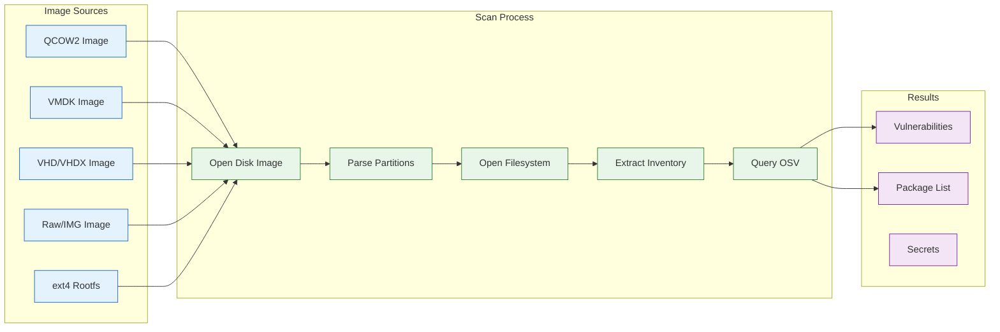

# VM and Rootfs Image Security

This guide covers scanning VM disk images and rootfs images for vulnerabilities and secrets.

## Quick Start

Scan a VM image in under 30 seconds:

```console
# Scan a qcow2 disk image
$ deputy scan vm:///path/to/disk.qcow2

# Scan a raw rootfs image
$ deputy scan rootfs:///path/to/rootfs.ext4

# Scan with JSON output
$ deputy scan --format json /path/to/disk.qcow2
```

Scan for secrets in VM images:

```console
# Scan for leaked credentials and secrets
$ deputy secrets vm:///path/to/disk.qcow2

# Scan rootfs for secrets
$ deputy secrets rootfs:///path/to/rootfs.ext4
```

## How VM Scanning Works



Deputy reads the disk image, parses the partition table (GPT or MBR), identifies Linux partitions, opens the filesystem (ext4), and walks it to extract the software inventory. This happens entirely in userspace with no root privileges or kernel mounts required.

## Supported Formats

### Disk Image Formats

| Format | Extension | Description |
|--------|-----------|-------------|
| QCOW2 | `.qcow2`, `.qcow` | QEMU Copy-On-Write format |
| VMDK | `.vmdk` | VMware Virtual Machine Disk |
| VHD | `.vhd` | Microsoft Virtual Hard Disk |
| VHDX | `.vhdx` | Microsoft Virtual Hard Disk v2 |
| VDI | `.vdi` | VirtualBox Disk Image |
| Raw | `.raw`, `.img`, `.bin` | Raw disk image |

### Filesystem Formats

| Format | Description |
|--------|-------------|
| ext4 | Linux ext4 filesystem (primary support) |

## Target Schemes

### VM Disk Images

Use the `vm://` scheme for disk images with partition tables:

```console
# QCOW2 images
$ deputy scan vm:///path/to/ubuntu-server.qcow2

# VMDK images
$ deputy scan vm:///path/to/centos.vmdk

# VHD images
$ deputy scan vm:///path/to/debian.vhd

# Raw disk images
$ deputy scan vm:///path/to/disk.raw
```

### Rootfs Images

Use the `rootfs://` scheme for raw filesystem images without partition tables:

```console
# ext4 rootfs
$ deputy scan rootfs:///path/to/rootfs.ext4

# IMG files
$ deputy scan rootfs:///path/to/rootfs.img
```

### Auto-Detection

Deputy auto-detects VM images by file extension:

```console
# These are equivalent
$ deputy scan /path/to/disk.qcow2
$ deputy scan vm:///path/to/disk.qcow2

# Explicit source override
$ deputy scan --source vm /path/to/disk.img
$ deputy scan --source rootfs /path/to/filesystem.img
```

## Partition Selection

By default, Deputy auto-detects the root partition using these heuristics:

1. Look for GPT root partition type GUIDs
2. Find Linux filesystem partitions (ext4)
3. Select the largest Linux partition

You can override this with the `--partition` flag:

```console
# Auto-detect root partition (default)
$ deputy scan vm:///path/to/disk.qcow2

# Scan a specific partition (1-based index)
$ deputy scan vm:///path/to/disk.qcow2 --partition 2

# Scan all partitions and merge results
$ deputy scan vm:///path/to/disk.qcow2 --partition all
```

## Examples

### Scanning Cloud VM Images

```console
# Download and scan an Ubuntu cloud image
$ wget https://cloud-images.ubuntu.com/jammy/current/jammy-server-cloudimg-amd64.img
$ deputy scan vm://jammy-server-cloudimg-amd64.img

# Scan with JSON output
$ deputy scan vm://jammy-server-cloudimg-amd64.img --format json --output scan.json
```

### Scanning Container Rootfs

Deputy can scan rootfs images used by container runtimes or sandboxes:

```console
# Scan a custom rootfs
$ deputy scan rootfs:///var/lib/containers/rootfs.ext4

# Scan with secrets detection
$ deputy secrets rootfs:///path/to/rootfs.ext4
```

### Scanning VMware Images

```console
# Scan a VMDK disk
$ deputy scan vm:///path/to/vm.vmdk

# With vulnerability filtering
$ deputy scan vm:///path/to/vm.vmdk --ignore-unfixed
```

### Scanning Hyper-V Images

```console
# Scan a VHDX disk
$ deputy scan vm:///path/to/disk.vhdx

# Scan with policy enforcement
$ deputy scan vm:///path/to/disk.vhdx --policy policy/vm-security.yaml
```

## Secrets Scanning

Scan VM images for leaked credentials, API keys, and other secrets:

```console
# Basic secrets scan
$ deputy secrets vm:///path/to/disk.qcow2

# JSON output
$ deputy secrets vm:///path/to/disk.qcow2 --format json

# Scan rootfs
$ deputy secrets rootfs:///path/to/rootfs.ext4
```

Common secrets detected:
- SSH private keys
- API keys and tokens
- Database credentials
- Cloud provider credentials
- TLS/SSL private keys
- Password files

## CI/CD Integration

### GitHub Actions

```yaml
name: VM Image Security Scan

on:
  push:
    paths:
      - 'images/**'

jobs:
  scan:
    runs-on: ubuntu-latest
    steps:
      - uses: actions/checkout@v4

      - name: Build VM image
        run: |
          # Build your VM image
          packer build template.pkr.hcl

      - name: Scan VM image
        run: |
          deputy scan vm://output/disk.qcow2 \
            --format json \
            --output scan-results.json

      - name: Scan for secrets
        run: |
          deputy secrets vm://output/disk.qcow2 \
            --format json \
            --output secrets-results.json

      - name: Upload results
        uses: actions/upload-artifact@v4
        with:
          name: security-scan-results
          path: |
            scan-results.json
            secrets-results.json
```

### GitLab CI

```yaml
vm-security-scan:
  image: golang:1.22
  script:
    - go install github.com/picatz/deputy@latest
    - deputy scan vm://$CI_PROJECT_DIR/images/disk.qcow2
        --format json
        --output scan-results.json
    - deputy secrets vm://$CI_PROJECT_DIR/images/disk.qcow2
        --format json
        --output secrets-results.json
  artifacts:
    reports:
      container_scanning: scan-results.json
```

## Writing Policies

VM image policies use the standard `scan_report` and `scan_vulnerability` entrypoints:

### Block Critical Vulnerabilities

```yaml
policies:
  - name: vm-no-critical
    description: Block critical vulnerabilities in VM images
    entrypoints: ["scan_report"]
    rules:
      - action: deny
        when: |
          scan.summary.by_severity.critical > 0
        reason: "VM image contains critical vulnerabilities"
        remediation: "Update packages to patched versions"
```

### Require Security Updates

```yaml
policies:
  - name: vm-security-updates
    description: Ensure security packages are up to date
    entrypoints: ["scan_vulnerability"]
    rules:
      - action: deny
        when: |
          vulnerability.package.ecosystem == "deb" &&
          vulnerability.advisory.severity.level == severity.high &&
          vulnerability.has_fix
        reason: "High severity vulnerability with available fix"
        remediation: "Run apt-get update && apt-get upgrade"
```

## Troubleshooting

### Unsupported Filesystem

```
Error: unsupported filesystem type
```

**Solution**: Deputy currently supports ext4 filesystems. Ensure the VM image uses ext4 for the root partition.

### No Linux Partition Found

```
Error: no Linux partition found
```

**Solution**: The disk image may not have a standard Linux partition. Try:
- Use `--partition` to specify a partition number
- Use `rootfs://` scheme for raw filesystem images
- Verify the image has a GPT or MBR partition table

### Compressed Images

```
Error: invalid magic number
```

**Solution**: Decompress the image first:
```console
$ gunzip disk.qcow2.gz
$ deputy scan vm://disk.qcow2

# Or for xz compression
$ xz -d disk.qcow2.xz
$ deputy scan vm://disk.qcow2
```

### Large Images and Performance

VM image scanning uses pure Go libraries for filesystem parsing, which provides excellent portability (no root required, no kernel mounts) but is slower than kernel-mounted filesystems.

**Expected scan times** (on modern hardware with SSD):

| Image Size | Virtual Size | Approximate Time |
|------------|--------------|------------------|
| Small (< 200MB) | < 1GB | 5-15 seconds |
| Medium (200MB - 500MB) | 1-5GB | 30-90 seconds |
| Large (> 500MB) | > 5GB | 2-5 minutes |

**Performance factors**:
- **Virtual disk size**: Larger filesystems have more files to traverse
- **File count**: More files = longer scan time
- **Disk format**: QCOW2 sparse images are efficient; raw images scale with virtual size
- **Storage I/O**: SSD strongly recommended over HDD

**Optimization tips**:
- Use SSD storage for faster I/O
- Scan specific partitions with `--partition N`
- Use `--ecosystems` to limit to specific package types (e.g., `--ecosystems deb` for Debian/Ubuntu)
- For CI/CD, consider caching scan results for unchanged images
- Build minimal VM images - fewer packages = faster scans

**Why pure Go?**
The pure Go approach enables scanning without root privileges, kernel modules, or FUSE dependencies. This makes Deputy safe for unprivileged CI runners and portable across platforms. The tradeoff is performance compared to kernel-mounted filesystems.

## Technical Details

### Dependencies

Deputy uses these Go libraries for VM image parsing:

| Library | Purpose |
|---------|---------|
| [lima-vm/go-qcow2reader](https://github.com/lima-vm/go-qcow2reader) | QCOW2, VMDK, VHDX, VDI format support |
| [masahiro331/go-disk](https://github.com/masahiro331/go-disk) | GPT/MBR partition table parsing |
| [masahiro331/go-ext4-filesystem](https://github.com/masahiro331/go-ext4-filesystem) | ext4 filesystem support |

These libraries are used by production tools like Lima/Colima and Trivy.

### No Root Required

VM image scanning is done entirely in userspace:
- No `mount` commands or kernel modules
- No root/sudo privileges needed
- Safe for unprivileged CI runners

### Memory Usage

Deputy reads disk images as `io.ReaderAt`, allowing random access without loading the entire image into memory. Memory usage scales with:
- Number of files in the filesystem
- Package database sizes (dpkg, rpm, apk)

## Known Limitations

### Filesystem Support

Currently only ext4 is supported. XFS and Btrfs support is planned for future releases.

### Encrypted Images

Encrypted disk images (LUKS, BitLocker) are not supported. Decrypt the image first if scanning is required.

### LVM Volumes

LVM (Logical Volume Manager) volumes within disk images are not currently supported.

### Snapshot Chains

QCOW2 backing files and snapshot chains are supported by the underlying library but may have limitations with complex chains.

## Next Steps

- [Container Image Security](container-images.md) - Scanning container images
- [Policy Cookbook](policy-cookbook.md) - More policy patterns
- [Secrets Scanning](../commands/secrets.md) - Detailed secrets detection
- [Troubleshooting](troubleshooting.md) - Common issues
