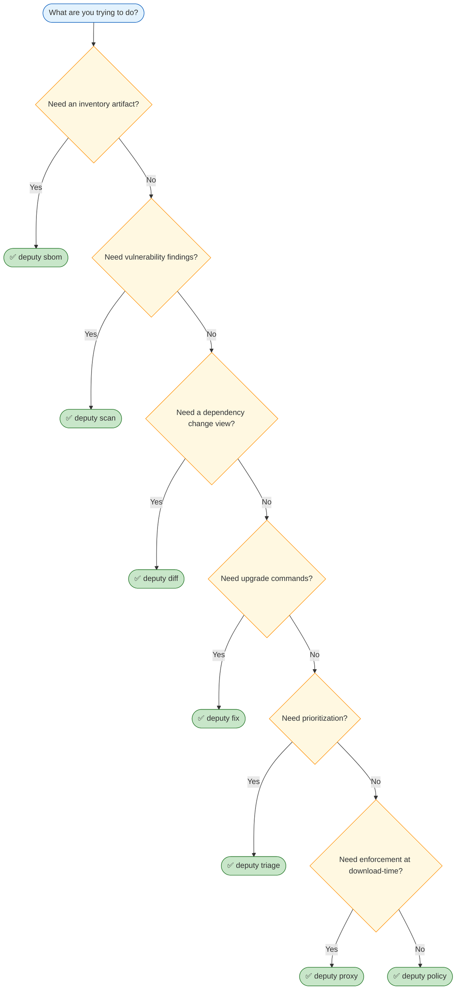

# Workflows

Use this page to pick the “right” Deputy command for the job.

## Choose a command

## Typical team setup

- Local: `deputy diff` and `deputy scan` for rapid feedback.
- CI: `deputy scan --format json` and `deputy sbom` to produce artifacts.
- Org controls: policies in `policy/`, enforced in CI and/or proxy.

