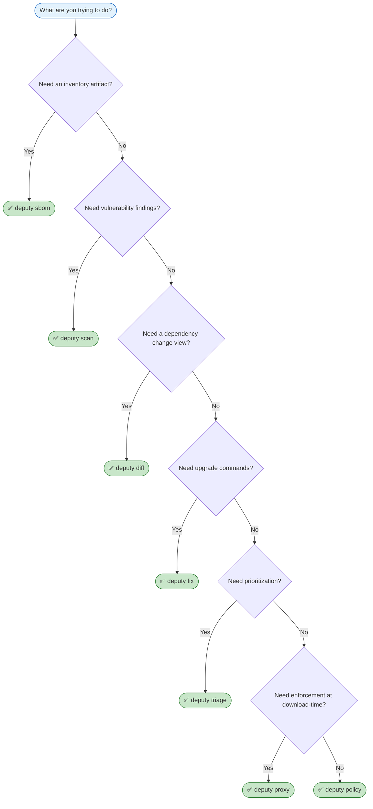

# Workflows

Choose the right Deputy command for your task.

## Command Selection



---

## Common Scenarios

### Daily Development

```console
# Quick vulnerability check
$ deputy scan

# See what changed since last commit
$ deputy diff HEAD~1 HEAD

# Auto-fix what can be fixed
$ deputy fix --apply
```

### Pull Request Review

```console
# Compare PR branch to main
$ deputy diff main feature-branch

# Check for new vulnerabilities introduced
$ deputy scan --ref feature-branch --format json | jq '.vulnerabilities | length'

# Generate SBOM for the PR
$ deputy sbom --ref feature-branch --output pr-sbom.json
```

### Release Preparation

```console
# Full vulnerability scan with policy
$ deputy scan --policy production-policy.yaml

# Generate release SBOM
$ deputy sbom --format cyclonedx-json --output release-sbom.json

# Verify no regressions from last release
$ deputy diff v1.2.0 HEAD
```

### Incident Response

```console
# Check if you're affected by a specific CVE
$ deputy scan | grep CVE-2024-1234

# Find when vulnerability was introduced
$ deputy diff "HEAD@{1.month.ago}" HEAD | grep vulnerable-package

# Historical view: what was known at ship date
$ deputy scan --as-of=2024-06-15
```

### Dependency Audit

```console
# List all dependencies
$ deputy list --format json | jq '.items | length'

# Check licenses
$ deputy sbom --licenses | jq '.components[].licenses'

# Find direct vs transitive
$ deputy list --only-direct
$ deputy list | grep -v "true$"  # transitives only
```

---

## Team Setup Patterns

### Solo Developer

```
Local only:
  deputy scan           # before commit
  deputy fix --apply    # when vulns found
```

### Small Team

```
Local:
  deputy scan           # quick feedback
  deputy diff           # PR review

CI (GitHub Actions):
  deputy scan --format json --output scan.json
  deputy sbom --output sbom.json
```

### Enterprise

```
Local:
  deputy proxy go -- go get ...     # enforced downloads
  deputy scan                        # pre-commit checks

CI:
  deputy scan --policy corp.yaml   # policy controls enforcement
  deputy sbom --format cyclonedx-json

Centralized:
  deputy proxy serve --config proxy.yaml   # shared proxy server
  Policy bundles in artifact registry
```

---

## Pipeline Patterns

### Scan → Fix → Verify

```console
# 1. Find issues
$ deputy scan --format json --output before.json

# 2. Generate and apply fixes
$ deputy fix --apply

# 3. Verify fixes worked
$ deputy scan --format json --output after.json

# 4. Compare
$ jq -s '.[0].summary.total - .[1].summary.total' before.json after.json
# Output: number of vulns fixed
```

### Diff → Policy → Gate

```console
# 1. Get changes
$ deputy diff main HEAD --format json --output changes.json

# 2. Apply policy to changes
$ deputy policy eval \
    --policy release-policy.yaml \
    --input changes.json

# 3. Gate on policy result
$ deputy scan --policy release-policy.yaml || exit 1
```

### SBOM → Attest → Publish

```console
# 1. Generate SBOM
$ deputy sbom --format cyclonedx-json --output sbom.json

# 2. Sign with cosign (example)
$ cosign attest --predicate sbom.json --type cyclonedx myimage:latest

# 3. Publish to registry
$ oras push myregistry.io/sboms:v1.0 sbom.json:application/vnd.cyclonedx+json
```

---

## Integration Points

### Git Hooks

```bash
# .git/hooks/pre-commit
#!/bin/sh
deputy scan --policy policy/deny-critical.yaml
```

### Make/Task Targets

```makefile
# Makefile
.PHONY: security
security:
	deputy scan --policy policy.yaml

.PHONY: sbom
sbom:
	deputy sbom --output dist/sbom.json

.PHONY: fix
fix:
	deputy fix --apply && go mod tidy
```

### CI Matrix

| Stage | Command | Artifact |
| --- | --- | --- |
| PR Check | `deputy diff main HEAD` | - |
| Build | `deputy sbom` | `sbom.json` |
| Gate | `deputy scan --policy` | `scan.json` |
| Release | `deputy sbom --licenses` | `sbom-full.json` |

---

## Troubleshooting Workflows

### "Too many vulnerabilities"

```console
# Focus on fixable vulnerabilities first
$ deputy scan --ignore-unfixed

# Or use triage for AI assistance
$ deputy triage
```

### "Policy keeps failing"

```console
# Debug the policy
$ deputy policy lint my-policy.yaml

# Test against current state
$ deputy scan --format json | deputy policy eval --policy my-policy.yaml --input -
```

### "Need to ignore specific CVEs"

```console
# Temporary: use grep
$ deputy scan | grep -v CVE-2024-WONTFIX

# Proper: add to policy
# See policy-cookbook.md for allowlist patterns
```

---

## See Also

- Command reference: [`docs/commands/`](../commands/)
- CI setup: [`ci.md`](ci.md)
- Policy cookbook: [`policy-cookbook.md`](policy-cookbook.md)
- Troubleshooting: [`troubleshooting.md`](troubleshooting.md)
