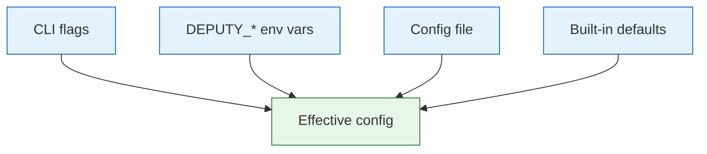

# Configuration

Deputy can be configured via CLI flags, environment variables, and an optional YAML config file.

## Precedence

Highest wins:

1. Command-line flags
2. Environment variables (`DEPUTY_*`)
3. Configuration file
4. Built-in defaults



## Config File Locations

Deputy searches these locations (in order):

1. `.deputy.yaml` (current directory)
2. `deputy.yaml` (current directory)
3. `~/.deputy.yaml` (home directory)

Override with `DEPUTY_CONFIG=/path/to/config.yaml`.

## Starter Config

See [`.deputy.yaml.example`](../../.deputy.yaml.example) for an annotated template. Copy to `.deputy.yaml` and customize.

## Config File Schema

```yaml
# Logging configuration
logging:
  level: info              # debug, info, warn, error
  format: text             # text, json
  color: true              # ANSI colors (auto-detected if omitted)
  source: false            # Include source file/line

# Default scanning behavior
scan:
  ecosystems:              # Limit to specific ecosystems
    - go
    - npm
  ignore_unfixed: false    # Ignore vulns without fixes
  format: text             # Default output format

# SBOM generation defaults
sbom:
  format: cyclonedx-json   # cyclonedx-json, spdx-json, protobom-json
  enrich_licenses: false   # Enrich with license data
  license_source: depsdev  # depsdev, scan, both

# Policy configuration
policy:
  paths:                   # Default policy files
    - policy/guardrails.yaml
  mode: enforce            # enforce, advisory

# Proxy configuration
proxy:
  addr: ":8080"            # Listen address
  policies:                # Policy files for enforcement
    - policy/proxy.yaml

# Agent configuration
agent:
  sandbox: workspace-write # read-only, workspace-write, danger-full-access
  skip_git_check: false    # Skip git repo validation
```

## Configuration Reference

### Logging

| Key | Type | Default | Description |
|-----|------|---------|-------------|
| `logging.level` | string | `info` | Log verbosity: `debug`, `info`, `warn`, `error` |
| `logging.format` | string | `text` | Output format: `text`, `json` |
| `logging.color` | bool | auto | Enable ANSI colors in text format |
| `logging.source` | bool | `false` | Include source file/line (debugging) |

**Environment variables:**
- `DEPUTY_LOG_LEVEL`
- `DEPUTY_LOG_FORMAT`
- `DEPUTY_LOG_COLOR`
- `DEPUTY_LOG_SOURCE`

### Scanning

| Key | Type | Default | Description |
|-----|------|---------|-------------|
| `scan.ecosystems` | []string | all | Ecosystems to scan (`go`, `npm`, `pypi`, `rubygems`) |
| `scan.ignore_unfixed` | bool | `false` | Filter out vulns without available fixes |
| `scan.format` | string | `text` | Default output format |

**Environment variables:**
- `DEPUTY_SCAN_ECOSYSTEMS` (comma-separated)
- `DEPUTY_SCAN_SKIP_CACHE`

### SBOM

| Key | Type | Default | Description |
|-----|------|---------|-------------|
| `sbom.format` | string | `cyclonedx-json` | Default SBOM format |
| `sbom.enrich_licenses` | bool | `false` | Fetch license data during generation |
| `sbom.license_source` | string | `depsdev` | License data source: `depsdev`, `scan`, `both` |

### Policy

| Key | Type | Default | Description |
|-----|------|---------|-------------|
| `policy.paths` | []string | none | Default policy files to load |
| `policy.mode` | string | `enforce` | Default mode: `enforce`, `advisory` |

**Environment variables:**
- `DEPUTY_POLICY_PATHS` (comma-separated)
- `DEPUTY_POLICY_MODE`

### Proxy

| Key | Type | Default | Description |
|-----|------|---------|-------------|
| `proxy.addr` | string | `:8080` | Default listen address |
| `proxy.policies` | []string | none | Policy files for proxy enforcement |

**Environment variables:**
- `DEPUTY_PROXY_ADDR`
- `DEPUTY_PROXY_POLICIES` (comma-separated)

### Agent

| Key | Type | Default | Description |
|-----|------|---------|-------------|
| `agent.sandbox` | string | `workspace-write` | Sandbox level for AI agents |
| `agent.skip_git_check` | bool | `false` | Skip git repository validation |

**Sandbox levels:**
- `read-only` - Agent can only read files
- `workspace-write` - Agent can write within workspace
- `danger-full-access` - Full system access (use with caution)

## Environment Variables

### Required for specific features

| Variable | Required For |
|----------|--------------|
| `GITHUB_TOKEN` | Enhanced rate limits, license enrichment, private repos |
| `ANTHROPIC_API_KEY` | Claude agent (`deputy fix --agent claude`) |
| `CODEX_API_KEY` | Codex agent (`deputy fix --agent codex`) |

### All DEPUTY_* variables

```bash
# Logging
DEPUTY_LOG_LEVEL=debug
DEPUTY_LOG_FORMAT=json
DEPUTY_LOG_COLOR=true
DEPUTY_LOG_SOURCE=true

# Configuration
DEPUTY_CONFIG=/path/to/config.yaml

# Scanning
DEPUTY_SCAN_ECOSYSTEMS=go,npm
DEPUTY_SCAN_SKIP_CACHE=true

# Policy
DEPUTY_POLICY_PATHS=policy/a.yaml,policy/b.yaml
DEPUTY_POLICY_MODE=advisory

# Proxy
DEPUTY_PROXY_ADDR=:9090
DEPUTY_PROXY_POLICIES=policy/proxy.yaml
```

## Per-Project vs Global Config

| Use Case | Location |
|----------|----------|
| Project defaults | `.deputy.yaml` in repo root |
| Personal defaults | `~/.deputy.yaml` |
| CI/CD overrides | Flags or env vars |

**Best practice:** Commit `.deputy.yaml` to source control for team consistency, but keep secrets (API keys) in environment variables.

## Example Configurations

### Minimal (local development)

```yaml
logging:
  level: debug
```

### CI/CD pipeline

```yaml
logging:
  level: info
  format: json

scan:
  ignore_unfixed: false

policy:
  paths:
    - policy/severity-guardrail.yaml
  mode: enforce
```

### Security team

```yaml
logging:
  level: info

policy:
  paths:
    - policy/license-allowlist.yaml
    - policy/severity-guardrail.yaml
    - policy/block-deprecated.yaml
  mode: enforce

sbom:
  enrich_licenses: true
  license_source: both
```

### Enterprise proxy deployment

```yaml
logging:
  level: info
  format: json

proxy:
  addr: ":8080"
  policies:
    - policy/enterprise-guardrails.yaml

policy:
  mode: enforce
```

## Debugging Configuration

```bash
# See effective config
deputy scan --log-level debug 2>&1 | head -20

# Verify config file is loaded
DEPUTY_LOG_LEVEL=debug deputy scan 2>&1 | grep -i config

# Test with explicit config
DEPUTY_CONFIG=./test-config.yaml deputy scan
```

## See Also

- [Logging](logging.md) - Detailed logging configuration
- [Environment Variables](README.md#environment-variables) - Complete variable reference
- [CLI Reference](../commands/README.md) - Command-specific flags
