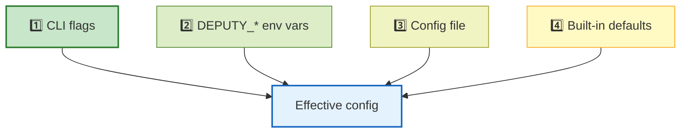

# Configuration

Deputy can be configured via flags, environment variables, and an optional YAML config file.

## Precedence

Highest wins:

1. Command-line flags
2. Environment variables (`DEPUTY_*`)
3. Configuration file
4. Built-in defaults

## Config file locations

Deputy searches (in order):

- `.deputy.yaml` (current directory)
- `deputy.yaml` (current directory)
- `~/.deputy.yaml` (home directory)

Or set `DEPUTY_CONFIG=/path/to/config.yaml`.

## Starter config

This repo includes an annotated example:

- [`.deputy.yaml.example`](../../.deputy.yaml.example)

Copy it to `.deputy.yaml` and adjust as needed.

## What belongs in config

- Logging defaults (level/format/color)
- Scan defaults (ecosystems, caching)
- Proxy defaults (listen address, policy paths)
- Policy defaults (paths, mode)

For command-specific one-offs, prefer flags so CI jobs remain explicit.

