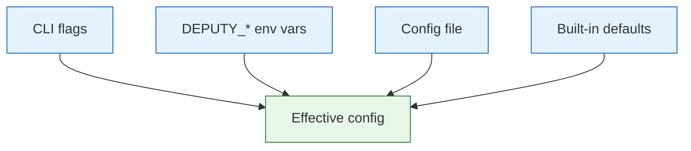

# Configuration

Deputy can be configured via CLI flags, environment variables, and an optional YAML config file.

## Precedence

Highest wins:

1. Command-line flags
2. Environment variables (`DEPUTY_*`)
3. Configuration file
4. Built-in defaults



## Config File Locations

Deputy searches these locations (in order):

1. `.deputy.yaml` (current directory)
2. `deputy.yaml` (current directory)
3. `~/.deputy.yaml` (home directory)

Override with `DEPUTY_CONFIG=/path/to/config.yaml`.

## Starter Config

See [`.deputy.yaml.example`](../../.deputy.yaml.example) for an annotated template. Copy to `.deputy.yaml` and customize.

## Config File Schema

```yaml
# Logging configuration
logging:
  level: info              # debug, info, warn, error
  format: text             # text, json
  color: true              # ANSI colors (auto-detected if omitted)
  source: false            # Include source file/line

# Default scanning behavior
scan:
  ecosystems:              # Limit to specific ecosystems
    - go
    - npm
  exclude_paths:           # Additional directory globs to skip during the walk
    - .bin/**              #   vendored tool binaries
    - "**/testdata"        #   test fixtures (matches at any depth)
  ignore_unfixed: false    # Ignore vulns without fixes
  format: text             # Default output format

# SBOM generation defaults
sbom:
  format: cyclonedx-json   # cyclonedx-json, spdx-json, protobom-json
  enrich_licenses: false   # Enrich with license data
  license_source: depsdev  # depsdev, scan, both

# Policy configuration
policy:
  paths:                   # Default policy files
    - policy/guardrails.yaml
  mode: enforce            # enforce, advisory

# Proxy configuration
proxy:
  addr: ":8080"            # Listen address
  policies:                # Policy files for enforcement
    - policy/proxy.yaml

# Local CLI egress allowlists (for in-process mode)
egress:
  allowed_hosts: [".corp.local"]
  allowed_cidrs: ["10.0.0.0/8"]
  allow_loopback: false
  allow_link_local: false

# Server configuration (for `deputy server`)
server:
  addr: "127.0.0.1:8090"   # Listen address (loopback by default)
  read_timeout: 30s
  write_timeout: 5m
  idle_timeout: 2m
  max_request_body_bytes: 10485760
  tls:
    cert_file: "/path/to/cert.pem"
    key_file: "/path/to/key.pem"
    client_ca_file: ""     # Optional mTLS CA
  cors:
    allowed_origins: ["https://app.example.com"]
    allowed_methods: ["GET", "POST"]
    allowed_headers: ["Authorization", "Content-Type"]
    allow_credentials: false
    max_age: 600
  auth:
    mode: "required"       # required or disabled
    jwks_url: "https://issuer/.well-known/jwks.json"
    oidc_discovery: false
    issuers: ["https://issuer"]
    audiences: ["deputy-server"]
    required_claims: ["sub", "tenant"]
    clock_skew: 30s
  rate_limit:
    enabled: true
    requests_per_second: 10
    burst: 20
  security:
    allow_public: false    # Explicit opt-in to bind 0.0.0.0
    allow_insecure: false  # Allow no TLS/auth or policy errors
  egress:
    allowed_hosts: [".corp.local"]
    allowed_cidrs: ["10.0.0.0/8"]
    allow_ssh: false          # Allow non-HTTPS git targets (ssh://, git://, git@)
    allow_loopback: false
    allow_link_local: false

# AI/Agent configuration
ai:
  default_provider: ""     # Default AI provider (codex, claude)
  disabled: false          # Completely disable AI features
  approval:
    required: false        # Require approval for all operations
    commands: true         # Require approval for shell commands
    file_writes: false     # Require approval for file modifications
    high_risk: true        # Always require approval for dangerous operations
  providers:
    codex:
      sandbox: workspace-write
    claude:
      model: claude-3-5-sonnet-20241022
      api_key: ${ANTHROPIC_API_KEY}
```

## Configuration Reference

### Logging

| Key | Type | Default | Description |
|-----|------|---------|-------------|
| `logging.level` | string | `info` | Log verbosity: `debug`, `info`, `warn`, `error` |
| `logging.format` | string | `text` | Output format: `text`, `json` |
| `logging.color` | bool | auto | Enable ANSI colors in text format |
| `logging.source` | bool | `false` | Include source file/line (debugging) |

**Environment variables:**
- `DEPUTY_LOG_LEVEL`
- `DEPUTY_LOG_FORMAT`
- `DEPUTY_LOG_COLOR`
- `DEPUTY_LOG_SOURCE`

### Scanning

| Key | Type | Default | Description |
|-----|------|---------|-------------|
| `scan.ecosystems` | []string | all | Ecosystems to scan (`go`, `npm`, `pypi`, `rubygems`) |
| `scan.exclude_paths` | []string | (none) | Additional directory globs to skip during the walk (e.g. `.bin/**`). Local source scans already prune directories ignored by `.gitignore`; this setting is for Deputy-specific exclusions and is unioned with `--exclude-path`. A slash-less name matches at any depth; a slashed path is anchored to the scan root. Honored by scan, diff, list, and graph. |
| `scan.ignore_unfixed` | bool | `false` | Filter out vulns without available fixes |
| `scan.format` | string | `text` | Default output format |

**Environment variables:**
- `DEPUTY_SCAN_ECOSYSTEMS` (comma-separated)
- `DEPUTY_SCAN_SKIP_CACHE`
- `DEPUTY_OSV_BASE_URL` (override OSV API base URL; useful for tests or mirrors)
- `DEPUTY_ADVISORY_SOURCES` (comma-separated advisory-source plugin programs to
  load alongside the built-in OSV source, as PATH-resolved names or paths.
  Explicit opt-in: Deputy never auto-executes plugins it merely finds on PATH.
  See the [plugins guide](../guides/plugins.md#advisory-source-plugins).)

### SBOM

| Key | Type | Default | Description |
|-----|------|---------|-------------|
| `sbom.format` | string | `cyclonedx-json` | Default SBOM format |
| `sbom.enrich_licenses` | bool | `false` | Fetch license data during generation |
| `sbom.license_source` | string | `depsdev` | License data source: `depsdev`, `scan`, `both` |

### Policy

| Key | Type | Default | Description |
|-----|------|---------|-------------|
| `policy.paths` | []string | none | Default policy files to load |
| `policy.mode` | string | `enforce` | Default mode: `enforce`, `advisory` |

**Environment variables:**
- `DEPUTY_POLICY_PATHS` (comma-separated)
- `DEPUTY_POLICY_MODE`

### Proxy

| Key | Type | Default | Description |
|-----|------|---------|-------------|
| `proxy.addr` | string | `:8080` | Default listen address |
| `proxy.policies` | []string | none | Policy files for proxy enforcement |

**Environment variables:**
- `DEPUTY_PROXY_ADDR`
- `DEPUTY_PROXY_POLICIES` (comma-separated)

### Egress (Local CLI)

| Key | Type | Default | Description |
|-----|------|---------|-------------|
| `egress.allowed_hosts` | []string | none | Hostnames allowed to resolve to private IPs in local CLI mode |
| `egress.allowed_cidrs` | []string | none | CIDR ranges allowed for outbound connections in local CLI mode |
| `egress.allow_loopback` | bool | `false` | Allow loopback addresses |
| `egress.allow_link_local` | bool | `false` | Allow link-local addresses |

**Environment variables:**
- `DEPUTY_EGRESS_ALLOW_HOSTS`
- `DEPUTY_EGRESS_ALLOW_CIDRS`
- `DEPUTY_EGRESS_ALLOW_LOOPBACK`
- `DEPUTY_EGRESS_ALLOW_LINK_LOCAL`

### Server

| Key | Type | Default | Description |
|-----|------|---------|-------------|
| `server.addr` | string | `127.0.0.1:8090` | Listen address (loopback by default) |
| `server.read_timeout` | duration | `30s` | Max duration for reading request |
| `server.write_timeout` | duration | `5m` | Max duration for writing response |
| `server.idle_timeout` | duration | `2m` | Max time to wait for next request |
| `server.max_request_body_bytes` | int | `10485760` | Max request body size |

**TLS:**
| Key | Type | Default | Description |
|-----|------|---------|-------------|
| `server.tls.cert_file` | string | none | TLS certificate file |
| `server.tls.key_file` | string | none | TLS private key file |
| `server.tls.client_ca_file` | string | none | Client CA for mTLS |

**CORS:**
| Key | Type | Default | Description |
|-----|------|---------|-------------|
| `server.cors.allowed_origins` | []string | none | Allowed origins (use `*` with care) |
| `server.cors.allowed_methods` | []string | Connect defaults | Allowed methods |
| `server.cors.allowed_headers` | []string | Connect defaults | Allowed headers |
| `server.cors.allow_credentials` | bool | `false` | Allow credentials |
| `server.cors.max_age` | int | `0` | Preflight max age (seconds) |

**Auth:**
| Key | Type | Default | Description |
|-----|------|---------|-------------|
| `server.auth.mode` | string | `disabled` | `required` or `disabled` |
| `server.auth.jwks_url` | string | none | JWKS endpoint URL |
| `server.auth.oidc_discovery` | bool | `false` | Use OIDC discovery |
| `server.auth.issuers` | []string | none | Trusted token issuers |
| `server.auth.audiences` | []string | none | Expected audiences |
| `server.auth.required_claims` | []string | none | Required JWT claims |
| `server.auth.clock_skew` | duration | `0s` | Clock drift allowance (max 5m) |

**Rate Limit:**
| Key | Type | Default | Description |
|-----|------|---------|-------------|
| `server.rate_limit.enabled` | bool | `false` | Enable rate limiting |
| `server.rate_limit.requests_per_second` | float | `10` | Requests per second |
| `server.rate_limit.burst` | int | `20` | Burst size |

**Security:**
| Key | Type | Default | Description |
|-----|------|---------|-------------|
| `server.security.allow_public` | bool | `false` | Allow binding to non-loopback addresses |
| `server.security.allow_insecure` | bool | `false` | Allow no TLS/auth or policy load failures |

**Egress:**
| Key | Type | Default | Description |
|-----|------|---------|-------------|
| `server.egress.allowed_hosts` | []string | none | Hostnames allowed to resolve to private IPs |
| `server.egress.allowed_cidrs` | []string | none | CIDR ranges allowed for outbound connections |
| `server.egress.allow_ssh` | bool | `false` | Allow non-HTTPS git targets (ssh://, git://, git@) |
| `server.egress.allow_loopback` | bool | `false` | Allow loopback addresses |
| `server.egress.allow_link_local` | bool | `false` | Allow link-local addresses |

**Environment variables:**
- `DEPUTY_SERVER_ADDR`
- `DEPUTY_SERVER_READ_TIMEOUT`
- `DEPUTY_SERVER_WRITE_TIMEOUT`
- `DEPUTY_SERVER_IDLE_TIMEOUT`
- `DEPUTY_SERVER_MAX_REQUEST_BODY_BYTES`
- `DEPUTY_SERVER_TLS_CERT`
- `DEPUTY_SERVER_TLS_KEY`
- `DEPUTY_SERVER_TLS_CLIENT_CA`
- `DEPUTY_SERVER_CORS_ORIGINS`
- `DEPUTY_SERVER_CORS_METHODS`
- `DEPUTY_SERVER_CORS_HEADERS`
- `DEPUTY_SERVER_CORS_CREDENTIALS`
- `DEPUTY_SERVER_CORS_MAX_AGE`
- `DEPUTY_SERVER_AUTH_ENABLED`
- `DEPUTY_SERVER_AUTH_MODE`
- `DEPUTY_SERVER_AUTH_JWKS_URL`
- `DEPUTY_SERVER_AUTH_OIDC_DISCOVERY`
- `DEPUTY_SERVER_AUTH_ISSUERS`
- `DEPUTY_SERVER_AUTH_AUDIENCES`
- `DEPUTY_SERVER_AUTH_REQUIRED_CLAIMS`
- `DEPUTY_SERVER_AUTH_CLOCK_SKEW`
- `DEPUTY_SERVER_RATE_LIMIT_ENABLED`
- `DEPUTY_SERVER_RATE_LIMIT_RPS`
- `DEPUTY_SERVER_RATE_LIMIT_BURST`
- `DEPUTY_SERVER_SECURITY_ALLOW_PUBLIC`
- `DEPUTY_SERVER_SECURITY_ALLOW_INSECURE`
- `DEPUTY_SERVER_EGRESS_ALLOW_HOSTS`
- `DEPUTY_SERVER_EGRESS_ALLOW_CIDRS`
- `DEPUTY_SERVER_EGRESS_ALLOW_SSH`
- `DEPUTY_SERVER_EGRESS_ALLOW_LOOPBACK`
- `DEPUTY_SERVER_EGRESS_ALLOW_LINK_LOCAL`
- `DEPUTY_SERVER_EGRESS_ALLOW_SSH`
- `DEPUTY_SERVER_EGRESS_ALLOW_LOOPBACK`
- `DEPUTY_SERVER_EGRESS_ALLOW_LINK_LOCAL`

### AI / Agents

| Key | Type | Default | Description |
|-----|------|---------|-------------|
| `ai.default_provider` | string | none | Default AI provider (`codex`, `claude`) |
| `ai.disabled` | bool | `false` | Completely disable AI features |
| `ai.approval.required` | bool | `false` | Require approval for all operations |
| `ai.approval.commands` | bool | `true` | Require approval for shell commands |
| `ai.approval.file_writes` | bool | `false` | Require approval for file modifications |
| `ai.approval.high_risk` | bool | `true` | Always require approval for dangerous operations |

**Provider-specific settings** (under `ai.providers.<name>`):

| Key | Type | Default | Description |
|-----|------|---------|-------------|
| `model` | string | provider default | Model to use |
| `api_key` | string | none | API key (supports `${ENV_VAR}` expansion) |
| `sandbox` | string | `workspace-write` | Sandbox level for agentic operations |
| `base_url` | string | provider default | Override API endpoint |
| `max_tokens` | int | provider default | Max tokens for completions |
| `temperature` | float | provider default | Temperature (0.0-2.0) |

**Sandbox levels:**
- `read-only` - Agent can only read files
- `workspace-write` - Agent can write within workspace
- `full-access` - Full system access (use with caution)

**Approval flow:**
1. If `approval.required=true`, all operations need approval
2. If not, check individual `commands` and `file_writes` settings
3. High-risk operations (rm -rf, sudo, etc.) always need approval if `high_risk=true`

**Environment variables:**
- `ANTHROPIC_API_KEY` - Claude API key
- `CODEX_API_KEY` - Codex API key (or use `OPENAI_API_KEY`)

## Environment Variables

### Required for specific features

| Variable | Required For |
|----------|--------------|
| `GITHUB_TOKEN` | Enhanced rate limits, license enrichment, private repos |
| `ANTHROPIC_API_KEY` | Claude agent (`deputy fix --agent claude`) |
| `CODEX_API_KEY` | Codex agent (`deputy fix --agent codex`) |

### All DEPUTY_* variables

```bash
# Logging
DEPUTY_LOG_LEVEL=debug
DEPUTY_LOG_FORMAT=json
DEPUTY_LOG_COLOR=true
DEPUTY_LOG_SOURCE=true

# Configuration
DEPUTY_CONFIG=/path/to/config.yaml

# Scanning
DEPUTY_SCAN_ECOSYSTEMS=go,npm
DEPUTY_SCAN_SKIP_CACHE=true
DEPUTY_OSV_BASE_URL=https://api.osv.dev

# Policy
DEPUTY_POLICY_PATHS=policy/a.yaml,policy/b.yaml
DEPUTY_POLICY_MODE=advisory

# Proxy
DEPUTY_PROXY_ADDR=:9090
DEPUTY_PROXY_POLICIES=policy/proxy.yaml

# Server / Connection
DEPUTY_SERVER=http://localhost:8090
DEPUTY_SERVER_ADDR=127.0.0.1:8090
DEPUTY_SERVER_READ_TIMEOUT=30s
DEPUTY_SERVER_WRITE_TIMEOUT=5m
DEPUTY_SERVER_IDLE_TIMEOUT=2m
DEPUTY_SERVER_MAX_REQUEST_BODY_BYTES=10485760
DEPUTY_SERVER_TLS_CERT=/path/to/cert.pem
DEPUTY_SERVER_TLS_KEY=/path/to/key.pem
DEPUTY_SERVER_TLS_CLIENT_CA=/path/to/ca.pem
DEPUTY_SERVER_CORS_ORIGINS=https://app.example.com
DEPUTY_SERVER_CORS_METHODS=GET,POST
DEPUTY_SERVER_CORS_HEADERS=Authorization,Content-Type
DEPUTY_SERVER_CORS_CREDENTIALS=true
DEPUTY_SERVER_CORS_MAX_AGE=600
DEPUTY_SERVER_AUTH_ENABLED=true
DEPUTY_SERVER_AUTH_MODE=required
DEPUTY_SERVER_AUTH_JWKS_URL=https://issuer/.well-known/jwks.json
DEPUTY_SERVER_AUTH_OIDC_DISCOVERY=true
DEPUTY_SERVER_AUTH_ISSUERS=https://issuer
DEPUTY_SERVER_AUTH_AUDIENCES=deputy-server
DEPUTY_SERVER_AUTH_REQUIRED_CLAIMS=sub,tenant
DEPUTY_SERVER_AUTH_CLOCK_SKEW=30s
DEPUTY_SERVER_RATE_LIMIT_ENABLED=true
DEPUTY_SERVER_RATE_LIMIT_RPS=10
DEPUTY_SERVER_RATE_LIMIT_BURST=20
DEPUTY_SERVER_SECURITY_ALLOW_PUBLIC=false
DEPUTY_SERVER_SECURITY_ALLOW_INSECURE=false
DEPUTY_SERVER_EGRESS_ALLOW_HOSTS=.corp.local
DEPUTY_SERVER_EGRESS_ALLOW_CIDRS=10.0.0.0/8
DEPUTY_SERVER_EGRESS_ALLOW_SSH=false
DEPUTY_SERVER_EGRESS_ALLOW_LOOPBACK=false
DEPUTY_SERVER_EGRESS_ALLOW_LINK_LOCAL=false
```

## Per-Project vs Global Config

| Use Case | Location |
|----------|----------|
| Project defaults | `.deputy.yaml` in repo root |
| Personal defaults | `~/.deputy.yaml` |
| CI/CD overrides | Flags or env vars |

**Best practice:** Commit `.deputy.yaml` to source control for team consistency, but keep secrets (API keys) in environment variables.

## Example Configurations

### Minimal (local development)

```yaml
logging:
  level: debug
```

### CI/CD pipeline

```yaml
logging:
  level: info
  format: json

scan:
  ignore_unfixed: false

policy:
  paths:
    - policy/severity-guardrail.yaml
  mode: enforce
```

### Security team

```yaml
logging:
  level: info

policy:
  paths:
    - policy/license-allowlist.yaml
    - policy/severity-guardrail.yaml
    - policy/block-deprecated.yaml
  mode: enforce

sbom:
  enrich_licenses: true
  license_source: both
```

### Enterprise proxy deployment

```yaml
logging:
  level: info
  format: json

proxy:
  addr: ":8080"
  policies:
    - policy/enterprise-guardrails.yaml

policy:
  mode: enforce
```

## Debugging Configuration

```bash
# See effective config
deputy scan --log-level debug 2>&1 | head -20

# Verify config file is loaded
DEPUTY_LOG_LEVEL=debug deputy scan 2>&1 | grep -i config

# Test with explicit config
DEPUTY_CONFIG=./test-config.yaml deputy scan
```

## See Also

- [Logging](logging.md) - Detailed logging configuration
- [Environment Variables](README.md#environment-variables) - Complete variable reference
- [CLI Reference](../commands/README.md) - Command-specific flags
