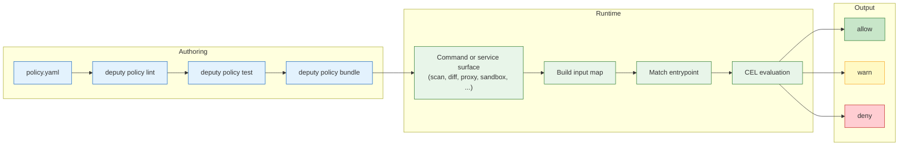
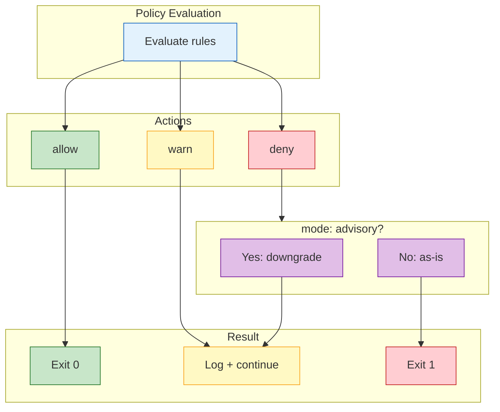

# Policy Framework

Deputy policies capture a decision once and enforce it everywhere: scan, diff, sbom, fix, triage, graph, secrets, server authorization, sandbox execution, and the artifact proxy. Policies are structured YAML bundles compiled to CEL and evaluated against a consistent input map, so rules stay readable, testable, and auditable.

## Policy Evaluation Flow



## Quick start

1. Write a policy bundle in YAML.
2. Lint and test it.
3. Bundle it for distribution.
4. Attach it to any command with `--policy`.

Example policy (`policy/block-critical.yaml`):

```yaml
policies:
  - name: block-critical
    entrypoints: ["scan_vulnerability"]
    rules:
      - action: deny
        when: vulnerability.?severity.orValue("") == "CRITICAL"
        reason: "critical vulnerability found"
```

Typical workflow:

```bash
deputy policy lint policy/block-critical.yaml
deputy policy test policy/
deputy policy bundle --output policy/corp.bundle.json policy/*.yaml
deputy scan --policy policy/corp.bundle.json
```

## Bundle structure

Policies are structured bundles with a top-level `policies` list. Each policy supports:

- `name`, `description`
- `entrypoints`, `commands`, `ecosystems` (optional filters)
- `mode` (`enforce` default, or `advisory`)
- `vars` (reusable values for rule logic)
- `rules` (each rule has `action`, `when`, and optional metadata)

Example license policy (from `policy/examples/license-allowlist.yaml`):

```yaml
policies:
  - name: allow-sans-copyleft
    description: Block packages carrying copyleft licenses
    vars:
      forbidden:
        - SSPL-1.0
        - AGPL-3.0-only
        - AGPL-3.0
        - GPL-3.0
        - GPL-3.0-only
    rules:
      - action: deny
        when: pkg.licenses.exists(l, l in forbidden)
        reason: package carries a forbidden license
      - action: warn
        when: size(pkg.licenses) == 0
        reason: package missing license metadata
```

This policy works across multiple target types:
- **Repository scans** with `--enrich-licenses`
- **Container image scans** (OS packages have embedded license metadata)
- **SBOM scans** (licenses preserved from generation)
- **Proxy requests** (deps.dev lookup)

See [License data sources](policy-inputs.md#license-data-sources) for details on where `pkg.licenses` data comes from.

Note on `vars`: string values are CEL expressions; non-string values are treated as literal data (lists, maps, numbers). Structured YAML is the supported authoring format; `deputy policy eval` expects raw CEL and is best used for ad hoc evaluation.

## Actions and enforcement

Policies return a list of action objects:

| Action | Effect | Common use |
| --- | --- | --- |
| `allow` | Explicitly allow | Add metadata, optional override |
| `warn` | Non-blocking | Notify, audit, or soft gates |
| `deny` | Blocking | Enforce policy, fail the command |



Use `mode: advisory` to downgrade `deny` actions from that policy into `warn` actions for canary rollouts.

## Inputs and entrypoints

See the [policy inputs](policy-inputs.md) for the full entrypoint list, standard variables, proxy version fields, and example payloads.

## CEL language reference

Deputy embeds CEL via cel-go; policy expressions follow the CEL language definition and standard library. Use these references for syntax, macros, and core functions:

- [CEL overview](https://cel.dev/overview/cel-overview)
- [CEL in depth](https://cel.dev/)
- [CEL intro (spec)](https://github.com/google/cel-spec/blob/master/doc/intro.md)
- [CEL language definition](https://github.com/google/cel-spec/blob/master/doc/langdef.md)
- [CEL string functions](https://github.com/google/cel-spec/blob/master/doc/extensions/strings.md)
- [cel-go extensions](https://github.com/google/cel-go/blob/master/ext/README.md)
- [cel-go examples](https://github.com/google/cel-go/blob/master/examples/README.md)

## CEL helpers and extensions

Deputy enables CEL optional types (null-safe `?.` access and `.orValue()`) and registers a small helper library:

- `now()` and `age()` for time-based checks
- `levenshtein()` and `levenshteinWithin()` for string distance checks
- `purl()` for parsing Package URLs into fields

CEL macros available in policy expressions: `has`, `exists`, `map`, `filter`.

Enabled CEL extensions (cel-go):

- `ext.Strings` (join, split, trim, replace, upperAscii, lowerAscii)
- `ext.Regex` (`string.matches(pattern)`)
- `ext.Lists`, `ext.Sets` (see cel-go extensions for the full function list)
- `ext.Bindings` (`cel.bind(var, init, expr)`)
- `ext.Encoders` (`base64.encode`, `base64.decode`)
- `ext.Math` (`math.abs`, `math.ceil`, `math.floor`, `math.round`, `math.greatest`, `math.least`)

These lists are not exhaustive; use the CEL language references above for the full standard library, macros, and extension details.

Deputy helper functions:

| Function | Signature | Notes |
| --- | --- | --- |
| `levenshtein` | `levenshtein(string, string) int` | Edit distance (capped length). |
| `levenshteinWithin` | `levenshteinWithin(string, string, int) bool` | True if distance within limit. |
| `now` | `now() timestamp` | Current time as a timestamp. |
| `age` | `age(int\|timestamp) duration` | Time since Unix seconds or timestamp. |
| `purl` | `purl(string) map` | Parse a Package URL into fields (or null when invalid). |
| `timestamp` | `timestamp(int\|string) timestamp` | CEL built-in: Unix seconds or RFC 3339. |
| `duration` | `duration(string) duration` | CEL built-in: parse duration strings. |

## Tooling commands

| Command | Use case | Notes |
| --- | --- | --- |
| `deputy policy eval` | Evaluate raw CEL against JSON | Expects CEL source, not YAML bundles |
| `deputy policy lint` | Validate syntax and types | Accepts YAML bundles or bundles compiled to JSON |
| `deputy policy test` | Run JSON fixtures | Uses `.policytest.json` files |
| `deputy policy bundle` | Build a JSON bundle | Output is portable and fast to load |
| `deputy policy inspect` | Inspect a bundle | Prints schema and policy names |
| `deputy policy simulate` | Replay policies against inputs | Useful for canarying changes |
| `deputy policy repl` | Interactive CEL playground | Good for quick experiments |
| `deputy policy lsp` | Editor integrations | See the [policy LSP setup](../policy-lsp.md) |

### Policy tests

Policy tests live in `.policytest.json` files alongside your policies:

```json
{
  "name": "blocks critical vulnerabilities",
  "policy": "./policy/block-critical.yaml",
  "input": "./testdata/critical.json",
  "want": [
    {"action": "deny", "reason": "critical vulnerability found"}
  ]
}
```

You can also use `policies` (array) or inline `input_json` to avoid separate files.

## Bundles and distribution

`deputy policy bundle` produces a JSON bundle with schema `policy.deputy.sh/v1alpha2`. Bundles can be loaded by any Deputy command via `--policy` or by the proxy server for runtime enforcement.

A bundle entry carries the policy's compiled CEL alongside the scoping the engine filters on (`entrypoints`, `commands`, `mode`), so the schema version changes whenever those fields change meaning. Deputy loads only the version it writes: a bundle built by a different release is refused with the version it was built for and the version to rebuild it as, rather than loaded with scoping it cannot find. Rebuild bundles from their authored policy files with `deputy policy bundle` when you upgrade Deputy: a refused bundle cannot be re-bundled into a readable one, because bundling loads its inputs the same way. Keep the sources you bundle from.

**Enforce a bundle with a Deputy no older than the one that built it.** The refusal above protects a Deputy that checks the schema version, which every version from the introduction of `policy.deputy.sh/v1alpha2` does. A build predating that check does not compare versions at all: it accepts a newer bundle, ignores the entry fields it does not know, and evaluates each policy with no scoping and no mode, so policies run for commands and entrypoints they exclude and an `advisory` policy blocks instead of warning. Nothing in a newer bundle can stop an older reader from doing this, so pin the bundling and enforcing steps to the same Deputy version, ideally in the same pipeline, and rebuild bundles when that version moves.

## See also

- [Policy concepts](../concepts/policies.md)
- [Policy command reference](../commands/policy.md)
- [Policy inputs](policy-inputs.md)
- [Policy spec](policy-spec.md)
- [Policy examples](../../policy/examples/)
- [Policy LSP setup](../policy-lsp.md)
