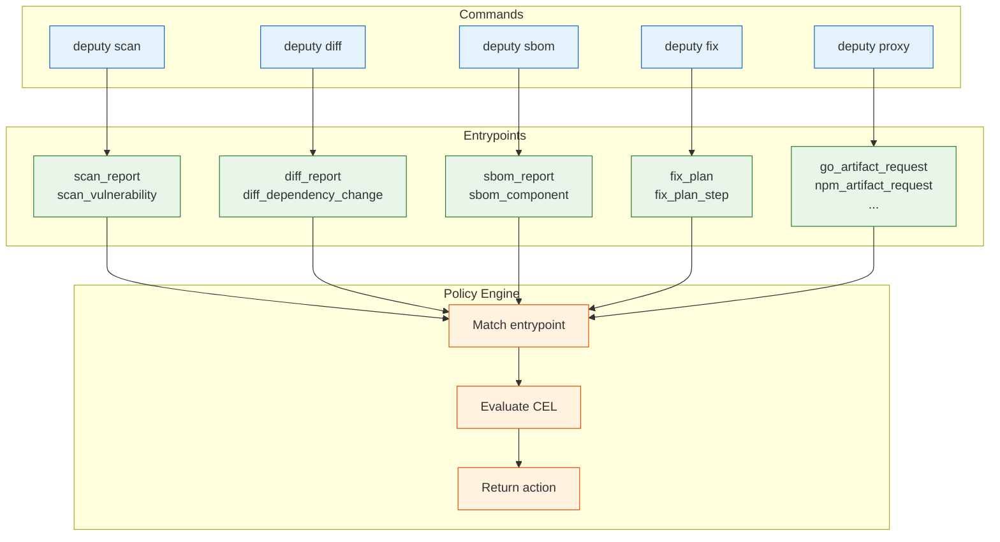

# Policy Inputs and Entrypoints

This page defines the payloads Deputy sends to the policy engine and the entrypoints each command emits.

## How Entrypoints Work



## Entrypoints by command

Each command emits one or more entrypoints when `--policy` is provided:

| Command | Entry points emitted |
| --- | --- |
| `deputy scan` | `scan_report`, `scan_vulnerability` |
| `deputy diff` | `diff_report`, `diff_dependency_change`, `diff_vulnerability` |
| `deputy sbom` | `sbom_report`, `sbom_component` |
| `deputy fix` | `fix_plan`, `fix_plan_step` |
| `deputy triage` | `triage_report`, `triage_cluster` |
| `deputy proxy` | `go_artifact_request`, `npm_artifact_request`, `pypi_artifact_request`, `rubygems_artifact_request` |

Every evaluation includes `env.command` and `env.entrypoint`, so a single policy can branch by context. Policies can also prefilter with `entrypoints`, `commands`, and `ecosystems`.

## Canonical ecosystems

The canonical ecosystem strings used by the proxy and policy filters are `go`, `npm`, `pypi`, `rubygems`.

## Proxy version semantics

Proxy requests always include `request.version` as a string. When a request has no concrete version (metadata/index requests), Deputy sets:

- `request.version` to `"<unknown>"`
- `request.has_version` to `false`
- `request.raw_version` to `""`

Guard version-sensitive rules with `request.has_version`:

```cel
request.has_version && pkg.name == "react" && pkg.version.startsWith("18.")
```

## Standard variables

Deputy seeds these identifiers in every policy environment. Missing values are set to `null` so optional types and `has()` work consistently.

`pkg`, `request`, `vulnerabilities`, `vulnerability`, `jwt`, `changes`, `packages`, `sbom`, `config`, `env`, `dependency`, `plan`, `step`, `repo`, `cluster`, `component`, `findings`, `change`

`pkg` is a convenience view synthesized from `request` or `component` when present, so a single policy can target proxy and sbom payloads without duplicating logic.

## Example payloads

Proxy request (simplified):

```json
{
  "request": {
    "ecosystem": "npm",
    "package": "lodash",
    "version": "4.17.21",
    "raw_version": "4.17.21",
    "has_version": true,
    "operation": "fetch",
    "path": "/lodash/-/lodash-4.17.21.tgz"
  },
  "vulnerabilities": [
    {"id": "CVE-2024-9999", "severity": "CRITICAL"}
  ],
  "jwt": {"anonymous": true},
  "env": {"command": "proxy", "entrypoint": "npm_artifact_request"}
}
```

Scan vulnerability (simplified):

```json
{
  "repo": "github.com/acme/deputy",
  "ref": "main",
  "commit": "abc123",
  "vulnerability": {"id": "GO-2024-1234", "severity": "MEDIUM"},
  "env": {"command": "scan", "entrypoint": "scan_vulnerability"}
}
```

If you use `deputy policy eval` or `deputy policy simulate`, include `env` explicitly when your policy depends on it. CLI commands and the proxy inject `env` automatically.

## Policy findings in scan reports

When `--policy` is used with `deputy scan`, the JSON report includes a `policyFindings` array. Each entry uses this shape:

```json
{
  "source": "policy.yaml",
  "action": "deny",
  "reason": "blocked by policy",
  "message": "optional details",
  "remediation": "suggested fix",
  "status": 403,
  "code": "policy.blocked"
}
```
