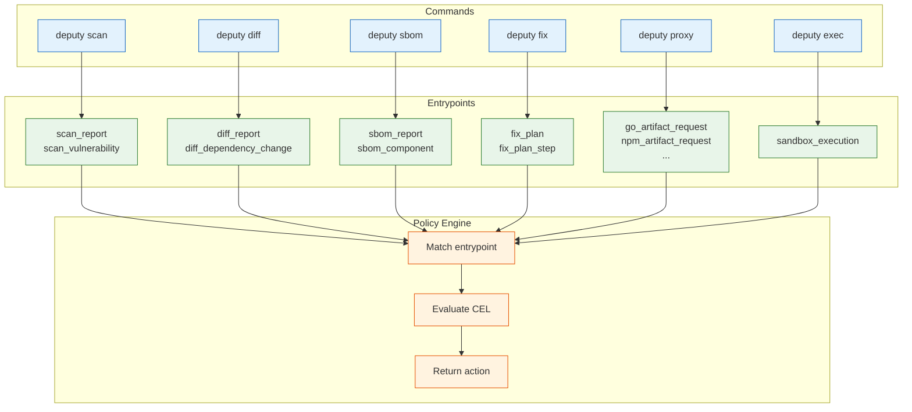

# Policy Inputs and Entrypoints

This page defines the payloads Deputy sends to the policy engine and the entrypoints each command emits.

## How Entrypoints Work



## Entrypoints by command

Each command emits one or more entrypoints when `--policy` is provided:

| Command | Entry points emitted |
| --- | --- |
| `deputy scan` (repository/image) | `scan_report`, `scan_vulnerability` |
| `deputy scan` (Dockerfile) | `dockerfile_report`, `dockerfile_stage` |
| `deputy diff` (git refs) | `diff_report`, `diff_dependency_change`, `diff_vulnerability` |
| `deputy diff` (container images) | `container_diff_report`, `container_diff_change`, `container_diff_vulnerability`, `container_diff_layer`, `container_diff_config` |
| `deputy sbom` | `sbom_report`, `sbom_component` |
| `deputy fix` | `fix_plan`, `fix_plan_step` |
| `deputy triage` | `triage_report`, `triage_cluster` |
| `deputy proxy` | `go_artifact_request`, `npm_artifact_request`, `pypi_artifact_request`, `rubygems_artifact_request`, `oci_artifact_request` |
| `deputy server` (API requests) | `service_scan_request`, `service_list_request`, `service_sbom_request`, `service_diff_request`, `service_secrets_request`, `service_graph_request` |
| `deputy exec` | `sandbox_execution` |

> [!NOTE]
> `deputy diff` auto-detects whether you're comparing git refs or container images based on the reference format. Container image refs look like `image:tag` or contain registry paths (e.g., `ghcr.io/org/app:v1`).

Every evaluation includes `env.command` and `env.entrypoint`, so a single policy can branch by context. Policies can also prefilter with `entrypoints`, `commands`, and `ecosystems`.

For sandbox policies, `env.command` is `sandbox` even when the operation is started by `deputy exec`. `commands: ["exec"]` is accepted as a legacy alias in policy bundles, but new policies should use `commands: ["sandbox"]`.

## Sandbox Entrypoints

`deputy exec --policy` evaluates `sandbox_execution` before a sandboxed command starts. Deputy also defines `sandbox_command` and `sandbox_network` as canonical sandbox policy entrypoints for runtime/plugin integrations that evaluate individual commands or network requests.

Sandbox entrypoint variables:

| Entrypoint | Required variables | Optional variables |
| --- | --- | --- |
| `sandbox_execution` | `command`, `workspace_dir`, `requested_config`, `env` | `context`, `source` |
| `sandbox_command` | `command`, `sandbox_config`, `env` | `context` |
| `sandbox_network` | `host`, `port`, `protocol`, `sandbox_config`, `env` | `context` |

## Canonical ecosystems

The canonical ecosystem strings used by the proxy and policy filters are `go`, `npm`, `pypi`, `rubygems`, `oci`.

## Proxy version semantics

Proxy requests always include `request.version` as a string. When a request has no concrete version (metadata/index requests), Deputy sets:

- `request.version` to `"<unknown>"`
- `request.has_version` to `false`
- `request.raw_version` to `""`

Guard version-sensitive rules with `request.has_version`:

```cel
request.has_version && pkg.name == "react" && pkg.version.startsWith("18.")
```

## Standard variables

Deputy seeds these identifiers in every policy environment. Missing values are set to `null` so optional types and `has()` work consistently.

`pkg`, `request`, `target`, `image`, `vulnerabilities`, `vulnerability`, `jwt`, `changes`, `packages`, `sbom`, `config`, `env`, `dependency`, `plan`, `step`, `repo`, `cluster`, `component`, `findings`, `change`

`pkg` is a convenience view synthesized from `request` or `component` when present, so a single policy can target proxy and sbom payloads without duplicating logic.

## Package metadata (`pkg`)

The `pkg` object provides a unified view of package information across all commands:

| Field | Type | Description |
|-------|------|-------------|
| `pkg.name` | `string` | Package name |
| `pkg.version` | `string` | Package version |
| `pkg.ecosystem` | `string` | Package ecosystem (npm, go, pypi, etc.) |
| `pkg.licenses` | `list(string)` | SPDX license identifiers |

### License data sources

`pkg.licenses` is populated from different sources depending on the target type:

| Target Type | License Source | Notes |
|-------------|----------------|-------|
| **Repository scan** | deps.dev enrichment | Requires `--enrich-licenses` |
| **Container image** | OSV-SCALIBR extraction | OS packages (apt, apk, rpm) embed license info |
| **SBOM scan** | SBOM component licenses | Preserved from generation (see below) |
| **Proxy request** | deps.dev lookup | Automatic for supported ecosystems |

### SBOM license round-trip

When you generate an SBOM with `deputy sbom` (optionally with `--enrich-licenses`) and later scan it with `deputy scan sbom`, license information is preserved:

```console
# Generate SBOM with license enrichment
$ deputy sbom --enrich-licenses --format cyclonedx-json -o sbom.cdx.json

# Scan the SBOM - pkg.licenses is available in policies
$ deputy scan sbom sbom.cdx.json --policy policy/license-allowlist.yaml
```

License data is extracted from all supported SBOM formats:

| Format | License Field(s) |
|--------|-----------------|
| CycloneDX | `component.licenses[].license.id`, `.license.name`, or `.expression` |
| SPDX | `package.licenseConcluded` or `package.licenseDeclared` |
| Protobom | `node.licenses[]` |

### Container image licenses

Container images have three license sources:

1. **OCI labels** (automatic): The `org.opencontainers.image.licenses` annotation is extracted and attached to the SBOM root node during `deputy sbom`.

2. **OS package metadata** (automatic): System packages from apt, apk, rpm embed license info that OSV-SCALIBR extracts during inventory scanning.

3. **Application packages** (with `--enrich-licenses`): Go modules, npm packages, etc. inside the container are enriched via deps.dev.

See [License enrichment concepts](../concepts/inventory-and-sboms.md#license-enrichment) for details.

## Target metadata

`target` summarizes what Deputy is evaluating, regardless of command or entrypoint. It is always present but may be empty when a command does not provide target details. Common fields:

- `target.kind`: `dir`, `git`, `sbom`, `purl`, `container-image`, etc.
- `target.display`: human-friendly target string (e.g., `github.com/acme/repo`, `oci://ghcr.io/acme/app@sha256:...`).
- `target.ref`: tag/branch/commit or image reference when known.
- `target.commit`: resolved Git commit (if applicable).
- `target.origin`: origin URL or registry host (if applicable).
- `target.local`: local filesystem path (if applicable).
- `target.provenance`: normalized metadata (strings) extracted during target resolution.

For container images, `target.provenance` commonly includes: `registry`, `repository`, `tag`, `digest`, `reference`, `image`, `transport`, and `platform` (when specified).

When scanning SBOMs, Deputy injects `sbom.purls`, a list of PURL strings found in
the SBOM input (including container image PURLs with qualifiers such as platform).
PURLs are normalized to canonical form when possible; use `purl()` to parse fields
in CEL:

```json
{
  "sbom": {
    "purls": [
      "pkg:docker/library/alpine@3.19",
      "pkg:oci/ghcr.io/acme/app@sha256:...?platform=linux/amd64"
    ]
  }
}
```

`image` is a convenience object for image targets and OCI proxy requests. It includes both provenance fields and extracted container configuration:

**Image Provenance (always present for container images):**
- `image.registry`, `image.repository`, `image.tag`, `image.digest`, `image.reference`, `image.image`.

**Image Configuration (when scanning container images):**

The `image.config` object contains extracted Dockerfile settings:
- `image.config.user` - User to run as (empty = root)
- `image.config.is_root` - Boolean indicating if running as root
- `image.config.env` - List of environment variables
- `image.config.sensitive_env` - Env vars that may contain secrets (detected by patterns like PASSWORD, KEY, TOKEN, SECRET)
- `image.config.entrypoint` - Container entrypoint command
- `image.config.cmd` - Default command arguments
- `image.config.exposed_ports` - List of exposed ports
- `image.config.volumes` - List of volumes
- `image.config.labels` - Map of image labels
- `image.config.working_dir` - Working directory
- `image.config.healthcheck` - Healthcheck configuration (if defined)

**Image Metadata:**
- `image.metadata.architecture` - CPU architecture (e.g., "amd64", "arm64")
- `image.metadata.os` - Operating system (e.g., "linux")
- `image.metadata.layer_count` - Number of layers
- `image.metadata.size` - Total size in bytes
- `image.metadata.created` - Creation timestamp (Unix seconds)
- `image.metadata.digest` - Image manifest digest

**Image History:**

`image.history` is a list of build history entries:
- `image.history[].created_by` - Dockerfile command that created the layer
- `image.history[].created` - Creation timestamp (Unix seconds)
- `image.history[].empty_layer` - Whether this is a metadata-only layer

OCI proxy requests also annotate `target.scan_cached` (bool) and `target.scan_error` (string) to help policies decide how to handle scan failures.

## Vulnerability layer details

When scanning container images, each vulnerability includes layer information via `vulnerability.layer_details`:

- `vulnerability.layer_details.index` - Layer position (0 = oldest/base layer)
- `vulnerability.layer_details.diff_id` - Digest of uncompressed layer content
- `vulnerability.layer_details.chain_id` - Cumulative layer chain ID
- `vulnerability.layer_details.command` - Dockerfile instruction that created the layer
- `vulnerability.layer_details.in_base_image` - Boolean indicating if the layer is from the base image (FROM instruction)

> [!NOTE]
> The `in_base_image` field requires the `--detect-base-image` flag when scanning:
> ```console
> $ deputy scan --detect-base-image nginx:1.25
> ```
> This queries deps.dev to determine which layers belong to known base images.

This enables layer-aware policies such as:
- Distinguishing base image vulnerabilities from application-introduced vulnerabilities
- Identifying which Dockerfile command introduced a vulnerable package
- Creating different policies for system packages vs application dependencies

## Example payloads

Proxy request (simplified):

```json
{
  "request": {
    "ecosystem": "npm",
    "package": "lodash",
    "version": "4.17.21",
    "raw_version": "4.17.21",
    "has_version": true,
    "operation": "fetch",
    "path": "/lodash/-/lodash-4.17.21.tgz"
  },
  "vulnerabilities": [
    {
      "advisory": {
        "id": "CVE-2024-9999",
        "severity": {"level": "SEVERITY_LEVEL_CRITICAL"}
      }
    }
  ],
  "jwt": {"anonymous": true},
  "env": {"command": "proxy", "entrypoint": "npm_artifact_request"}
}
```

OCI proxy request (simplified):

```json
{
  "request": {
    "ecosystem": "oci",
    "repository": "library/ubuntu",
    "reference": "sha256:deadbeef",
    "version": "sha256:deadbeef",
    "has_version": true,
    "operation": "manifest",
    "path": "/v2/library/ubuntu/manifests/sha256:deadbeef",
    "registry": "registry-1.docker.io"
  },
  "target": {
    "kind": "container-image",
    "display": "oci://registry-1.docker.io/library/ubuntu@sha256:deadbeef",
    "provenance": {
      "registry": "registry-1.docker.io",
      "repository": "library/ubuntu",
      "digest": "sha256:deadbeef"
    }
  },
  "image": {
    "registry": "registry-1.docker.io",
    "repository": "library/ubuntu",
    "digest": "sha256:deadbeef",
    "reference": "sha256:deadbeef",
    "image": "registry-1.docker.io/library/ubuntu"
  },
  "vulnerabilities": [
    {
      "advisory": {
        "id": "CVE-2024-9999",
        "severity": {"level": "SEVERITY_LEVEL_CRITICAL"}
      }
    }
  ],
  "jwt": {"anonymous": true},
  "env": {"command": "proxy", "entrypoint": "oci_artifact_request"}
}
```

Scan vulnerability (simplified):

```json
{
  "repo": "github.com/acme/deputy",
  "ref": "main",
  "commit": "abc123",
  "vulnerability": {
    "advisory": {
      "id": "GO-2024-1234",
      "severity": {"level": "SEVERITY_LEVEL_MEDIUM"}
    },
    "package": {"name": "example.com/pkg", "version": "1.0.0", "ecosystem": "Go"}
  },
  "env": {"command": "scan", "entrypoint": "scan_vulnerability"}
}
```

Container image scan vulnerability (with layer details):

```json
{
  "target": {
    "kind": "container-image",
    "display": "oci://ghcr.io/acme/app:latest"
  },
  "image": {
    "registry": "ghcr.io",
    "repository": "acme/app",
    "tag": "latest",
    "config": {
      "user": "app",
      "is_root": false,
      "env": ["PATH=/usr/bin"],
      "sensitive_env": []
    },
    "metadata": {
      "architecture": "amd64",
      "os": "linux",
      "layer_count": 12,
      "size": 104857600
    }
  },
  "vulnerability": {
    "advisory": {
      "id": "CVE-2024-1234",
      "severity": {"level": "SEVERITY_LEVEL_HIGH"}
    },
    "package": {
      "name": "openssl",
      "version": "1.1.1k",
      "ecosystem": "deb"
    },
    "layer_details": {
      "index": 2,
      "command": "RUN apt-get install -y openssl",
      "in_base_image": true
    }
  },
  "env": {"command": "scan", "entrypoint": "scan_vulnerability"}
}
```

If you use `deputy policy eval` or `deputy policy simulate`, include `env` explicitly when your policy depends on it. CLI commands and the proxy inject `env` automatically.

## Policy findings in scan reports

When `--policy` is used with `deputy scan`, the JSON report includes a `policyFindings` array. Each entry uses this shape:

```json
{
  "source": "policy.yaml",
  "action": "deny",
  "reason": "blocked by policy",
  "message": "optional details",
  "remediation": "suggested fix",
  "status": 403,
  "code": "policy.blocked"
}
```

## Dockerfile scanning inputs

When scanning Dockerfiles with `deputy scan Dockerfile`, the policy engine receives Dockerfile-specific variables.

### `dockerfile` object

Contains parsed Dockerfile data:

| Field | Type | Description |
|-------|------|-------------|
| `dockerfile.path` | `string` | Path to the Dockerfile |
| `dockerfile.stages` | `list(stage)` | All build stages |
| `dockerfile.args` | `map(string)` | ARG instructions with defaults |
| `dockerfile.final_stage` | `stage` | The final stage (what gets built) |

### `stage` object

Each stage in a Dockerfile:

| Field | Type | Description |
|-------|------|-------------|
| `stage.index` | `int` | 0-based stage position |
| `stage.name` | `string` | AS alias (empty if unnamed) |
| `stage.base_image` | `string` | FROM image reference as written |
| `stage.base_image_resolved` | `object` | Parsed reference after ARG substitution |
| `stage.platform` | `string` | --platform flag value |
| `stage.is_scratch` | `bool` | True if FROM scratch |
| `stage.is_builder_stage` | `bool` | True if only used as COPY source |
| `stage.user` | `string` | Final USER directive (empty = root) |
| `stage.workdir` | `string` | Final WORKDIR value |
| `stage.env_vars` | `map(string)` | ENV declarations |
| `stage.exposed_ports` | `list(string)` | EXPOSE instructions |
| `stage.labels` | `map(string)` | LABEL instructions |
| `stage.healthcheck` | `object` | HEALTHCHECK configuration |
| `stage.run_commands` | `list(object)` | RUN instructions |
| `stage.copy_commands` | `list(object)` | COPY instructions |
| `stage.add_commands` | `list(object)` | ADD instructions |
| `stage.entrypoint` | `list(string)` | ENTRYPOINT instruction |
| `stage.cmd` | `list(string)` | CMD instruction |

### `dockerfile_analysis` object

Computed analysis results:

| Field | Type | Description |
|-------|------|-------------|
| `dockerfile_analysis.stage_count` | `int` | Total number of stages |
| `dockerfile_analysis.has_multi_stage` | `bool` | True if multi-stage build |
| `dockerfile_analysis.builder_stage_count` | `int` | Number of builder-only stages |
| `dockerfile_analysis.final_stage_is_root` | `bool` | True if final stage runs as root |
| `dockerfile_analysis.final_stage_is_scratch` | `bool` | True if final stage uses FROM scratch |
| `dockerfile_analysis.sensitive_env_vars` | `list(string)` | Env vars that may contain secrets |
| `dockerfile_analysis.has_add_url` | `bool` | True if ADD uses URL sources |
| `dockerfile_analysis.add_url_sources` | `list(string)` | URL sources in ADD instructions |

### Dockerfile example payload

```json
{
  "dockerfile": {
    "path": "/app/Dockerfile",
    "stages": [
      {
        "index": 0,
        "name": "builder",
        "base_image": "golang:1.22",
        "is_builder_stage": true,
        "user": ""
      },
      {
        "index": 1,
        "name": "",
        "base_image": "alpine:3.19",
        "is_scratch": false,
        "user": "nobody",
        "exposed_ports": ["8080"],
        "healthcheck": {"test": ["CMD", "wget", "-q", "--spider", "http://localhost:8080/health"]}
      }
    ]
  },
  "dockerfile_analysis": {
    "stage_count": 2,
    "has_multi_stage": true,
    "builder_stage_count": 1,
    "final_stage_is_root": false,
    "sensitive_env_vars": []
  },
  "env": {"command": "scan", "entrypoint": "dockerfile_report"}
}
```

## Dependency graph inputs

When Deputy builds a dependency graph (`deputy graph`, the graph API, or the
`analyze_dependency_graph` MCP tool), the policy engine can evaluate graph
entrypoints. The same variables are exposed identically across CLI, API, and MCP.

### `graph_report` variables

Evaluated once after the graph is built, with the whole graph in scope.

| Field | Type | Description |
|-------|------|-------------|
| `graph` | `graphv1.Graph` | Dependency graph data |
| `nodes` | `list(graphv1.Node)` | Dependency graph nodes |
| `edges` | `list(graphv1.Edge)` | Dependency graph edges |
| `roots` | `list(string)` | PURLs of direct (depth-0) dependencies |
| `stats` | `object` | Summary statistics for the graph |

### `graph_node` variables (per-node)

| Field | Type | Description |
|-------|------|-------------|
| `node` | `graphv1.Node` | Current dependency graph node |

### `graph_edge` variables (per-edge)

| Field | Type | Description |
|-------|------|-------------|
| `edge` | `graphv1.Edge` | Current dependency graph edge |
| `from_node` | `graphv1.Node` | Source node for the current edge |
| `to_node` | `graphv1.Node` | Target node for the current edge |

## Container diff inputs

When comparing container images with `deputy diff image1 image2`, the policy engine receives container-diff-specific variables.

### `container_diff_report` variables

| Field | Type | Description |
|-------|------|-------------|
| `base_image` | `object` | Base image reference info |
| `target_image` | `object` | Target image reference info |
| `summary.packages_added` | `int` | Number of packages added |
| `summary.packages_removed` | `int` | Number of packages removed |
| `summary.packages_upgraded` | `int` | Number of packages upgraded |
| `summary.packages_downgraded` | `int` | Number of packages downgraded |
| `summary.vulnerabilities_added` | `int` | New vulnerabilities introduced |
| `summary.vulnerabilities_removed` | `int` | Vulnerabilities no longer present |
| `summary.vulnerabilities_fixed` | `int` | Vulnerabilities fixed by upgrades |
| `summary.layers_added` | `int` | New layers added |
| `summary.layers_removed` | `int` | Layers removed |
| `summary.config_changed` | `bool` | Whether configuration changed |
| `package_changes` | `list(change)` | Package change details |
| `vulnerability_changes` | `list(vuln_change)` | Vulnerability change details |
| `config_changes` | `object` | Configuration diff details |
| `layer_analysis` | `object` | Layer diff analysis |

### `container_diff_change` variables (per-package)

| Field | Type | Description |
|-------|------|-------------|
| `change.name` | `string` | Package name |
| `change.base_version` | `string` | Version in base image |
| `change.target_version` | `string` | Version in target image |
| `change.change_type` | `string` | `added`, `removed`, `upgraded`, `downgraded` |
| `change.ecosystem` | `string` | Package ecosystem (deb, apk, rpm, etc.) |
| `change.base_layer_details` | `object` | Layer info from base image |
| `change.target_layer_details` | `object` | Layer info from target image |

### `container_diff_vulnerability` variables (per-vuln)

| Field | Type | Description |
|-------|------|-------------|
| `vulnerability.advisory.id` | `string` | CVE/GHSA identifier |
| `vulnerability.change_type` | `string` | `added`, `removed`, `fixed`, `persisted` |
| `vulnerability.advisory.severity.level` | `enum` | Use `severity.critical`, `severity.high`, etc. |
| `vulnerability.package.name` | `string` | Affected package name |
| `vulnerability.base_version` | `string` | Package version in base image |
| `vulnerability.target_version` | `string` | Package version in target image |
| `vulnerability.advisory.summary` | `string` | Vulnerability description |
| `vulnerability.layer_details` | `object` | Layer where package was introduced |

### `container_diff_config` variables

| Field | Type | Description |
|-------|------|-------------|
| `config_changes.user_changed` | `bool` | Whether USER changed |
| `config_changes.root_changed` | `bool` | Whether root status changed |
| `config_changes.base_is_root` | `bool` | Was running as root in base |
| `config_changes.target_is_root` | `bool` | Is running as root in target |
| `config_changes.ports_changed` | `bool` | Whether exposed ports changed |
| `config_changes.ports_added` | `list(string)` | Ports added |
| `config_changes.ports_removed` | `list(string)` | Ports removed |
| `config_changes.entrypoint_changed` | `bool` | Whether entrypoint changed |
| `config_changes.healthcheck_changed` | `bool` | Whether healthcheck changed |

### Container diff example payload

```json
{
  "base_image": {
    "registry": "docker.io",
    "repository": "library/nginx",
    "tag": "1.24"
  },
  "target_image": {
    "registry": "docker.io",
    "repository": "library/nginx",
    "tag": "1.25"
  },
  "summary": {
    "packages_added": 2,
    "packages_removed": 1,
    "packages_upgraded": 15,
    "packages_downgraded": 0,
    "vulnerabilities_added": 1,
    "vulnerabilities_fixed": 5
  },
  "vulnerability_changes": [
    {
      "id": "CVE-2024-1234",
      "change_type": "fixed",
      "severity": "HIGH",
      "package": "openssl"
    }
  ],
  "env": {"command": "diff", "entrypoint": "container_diff_report"}
}
```
