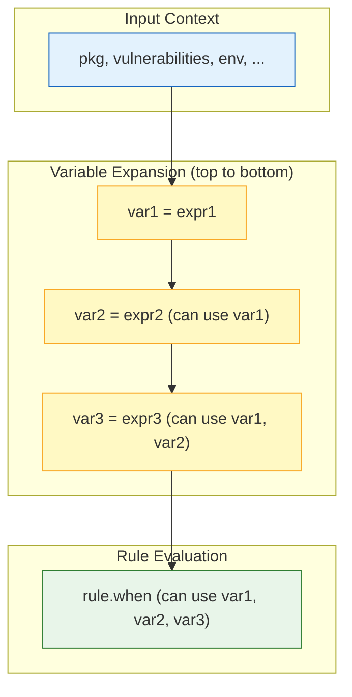

# Deputy Policy Bundle Specification

Defines the structured bundle format used by Deputy for CEL policies.

## Schema

```yaml
metadata:          # optional map
  title: "... "
policies:          # required, non-empty list
  - name:          # required, unique within bundle
    description:   # optional
    ecosystems:    # optional list of ecosystem strings
    entrypoints:   # optional list of entrypoint strings (pre-filter at runtime)
    commands:      # optional list of commands (pre-filter at runtime)
    mode:          # optional, "enforce" (default) or "advisory" (deny -> warn)
    vars:          # optional ordered map (preserves author order)
      <name>: <cel-expression-string | literal>
    rules:         # required list
      - action: <string>   # e.g., deny | warn | allow
        when:   <cel-expression-string>   # required
        reason: <string>                  # optional
        status: <int>                     # optional
        headers: <map<string,string>>     # optional
        remediation: <string>             # optional
        details: <any>                    # optional
```

### Variable ordering
- Variables are evaluated in the **author-specified order**. Later vars can reference earlier ones. Duplicate or empty names are rejected.
- JSON bundles fall back to lexical order for determinism (JSON objects are unordered).



### Expansion semantics
- Each var is expanded as `([expr]).map(name, BODY)[0]` from last to first, so each name is in scope for subsequent vars and rules.
- CEL environment includes optional types plus cel-go extensions: `ext.Strings`, `ext.Regex`, `ext.Lists`, `ext.Sets`, `ext.Bindings`, `ext.Encoders`, and `ext.Math`. See the [policy framework](policy-framework.md#cel-helpers-and-extensions) for details.

### Entrypoint inputs
- Standard top-level identifiers include `request`, `pkg`, `target`, `image`, `vulnerabilities`, `vulnerability`, `jwt`, `changes`, `packages`, `sbom`, `config`, `env`, `dependency`, `plan`, `step`, `repo`, `cluster`, `component`, `findings`, and `change`. See the [policy inputs](policy-inputs.md) for the full list and example payloads.
- `env.command` and `env.entrypoint` indicate the invoking command/entrypoint.
- Use canonical command names in `commands`: `proxy`, `scan`, `diff`, `sbom`, `fix`, `triage`, `secrets`, `graph`, `server`, `sandbox`. `exec` is accepted as a legacy alias for `sandbox`. Container image diff policies still use `commands: ["diff"]`; `container_diff` is the policy discovery category for the `container_diff_*` entrypoints.
- Proxy requests always include `request.version` as a string. When no concrete version exists yet (e.g., metadata/index requests), Deputy sets it to the placeholder `"<unknown>"` and also provides:
  - `request.has_version` (bool): true only when a real version was present in the request path.
  - `request.raw_version` (string): the original version string (empty when none was present).
  Use `request.has_version` to guard version-sensitive logic, e.g.:
  ```cel
  request.has_version &&
  iocPkgs.exists(p, p.name == pkg.name && p.versions.exists(v, v.matches(pkg.version)))
  ```

Canonical entrypoints (snake_case):
- proxy: `go_artifact_request`, `npm_artifact_request`, `pypi_artifact_request`, `rubygems_artifact_request`, `oci_artifact_request`
- scan (repository/image): `scan_report`, `scan_vulnerability`
- scan (Dockerfile): `dockerfile_report`, `dockerfile_stage`
- diff (git refs): `diff_report`, `diff_dependency_change`, `diff_vulnerability`
- container_diff (container images): `container_diff_report`, `container_diff_change`, `container_diff_vulnerability`, `container_diff_layer`, `container_diff_config`
- sbom: `sbom_report`, `sbom_component`
- fix: `fix_plan`, `fix_plan_step`
- triage: `triage_report`, `triage_cluster`
- secrets: `secrets_report`, `secrets_finding`
- graph: `graph_report`, `graph_node`, `graph_edge`
- server: `service_scan_request`, `service_list_request`, `service_sbom_request`, `service_diff_request`, `service_secrets_request`, `service_graph_request`
- sandbox: `sandbox_execution`, `sandbox_command`, `sandbox_network`

### Validation
- Empty `policies` or missing `rules` is invalid; each policy must have at least one rule.
- Policy names must be unique within a bundle.
- String vars are CEL expressions; non-string values are treated as literals. Rules must include `action` and `when`.
- `action` must be `allow`, `deny`, or `warn`.
- `mode`, if set, must be `enforce` or `advisory`.
- Canonical ecosystem strings used by built-in entrypoints: `go`, `npm`, `pypi`, `rubygems`, `oci`.
- YAML anchors, aliases, and merge keys are rejected. See below.

### YAML anchors are not supported

A bundle may not use YAML anchors (`&name`), aliases (`*name`), or merge keys
(`<<:`). Both `deputy policy lint` and bundle loading refuse them, naming the
line and the alternatives. That includes a bundle whose `policies` key is not
written directly but arrives through a top-level merge key. A refused anchor
does not stop the rest of the checks: lint reports it alongside any unrelated
defect in the policies written plainly.

This is closed for now, not closed forever. Nothing prevents Deputy from
resolving these constructs, and the decision can be revisited if a real need
appears. Two reasons to say no today:

- A policy bundle is a security control, and its job is to state plainly what it
  blocks. An aliased policy means the text a reviewer reads is not the policy
  that runs, and merge-key precedence adds a resolution rule the reviewer has to
  know before they can tell what a policy does.
- Every YAML feature the format allows has to be implemented identically by
  every reader of a bundle, and several read the document as nodes rather than
  decoding it. That divergence is not hypothetical: it once let an aliased
  bundle compile fine and lint as broken.

To share rules across bundles, pass a separate file with `--policy`, which is
repeatable. To reuse an expression within a bundle, use `vars:`.

## Examples

License allowlist (composed):
```yaml
policies:
  - name: license-allowlist-composed
    description: Copyleft block with layered vars and scope guard
    vars:
      componentLicenses: 'component.?licenses.orValue([])'
      requestLicenses: 'request.?licenses.orValue([])'
      licenses_union: 'componentLicenses + requestLicenses'
      normalized: 'licenses_union.map(l, l.upperAscii())'
      forbidden: '["SSPL-1.0","AGPL-3.0-ONLY","AGPL-3.0","GPL-3.0","GPL-3.0-ONLY"]'
      in_scope: 'env.command in ["proxy","sbom","diff"]'
    rules:
      - action: deny
        when: in_scope && normalized.exists(l, l in forbidden)
        reason: "forbidden license(s): " + normalized.join(", ")
      - action: warn
        when: in_scope && size(normalized) == 0
        reason: "package missing license metadata"
```

High-severity proxy blocker:
```yaml
policies:
  - name: proxy-high-sev
    rules:
      - action: deny
        when: env.command == "proxy" && vulnerabilities.exists(v, v.advisory.severity.level in [severity.critical, severity.high])
        reason: "proxy block: high severity vuln"
```

Version-aware IOC example (use `has_version` to avoid matching metadata requests):
```yaml
policies:
  - name: block-react-ioc
    vars:
      iocPkgs: [{name: "react", versions: ["18.3.1"]}]
    rules:
      - action: deny
        when: request.has_version &&
              iocPkgs.exists(p, p.name == pkg.name && p.versions.exists(v, v.matches(pkg.version)))
        reason: package/version matches IOC
```

## Tooling and tests
- `deputy policy lint` rejects malformed bundles or CEL expressions.
- `go test ./internal/policy` compiles all examples and runs entrypoint evaluations.
- CEL extensions are configured in `internal/policy/evaluator.go` if you need to audit or change the environment.

## Compatibility
- Raw `.cel` files are not supported. Author structured bundles and load them directly.
