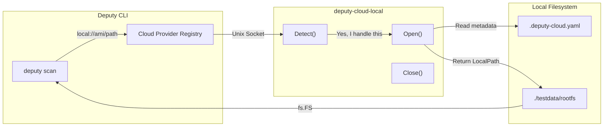
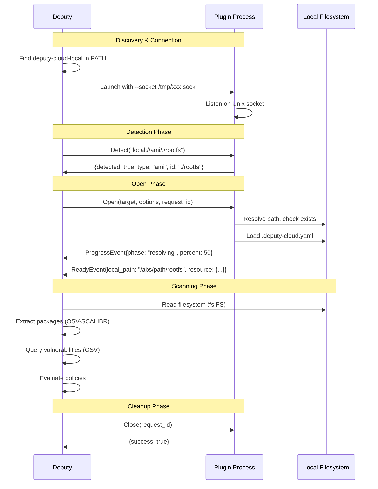
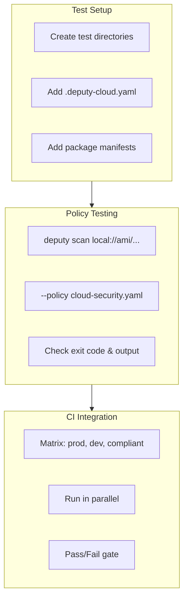
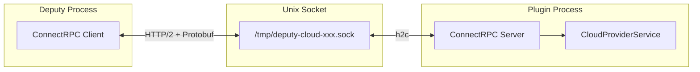

# Local Cloud Provider Plugin

A Deputy cloud provider plugin that treats local directories as cloud resources. Perfect for testing cloud scanning workflows, developing policies, and CI/CD environments without real cloud credentials.

## Overview



## Quick Start

### Build and Install

```bash
# Build the plugin
go build -o deputy-cloud-local ./examples/plugins/local-cloud

# Install to PATH
mv deputy-cloud-local /usr/local/bin/

# Or for development, run from current directory
export PATH="$PWD:$PATH"
```

### Basic Usage

```bash
# Scan a local directory as if it were a cloud AMI
deputy scan local://ami/./path/to/rootfs

# Scan with cloud-style options
deputy scan local://ami/./testdata/ubuntu-rootfs --region local-1

# Apply cloud security policies
deputy scan local://ami/./testdata/prod-image \
  --policy policy/examples/cloud-security.yaml
```

## URI Format

```
local://<resource-type>/<path>
```

| Component | Description | Examples |
|-----------|-------------|----------|
| `resource-type` | Simulated cloud resource type | `ami`, `snapshot`, `disk` |
| `path` | Local directory path | `./rootfs`, `/tmp/test-image`, `../fixtures/ubuntu` |

### Examples

```bash
# Relative path
deputy scan local://ami/./testdata/rootfs

# Absolute path
deputy scan local://snapshot//tmp/test-snapshot

# Parent directory
deputy scan local://disk/../fixtures/disk-image
```

## Simulating Cloud Metadata

Create a `.deputy-cloud.yaml` file in your target directory to simulate cloud resource metadata:

```yaml
# .deputy-cloud.yaml
provider: local
type: ami
region: us-east-1
account_id: "123456789012"
name: my-golden-image
tags:
  environment: production
  owner: platform-team
  application: web-api
  compliance: pci-dss
  data-classification: confidential
```

This metadata is used for policy evaluation, enabling you to test policies like:

```yaml
# Deny critical vulns in production
when: |
  resource.tags["environment"] == "production" &&
  vulnerability.severity == severity.CRITICAL
```

## Architecture



## Testing Cloud Policies

The primary use case for this plugin is testing cloud security policies without real cloud access.

### Example Test Directory Structure

```
testdata/
├── production-ami/
│   ├── .deputy-cloud.yaml      # environment: production
│   ├── var/lib/dpkg/status     # Debian packages
│   └── etc/os-release
├── development-ami/
│   ├── .deputy-cloud.yaml      # environment: development
│   └── ...
└── compliant-image/
    ├── .deputy-cloud.yaml      # compliance: pci-dss
    └── ...
```

### Policy Testing Workflow



### Example: Testing Production Policy

```bash
# Create test directory with production metadata
mkdir -p testdata/prod-test
cat > testdata/prod-test/.deputy-cloud.yaml << 'EOF'
region: us-east-1
account_id: "123456789012"
tags:
  environment: production
  owner: security-team
EOF

# Add a vulnerable package (for testing)
mkdir -p testdata/prod-test/var/lib/dpkg
echo "Package: openssl
Status: install ok installed
Version: 1.1.1f-1ubuntu2" > testdata/prod-test/var/lib/dpkg/status

# Test the policy - should fail if critical vulns exist
deputy scan local://ami/./testdata/prod-test \
  --policy policy/examples/cloud-security.yaml \
  --format json
```

## Plugin Protocol

This plugin implements the `CloudProviderService` defined in `api/deputy/cloud/v1/plugin.proto`:

```protobuf
service CloudProviderService {
  rpc GetInfo(GetProviderInfoRequest) returns (GetProviderInfoResponse);
  rpc Detect(DetectRequest) returns (DetectResponse);
  rpc Open(OpenResourceRequest) returns (stream OpenResourceEvent);
  rpc Close(CloseResourceRequest) returns (CloseResourceResponse);
}
```

### Communication Flow



## Development

### Running Locally

```bash
# Terminal 1: Run plugin manually
./deputy-cloud-local --socket /tmp/test.sock

# Terminal 2: Test with grpcurl (optional)
grpcurl -unix -plaintext /tmp/test.sock \
  deputy.cloud.v1.CloudProviderService/GetInfo

# Terminal 3: Use with Deputy (Deputy auto-discovers from PATH)
deputy scan local://ami/./testdata/rootfs
```

### Debugging

```bash
# Plugin logs to stderr
./deputy-cloud-local --socket /tmp/test.sock 2>&1 | tee plugin.log

# Deputy debug logging
DEPUTY_LOG_LEVEL=debug deputy scan local://ami/./testdata/rootfs
```

### Using the SDK (Simpler)

For new plugins, consider using the SDK instead of raw ConnectRPC:

```go
package main

import (
    "context"
    "iter"
    "github.com/picatz/deputy/sdk/cloudplugin"
)

func main() {
    cloudplugin.Main(&myProvider{})
}

type myProvider struct{}

func (p *myProvider) Info() cloudplugin.ProviderInfo {
    return cloudplugin.ProviderInfo{
        Name:    "mycloud",
        Schemes: []string{"mycloud://"},
    }
}

func (p *myProvider) Detect(ctx context.Context, target string) (*cloudplugin.DetectResult, error) {
    // Detection logic...
}

func (p *myProvider) Open(ctx context.Context, req cloudplugin.OpenRequest) iter.Seq[cloudplugin.OpenEvent] {
    return func(yield func(cloudplugin.OpenEvent) bool) {
        yield(cloudplugin.ProgressEvent{Phase: "working", Percent: 50})
        yield(cloudplugin.ReadyEvent{LocalPath: "/path/to/resource"})
    }
}

func (p *myProvider) Close(ctx context.Context, requestID string) error {
    return nil
}
```

See `main_sdk.go.example` for a complete example using the SDK.

## CI/CD Integration

### GitHub Actions Example

```yaml
name: Cloud Policy Tests

on: [push, pull_request]

jobs:
  test-cloud-policies:
    runs-on: ubuntu-latest
    strategy:
      matrix:
        environment: [production, development, staging]

    steps:
      - uses: actions/checkout@v4

      - name: Setup Go
        uses: actions/setup-go@v5
        with:
          go-version: '1.23'

      - name: Build Deputy and Plugin
        run: |
          go build -o deputy .
          go build -o deputy-cloud-local ./examples/plugins/local-cloud
          export PATH="$PWD:$PATH"

      - name: Run Cloud Policy Tests
        run: |
          deputy scan local://ami/./testdata/${{ matrix.environment }}-image \
            --policy policy/examples/cloud-security.yaml \
            --format json \
            --output results-${{ matrix.environment }}.json

      - name: Upload Results
        uses: actions/upload-artifact@v4
        with:
          name: scan-results-${{ matrix.environment }}
          path: results-${{ matrix.environment }}.json
```

## Comparison with Real Cloud Scanning

| Feature | `local://` | `aws://` |
|---------|-----------|----------|
| Authentication | None | AWS SDK credential chain |
| Data Source | Local directory | EBS Direct API |
| Network Required | No | Yes |
| Cost | Free | API calls |
| Speed | Instant | Download time |
| Use Case | Testing, CI/CD | Production scanning |

## Related Resources

- [Cloud Scanning Guide](../../../docs/guides/cloud-scanning.md)
- [Cloud Security Policies](../../../policy/examples/cloud-security.yaml)
- [Cloud Plugin SDK](../../../sdk/cloudplugin/)
- [Plugin Protocol](../../../api/deputy/cloud/v1/plugin.proto)
