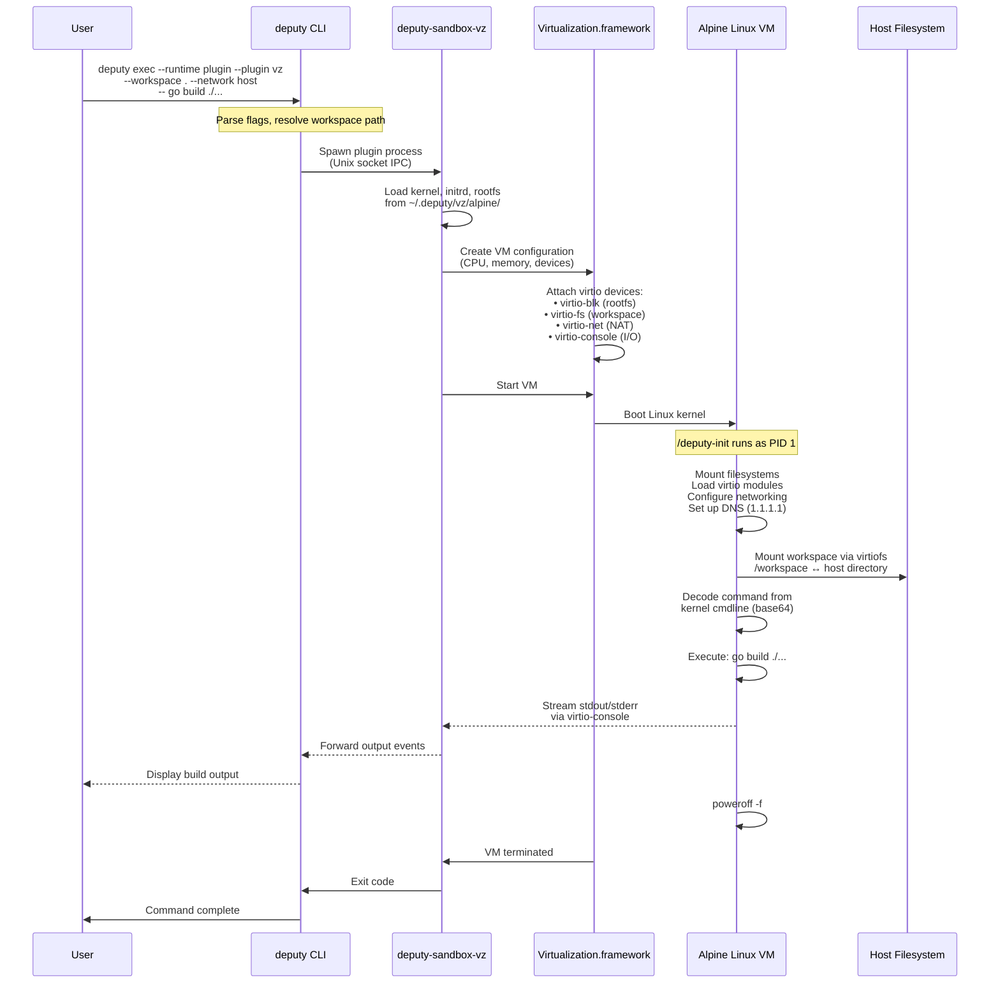
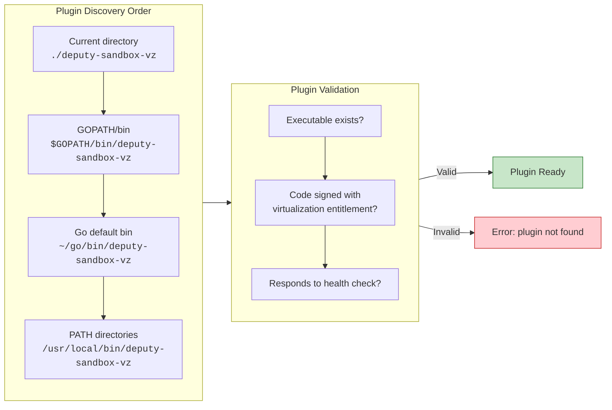
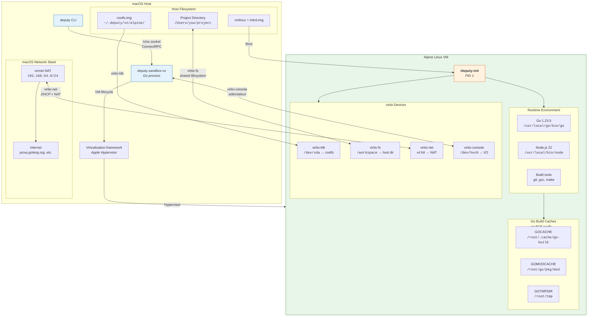
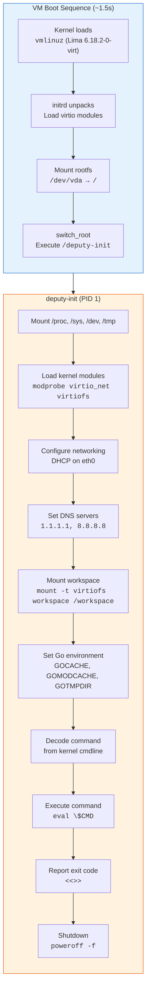
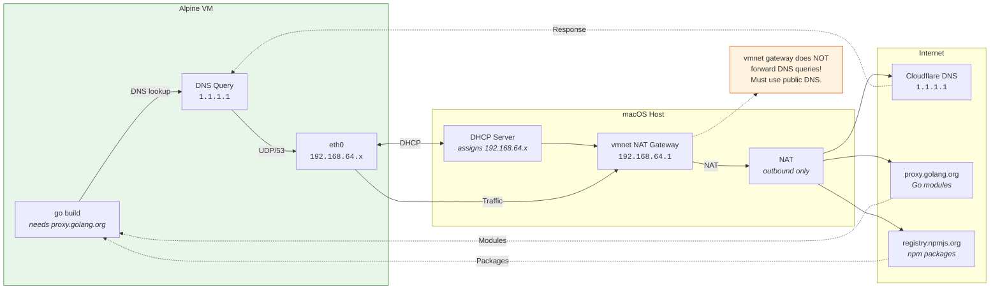
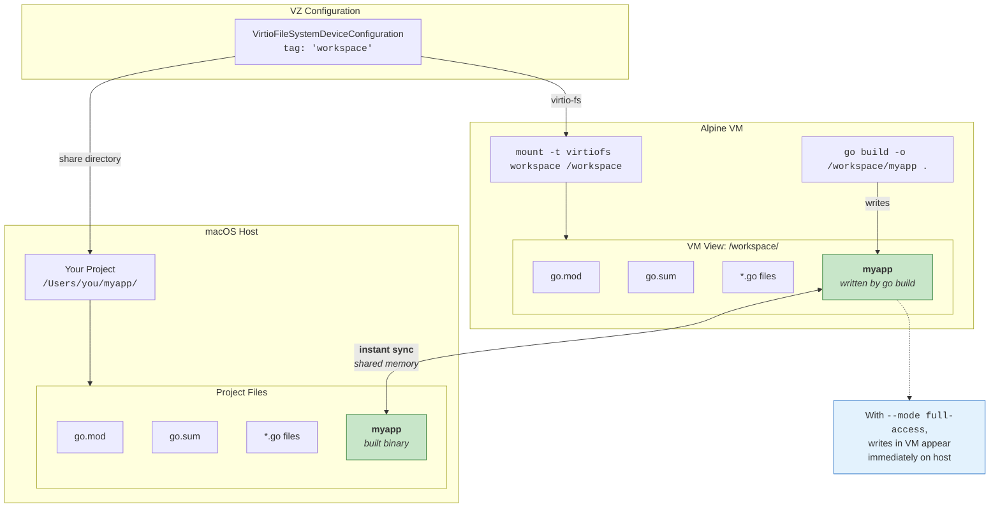
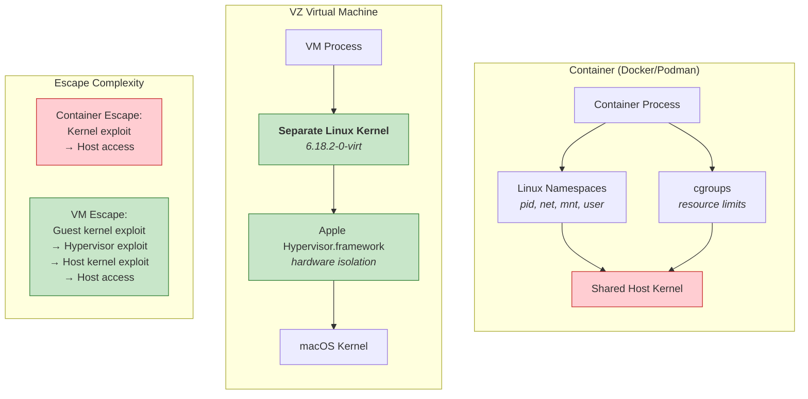
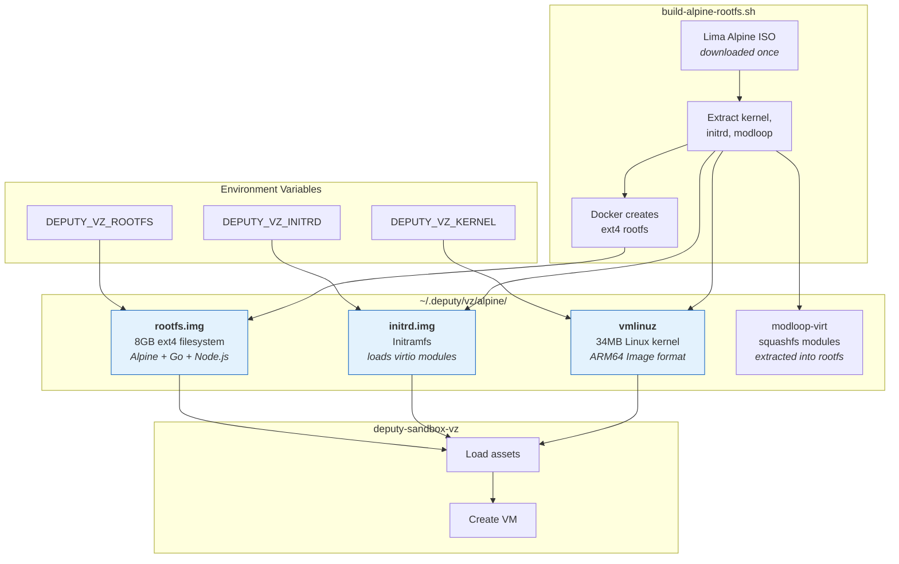
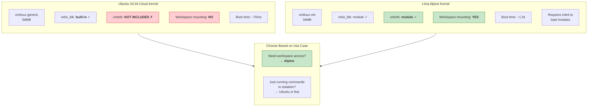
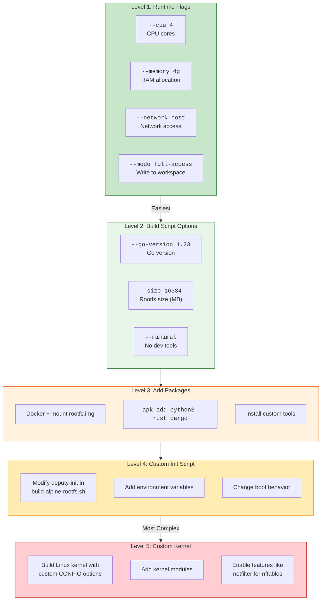

# deputy-sandbox-vz

A Deputy sandbox runtime plugin using Apple's Virtualization.framework for VM-based isolation on macOS.

## Credits

- **[vz library](https://github.com/Code-Hex/vz)** by [@Code-Hex](https://github.com/Code-Hex) - Go bindings for macOS Virtualization.framework
- **[Lima project](https://github.com/lima-vm/lima)** - Alpine images with virtiofs-enabled kernel
- **[Ubuntu Cloud Images](https://cloud-images.ubuntu.com/)** - ARM64 cloud images
- **[Alpine Linux](https://alpinelinux.org/)** - Lightweight Linux distribution

## Overview

This plugin provides maximum isolation by running each sandbox execution in a lightweight VM using the [vz](https://github.com/Code-Hex/vz) Go bindings for macOS Virtualization.framework.

**Key Features (with Alpine rootfs):**
- **Network access** - Download dependencies, connect to registries
- **Workspace mounting** - Access your project files via virtiofs
- **Developer-ready** - Go 1.23.5 and Node.js 22 pre-installed
- **Hardware isolation** - Each execution runs in a separate VM
- **No root/sudo required** - Uses user-space virtualization

**Use Cases:**
- Run `go build`, `npm install`, `pip install` in isolated VMs
- Execute untrusted build scripts safely
- Test package manager commands without affecting your system
- AI agent remediation workflows
- Build Deputy inside Deputy ("inception" testing)

**Requirements:**
- macOS 11.0+ (Big Sur or later)
- Apple Silicon (arm64) - required for Virtualization.framework
- Code signing with virtualization entitlements
- Docker (for creating rootfs on macOS)

## How It Works

### End-to-End Flow

When you run `deputy exec --runtime plugin --plugin vz ...`, here's what happens:



### Plugin Discovery

Deputy discovers sandbox plugins by searching for executables named `deputy-sandbox-*`:



### VM Architecture

The VM uses virtio devices for all host communication:



### Boot Sequence

What happens inside the VM from power-on to command execution:



### Network Architecture

How the VM connects to the internet for downloading dependencies:



### Workspace Mounting (virtiofs)

How your project directory is shared between host and VM:



### Security Boundary

How VZ provides stronger isolation than containers:



### Asset Files

The files created by `build-alpine-rootfs.sh` and how they're used:



### Why Alpine Over Ubuntu?



## Quick Start with Alpine (Recommended)

This is the recommended setup for supply chain security workflows. It provides:
- **Network access** for downloading dependencies (`go build`, `npm install`)
- **Workspace mounting** via virtiofs (access your project files in the VM)
- **Go 1.23.5 and Node.js 22** pre-installed
- **8GB rootfs** with room for toolchain caches and builds

### Complete Setup (5 Steps)

```bash
# Step 1: Build and install the VZ plugin
cd examples/sandbox-plugins/vz
go build -o deputy-sandbox-vz .
codesign --entitlements entitlements.plist --sign - deputy-sandbox-vz
mkdir -p ~/go/bin && cp deputy-sandbox-vz ~/go/bin/

# Step 2: Build the Alpine rootfs (requires Docker, takes ~2-3 minutes)
./build-alpine-rootfs.sh

# Step 3: Set environment variables (add to ~/.zshrc for persistence)
export DEPUTY_VZ_KERNEL=~/.deputy/vz/alpine/vmlinuz
export DEPUTY_VZ_ROOTFS=~/.deputy/vz/alpine/rootfs.img
export DEPUTY_VZ_INITRD=~/.deputy/vz/alpine/initrd.img

# Step 4: Verify setup
deputy exec --runtime plugin --plugin vz -- uname -a
# Expected: Linux (none) 6.18.2-0-virt #1-Alpine SMP ... aarch64 Linux

deputy exec --runtime plugin --plugin vz -- go version
# Expected: go version go1.23.5 linux/arm64

# Step 5: Test workspace mounting and network
deputy exec --runtime plugin --plugin vz --workspace . -- ls /workspace
deputy exec --runtime plugin --plugin vz --network host -- curl -sS https://proxy.golang.org
```

### Building Go Projects

```bash
# Build your Go project in an isolated VM with network access
deputy exec --runtime plugin --plugin vz \
    --workspace . \
    --network host \
    --cpu 4 \
    --memory 4g \
    -- go build ./...

# Build and output binary to host filesystem
deputy exec --runtime plugin --plugin vz \
    --workspace . \
    --network host \
    --cpu 4 \
    --memory 4g \
    --mode full-access \
    -- go build -o /workspace/myapp .

# Verify the binary (Linux ELF format, not macOS Mach-O)
file myapp
# myapp: ELF 64-bit LSB executable, ARM aarch64, ...
```

### Deputy-with-Deputy (Inception)

Build and test Deputy itself inside a VM sandbox:

```bash
# From the deputy repository root
cd /path/to/deputy

# Build deputy inside the VM
deputy exec --runtime plugin --plugin vz \
    --workspace . \
    --network host \
    --cpu 4 \
    --memory 4g \
    --mode full-access \
    -- go build -o /workspace/deputy-vm .

# Run deputy inside deputy!
deputy exec --runtime plugin --plugin vz \
    --workspace . \
    --network host \
    -- ./deputy-vm scan .

# Run tests in the VM
deputy exec --runtime plugin --plugin vz \
    --workspace . \
    --network host \
    --cpu 4 \
    --memory 4g \
    -- go test ./...
```

---

## Quick Start (Ubuntu 24.04 LTS)

> **Note:** Ubuntu is simpler to set up but does NOT support workspace mounting (no virtiofs).
> Use Alpine (above) if you need to access host files in the VM.

This section provides exact commands to get a working VM sandbox using Ubuntu 24.04 LTS (Noble Numbat).

### One-Command Setup (Recommended)

The fastest way to get started is using the Makefile:

```bash
# From the deputy repository root
cd examples/sandbox-plugins/vz

# Full setup: download kernel, build rootfs with Go/Node, install plugin
make setup

# Test it works
deputy exec --runtime plugin --plugin vz -- go version
deputy exec --runtime plugin --plugin vz -- node --version
```

This creates a developer-ready VM with:
- Go 1.25.5 toolchain (matches deputy's go.mod)
- Node.js 22 LTS + npm
- Build essentials (gcc, make, git)
- Python 3 with pip

### Manual Setup

If you prefer manual control, follow these steps:

### 1. Build and Install the Plugin

```bash
# From the deputy repository root
cd examples/sandbox-plugins/vz

# Build the plugin
go build -o deputy-sandbox-vz .

# Sign with virtualization entitlement (required by macOS)
codesign --entitlements entitlements.plist --sign - deputy-sandbox-vz

# Install to Go's bin directory (automatically discovered by deputy)
mkdir -p ~/go/bin
cp deputy-sandbox-vz ~/go/bin/

# Verify it's discoverable
ls ~/go/bin/deputy-sandbox-vz
```

**Plugin Discovery:** Deputy searches for sandbox plugins (`deputy-sandbox-*`) in:
1. Current working directory (for development)
2. `$GOPATH/bin` (if GOPATH is set)
3. `$HOME/go/bin` (default Go bin location)
4. All directories in `PATH`

### 2. Download Ubuntu Assets

Download the kernel and root filesystem from Ubuntu's official cloud images:

```bash
# Create the asset directory
mkdir -p ~/.deputy/vz
cd ~/.deputy/vz

# Download kernel (vmlinuz) - this is a gzip-compressed file
curl -LO https://cloud-images.ubuntu.com/releases/24.04/release/unpacked/ubuntu-24.04-server-cloudimg-arm64-vmlinuz-generic
mv ubuntu-24.04-server-cloudimg-arm64-vmlinuz-generic vmlinuz.gz

# Decompress the kernel
gunzip vmlinuz.gz

# Verify it's a proper ARM64 kernel
file vmlinuz
# Expected: Linux kernel ARM64 boot executable Image, little-endian, 4K pages

# Download root filesystem tarball
curl -LO https://cloud-images.ubuntu.com/releases/24.04/release/ubuntu-24.04-server-cloudimg-arm64-root.tar.xz
```

> **Note:** No initrd is needed! The Ubuntu kernel boots directly to the rootfs with virtio drivers built-in, achieving ~70ms boot times.

### 3. Create the Root Filesystem Image

Use Docker to create an ext4 disk image from the root tarball (macOS can't create ext4 natively):

```bash
cd ~/.deputy/vz

# Use Docker to create an ext4 rootfs (requires --privileged for loop mount)
docker run --rm --privileged -v ~/.deputy/vz:/output ubuntu:24.04 bash -c '
  set -ex
  apt-get update && apt-get install -y xz-utils e2fsprogs

  # Create a 2GB disk image (Ubuntu needs more space than Alpine)
  dd if=/dev/zero of=/output/rootfs.img bs=1M count=2048
  mkfs.ext4 -F /output/rootfs.img

  # Mount the image
  mkdir -p /mnt/rootfs
  mount -o loop /output/rootfs.img /mnt/rootfs

  # Extract the Ubuntu root filesystem
  tar -xJf /output/ubuntu-24.04-server-cloudimg-arm64-root.tar.xz -C /mnt/rootfs

  # Create deputy-init script for command execution
  cat > /mnt/rootfs/deputy-init << "INITSCRIPT"
#!/bin/bash
# deputy-init - Init script for Deputy VZ sandbox
#
# This script is executed as the init process (PID 1) inside the VM.
# It reads the base64-encoded command from the kernel cmdline parameter "deputy.cmd",
# executes it using eval, and reports the exit code via protocol markers.

# Mount essential filesystems
mount -t proc proc /proc 2>/dev/null
mount -t sysfs sys /sys 2>/dev/null
mount -t devtmpfs dev /dev 2>/dev/null

# Get the base64-encoded command from kernel cmdline
CMD_BASE64=""
for param in $(cat /proc/cmdline); do
    case "$param" in
        deputy.cmd=*)
            CMD_BASE64="${param#deputy.cmd=}"
            break
            ;;
    esac
done

if [ -z "$CMD_BASE64" ]; then
    echo "<<<DEPUTY_OUTPUT_START>>>"
    echo "<<<DEPUTY_STDERR>>>"
    echo "Error: No command provided (deputy.cmd not found in kernel cmdline)"
    echo "<<<DEPUTY_OUTPUT_END>>>"
    echo "<<<DEPUTY_EXIT_CODE:1>>>"
    exec /sbin/poweroff -f
fi

# Decode the command (space-separated, executed via eval)
CMD_DECODED=$(echo "$CMD_BASE64" | base64 -d 2>/dev/null)

if [ -z "$CMD_DECODED" ]; then
    echo "<<<DEPUTY_OUTPUT_START>>>"
    echo "<<<DEPUTY_STDERR>>>"
    echo "Error: Failed to decode command"
    echo "<<<DEPUTY_OUTPUT_END>>>"
    echo "<<<DEPUTY_EXIT_CODE:1>>>"
    exec /sbin/poweroff -f
fi

# Signal start of output
echo "<<<DEPUTY_OUTPUT_START>>>"
echo "<<<DEPUTY_STDOUT>>>"

# Create temporary files for capturing stdout and stderr
STDOUT_FILE="/tmp/deputy_stdout"
STDERR_FILE="/tmp/deputy_stderr"
touch "$STDOUT_FILE" "$STDERR_FILE"

# Execute the command using eval, capturing stdout and stderr separately
eval "$CMD_DECODED" >"$STDOUT_FILE" 2>"$STDERR_FILE"
EXIT_CODE=$?

# Output stdout
if [ -s "$STDOUT_FILE" ]; then
    cat "$STDOUT_FILE"
fi

# Output stderr if any
if [ -s "$STDERR_FILE" ]; then
    echo "<<<DEPUTY_STDERR>>>"
    cat "$STDERR_FILE"
fi

# Signal end of output and report exit code
echo "<<<DEPUTY_OUTPUT_END>>>"
echo "<<<DEPUTY_EXIT_CODE:${EXIT_CODE}>>>"

# Shutdown the VM
exec /sbin/poweroff -f
INITSCRIPT
  chmod +x /mnt/rootfs/deputy-init

  # Ensure essential directories exist
  mkdir -p /mnt/rootfs/{dev,proc,sys,tmp,run}

  umount /mnt/rootfs
  echo "SUCCESS: Created rootfs.img with Ubuntu and deputy-init"
'
```

### 4. Verify Your Setup

```bash
ls -la ~/.deputy/vz/
# Should show:
# - vmlinuz      (Linux kernel, ~35-40MB)
# - rootfs.img   (root filesystem, 2GB)

# Verify kernel format
file ~/.deputy/vz/vmlinuz
# Expected: Linux kernel ARM64 boot executable Image, little-endian, 4K pages
```

### 5. Test the Plugin

```bash
# Build deputy if not already built
cd /path/to/deputy
go build -o deputy .

# Test plugin discovery - start the plugin manually to verify it works
~/go/bin/deputy-sandbox-vz --socket /tmp/test-vz.sock &
VZ_PID=$!
sleep 2
ls -la /tmp/test-vz.sock  # Should show the socket file
kill $VZ_PID

# Test via deputy (full end-to-end)
./deputy exec --runtime plugin --plugin vz -- echo "hello from VM"

# Try more commands
./deputy exec --runtime plugin --plugin vz -- uname -a
# Expected: Linux (none) 6.8.0-90-generic ... aarch64 GNU/Linux

./deputy exec --runtime plugin --plugin vz -- cat /etc/os-release
# Expected: PRETTY_NAME="Ubuntu 24.04.3 LTS" ...
```

## Environment Variables

| Variable | Description | Default |
|----------|-------------|---------|
| `DEPUTY_VZ_KERNEL` | Path to Linux kernel (vmlinuz) | `~/.deputy/vz/vmlinuz` |
| `DEPUTY_VZ_INITRD` | Path to initrd (required for Alpine) | `~/.deputy/vz/alpine/initrd.img` |
| `DEPUTY_VZ_ROOTFS` | Path to root filesystem image | `~/.deputy/vz/rootfs.img` |

### Setting Up Environment for Alpine (Recommended)

After building the Alpine rootfs with `./build-alpine-rootfs.sh`, set these environment variables:

```bash
# Add to your ~/.zshrc or ~/.bashrc for persistence
export DEPUTY_VZ_KERNEL=~/.deputy/vz/alpine/vmlinuz
export DEPUTY_VZ_ROOTFS=~/.deputy/vz/alpine/rootfs.img
export DEPUTY_VZ_INITRD=~/.deputy/vz/alpine/initrd.img
```

Then reload your shell or run `source ~/.zshrc`.

### Verifying Your Environment

```bash
# Check environment variables are set
echo "DEPUTY_VZ_KERNEL: $DEPUTY_VZ_KERNEL"
echo "DEPUTY_VZ_ROOTFS: $DEPUTY_VZ_ROOTFS"
echo "DEPUTY_VZ_INITRD: $DEPUTY_VZ_INITRD"

# Verify files exist
ls -la $DEPUTY_VZ_KERNEL $DEPUTY_VZ_ROOTFS $DEPUTY_VZ_INITRD
```

## Dual-OS Setup (Ubuntu + Alpine)

The VZ plugin supports two Linux distributions:

| Distribution | Location | Kernel | virtiofs | Workspace | Network | Status |
|--------------|----------|--------|----------|-----------|---------|--------|
| **Alpine 3.23** | `~/.deputy/vz/alpine/` | 34MB (Lima) | Yes | **Yes** | **Yes** | **Recommended** - full features |
| **Ubuntu 24.04** | `~/.deputy/vz/ubuntu/` | 56MB (cloud) | No* | No | Yes | Fast boot, no workspace |

*Ubuntu's cloud kernel lacks `CONFIG_VIRTIO_FS`. Alpine's Lima kernel has virtiofs as a module.

### Directory Structure

After running `./build-alpine-rootfs.sh`, the Alpine assets are at:

```
~/.deputy/vz/alpine/
├── vmlinuz                    # Lima Alpine kernel (ARM64 Image format)
├── initrd.img                 # Alpine initramfs with virtiofs/virtio modules
├── rootfs.img                 # Alpine rootfs (8GB, includes Go 1.23.5 + Node.js 22)
└── modloop-virt               # Squashfs of kernel modules (used during build)
```

The environment variables point to these files:
```bash
export DEPUTY_VZ_KERNEL=~/.deputy/vz/alpine/vmlinuz
export DEPUTY_VZ_INITRD=~/.deputy/vz/alpine/initrd.img
export DEPUTY_VZ_ROOTFS=~/.deputy/vz/alpine/rootfs.img
```

### Using Alpine (Recommended for Workspace Mounting)

Alpine provides virtiofs support for workspace mounting. See [Quick Start with Alpine](#quick-start-with-alpine-recommended) for the complete setup.

**What `build-alpine-rootfs.sh` does:**
1. Downloads Lima's Alpine ISO (which has a kernel with virtiofs support)
2. Extracts the kernel, initrd, and module archive
3. Creates an 8GB ext4 rootfs with Alpine base system
4. Installs Go 1.23.5 and Node.js 22
5. Embeds `deputy-init` script for command execution

**Environment setup (required):**
```bash
export DEPUTY_VZ_KERNEL=~/.deputy/vz/alpine/vmlinuz
export DEPUTY_VZ_INITRD=~/.deputy/vz/alpine/initrd.img
export DEPUTY_VZ_ROOTFS=~/.deputy/vz/alpine/rootfs.img
```

### Switching Between Ubuntu and Alpine

```bash
# Use Ubuntu (fast boot, no workspace mounting)
unset DEPUTY_VZ_KERNEL DEPUTY_VZ_ROOTFS DEPUTY_VZ_INITRD
deputy exec --runtime plugin --plugin vz --no-workspace -- uname -a

# Use Alpine (virtiofs workspace mounting, network access)
export DEPUTY_VZ_KERNEL=~/.deputy/vz/alpine/vmlinuz
export DEPUTY_VZ_ROOTFS=~/.deputy/vz/alpine/rootfs.img
export DEPUTY_VZ_INITRD=~/.deputy/vz/alpine/initrd.img
deputy exec --runtime plugin --plugin vz --workspace . -- ls /workspace
```

## Usage Examples

### Basic Commands

```bash
# Run a command in a VM
deputy exec --runtime plugin --plugin vz -- ls -la

# Read-only mode (workspace mounted read-only)
deputy exec --runtime plugin --plugin vz --mode read-only -- cat /etc/os-release

# With memory limit
deputy exec --runtime plugin --plugin vz --memory 1g -- make build

# With CPU limit
deputy exec --runtime plugin --plugin vz --cpu 2 -- npm install

# Network isolated (no network interface)
deputy exec --runtime plugin --plugin vz --network none -- ./build.sh

# With network access (NAT via DHCP)
deputy exec --runtime plugin --plugin vz --network host -- curl -sS https://example.com

# With timeout
deputy exec --runtime plugin --plugin vz --timeout 30s -- long-running-task
```

### Supply Chain Security (Package Manager Operations)

Run package manager commands safely in VM isolation:

```bash
# Go: Run go mod tidy in isolated VM
deputy exec --runtime plugin --plugin vz -- go mod tidy

# Go: Build and test without affecting host
deputy exec --runtime plugin --plugin vz -- go build ./...
deputy exec --runtime plugin --plugin vz -- go test ./...

# Node.js: Safe npm install with workspace isolation
deputy exec --runtime plugin --plugin vz \
    --workspace-isolation snapshot \
    --mask-preset supply-chain \
    -- npm install

# Node.js: Run npm audit to check for vulnerabilities
deputy exec --runtime plugin --plugin vz -- npm audit

# Python: Install dependencies in isolated environment
deputy exec --runtime plugin --plugin vz -- pip install -r requirements.txt
```

### Deputy Development Workflow

Use the vz plugin to develop Deputy itself in an isolated environment:

```bash
# From the deputy repository root

# Build deputy in VM
deputy exec --runtime plugin --plugin vz -- go build -o deputy-vm .

# Run tests in VM
deputy exec --runtime plugin --plugin vz -- go test ./...

# Run a specific test
deputy exec --runtime plugin --plugin vz -- go test -v -run TestScanCommand ./internal/cli/cmd/...

# Tidy modules safely
deputy exec --runtime plugin --plugin vz -- go mod tidy

# Run deputy inside deputy (inception!)
deputy exec --runtime plugin --plugin vz -- ./deputy-vm scan
```

### Workspace Isolation with VZ

Combine VM isolation with workspace isolation for maximum safety:

```bash
# Snapshot isolation: changes don't affect original workspace
deputy exec --runtime plugin --plugin vz \
    --workspace-isolation snapshot \
    -- npm install malicious-looking-package

# Review changes before applying (preserved workspace)
deputy exec --runtime plugin --plugin vz \
    --workspace-isolation snapshot \
    --preserve-workspace \
    -- npm install

# File masking: hide secrets, expose only lockfiles
deputy exec --runtime plugin --plugin vz \
    --mask-preset supply-chain \
    -- npm audit
```

## Custom Rootfs Builds

### Customization Points

You can customize the VZ sandbox at several levels:



The `build-rootfs.sh` script creates customized rootfs images:

```bash
# Developer rootfs (Go + Node.js + build tools) - default
./build-rootfs.sh

# Minimal rootfs (Ubuntu base only, smaller)
./build-rootfs.sh --minimal

# Larger rootfs for more packages
./build-rootfs.sh --size 4096

# Custom Go version (e.g., match your project's go.mod)
./build-rootfs.sh --go-version 1.25.5

# Custom output directory
./build-rootfs.sh --output /path/to/assets
```

Or use the Makefile targets:

```bash
make rootfs          # Developer rootfs with Go/Node
make rootfs-minimal  # Minimal Ubuntu rootfs
```

### What's Included in Developer Rootfs

| Component | Version | Purpose |
|-----------|---------|---------|
| Ubuntu | 24.04 LTS | Base system |
| Go | 1.25.5 (configurable via `--go-version`) | Go toolchain |
| Node.js | 22 LTS | JavaScript runtime |
| npm | Latest | Package manager |
| gcc/g++ | System | C/C++ compiler |
| make | System | Build system |
| git | System | Version control |
| curl/wget | System | HTTP clients |

## Using Other Linux Distributions

### Debian

```bash
# Download Debian cloud image
curl -LO https://cloud.debian.org/images/cloud/bookworm/latest/debian-12-generic-arm64.raw

# Extract or download kernel
# Copy rootfs
cp debian-12-generic-arm64.raw ~/.deputy/vz/rootfs.img
```

### Fedora

```bash
# Download Fedora kernel and initrd
RELEASE=40
curl -LO https://download.fedoraproject.org/pub/fedora/linux/releases/${RELEASE}/Everything/aarch64/os/images/pxeboot/vmlinuz
curl -LO https://download.fedoraproject.org/pub/fedora/linux/releases/${RELEASE}/Everything/aarch64/os/images/pxeboot/initrd.img
```

### Custom Kernel

Build your own kernel with minimal config:

```bash
git clone --depth 1 https://github.com/torvalds/linux.git
cd linux

# Use a minimal ARM64 config
make ARCH=arm64 defconfig

# Enable virtio drivers (required)
./scripts/config --enable VIRTIO
./scripts/config --enable VIRTIO_BLK
./scripts/config --enable VIRTIO_NET
./scripts/config --enable VIRTIO_CONSOLE
./scripts/config --enable VIRTIO_FS
./scripts/config --enable FUSE_FS

# Build
make ARCH=arm64 CROSS_COMPILE=aarch64-linux-gnu- -j$(nproc)

# Output is arch/arm64/boot/Image
cp arch/arm64/boot/Image ~/.deputy/vz/vmlinuz
```

## Capabilities

| Capability | Supported | Notes |
|------------|-----------|-------|
| Network Isolation | Yes | NAT or none via virtio-net |
| Filesystem Isolation | Yes | Full VM boundary |
| Resource Limits | Yes | CPU cores, memory |
| Seccomp | No | N/A for VMs |
| AppArmor/SELinux | No | N/A for VMs |
| Streaming Output | Yes | Via virtio-console |
| Interactive Stdin | Yes | Via virtio-console |
| Workspace Mounting | Yes | Alpine kernel with virtiofs (see below) |
| GPU Passthrough | No | Not yet implemented |

## Supported Modes

| Mode | Description |
|------|-------------|
| `read-only` | Workspace mounted read-only inside VM |
| `workspace-write` | Workspace mounted read-write (default) |
| `ephemeral` | Changes discarded after execution |
| `network-isolated` | No network interface attached |

## Architecture

```
+-------------------------------------------------------------+
|                    Deputy CLI / Agent                        |
+-----------------------------+-------------------------------+
                              | ConnectRPC (Unix Socket)
                              v
+-------------------------------------------------------------+
|                  deputy-sandbox-vz Plugin                    |
|  - Receives ExecuteRequest                                   |
|  - Creates VM configuration                                  |
|  - Manages VM lifecycle                                      |
|  - Streams output via virtio-console                         |
+-----------------------------+-------------------------------+
                              | Virtualization.framework
                              v
+-------------------------------------------------------------+
|                    Lightweight VM                            |
|  +-------------------------------------------------------+  |
|  | Linux Guest                                           |  |
|  |  - virtio-blk: rootfs disk                            |  |
|  |  - virtio-fs: workspace directory                     |  |
|  |  - virtio-console: stdin/stdout/stderr                |  |
|  |  - virtio-net: network (if enabled)                   |  |
|  |  - virtio-balloon: memory management                  |  |
|  |  - virtio-entropy: randomness                         |  |
|  +-------------------------------------------------------+  |
+-------------------------------------------------------------+
```

## Security Model

The VM boundary provides stronger isolation than containers:

1. **Separate Kernel**: Each VM runs its own kernel; kernel vulnerabilities cannot escape
2. **Hardware Isolation**: Uses Apple's Hypervisor.framework for hardware-backed isolation
3. **No Shared State**: Unlike containers, VMs don't share cgroups, namespaces, or kernel state
4. **Controlled I/O**: All I/O goes through virtio devices which can be audited
5. **No Root Required**: Uses user-space virtualization, no elevated privileges needed

### Comparison with Other Runtimes

| Aspect | none | sandbox-exec | docker | gvisor | vz |
|--------|------|--------------|--------|--------|-----|
| Isolation Level | None | Process | Namespace | Syscall | VM |
| Kernel Shared | Yes | Yes | Yes | Partially | No |
| Escape Risk | High | Medium | Medium | Low | Very Low |
| Startup Time | ~1ms | ~5ms | ~100ms | ~50ms | ~70ms |
| Overhead | None | Low | Low | Medium | Medium |

### Networking

The VZ plugin supports NAT networking via macOS's built-in vmnet framework. When `--network host` or `--network bridge` is specified, the VM obtains an IP address via DHCP from the macOS vmnet DHCP server.

**How it works:**
1. The VM boots with a virtio-net device attached (`eth0`)
2. The `deputy-init` script brings up the interface and runs `dhclient`
3. macOS vmnet assigns an IP from the `192.168.64.0/24` subnet (configurable via `/Library/Preferences/SystemConfiguration/com.apple.vmnet.plist`)
4. DNS resolution uses public DNS servers (1.1.1.1, 8.8.8.8) since vmnet gateway doesn't forward DNS

**Requirements for network modes:**
- The rootfs must include a DHCP client (`dhclient` or `udhcpc`)
- The rootfs built by `build-rootfs.sh` includes `isc-dhcp-client` by default

### Network Filtering Limitations

For fine-grained network control (allowlists), network filtering uses **guest-level nftables** instead of host-level vmnet controls. This has important implications:

| Approach | Host-Level (vmnet) | Guest-Level (nftables) |
|----------|-------------------|------------------------|
| Entitlement | `com.apple.vm.networking` (restricted) | None required |
| Ad-hoc signing | ❌ Not supported | ✅ Works |
| Enforcement point | macOS kernel | Linux guest kernel |
| Bypass risk | None (host controls) | Requires guest kernel exploit |
| DNS filtering | Full control | Requires kernel netfilter support |

**Current Limitations:**

1. **Kernel netfilter required for allowlists**: The guest kernel must have `CONFIG_NETFILTER=y` and related nftables modules. The Ubuntu 24.04 cloud kernel (`vmlinuz-generic`) does **not** include netfilter support by default, causing nftables commands to fail with "Protocol not supported."

2. **Guest-side enforcement**: A malicious process with root inside the guest could theoretically modify or bypass nftables rules. However, this requires kernel-level access inside the VM.

3. **DNS queries may bypass filtering**: Without proper nftables setup, allowlist rules only affect direct IP connections. DNS queries to the default resolver still work, allowing hostname resolution for blocked destinations (though connections will fail if the IP isn't in the allowlist).

**Solutions:**

- **Full isolation**: Use `--network none` for complete network isolation (recommended for untrusted code)
- **Custom kernel**: Build a kernel with `CONFIG_NETFILTER=y` for nftables support
- **Application-level proxy**: Future enhancement to route all traffic through a host-side filtering proxy

### Clock Synchronization

The VM automatically synchronizes its clock from the host at boot via the `deputy.time` kernel parameter. This ensures SSL/TLS certificate validation works correctly.

```bash
# Clock is automatically synced from host
$ deputy exec --runtime plugin --plugin vz -- date
Mon Jan 13 19:58:00 UTC 2026
```

## Limitations

- **macOS Only**: Requires macOS 11.0+ on Apple Silicon
- **Startup Overhead**: VMs take ~70-200ms to boot (vs ~10ms for containers)
- **Asset Management**: Requires pre-built kernel and rootfs images
- **No GPU Passthrough**: GPU workloads not supported
- **Disk Space**: Rootfs images consume disk space (~2GB for Ubuntu)
- **Network Allowlist Limited**: Fine-grained network allowlists require a custom kernel with netfilter support; basic NAT networking works out of the box
- **Ubuntu No Workspace**: Ubuntu kernel lacks virtiofs; use Alpine kernel for workspace mounting. See [Workspace Mounting Status](#workspace-mounting-status)

## Workspace Mounting Status

Workspace mounting (`--workspace`) allows sharing a host directory with the VM via virtiofs. This is critical for supply chain security workflows where you want to run `go build` or `npm install` on your project.

### Current Status

| Kernel | virtiofs | virtio_blk | Workspace | Status |
|--------|----------|------------|-----------|--------|
| Ubuntu 24.04 cloud | Not available | Built-in | **No** | Boots fast, no virtiofs |
| Lima Alpine 6.18 | Module in initrd | Module in initrd | **Yes** | **Working with custom initrd** |
| Custom kernel | Needs `CONFIG_VIRTIO_FS=y` | Needs `CONFIG_VIRTIO_BLK=y` | **Yes** | Build from source |

### Technical Details

**Ubuntu Cloud Kernel** (`vmlinuz-generic`):
- Downloads from: `cloud-images.ubuntu.com`
- Boots directly without initramfs (fast ~70ms)
- Has `virtio_blk` built-in for disk access
- **Lacks** `CONFIG_VIRTIO_FS` (virtiofs not available)
- Best for: Isolated execution without host directory access

**Lima Alpine Kernel** (from Lima project's Alpine ISO):
- Kernel format: EFI stub, requires extraction for VZ
- Has `virtiofs.ko` module in initramfs
- Has `virtio_blk.ko` module (not built-in)
- **Requires** custom initramfs (`initrd-virtiofs.img`) to load modules
- **Working**: virtiofs workspace mounting tested and functional
- Boot time: ~1.5s (includes module loading)

### Creating the Alpine Initrd (Advanced)

> **Note:** The `build-alpine-rootfs.sh` script handles initrd creation automatically.
> This section is for reference only if you need to customize the boot process.

The Lima Alpine kernel uses modular drivers, so an initrd is needed to load virtiofs, ext4, and virtio_blk modules before mounting root. The `build-alpine-rootfs.sh` script extracts the initrd from Lima's Alpine ISO which already has these modules.

### Installing Additional Packages in the Alpine Rootfs

The `build-alpine-rootfs.sh` script already installs Go 1.23.5 and Node.js 22. To add more packages, use Docker to mount and modify the ext4 image:

```bash
# Add Python to the Alpine rootfs
docker run --rm --privileged -v ~/.deputy/vz/alpine:/alpine alpine:3.23 sh -c "
  mkdir -p /mnt/rootfs
  mount -o loop /alpine/rootfs.img /mnt/rootfs
  apk --root /mnt/rootfs add python3 py3-pip
  umount /mnt/rootfs
"

# Add Rust toolchain
docker run --rm --privileged -v ~/.deputy/vz/alpine:/alpine alpine:3.23 sh -c "
  mkdir -p /mnt/rootfs
  mount -o loop /alpine/rootfs.img /mnt/rootfs
  apk --root /mnt/rootfs add rust cargo
  umount /mnt/rootfs
"
```

### Supply Chain Security Examples (Alpine + Go)

With Go installed and virtiofs workspace mounting, you can run supply chain security workflows in an isolated VM:

```console
$ deputy exec --runtime plugin --plugin vz --workspace . -- cat go.mod | head -n 3
module github.com/picatz/deputy

go 1.25.5
$ deputy exec --runtime plugin --plugin vz --workspace . -- uname -a
Linux (none) 6.18.2-0-virt #1-Alpine SMP PREEMPT_DYNAMIC 2025-12-29 10:24:58 aarch64 Linux
```

#### Building Go Projects with Network Access

For large projects that need to download dependencies, use `--network host` and increase resources:

```bash
# Build a Go project with network access (downloads dependencies)
# Uses 4 CPUs and 4GB RAM for faster compilation
deputy exec --runtime plugin --plugin vz \
    --workspace . \
    --network host \
    --dangerously-skip-prompt \
    --cpu 4 \
    --memory 4g \
    -- go build ./...

# Build and output binary to host filesystem (writable workspace)
deputy exec --runtime plugin --plugin vz \
    --workspace . \
    --network host \
    --dangerously-skip-prompt \
    --cpu 4 \
    --memory 4g \
    --mode full-access \
    -- go build -o /workspace/myapp .

# Verify the binary was created (Linux ELF, not macOS Mach-O)
$ file myapp
myapp: ELF 64-bit LSB executable, ARM aarch64, version 1 (SYSV), dynamically linked, interpreter /lib/ld-musl-aarch64.so.1, ...
```

**Resource recommendations:**
- `--cpu 4 --memory 4g` - Good for most Go projects
- `--cpu 8 --memory 8g` - Large projects with many dependencies
- Default (1 CPU, 512MB) - Only suitable for simple commands, not compilation

**Network modes:**
- `--network host` - Full network access (required for `go build` to download dependencies)
- `--network none` (default) - No network, most isolated

#### Other Go Operations

```bash
# List module dependencies
deputy exec --runtime plugin --plugin vz --workspace . -- \
    go list -m all

# Run go mod tidy (read-write workspace)
deputy exec --runtime plugin --plugin vz \
    --workspace . \
    --network host \
    --dangerously-skip-prompt \
    --mode full-access \
    -- go mod tidy

# Verify checksums (no network needed)
deputy exec --runtime plugin --plugin vz --workspace . -- \
    go mod verify

# Download dependencies without building
deputy exec --runtime plugin --plugin vz \
    --workspace . \
    --network host \
    --dangerously-skip-prompt \
    -- go mod download
```

#### Technical Notes

The Alpine rootfs created by `build-alpine-rootfs.sh` is configured with:

| Configuration | Value | Why |
|---------------|-------|-----|
| **Rootfs size** | 8GB | Accommodates Go toolchain downloads and large builds |
| **GOCACHE** | `/root/.cache/go-build` | On rootfs, not `/tmp` (tmpfs is RAM-backed, limited) |
| **GOMODCACHE** | `/root/go/pkg/mod` | Persistent module cache on rootfs |
| **GOTMPDIR** | `/root/tmp` | Build temp files on rootfs, not RAM |
| **DNS servers** | 1.1.1.1, 8.8.8.8 | Apple's vmnet NAT gateway does NOT forward DNS queries |
| **Kernel** | Lima 6.18.2-0-virt | Has virtiofs as module (matches modloop) |

**Why these matter:**
- Without `GOTMPDIR` on rootfs, `go build` fails with "no space left on device" during compilation
- Without public DNS, `go build` fails with DNS resolution errors (vmnet DHCP provides a gateway IP that doesn't answer DNS)
- The 8GB size allows building projects with 100+ dependencies without running out of space

### Workarounds for Ubuntu (No Workspace)

If using Ubuntu kernel without virtiofs, these alternatives provide host file access:

1. **Pre-install dependencies in rootfs**: Build a rootfs with all needed tools
   ```bash
   make rootfs  # Creates developer rootfs with Go, Node.js, etc.
   ```

2. **Copy files into VM**: Use `deputy exec` to copy files
   ```bash
   # Copy file into VM (placeholder - not yet implemented)
   deputy exec --runtime plugin --plugin vz -- 'cat > /tmp/file.txt' < local-file.txt
   ```

3. **Use network for deps**: Fetch dependencies over network instead of host mount
   ```bash
   deputy exec --runtime plugin --plugin vz --network host -- \
       'git clone --depth 1 https://github.com/user/repo && cd repo && go build'
   ```

### Building a Custom Kernel (Advanced)

To enable workspace mounting, build a kernel with these options built-in (not as modules):

```bash
# Required kernel config options (=y means built-in, not =m module)
CONFIG_VIRTIO=y
CONFIG_VIRTIO_PCI=y
CONFIG_VIRTIO_BLK=y
CONFIG_VIRTIO_CONSOLE=y
CONFIG_VIRTIO_FS=y    # Critical for workspace mounting
CONFIG_FUSE_FS=y      # Required by virtiofs
```

See [Custom Kernel](#custom-kernel) section above for build instructions.

## Troubleshooting

### "Virtualization.framework not available"

Ensure you're running on:
- macOS 11.0 (Big Sur) or later
- Apple Silicon (M1/M2/M3/M4)

Intel Macs are **not supported** by Virtualization.framework for Linux VMs.

### "plugin not found" or "runtime RUNTIME_PLUGIN is not available"

```bash
# Check if plugin is installed in ~/go/bin
ls -la ~/go/bin/deputy-sandbox-vz
# Should show: -rwxr-xr-x

# Verify plugin is signed with virtualization entitlement
codesign -dv ~/go/bin/deputy-sandbox-vz 2>&1 | grep -i entitlement
# Should show entitlements

# Test plugin starts correctly
~/go/bin/deputy-sandbox-vz --socket /tmp/test.sock &
sleep 2
ls /tmp/test.sock && echo "Plugin started OK"
kill %1

# If plugin hangs, check for extended attributes
xattr ~/go/bin/deputy-sandbox-vz
# If "com.apple.provenance" exists, remove it:
xattr -d com.apple.provenance ~/go/bin/deputy-sandbox-vz
codesign --entitlements entitlements.plist --force --sign - ~/go/bin/deputy-sandbox-vz
```

### "kernel not found" or "rootfs not found"

```bash
# Check if environment variables are set
echo "DEPUTY_VZ_KERNEL=$DEPUTY_VZ_KERNEL"
echo "DEPUTY_VZ_ROOTFS=$DEPUTY_VZ_ROOTFS"
echo "DEPUTY_VZ_INITRD=$DEPUTY_VZ_INITRD"

# Check Alpine assets exist
ls -la ~/.deputy/vz/alpine/
# Should show: vmlinuz, initrd.img, rootfs.img

# Set environment variables for Alpine (the recommended setup)
export DEPUTY_VZ_KERNEL=~/.deputy/vz/alpine/vmlinuz
export DEPUTY_VZ_ROOTFS=~/.deputy/vz/alpine/rootfs.img
export DEPUTY_VZ_INITRD=~/.deputy/vz/alpine/initrd.img

# If files don't exist, rebuild the rootfs
cd examples/sandbox-plugins/vz
./build-alpine-rootfs.sh
```

### "no space left on device" during go build

This happens when Go tries to use `/tmp` for caches or temp files, but `/tmp` is RAM-backed (tmpfs) with limited space.

**Solution:** The `build-alpine-rootfs.sh` script should configure Go caches on the rootfs. If you still see this error, rebuild the rootfs:

```bash
cd examples/sandbox-plugins/vz
./build-alpine-rootfs.sh
```

The init script sets these environment variables to use the 8GB rootfs instead of tmpfs:
- `GOCACHE=/root/.cache/go-build`
- `GOMODCACHE=/root/go/pkg/mod`
- `GOTMPDIR=/root/tmp`

### DNS resolution fails (go build can't reach proxy.golang.org)

Apple's vmnet NAT gateway does NOT forward DNS queries. The init script must set public DNS servers.

**Solution:** Rebuild the rootfs - the latest `build-alpine-rootfs.sh` always sets DNS to 1.1.1.1 and 8.8.8.8:

```bash
cd examples/sandbox-plugins/vz
./build-alpine-rootfs.sh
```

### go build is very slow

Default VM resources (1 CPU, 512MB RAM) are too low for compilation.

**Solution:** Use `--cpu` and `--memory` flags:

```bash
deputy exec --runtime plugin --plugin vz \
    --workspace . \
    --network host \
    --cpu 4 \
    --memory 4g \
    -- go build ./...
```

### "code signature invalid"

```bash
# Re-sign with entitlements (from the vz plugin directory)
cd examples/sandbox-plugins/vz
codesign --entitlements entitlements.plist --force --sign - ~/go/bin/deputy-sandbox-vz

# Verify signature
codesign -dvvv ~/go/bin/deputy-sandbox-vz
# Should show entitlements including com.apple.security.virtualization
```

### Verifying Code Signatures

When troubleshooting, check the code signatures for both `deputy` and `deputy-sandbox-vz`:

**deputy CLI** (no special entitlements needed):
```bash
$ codesign -dv --entitlements - /Users/picat/go/bin/deputy
Executable=/Users/picat/go/bin/deputy
Identifier=a.out
Format=Mach-O thin (arm64)
CodeDirectory v=20400 size=747422 flags=0x20002(adhoc,linker-signed) hashes=23354+0 location=embedded
Signature=adhoc
Info.plist=not bound
TeamIdentifier=not set
Sealed Resources=none
Internal requirements=none
```

**deputy-sandbox-vz** (requires virtualization entitlements):
```bash
$ codesign -dv --entitlements - /Users/picat/go/bin/deputy-sandbox-vz
Executable=/Users/picat/go/bin/deputy-sandbox-vz
Identifier=deputy-sandbox-vz-555549449c0df4d405ee3b50d43bbe8b6ff61fc4
Format=Mach-O thin (arm64)
CodeDirectory v=20400 size=106963 flags=0x2(adhoc) hashes=3331+7 location=embedded
Signature=adhoc
Info.plist=not bound
TeamIdentifier=not set
Sealed Resources=none
Internal requirements count=0 size=12
[Dict]
	[Key] com.apple.security.network.client
	[Value]
		[Bool] true
	[Key] com.apple.security.network.server
	[Value]
		[Bool] true
	[Key] com.apple.security.virtualization
	[Value]
		[Bool] true
```

**Key things to verify:**
- `Signature=adhoc` - Ad-hoc signed (normal for local development)
- The entitlements dict must include:
  - `com.apple.security.virtualization` = true (required for VM creation)
  - `com.apple.security.network.client` = true (for VM network access)
  - `com.apple.security.network.server` = true (for plugin socket server)

**If entitlements are missing**, re-sign with the entitlements file:
```bash
cd examples/sandbox-plugins/vz
codesign --entitlements entitlements.plist --force --sign - ~/go/bin/deputy-sandbox-vz
```

### Plugin hangs on startup (UE state)

If the plugin process immediately enters "UE" (uninterruptible/exiting) state without creating its socket:

```bash
# Check process state
ps aux | grep deputy-sandbox-vz
# If you see "UE" in the stat column, the plugin is hung

# Debugging checklist:
# 1. Check code signature is valid
codesign -dvvv ~/go/bin/deputy-sandbox-vz

# 2. Rebuild from source (in the vz directory)
cd examples/sandbox-plugins/vz
go build -o deputy-sandbox-vz .
codesign --entitlements entitlements.plist --force --sign - deputy-sandbox-vz
cp deputy-sandbox-vz ~/go/bin/

# 3. Test the local binary first
./deputy-sandbox-vz --socket /tmp/test.sock &
sleep 2
ls -la /tmp/test.sock  # Should exist
kill %1

# 4. Test the installed binary
~/go/bin/deputy-sandbox-vz --socket /tmp/test2.sock &
sleep 2
ls -la /tmp/test2.sock  # Should exist
```

**Common causes:**
- Stale/corrupted binary in ~/go/bin (rebuild and reinstall)
- Missing entitlements (re-sign with entitlements.plist)
- Zombie VZ processes from previous runs (try `pkill -9 -f deputy-sandbox-vz`)
- System Virtualization.framework resource exhaustion (may require reboot)

**Note:** The `com.apple.provenance` extended attribute is normal and does NOT cause issues.
macOS adds this to track file origin, but it doesn't affect execution.

### Restricted Entitlements

Some Virtualization.framework entitlements are **restricted** and cannot be used with ad-hoc signing (`codesign -s -`). These require either:
- An Apple Developer account with the entitlement provisioned
- Distribution through the App Store or notarization

| Entitlement | Restriction | Purpose |
|-------------|-------------|---------|
| `com.apple.security.virtualization` | ✅ Ad-hoc OK | Basic VM creation |
| `com.apple.security.network.client` | ✅ Ad-hoc OK | Outbound network |
| `com.apple.security.network.server` | ✅ Ad-hoc OK | Inbound network |
| `com.apple.vm.networking` | ❌ **Restricted** | vmnet/NAT networking with host-level control |
| `com.apple.vm.device-access` | ❌ **Restricted** | USB device passthrough |

**Symptom**: Adding `com.apple.vm.networking` to `entitlements.plist` and signing with `-s -` causes macOS to kill the process immediately with:
```
Error Domain=AppleMobileFileIntegrityError Code=-420
"The signature on the file is invalid"
```

**Workaround**: The plugin uses guest-level `nftables` for network filtering instead of host-level vmnet controls. This works with ad-hoc signing but has limitations (see Network Filtering Limitations below).

### "Internal Virtualization error"

This usually means:
1. **Wrong kernel format**: Ensure `vmlinuz` is an uncompressed ARM64 Image, not an EFI stub
   ```bash
   file ~/.deputy/vz/vmlinuz
   # Must show: Linux kernel ARM64 boot executable Image
   # NOT: PE32+ executable (EFI application)
   ```

2. **Kernel/rootfs mismatch**: Ensure kernel and rootfs are both arm64

3. **Insufficient resources**: Try increasing memory
   ```bash
   deputy exec --runtime plugin --plugin vz --memory 1g -- ...
   ```

### VM boots but command doesn't execute

Check that the rootfs contains the `deputy-init` script:
```bash
# Re-create rootfs with deputy-init (see step 3 above)
```

### No output from VM

Enable debug logging to see console output:
```bash
DEPUTY_LOG_LEVEL=debug deputy exec --runtime plugin --plugin vz -- echo hello
```

## Development

### Building from Source

```bash
cd examples/sandbox-plugins/vz
go mod tidy
go build -o deputy-sandbox-vz .

# Sign with virtualization entitlement (required)
codesign --entitlements entitlements.plist --sign - deputy-sandbox-vz
```

### Running Tests

```bash
go test -v ./...
```

### Protocol

The plugin implements the `SandboxRuntimeService` ConnectRPC interface:

```protobuf
service SandboxRuntimeService {
  rpc GetInfo(GetRuntimeInfoRequest) returns (GetRuntimeInfoResponse);
  rpc Execute(RuntimeExecuteRequest) returns (stream ExecuteEvent);
  rpc Cleanup(CleanupRequest) returns (CleanupResponse);
}
```

Communication happens over a Unix socket passed via `--socket` flag.

### Command Execution Protocol

Commands are passed to the VM via kernel command line parameters:
1. Command and arguments are joined with spaces
2. The result is base64-encoded
3. Passed as `deputy.cmd=<base64>` kernel parameter

The `deputy-init` script inside the VM:
1. Reads `deputy.cmd` from `/proc/cmdline`
2. Base64 decodes and executes via `eval`
3. Outputs results with protocol markers:
   - `<<<DEPUTY_OUTPUT_START>>>` - marks beginning of output
   - `<<<DEPUTY_STDOUT>>>` - switches to stdout
   - `<<<DEPUTY_STDERR>>>` - switches to stderr
   - `<<<DEPUTY_OUTPUT_END>>>` - marks end of output
   - `<<<DEPUTY_EXIT_CODE:N>>>` - reports exit code

<details>
<summary>Historical: Alpine Linux Setup (Experimental)</summary>

> [!WARNING]
> Alpine Linux support is experimental. The Alpine virt kernel uses modular virtio drivers
> that require a compatible initrd to load. This can cause "No such device" errors when
> mounting the rootfs. Ubuntu is recommended instead.

### Alpine Setup (for reference only)

```bash
mkdir -p ~/.deputy/vz && cd ~/.deputy/vz

# Download Alpine virt ISO
curl -LO https://dl-cdn.alpinelinux.org/alpine/v3.19/releases/aarch64/alpine-virt-3.19.0-aarch64.iso

# Extract kernel and initramfs
bsdtar -xf alpine-virt-3.19.0-aarch64.iso boot/vmlinuz-virt boot/initramfs-virt
mv boot/vmlinuz-virt vmlinuz.efi
mv boot/initramfs-virt initrd.img
rmdir boot

# Extract the raw kernel from the EFI stub
OFFSET=$(xxd vmlinuz.efi | grep "1f8b 08" | head -1 | cut -d: -f1)
OFFSET_DEC=$((16#${OFFSET}))
dd if=vmlinuz.efi bs=1 skip=$OFFSET_DEC of=vmlinux.gz 2>/dev/null
gunzip -f vmlinux.gz 2>/dev/null || true
mv vmlinux vmlinuz

# Download minirootfs
curl -LO https://dl-cdn.alpinelinux.org/alpine/v3.19/releases/aarch64/alpine-minirootfs-3.19.0-aarch64.tar.gz

# Create rootfs with Docker
docker run --rm --privileged -v ~/.deputy/vz:/output alpine:3.19 sh -c '
  apk add --no-cache e2fsprogs
  dd if=/dev/zero of=/output/rootfs.img bs=1M count=256
  mkfs.ext4 -F /output/rootfs.img
  mkdir -p /mnt/rootfs
  mount -o loop /output/rootfs.img /mnt/rootfs
  tar -xzf /output/alpine-minirootfs-3.19.0-aarch64.tar.gz -C /mnt/rootfs
  mkdir -p /mnt/rootfs/{dev,proc,sys,tmp,run}
  umount /mnt/rootfs
'
```

**Known issues:**
- The Alpine virt kernel has virtio as a loadable module, not built-in
- The stock Alpine initrd expects specific boot parameters for module loading
- Mount errors like "No such device" occur when virtio_blk module isn't loaded

</details>

## References

- [vz library](https://github.com/Code-Hex/vz) - Go bindings for Virtualization.framework
- [Apple Virtualization.framework](https://developer.apple.com/documentation/virtualization)
- [apple/container](https://github.com/apple/container) - Apple's container runtime using the same framework
- [Ubuntu Cloud Images](https://cloud-images.ubuntu.com/) - Official ARM64 images
- [Deputy Sandbox Architecture](../../../docs/design/sandbox-architecture.md) - Design documentation
